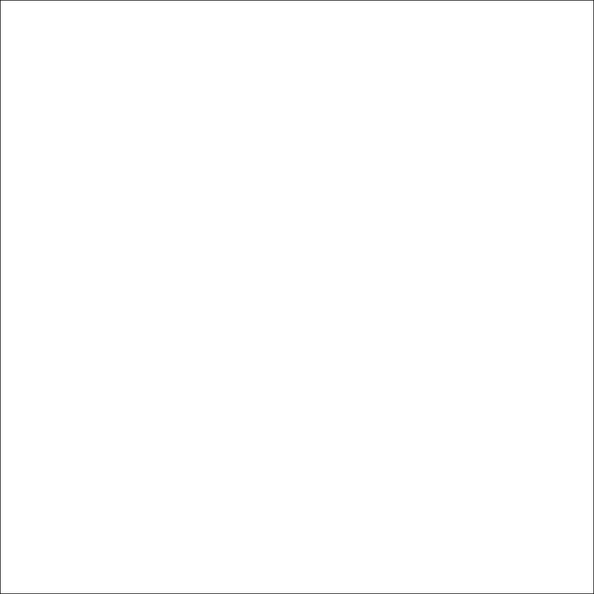
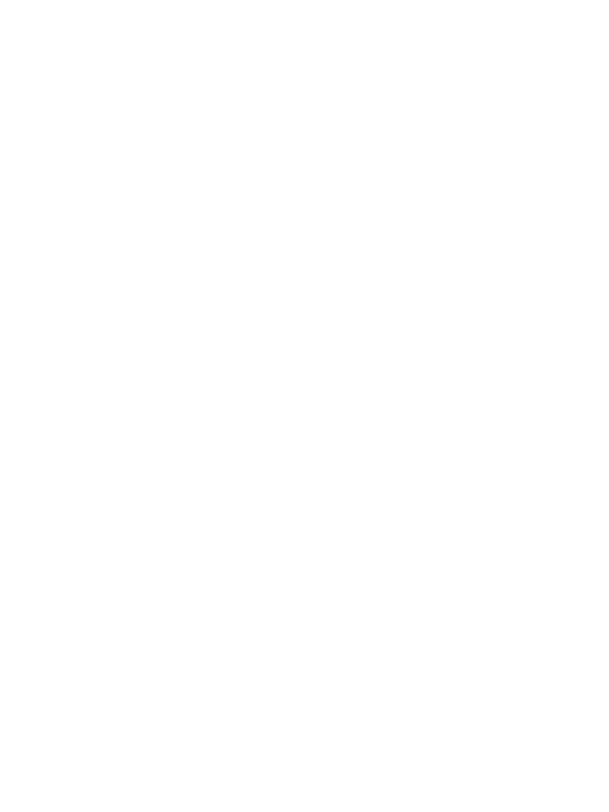
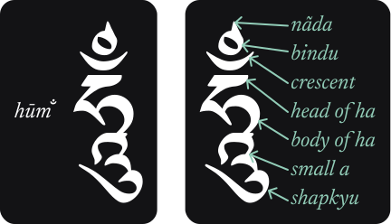
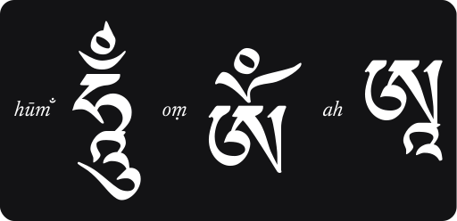

# 
Words of My Perfect Teacher

A Complete Translation of a Classic Introduction to Tibetan Buddhism
  

HAND-COPIED DIGITAL REVISED EDITION

by <a href="#patrul-rinpoche">Patrul Rinpoche</a>
  

translated by the <a href="https://www.shambhala.com/padmakara-translation-group-home/">Padmakara Translation Group</a>, with a <a href="#forewordhhdl">foreword by the Dalai Lama</a>;  
digital edition <a href="#digital-preface">hand-typed</a> by <a href="https://github.com/ryanallen">Ryan Allen</a>.
  

---

*
<a href="#buddha">Buddha</a> <a href="#śākyamuni">Śākyamuni</a>
*

The <a href="#buddha">Buddha</a> of our time

---

*
<a href="#guru-rinpoche">Guru Rinpoche</a>
*

Also known as <a href="#padmasambhava-of-oḍḍiyāna">Padmasambhava</a>, the Lotus-born, he is the "<a href="#second-buddha">Second Buddha</a>" who established Buddhism in Tibet. He is shown here in the form known as "Prevailing Over <a href="#appearances">Appearances</a> and Existence" (Nangsi Zilnon), the name meaning that, as he understands the nature of everything that appears, he is naturally the master of all situations.

---

[Uchen script](image_url)

---

# 
KUNZAN <a href="#lama">LAMA</a>'I SHELUNG
  

# *
The Words of My Perfect Teacher
*

## 
PATRUL RINPOCHE

Translated by the Padmakara Translation Group

*
With forewords by the Dalai <a href="#lama">Lama</a> and Dilgo Khyentse Rinpoche
*

YALE UNIVERSITY PRESS  New Haven & London

---

First Yale University Press edition 2011.
  
Translation and introductory matter copyright 1994, 1998 by Padmakara Translation Group.

All rights reserved.  
This book may not be reproduced, in whole or in part, including illustrations, in any form (beyond that copying permitted by Sections 107 and 108 of the U.S. Copyright Law and except by reviewers for the public press), without written permission from the publishers.

Yale University Press books may be purchased in quantity for educational, business, or promotional use. For information, please e-mail sales.press@yale.edu (U.S. office) or sales@yaleup.co.uk (U.K. office).

The Library of Congress has cataloged the original edition as follows:

O-rgyan- 'jigs-med-chos-kyi-dban-po, Dpal-sprul, b. 1808  
[Kun bzan bla ma'i zal lun. English]  
[The words of my perfect teacher](#the-words-of-my-perfect-teacher) / [Patrul Rinpoche](#patrul-rinpoche): translated by the Padmakara Translation Group; with a foreword by the Dalai [Lama](#lama) and Dilgo Khyentse Rinpoche&mdash;2nd ed.  
p. cm.&mdash;(Sacred literature series)  
Includes bibliographical references and index.  
ISBN 0-7619-9026-7 (alk. paper).&mdash;ISBN 0-7619-9027-5 (alk. paper)  
1.&nbsp;Rdzogs-chen 2. Jig-med-rgyal-ba 'I-my-gu, ca 1750-1825.  
I. Title. II Series.  
BQ 7662.4.072513  1998  98-23830  
29-4.3'420423-dc21  CIP  
ISBN 978-0-300-16532-6 (pbk.)  
Printed in the United States of America.  
10 9 8 7 6

---

*<blockquote align="center">To the teachers of the past, the present and the future</blockquote>*

---

# *
Patron
*  

HRH The Prince Philip, Duke of Edinburgh, KG, KT
  

# *
Trustees
*

Sir Brian McGrath, KCVO (Chair)

|||
|-|-|
| Martine Batchelor  | Dr Narinder Singh Kapany  |
| Dr Muhammad Zaki Badawi  | Richard Summers  |
| The Duchess of Abercorn  | Michael Stillwell  |

---

# INTERNATIONAL SACRED LITERATURE TRUST

The [International Sacred Literature Trust](#international-sacred-literature-trust) was established to promote understanding and open discussion between and within faiths and to give voice in today's world to the [wisdom](#wisdom) that speaks across time and traditions.

What resources do the sacred traditions of the world possess to respond to the great global threats of poverty, war, ecological disaster and spiritual despair?

Our starting-point is the sacred texts with their vision of a higher truth and their deep insights into the nature of humanity and the universe we inhabit. The translation program is planned so that each faith community articulates its own teachings with the intention of enhancing its self-understanding as well as the understanding of those of other faiths and those of no faith.

The Trust particularly encourages faiths to make available texts which are needed in translation for their own communities and also texts which are little known outside the tradition but which have the power to inspire, console, enlighten and transform. These sources from the past become resources for the present and future when we make inspired use of them to guide us in shaping the contemporary world.

Our religious traditions are diverse but, as with the natural environment, we are discovering the global interdependence of human hearts and minds. The Trust invites all to participate in the modern experience of interfaith encounter and exchange which marks a new phase in the human quest to discover our full humanity. 

---

# *Contents*
*[List of illustrations](#listofillustrations)  
[Foreword by the Dalai Lama](#forewordhhdl)  
[Longchenpa](#longchenpa)  
[Foreword by Dilgo Khyentse Rinpoche](#forewordhhdkr)  
[Translators' Acknowledgements](#acknowledgements)  
[Preface to the Hand-copied Digital Edition from the Second Edition](#digital-preface)  
[Preface to the Second Edition](#preface)  
[Translators' Introduction](#introduction)  
[A brief historical introduction to Tibetan Buddhism](#historical-introduction)*  

[PROLOGUE](#prologue)  

---

**[PART ONE THE ORDINARY OR EXTERNAL PRELIMINARIES](#part-one)**

◈  
***[Chapter One The difficulty of finding the freedoms and advantages](#chapter-onethe-difficulty-of-finding-the-freedoms-and-advantages)***  
* [I. THE PROPER WAY TO LISTEN TO SPIRITUAL TEACHING](#i-the-proper-way-to-listen-to-spiritual-teaching)  
    * **[1. Attitude](#1-attitude)**  
        * [1.1 THE VAST ATTITUDE OF THE BODHICITTA](#11-the-vast-attitude-of-the-bodhicitta)  
        * [1.2 VAST SKILL IN MEANS: THE ATTITUDE OF THE SECRET MANTRAYĀNA](#12-vast-skill-in-means-the-attitude-of-the-secret-mantrayāna)  
    * **[2. Conduct](#2-conduct)**  
        * [2.1 WHAT TO AVOID](#21-what-to-avoid)  
            * [2.1.1 The Three Defects of the Pot](#211-the-three-defects-of-the-pot)  
            * [2.1.2 The Six Stains](#212-the-six-stains)  
            * [2.1.3 The Five Wrong Ways of Remembering](#213-the-five-wrong-ways-of-remembering)  
        * [2.2 WHAT TO DO](#22-what-to-do)  
            * [2.2.1 The Four Metaphors](#221-the-four-metaphors)  
            * [2.2.2 The Six Transcendent Perfections](#222-the-six-transcendent-perfections)  
            * [2.2.3 Other Modes of Conduct](#223-other-modes-of-conduct)
* [II. THE TEACHING ITSELF: AN EXPLANATION OF HOW DIFFICULT IT IS TO FIND THE FREEDOMS AND ADVANTAGES](#ii-the-teaching-itself-an-explanation-of-how-difficult-it-is-to-find-the-freedoms-and-advantages)  
    * **[1. Reflecting on the nature of freedom](#1-reflecting-on-the-nature-of-freedom)**  
    * **[2. Reflecting on the particular advantages related to Dharma](#2-reflecting-on-the-particular-advantages-related-to-dharma)**  
        * [2.1 THE FIVE INDIVIDUAL ADVANTAGES](#21-the-five-individual-advantages)  
        * [2.2 THE FIVE CIRCUMSTANTIAL ADVANTAGES](#22-the-five-circumstantial-advantages)  
        * [2.3 THE EIGHT INTRUSIVE CIRCUMSTANCES](#23-the-eight-intrusive-circumstances-that-leave-no-freedom-to-practice-the-dharma)  
        * [2.4 THE EIGHT INCOMPATIBLE PROPENSITIES](#24-the-eight-incompatible-propensities-that-leave-no-freedom-to-practice-the-dharma)  
    * **[3. Reflecting on images that show how difficult it is to find the freedoms and advantages](#3-reflecting-on-images-that-show-how-difficult-it-is-to-find-the-freedoms-and-advantages)**  
    * **[4. Reflecting on numerical comparisons](#4-reflecting-on-numerical-comparisons)**  

◈  
***[Chapter Two The impermanence of life](#chapter-twothe-impermanence-of-life)***  
* [I. THE IMPERMANENCE OF THE OUTER UNIVERSE IN WHICH BEINGS LIVE](#i-the-impermanence-of-the-outer-universe-in-which-beings-live)  
* [II. THE IMPERMANENCE OF BEINGS LIVING IN THE UNIVERSE](#ii-the-impermanence-of-beings-living-in-the-universe)  
* [III. THE IMPERMANENCE OF HOLY BEINGS](#iii-the-impermanence-of-holy-beings)  
* [IV. THE IMPERMANENCE OF THOSE IN POSITIONS OF POWER](#iv-the-impermanence-of-those-in-positions-of-power)  
* [V. OTHER EXAMPLES OF IMPERMANENCE](#v-other-examples-of-impermanence)
* [VI. THE UNCERTAINTY OF THE CIRCUMSTANCES OF DEATH](#vi-the-uncertainty-of-the-circumstances41-of-death)  
* [VII. INTENSE AWARENESS OF IMPERMANENCE](#vii-intense-awareness-of-impermanence)  

◈  
***[Chapter Three The defects of saṃsāra](#chapter-threethe-defects-of-saṃsāra)***
* [I. THE SUFFERINGS OF SAṂSĀRA IN GENERAL](#i-the-sufferings-of-saṃsāra-in-general)  
* [II. THE PARTICULAR SUFFERINGS EXPERIENCED BY THE BEINGS OF THE SIX REALMS](#ii-the-particular-sufferings-experienced-by-the-beings-of-the-six-realms)  
    * **[1. The eighteen hells](#1-the-eighteen-hells)**  
        * [1.1 THE EIGHT HOT HELLS](#11-the-eight-hot-hells)  
            * [1.1.1 The Reviving Hell](#111-the-reviving-hell)  
            * [1.1.2 The Black-Line Hell](#112-the-black-line-hell)  
            * [1.1.3 The Rounding-Up and Crushing Hell](#113-the-rounding-up-and-crushing-hell)  
            * [1.1.4 The Howling Hell](#114-the-howling-hell)  
            * [1.1.5 The Great Howling Hell](#115-the-great-howling-hell)  
            * [1.1.6 The Heating Hell](#116-the-heating-hell)  
            * [1.1.7 The Intense Heating Hell](#117-the-intense-heating-hell)  
            * [1.1.8 The Hell of Ultimate Torment](#118-the-hell-of-ultimate-torment)  
            * [1.1.9 The Neighboring Hells](#119-the-neighboring-hells)  
        * [1.2 THE EIGHT COLD HELLS](#12-the-eight-cold-hells)  
        * [1.3 THE EPHEMERAL HELLS](#13-the-ephemeral-hells)  
    * **[2. The pretas](#2-the-pretas)**  
        * [2.1 PRETAS WHO LIVE COLLECTIVELY](#21-pretas-who-live-collectively)  
            * [2.1.1 Pretas suffering from external obscurations](#211-pretas-suffering-from-external-obscurations)  
            * [2.1.2 Pretas suffering from internal obscurations](#212-pretas-suffering-from-internal-obscurations)  
            * [2.1.3 Pretas suffering from specific obscurations](#213-pretas-suffering-from-specific-obscurations)  
        * [2.2 PRETAS WHO MOVE THROUGH SPACE](#22-pretas-who-move-through-space)  
    * **[3. The animals](#3-the-animals)**  
        * [3.1 ANIMALS LIVING IN THE DEPTHS](#31-animals-living-in-the-depths)  
        * [3.2 ANIMALS THAT LIVE SCATTERED IN DIFFERENT PLACES](#32-animals-that-live-scattered-in-different-places)  
    * **[4. The human realm](#4-the-human-realm)**  
        * [4.1 THE THREE FUNDAMENTAL TYPES OF SUFFERING](#41-the-three-fundamental-types-of-suffering)  
            * [4.1.1 The suffering of change](#411-the-suffering-of-change)  
            * [4.1.2 Suffering upon suffering](#412-suffering-upon-suffering)  
            * [4.1.3 The suffering of everything composite](#413-the-suffering-of-everything-composite53)  
        * [4.2 THE SUFFERINGS OF BIRTH, SICKNESS, OLD AGE, AND DEATH](#42-the-sufferings-of-birth-sickness-old-age-and-death)  
            * [4.2.1 The suffering of birth](#421-the-suffering-of-birth)  
            * [4.2.2 The suffering of old age](#422-the-suffering-of-old-age)  
            * [4.2.3 The suffering of sickness](#423-the-suffering-of-sickness)  
            * [4.2.4 The suffering of death](#424-the-suffering-of-death)  
        * [4.3 OTHER HUMAN SUFFERINGS](#43-other-human-sufferings)  
            * [4.3.1 The fear of meeting hated enemies](#431-the-fear-of-meeting-hated-enemies)  
            * [4.3.2 The fear of losing loved ones](#432-the-fear-of-losing-loved-ones)  
            * [4.3.3 The suffering of not getting what one wants](#433-the-suffering-of-not-getting-what-one-wants)  
            * [4.3.4 The suffering of encountering what one does not want](#434-the-suffering-of-encountering-what-one-does-not-want)  
    * **[5. The asuras](#5-the-asuras)**  
    * **[6. The gods](#6-the-gods)**  

◈  
***[Chapter Four Actions: the principle of cause and effect](#chapter-fouractions-the-principle-of-cause-and-effect)***
* [I. NEGATIVE ACTIONS TO BE ABANDONED](#i-negative-actions-to-be-abandoned)  
    * **[1. The ten negative actions to be avoided](#1-the-ten-negative-actions-to-be-avoided)**  
        * [1.1 TAKING LIFE](#11-taking-life)  
        * [1.2 TAKING WHAT IS NOT GIVEN](#12-taking-what-is-not-given)  
            * [1.2.1 TAKING BY FORCE](#121-taking-by-force)  
            * [1.2.2 TAKING BY STEALTH](#122-taking-by-stealth)  
            * [1.2.1 TAKING BY TRICKERY](#121-taking-by-trickery)  
        * [1.3 SEXUAL MISCONDUCT](#13-sexual-misconduct)  
        * [1.4 LYING](#14-lying)  
            * [1.4.1 ORDINARY LIES](#141-ordinary-lies)  
            * [1.4.2 MAJOR LIES](#142-major-lies)  
            * [1.4.3 PHONY LAMA'S LIES](#143-phony-lamas-lies)  
        * [1.5 SOWING DISCORD](#15-sowing-discord)  
            * [1.5.1 OPENLY SOWING DISCORD](#151-openly-sowing-discord)  
            * [1.5.2 SECRETLY SOWING DISCORD](#152-secretly-sowing-discord)  
        * [1.6 HARSH SPEECH](#16-harsh-speech)  
        * [1.7 WORTHLESS CHATTER](#17-worthless-chatter)  
        * [1.8 COVETOUSNESS](#18-covetousness)  
        * [1.9 WISHING HARM ON OTHERS](#19-wishing-harm-on-others)  
        * [1.10 WRONG VIEWS](#110-wrong-views)  
    * **[2. The effects of the ten negative actions](#2-the-effects-of-the-ten-negative-actions)**  
        * [2.1 THE FULLY RIPENED EFFECT](#21-the-fully-ripened-effect80)  
        * [2.2 THE EFFECT SIMILAR TO THE CAUSE](#22-the-effect-similar-to-the-cause)  
            * [2.2.1 Actions Similar to the Cause](#221-actions-similar-to-the-cause)  
            * [2.2.2 Experiences Similar to the Cause](#222-experiences-similar-to-the-cause)  
        * [2.3 THE CONDITIONING EFFECT](#23-the-conditioning-effect)  
        * [2.4 THE PROLIFERATING EFFECT](#24-the-proliferating-effect)  
* [II. POSITIVE ACTIONS TO BE ADOPTED](#ii-positive-actions-to-be-adopted)  
* [III. THE ALL-DETERMINING QUALITY OF ACTIONS](#iii-the-all-determining-quality-of-actions)
 
◈  
***[Chapter Five The benefits of liberation](#chapter-fivethe-benefits-of-liberation)***
* [I. CAUSES LEADING TO LIBERATION](#i-causes-leading-to-liberation)  
* [II. THE RESULT: THE THREE LEVELS OF ENLIGHTENMENT](#ii-the-result-the-three-levels-of-enlightenment)  
 
◈  
***[Chapter Six How to follow a spiritual friend](#chapter-sixhow-to-follow-a-spiritual-friend)***  
* [I. EXAMINING THE TEACHER](#i-examining-the-teacher)  
* [II. FOLLOWING THE TEACHER](#ii-following-the-teacher)  
* [III. EMULATING THE TEACHER'S REALIZATION AND ACTIONS](#iii-emulating-the-teachers-realization98-and-actions)  

---

**[PART TWO THE EXTRAORDINARY OR INNER PRELIMINARIES](#part-two)**

◈  
***[Chapter One Taking refuge, foundation stone of all paths](#chapter-onetaking-refuge-the-foundation-stone-of-all-paths)***  
* [I. APPROACHES TO TAKING REFUGE](#i-approaches-to-taking-refuge)  
    * **[1. Faith](#1-faith)**  
        * [1.1 VIVID FAITH](#11-vivid-faith)  
        * [1.2 EAGER FAITH](#12-eager-faith)  
        * [1.3 CONFIDENT FAITH](#13-confident-faith)  
    * **[2. Motivation](#2-motivation)**  
        * [2.1 THE REFUGE OF LESSER BEINGS](#21-the-refuge-of-lesser-beings)  
        * [2.2 THE REFUGE OF MIDDLING BEINGS](#22-the-refuge-of-middling-beings)  
        * [2.3 THE REFUGE OF GREAT BEINGS](#23-the-refuge-of-great-beings)  
* [II. HOW TO TAKE REFUGE](#ii-how-to-take-refuge)  
* [III. PRECEPTS AND BENEFITS OF TAKING REFUGE](#iii-precepts-and-benefits-of-taking-refuge)  
    * **[1. The precepts of taking refuge](#1-the-precepts-of-taking-refuge)**  
        * [1.1 THE THREE THINGS TO BE ABANDONED](#11-the-three-things-to-be-abandoned)  
        * [1.2 THE THREE THINGS TO BE DONE](#12-the-three-things-to-be-done)  
        * [1.3 THE THREE SUPPLEMENTARY PRECEPTS](#13-the-three-supplementary-precepts)  
    * **[2. The benefits of taking refuge](#2-the-benefits-of-taking-refuge)**

◈  
***[Chapter Two Arousing bodhicitta, the root of the Great Vehicle](#chapter-twoarousing-bodhicitta-the-root-of-the-great-vehicle)***  
* [I. TRAINING THE MIND IN THE FOUR BOUNDLESS QUALITIES](#i-training-the-mind-in-the-four-boundless-qualities)  
    * **[1. Meditation on impartiality](#1-meditation-on-impartiality)**  
    * **[2. Meditation on love](#2-meditation-on-love)**  
    * **[3. Meditation on compassion](#3-meditation-on-compassion)**  
    * **[4. Meditation on sympathetic joy](#4-meditation-on-sympathetic-joy)**  
* [II. AROUSING BODHICITTA](#ii-arousing-bodhicitta135)  
    * **[1. Classification based on the three degrees of courage](#1-classification-based-on-the-three-degrees-of-courage)**  
        * [1.1 THE COURAGE OF A KING](#11-the-courage-of-a-king)  
        * [1.2 THE COURAGE OF A BOATMAN](#12-the-courage-of-a-boatman)  
        * [1.3 THE COURAGE OF A SHEPHERD](#13-the-courage-of-a-shepherd)  
    * **[2. Classification according to the Bodhisattva levels](#2-classification-according-to-the-bodhisattva-levels)**  
    * **[3. Classification according to the nature of bodhicitta](#3-classification-according-to-the-nature-of-bodhicitta)**  
        * [3.1 RELATIVE BODHICITTA](#31-relative-bodhicitta)  
            * [3.1.1 Intention](#311-intention)  
            * [3.1.2 Application](#312-application)  
        * [3.2 ABSOLUTE BODHICITTA](#32-absolute-bodhicitta)  
    * **[4. Taking the vow of bodhicitta](#4-taking-the-vow-of-bodhicitta140)**  
* [III. TRAINING IN THE BODHICITTA PRECEPTS](#iii-training-in-the-bodhicitta-precepts)  
    * **[1. Training in the precepts of the bodhicitta of aspiration](#1-training-in-the-precepts-of-the-bodhicitta-of-aspiration)**  
        * [1.1 CONSIDERING OTHERS AS EQUAL TO ONESELF](#11-considering-others-as-equal-to-oneself)  
        * [1.2 EXCHANGING ONESELF AND OTHERS](#12-exchanging-oneself-and-others)  
        * [1.3 CONSIDERING OTHERS MORE IMPORTANT THAN ONESELF](#13-considering-others-more-important-than-oneself)  
    * **[2. Training in the precepts of the bodhicitta of application: the six transcendent perfections](#2-training-in-the-precepts-of-the-bodhicitta-of-application-the-six-transcendent-perfections)**
        * [2.1 TRANSCENDENT GENEROSITY](#21-transcendent-generosity)
            * [2.1.1 Material giving](#211-material-giving)  
            * [2.1.2 Giving Dharma](#212-giving-dharma)  
            * [2.1.3 Giving protection from fear](#213-giving-protection-from-fear)  
        * [2.2 TRANSCENDENT DISCIPLINE](#22-transcendent-discipline)  
            * [2.2.1 Avoiding negative actions](#221-avoiding-negative-actions)  
            * [2.2.2 Undertaking positive actions](#222-undertaking-positive-actions)  
            * [2.2.3 Bringing benefit to others](#223-bringing-benefit-to-others)  
        * [2.3 TRANSCENDENT PATIENCE](#23-transcendent-patience)  
            * [2.3.1 Patience when wronged](#231-patience-when-wronged)  
            * [2.3.2 Patience to bear hardships for the Dharma](#232-patience-to-bear-hardships-for-the-dharma)  
            * [2.3.3 Patience to face the profound truth without fear](#233-patience-to-face-the-profound-truth-without-fear)  
        * [2.4 TRANSCENDENT DILIGENCE](#24-transcendent-diligence)  
            * [2.4.1 Armor-like diligence](#241-armor-like-diligence)  
            * [2.4.2 Diligence in action](#242-diligence-in-action)  
            * [2.4.3 Diligence that cannot be stopped](#243-diligence-that-cannot-be-stopped)  
        * [2.5 TRANSCENDENT CONCENTRATION](#25-transcendent-concentration)  
            * [2.5.1 Giving up distractions](#251-giving-up-distractions)  
            * [2.5.2 Actual concentration](#252-actual-concentration)  
        * [2.6 TRANSCENDENT WISDOM](#26-transcendent-wisdom)  
            * [2.6.1 Wisdom through hearing](#261-wisdom-through-hearing)  
            * [2.6.2 Wisdom through reflection](#262-wisdom-through-reflection)  
            * [2.6.3 Wisdom through meditation](#263-wisdom-through-meditation)  

◈  
***[Chapter Three Meditating and reciting on the teacher as Vajrasattva to cleanse all obscurations](#chapter-threemeditating-and-reciting-on-the-teacher-as-vajrasattva-to-cleanse-all-obscurations172)***
* [I. HOW OBSCURATIONS CAN BE PURIFIED THROUGH CONFESSION](#i-how-obscurations-can-be-purified-through-confession)  
* [II. THE FOUR POWERS](#ii-the-four-powers)  
    * **[1. The power of support](#1-the-power-of-support)**  
    * **[2. The power of regretting having done wrong](#2-the-power-of-regretting-having-done-wrong)**
    * **[3. The power of resolution](#3-the-power-of-resolution)**
    * **[4. The power of action as an antidote](#4-the-power-of-action-as-an-antidote)**
* [III. THE ACTUAL MEDITATION ON VAJRASATTVA](#iii-the-actual-meditation-on-vajrasattva)

◈  
***[Chapter Four Offering the maṇḍala to accumulate merit and wisdom](#chapter-fouroffering-the-maṇḍala-to-accumulate-merit-and-wisdom)***
* [I. THE NEED FOR THE TWO ACCUMULATIONS](#i-the-need-for-the-two-accumulations)
* [II. THE ACCOMPLISHMENT MAṆḌALA](#ii-the-accomplishment-maṇḍala202)
* [III. THE OFFERING MAṆḌALA](#iii-the-offering-maṇḍala)
    * **[1. The thirty-seven element maṇḍala offering](#1-the-thirty-seven-element-maṇḍala-offering)**
    * **[2. The maṇḍala offering of the three kāyas according to this text](#2-the-maṇḍala-offering-of-the-three-kāyas-according-to-this-text)**
        * [2.1 THE ORDINARY MAṆḌALA OF THE NIRMĀṆAKĀYA](#21-the-ordinary-maṇḍala209-of-the-nirmāṇakāya)
        * [2.2 THE EXTRAORDINARY MAṆḌALA OF THE SAṂBHOGAKĀYA](#22-the-extraordinary-maṇḍala-of-the-saṃbhogakāya)
        * [2.3 THE SPECIAL MAṆḌALA OF THE DHARMAKĀYA](#23-the-special-maṇḍala-of-the-dharmakāya)

◈  
***[Chapter Five The kusali's accumulation: destroying the four demons at a single stroke](#chapter-fivethe-kusalis-accumulation-destroying-the-four-demons-at-a-single-stroke)***
* [I. THE BODY AS AN OFFERING](#i-the-body-as-an-offering)
* [II. THE PRACTICE OF OFFERING THE BODY](#ii-the-practice-of-offering-the-body)
    * **[1. The white feast for the guests above](#1-the-white-feast-for-the-guests-above)**
    * **[2. The white feast for the guests below](#2-the-white-feast-for-the-guests-below)**
    * **[3. The variegated feast for the guests above](#3-the-variegated-feast-for-the-guests-above)**
    * **[4. The variegated feast for the guests below](#4-the-variegated-feast-for-the-guests-below)**
* [III. THE MEANING OF CHO](#iii-the-meaning-of-cho)

◈  
***[Chapter Six Guru Yoga, entrance-way for blessings, the ultimate method for arousing the wisdom of realization](#chapter-sixguru-yoga223-entrance-way-for-blessings-the-ultimate-method-for-arousing-the-wisdom-of-realization)***
* [I. THE REASON FOR GURU YOGA](#i-the-reason-for-guru-yoga)
* [II. HOW TO PRACTICE GURU YOGA](#ii-how-to-practice-guru-yoga)
    * **[1. Visualizing the field of merit](#1-visualizing-the-field-of-merit)**
    * **[2. Offering the seven branches](#2-offering-the-seven-branches)**
        * [2.1 PROSTRATION, THE ANTIDOTE TO PRIDE](#21-prostration250-the-antidote-to-pride)
        * [2.2 OFFERING](#22-offering255)
        * [2.3 CONFESSION OF HARMFUL ACTIONS](#23-confession-of-harmful-actions257)
        * [2.4 REJOICING, THE ANTIDOTE TO JEALOUSY](#24-rejoicing-the-antidote-to-jealousy)
        * [2.5 EXHORTING THE BUDDHAS TO TURN THE WHEEL OF DHARMA](#25-exhorting-the-buddhas-to-turn-the-wheel-of-dharma260)
        * [2.6 REQUESTING THE BUDDHAS NOT TO ENTER NIRVĀṆA](#26-requesting-the-buddhas-not-to-enter-nirvāṇa261)
        * [2.7 DEDICATION](#27-dedication263)
    * **[3. Praying with resolute trust](#3-praying266-with-resolute-trust)**
    * **[4. Taking the four empowerments](#4-taking-the-four-empowerments)**
* [III. THE HISTORY OF THE ADVENT OF THE EARLY TRANSLATION DOCTRINE](#iii-the-history-of-the-advent-of-the-early-translation-doctrine)
    * **[1. The mind lineage of the Conquerors](#1-the-mind-lineage-of-the-conquerors)**
    * **[2. The symbol lineage of the Vidyādharas](#2-the-symbol-lineage-of-the-vidyādharas)**
        * [2.1 THE MAHĀYOGA TANTRAS](#21-the-mahāyoga-tantras)
        * [2.2 THE TRANSMISSION OF ANUYOGA](#22-the-transmission-of-anuyoga)
        * [2.3 THE PITH-INSTRUCTIONS OF ATIYOGA](#23-the-pith-instructions-of-atiyoga)
        * [2.4 THE COMING OF ATIYOGA TO THE HUMAN REALM](#24-the-coming-of-atiyoga-to-the-human-realm)
* [IV. PROPAGATION OF THE ESSENCE-TEACHING IN TIBET, LAND OF SNOWS](#iv-propagation-of-the-essence-teaching-in-tibet-land-of-snows)
    * **[3. The hearing lineage of ordinary beings](#3-the-hearing-lineage-of-ordinary-beings)**

---

**[PART THREE THE SWIFT PATH OF TRANSFERENCE](#part-three)**

◈  
***[Chapter One Transference of consciousness, the instructions for the dying: Buddhahood without meditation](#chapter-onetransference-of-consciousness-the-instructions-for-the-dying-buddhahood-without-meditation)***
* [I. THE FIVE KINDS OF TRANSFERENCE](#i-the-five-kinds-of-transference)
    * **[1. Superior transference to the dharmakāya through the seal of the view](#1-superior-transference-to-the-dharmakāya-through-the-seal-of-the-view)**
    * **[2. Middling transference to the saṃbhogakāya through the union of the generation and perfection phases](#2-middling-transference-to-the-saṃbhogakāya-through-the-union-of-the-generation-and-perfection-phases)**
    * **[3. Lower transference to the nirmāṇakāya through immeasurable compassion](#3-lower-transference-to-the-nirmāṇakāya-through-immeasurable-compassion)**
    * **[4. Ordinary transference using three metaphors](#4-ordinary-transference-using-three-metaphors)**
    * **[5. Transference performed for the dead with the hook of compassion](#5-transference-performed-for-the-dead-with-the-hook-of-compassion)**
* [II. ORDINARY TRANSFERENCE USING THREE METAPHORS](#ii-ordinary-transference-using-three-metaphors)
    * **[1. Training for transference](#1-training-for-transference)**
    * **[2. Actual transference](#2-actual-transference)**
    * **[3. The steps of the meditation on transference](#3-the-steps-of-the-meditation-on-transference)**
        * [3.1 THE PRELIMINARIES](#31-the-preliminaries)
        * [3.2 THE MAIN VISUALIZATION](#32-the-main-visualization)

---

**[CONCLUSION](#conclusion)**

[Postface by Jamgön Kongtrul Lodrö Thayé](#postface)

Notes *— integrated inline; see [Preface to the Hand-copied Digital Edition](#digital-preface)*
[Glossary](#glossary)  
[Bibliography](#bibliography)  
[Index](#index)    

---

*<h1 id="listofillustrations" align="center">List of Illustrations</h1>*

---

[alt text](image_url)

*
Padmasambhava
*

---

*<h1 id="forewordhhdl" align="center">Foreword by The Dalai [Lama](#lama)</h1>*

Jig-me Gyal-wai Nyu-gu, who was one of the eminent disciples of Jig-me Ling-pa, the exponent of Dzog-pa Chen-po Long-chen Nying-thig, gave an oral instruction on Long-chen Nying-thig and his disciple Dza Pal-trul Rinpoche transcribed it, giving it the title: KUNSANG LA-MAI ZHAL-LUNG.

It is said in the [Great Perfection](#great-perfection) teachings that one cannot become enlightened through a contrived mind; rather, the basic mind is to be identified, in relation to which all phenomena are to be understood as the sport of the mind. One then familiarizes oneself continuously and one-pointedly with this ascertainment. However, to have a full understanding of this it is not sufficient merely to read books; one needs the full preparatory practice of the Nying-ma system and, in addition, the special teaching of a qualified Nying-ma master as well as his blessings. The student must also have accumulated great [merit](#merit). That is why great [Nying-ma-pa](#nyingmapa) masters like Jig-me Ling-pa and Do-drup-chen worked so hard.

Translation of such works containing the Dzog-chen [preliminaries](#preliminaries) will be of immense value these days. I congratulate the Padmakara Translation Group for having produced this work in English and French. I am sure this authentic preliminary work will benefit all those who are interested in Dzog-chen.

November 23, 1990 The Dalai [Lama](#lama)

---

[alt text](image_url)

*
<a href="#longchenpa">Longchenpa</a> (1308-1363)
*
The most brilliant teacher of the [Nyingma](#nyingmapa) lineage. Longchen Rabjampa gathered together the Heart-essence teachings of [Padmasambhava](#padmasambhava-of-oḍḍiyāna), [Vimalamitra](#vimalamitra) and [Yeshe Tsogyal](#yeshe-tsogyal). He transmitted all these teachings to [Jigme Lingpa](#jigme-lingpa) in a series of visions as the Heart-essence of the Vast Expanse. 

---

*<h1 id="forewordhhdkr" align="center">Foreword by Dilgo Khyentse Rinpoche</h1>*

*The [Words of My Perfect Teacher](#words-of-my-perfect-teacher), a Guide to the [Preliminaries](#preliminaries) for the Heart-essence of the Vast Expanse from the [Great Perfection](#great-perfection)*, sets out the paths of the four main schools of Tibetan Buddhism without any conflict between them.

It contains all the teachings, including the Steps of the Path for those of the three [levels](#levels) of understanding, along with the Three Main Themes of the Path; the Three [Perceptions](#perceptions), [preliminaries](#preliminaries) for the Path and Fruit; the [Buddha Nature](#buddha-nature) as the cause, precious human life as the support, the [spiritual friend](#spiritual-friend) as the impetus, his instructions as the method, and the [kāyas](#kāya) and [wisdom](#wisdom)s as the result, these representing the confluence of the [Kadampa](#kadampa) and [Mahāmudrā](#mahāmudrā) traditions; and the [Nyingma](#nyingmapa) path in terms of [determination to be free](#determination-to-be-free) through disgust for [saṃsāra](#saṃsāra), faith through confidence in the effect of actions, bodhicitta through striving to help others, and [pure perception](#pure-perception) of the utter purity of everything there is.

For all teachings on all practices, whether [preliminaries](#preliminaries) or main, this text is indispensable. That is why, at this fortunate time in which the [Buddha's](#buddha) precious doctrine is [beginning](#beginning) to shine its light throughout the world, this book has been translated in the profound hope that&mdash;being of enormous worth and little danger, and covering as it does all the essential points of the path&mdash;all contact with it may be fruitful, and that it may become the object of [study](#study), reflection and meditation. That followers of [Dharma](#dharma) teach or listen to this text is of great importance.

---

*<h1 id="acknowledgements" align="center">Translators' Acknowledgements</h1>*

In accordance with Tibetan tradition, the translators would like to thank the teachers of the lineage: the late Dudjom Rinpoche, Dilgo Khyentse Rinpoche and Kangyur Rinpoche, whose extraordinary inspiration and patient explanations form the basis for all our efforts to understand these teachings; and also the numerous other [lamas](#lama) who answered our questions and gave us encouragement&mdash;Dodrup Chen Rinpoche, Nyoshul Khenpo Rinpoche, Dzogchen Khenpo Thubten, Zenkar Rinpoche, Khetsun Zangpo Rinpoche, [Lama](#lama) Sönam Tobgyal and many others.

The Padmakara Translation Group is made up of students of Tibetan Buddhism from several countries and disciplines, working under the direction of Pema Wangyal Rinpoche and Jigme Khyentse Rinpoche, at the centre d'Etudes de Chanteloube in Dordogne, Southwest France.

The history of this particular project runs parallel to the evolution of the group, many of whose members began their [study](#study) of Patrul Rinpoche's *Kunzang Lamai Shelung* in the mid seventies, both in India and in Europe. They were then taught in detail from it, as the basis for their own practice of the [Vajrayāna](#vajrayāna) path during the traditional meditation retreats which started in 1980 at Chanteloube. The text was translated into French by members of the group guided by their Tibetan teachers, and published as *Le Chemin de La Grande Perfection* by the newly-formed Editions Padmakara in 1987.

The first stage of the English version was a draft translation from the French by Michael Dickman. This was the starting point for a new translation from the original Tibetan. It was prepared, with many revisions, by Christian Bruyat, Charles Hastings and John Canti. Stephen Gethin provided editorial help and prepared the index.

The translators are grateful to readers Michal Abrams, Wulstan Fletcher, Helena Blankleder, Rinchen Lhamo, Elissa Mannheimer and Vivian Kurz for their valuable suggestions, and to Jill Heald for help with the typescript.

Finally, our warmest thanks to Kerry Brown of the [International Sacred Literature Trust](#international-sacred-literature-trust) for her constant and patient encouragement.

---

*<h1 id="digital-preface" align="center">Preface to the Hand-copied Digital Edition from the Second Edition</h1>*

Thank you, great teachers. This digital edition from the printed second edition for personal **study, research, and scholarship** was hand-typed by <a href="https://github.com/ryanallen">Ryan Allen</a>&mdash;to make it easier to read and [study](#study), and as a <a href="https://en.wikipedia.org/wiki/Sutra_copying">sūtra-copying</a> practice to accumulate [merit](#merit) dedicated to every sentient being, that they may find love, the cause of happiness, and be free from self-grasping, the cause of suffering.

*The Words of My Perfect Teacher* is by [Patrul Rinpoche](#patrul-rinpoche), translated by the <a href="https://www.shambhala.com/padmakara-translation-group-home/">Padmakara Translation Group</a> (Yale University Press, 2011; © 1994, 1998). Non-commercial fair use (17 U.S.C. § 107); not sold; all rights remain with the copyright holders. Please <a href="https://yalebooks.yale.edu/">purchase the print edition</a>. Copyright concerns: [dharma@ryanallen.com](mailto:dharma@ryanallen.com).

Changes in this edition:

- Clickable contents, sections, and glossary.
- Notes appear inline beneath their passage; no separate section.
- Dotted notes (e.g. [37.1](#37-1)) add context with source links; [Vajrasattva](#vajrasattva) notes come from a three-month ngöndro retreat with <a href="https://www.drikungtucson.org/our-teachers/khenpo-tenzin/">Ven. Khenpo Tenzin</a>.
- Numbered sections (e.g. *[The Three Defects of the Pot](#211-the-three-defects-of-the-pot)*) keep their number in the title.
- British spellings → American (e.g. armour → armor).
- Gender-neutral pronouns where it fits.
- Sanskrit and Tibetan spellings use IAST diacritics (*yogī*, *saṃsāra*, *prajñā*, *Mañjuśrī*).
- Em- and en-dashes use closed style (no spaces).
- Missing chapters added to the Part Three intro.
- Run-in labels and inline lists are all made headings, so every section appears in the contents.
- Illustrations are hand-traced from the original woodblock prints by Ryan Allen.

Found an error? [Open an issue](https://github.com/ryanallen/words-of-my-perfect-teacher/issues) or [submit a pull request](https://github.com/ryanallen/words-of-my-perfect-teacher/pulls).

May all beings be free from suffering.

---

*<h1 id="preface" align="center">Preface to the Second Edition</h1>*

  The encouraging need for this book to be reprinted has made possible a number of changes. A preface written by Dilgo Khyentse Rinpoche for the French edition has been included, as well as a postface written by Jamgön Kongtrul the Great for the very first woodblock printing of this book in Tibetan a century ago. The quality of the [illustrations](#listofillustrations) has been improved, the notes and [glossary](#glossary) have been expanded and revised, and Sanskrit words have been given their standard transliterated spelling.

  However, the principal change is a revision of the text itself, the fruit of a painstaking, detailed re-reading by Pema Wangyal Rinpoche. His numerous comments, clarifications and queries&mdash;on average three or four per page&mdash;have enabled us to take a critical look at the accuracy of our translation and to bring it closer still to Patrul Rinpoche's original meaning. Readers of the first edition may be assured that we have found no glaring errors in the substance of the instructions and practices explained. Nevertheless, in a text so justly celebrated for its extraordinary wealth of detail and anecdote, it is in those finer details that we hope the translation has gained in authenticity and accuracy.

No translation will ever be definitive. Our hope is that we may continue to improve the translation of this text in the future, particularly since&mdash;as testified by the many encouraging letters we have received from all over the world&mdash;it is used intensively by many individual readers and Buddhist groups as a tool for [study](#study) and practice. Had time allowed, we would have liked to undertake a thorough revision of the endnotes in the light of a new translation of one of the principal sources from which they were compiled, Khenpo Ngawang Palzang's *Notes*, currently proceeding under the direction of Alak Zenkar (with the participation of several members of the Padmakara Translation Group, see bibliography). That, unfortunately, will have to await a third edition.

All the changes to this edition were compiled, edited and entered by John Canti, with valuable help from Maria Jesus Hervas, whose assiduous work in preparing a forthcoming Spanish translation uncovered a number of errors and omissions in the English, and from readers Helena Blankleder, Charles Hastings, Steven Gethin and Wulstan Fletcher.

Once again, we are grateful for the continuing interest and support of the Sacred Literature Trust and its successive directors, Paul Seto and Malcolm Gerratt&mdash;and especially for their patience, which the delays in the preparation of this second edition must have sorely tested.

---

[alt text](image_url)

*
<a href="#jigme-lingpa">Jigme Lingpa</a> (1729-1798)
*
[Jigme Lingpa](#jigme-lingpa) received the transmission of the *Heart-essence of the Vast Expanse* from [Longchenpa](#longchenpa). He practiced them in solitude and subsequently transmitted them to his own students.

---

*<h1 id="introduction" align="center">Translators' Introduction</h1>*

*The Words of My Perfect Teacher* is one of the best-loved introductions to the foundations of Tibetan Buddhism, constantly recommended by His Holiness the Dalai [Lama](#lama) and other eminent teachers. It provides a detailed guide to the methods by which an ordinary person can transform his or her consciousness and set off on the path to Buddhahood, the state of awakening and freedom. The first half of the book contains a series of contemplations on the frustration and deep suffering of [saṃsāra](#saṃsāra), the round of existence based on ignorance and deluded [emotions](#emotions), and the enormous value of our human life, which provides a unique opportunity to attain Buddhahood. The second half explains the first steps of the [Vajrayāna](#vajrayāna), the "Diamond [Vehicle](#vehicle)" whose powerful methods of transformation provide the distinctive character of the Tibetan tradition of Buddhism.

Patrul Rinpoche's work is not a treatise for experts but a manual of practical advice for anyone sincerely wishing to practice the [Dharma](#dharma). He wrote it in a style that could speak as easily to rough nomads and villagers as to [lama](#lama)s and monks. In fact he claimed that it was not really a literary composition at all, but that he had simply set down the oral instructions of his own teacher as he himself had heard them. The particular magic of the book is that we feel that we are Patrul Rinpoche's own students, listening to his heartfelt advice, based on the oral tradition that he received from his own teacher and the deep experience of years of practice.

He explains everything we need to know to practice the teachings&mdash;and also, often with devastating irony, the many mistakes that can be made on the spiritual journey. The language veers from high poetry to broad vernacular. Each point is illustrated by numerous quotations, down-to-earth examples from daily life, and a wealth of stories. Some of these stories go back to the very origins of Buddhism in the 6th century BC and beyond; some are drawn from the extraordinary lives of the great masters of India and Tibet; some concern the doings of the ordinary folk of Patrul Rinpoche's native Kham.

[Patrul Rinpoche](#patrul-rinpoche) was famous for the direct way he probed the depths of his students' minds. He was a firm believer in [Atīśa's](#atīśa) dictum, **"The best [spiritual friend](#spiritual-friend) is the one who attacks your hidden faults."** Although his work is clearly adapted to his particular audience, with a little effort of transposition we can see that human nature remains remarkably the same regardless of time and culture. We feel that the recesses of our own character are exposed and we are forced to question our own habits of [thought](#thought) and open our minds to new possibilities.

In his concluding chapter the author describes his work as follows:

> In writing down these instructions I have not been guided primarily by aesthetic or literary considerations. My main aim has simply been to record faithfully the oral instructions of my revered teacher in a way that is easy to understand and useful for the mind. I have done my best not to spoil them by mixing in my own words or ideas. On separate occasions my teacher also used to give numerous special instructions for exposing hidden faults, and I have added whatever I have been able to remember of these in the most appropriate places. Do not take them as a window through which to observe others' faults, but rather as a mirror for examining your own. Look carefully within yourself to see whether or not you have those hidden faults. If you do, recognize them and take them out of their hiding place. Correct your mind and set it at ease on the right path...

For [Vajrayāna](#vajrayāna) Buddhism, [enlightenment](#enlightenment) is not a remote ideal but something which, with the appropriate methods and a supreme effort, can be achieved here and now, in this very life. In Tibet's living [wisdom](#wisdom) tradition, every scripture, every meditation practice and training for the mind, is passed on from teacher to student, and then internalized till it becomes an integral part of that person's experience. One of the words for spiritual practice in Tibetan is *nyamlen*, literally "taking into experience." Someone who can be considered a lineage holder, a truly qualified spiritual teacher, must have actually attained realization. [Patrul Rinpoche](#patrul-rinpoche) held a continuous line of transmission coming down from the [Buddha](#buddha) himself. This lineage has been passed on unbroken, from one realized teacher to the next, until the present day.

*
Jigme Gyalwai Nyugu
*
Patrul Rinpoche's perfect teacher. [Patrul Rinpoche](#patrul-rinpoche) heard his explanation of the *Heart-essence of the Vast Expanse* many times, and claimed that *The Words of My Perfect Teacher* was nothing more or less than a faithful compendium of what he had heard on those different occasions.

## Patrul Rinpoche and the tradition he inherited

In the [Nyingmapa](#nyingmapa) school, to which [Patrul Rinpoche](#patrul-rinpoche) belonged, and which is the oldest tradition of Tibetan Buddhism, there are two kinds of transmission. There is the Kahma, (*bka' ma*) or oral lineage, passed on from teacher to student over the centuries, and there is the miraculous direct lineage of Terma (*gter ma*) or [Spiritual Treasures](#spiritual-treasure). These were hidden in the eighth century by [Padmasambhava](#padmasambhava-of-oḍḍiyāna) and his great woman disciple [Yeshe Tsogyal](#yeshe-tsogyal), to be discovered in later ages at the appropriate moment. *The Words of My Perfect Teacher* is an explanation of the preliminary practices of the *Longchen Nyingtik* (*klong chen snying thig*), *The Heart-essence of the Vast Expanse*, a [spiritual treasure](#spiritual-treasure) discovered by [Rigdzin Jigme Lingpa](#jigme-lingpa) (1729 - 1798).

[alt text](image_url)

*
Jigme Gyalwai Nyugu
*
[Patrul Rinpoche's](#patrul-rinpoche-and-the-tradition-he-inherited) perfect teacher. [Patrul Rinpoche](#patrul-rinpoche) heard his explanation of the *Heart-essence of the Vast Expanse* many times, and claimed that *The Words of My Perfect Teacher* was nothing more or less than a faithful compendium of what he had heard on those different occasions.

[Jigme Lingpa](#jigme-lingpa) was a prodigy who became immensely learned with almost no [study](#study), through arousing his [wisdom](#wisdom) mind in a series of long meditation retreats. He received the *Heart-essence of the Vast Expanse* in a series of visions of [Longchenpa](#longchenpa), a great [lama](#lama) of the fourteenth century.

[Longchenpa](#longchenpa) systematized the [Nyingmapa](#nyingmapa) doctrines in his astonishing *Seven Treasures* (*mdzod bdun*, see [bibliography](#bibliography)) and other works, which cover all aspects of the Buddhist teachings, and in particular discuss fully the subtleties of [Dzogchen, the Great Perfection](#great-perfection). He also wrote extensively on the teachings of the other schools, but these works have been lost. Although [Longchenpa](#longchenpa) lived several centuries before him, he was in fact [Jigme Lingpa's](#jigme-lingpa) principal teacher.

[Jigme Lingpa](#jigme-lingpa) first practiced and mastered the teachings he had discovered, and then passed them on to a few close disciples who were capable of [becoming](#becoming) pure holders of the doctrine. One of these was Patrul Rinpoche's teacher, Jigme Gyalwai Nyugu, who after spending a considerable time with [Jigme Lingpa](#jigme-lingpa) in central Tibet, returned to Kham (the eastern region of the country). There he undertook the practice of what [Jigme Lingpa](#jigme-lingpa) had taught him, living on a remote mountainside in a mere depression in the ground, without even a cave for shelter, and with only wild plants for food. He was indifferent to comfort and convenience, determined to let go of all worldly considerations and concentrate on the goal of ultimate realization. Gradually disciples gathered around him, living in tents on the windswept hillside. One of these was the young Patrul, who received from him, no less than fourteen times, the teachings contained in this book. Subsequently Patrul also studied with many other great [lamas](#lama) of the day, including the highly unconventional Do Khyentse Yeshe Dorje, who directly introduced him to the nature of the mind.

Throughout his life [Patrul Rinpoche](#patrul-rinpoche) emulated the uncompromising simplicity of his master. Although he had been recognized in his childhood as an incarnate [lama](#lama) or [*tulku*](#tulku)&mdash;his name is an abbreviation of Palgye [Tulku](#tulku)&mdash;and would normally have had a high position in a monastic establishment, he spent his life wandering from place to place, camping in the open, in the guise of an ordinary beggar. If he was offered gold or silver he would often just leave it lying on the ground, thinking that wealth was only a source of trouble. Even when he had become a famous teacher, he would travel around unrecognized, living in the same simple and carefree manner. There is even a story of a [lama](#lama) he met on his travels who, thinking he was a good fellow who might benefit from such an extraordinary teaching, taught him this very text. On another occasion he traveled with a poor widow, helping her to cook and to take care of her children, carrying them on his back. When they arrived at their destination, [Patrul Rinpoche](#patrul-rinpoche) excused himself, saying he had something important to do. The woman heard that the great [Patrul Rinpoche](#patrul-rinpoche) was teaching at the monastery. She went there to watch, and was amazed to see her traveling companion on the throne instructing a vast assembly. At the end of the teaching he asked that all the offerings be given to her.

To his students he was immensely kind, but also immensely tough. He treated beggars and kings in exactly the same way. In all situations his only interest was to benefit others, and he would always say whatever would be most useful, regardless of social niceties.

## The stages of practice

*The Words of My Perfect Teacher* belongs to a category of literature known as "written guides" (*khrid yig*), which emulate and supplement the oral explanations needed to elucidate a meditation text. In this case the text in question is [the preliminary practice](#the-preliminary-practice) of the *Heart-essence of the Vast Expanse*.

The *Heart-essence of the Vast Expanse* cycle of teachings that [Longchenpa](#longchenpa) passed on to [Jigme Lingpa](#jigme-lingpa) has become one of the most widely practiced in the [Nyingmapa](#nyingmapa) school. It contains a complete [Vajrayāna](#vajrayāna) path, starting at the beginner stage with the preliminary practices (*sngon 'gro*). Then comes the main practice (*dngos gzhi*), which has three principal parts, the [generation phase](#generation-phase) (*bskyed rim*) the [perfection phase](#perfection-phase) (*rdzogs rim*), and the [Great Perfection](#great-perfection) (*rdzogs pa chen po*).

[The preliminary practices](#the-preliminary-practice) have an outer and an inner section, and our text is accordingly divided into two. The  first part, the ordinary or external [preliminaries](#preliminaries), deals with:  
1. the freedoms and advantages offered by human life
2. impermanence
3. the sufferings of [saṃsāra](#saṃsāra)
4. how [karma](#karma), the [principle of cause and effect](#principle-of-cause-and-effect), applies to all our actions
5. the benefits of [liberation](#liberation) and
6. how to follow a spiritual teacher.

These elements are fundamental for a proper understanding of Buddhist values. They are general because they are the fundamentals of Buddhism in general. The contemplations in this section can be practiced by anyone, Buddhist or not.

The second part, the inner [preliminaries](#preliminaries), starts with taking [refuge](#refuge)&mdash;learning to rely on the [Buddha](#buddha), the [Dharma](#dharma) (his teaching) and the [Saṅgha](#saṅgha) (the Buddhist community). This is the basis of Buddhist commitment common to all traditions. Next comes the development of bodhicitta, the "mind of [enlightenment](#enlightenment)." This attitude of unconditional love and compassion, that seeks to bring all beings to perfect freedom, is the basis of the [Mahāyāna](#mahāyāna). It is followed by practices to purify the effects of one's past [negative action](#negative-action)s and accumulate the positive [energy](#energy) necessary to progress on the path. These practices use more fully the techniques of visualization and [mantra](#mantra) specific to the [Vajrayāna](#vajrayāna) approach.

Finally comes the [Guru Yoga](#guru-yoga), uniting one's mind with the mind of the teacher. [Guru Yoga](#guru-yoga) is the very root of the [Vajrayāna](#vajrayāna), where the purity of the link between teacher and disciple is of paramount importance. Also included here is the practice of *phowa*, or [transference](#transference) of consciousness, a shortcut method to enable those who are unable to pursue the path to the end to be liberated nonetheless at the time of death.

For the practices in [Part Two](#part-two), it is necessary to have the guidance of a qualified teacher. Indeed this is advisable for any spiritual practice. In pre-communist Tibet almost all Tibetans considered themselves Buddhists, and they would try to follow Buddhist ethics, make offerings and recite some prayers and [mantras](#mantra). This remains largely true even in occupied Tibet today. A smaller number of those who are Buddhists in this general sense then take the decision to pursue the spiritual journey actively, and it is such people who would undertake these practices, usually repeating each element one hundred thousand times.

Next comes the practices of the generation and [perfection phase](#perfection-phase)s, culminating in the [Great Perfection](#great-perfection). In the Tibetan tradition the inner journey is mapped with astonishing precision. For each stage of the practice there are oral explanations and explanatory texts. [Vajrayāna](#vajrayāna) is a science of the mind, in which an expert teacher fully understands the significance of each experience, and the solution for each error. Our present text does not go into the details of the rest of the path, but we shall give a brief overview here, to give an idea of the progression that follows on from the [preliminaries](#preliminaries).

### The preliminary practice

*The outer [preliminaries](#preliminaries)* comprise the four contemplations which turn away from [saṃsāra](#saṃsāra).
*The inner [preliminaries](#preliminaries)* are:
1. taking [refuge](#refuge)
2. bodhicitta
3. purification through the practice of [Vajrasattva](#vajrasattva)
4. accumulation of [merit](#merit) through the offering of the [maṇḍala](#maṇḍala), and
5. [Guru Yoga](#guru-yoga).

Sometimes there are additional elements, as in the *Heart-essence of the Vast Expanse*. The ritual text may be quite long or very short. This, however, is the general structure.

### The [generation phase](#generation-phase)

In the [generation phase](#generation-phase) one learns to develop an enlightened vision of the world by visualizing oneself as a [Buddha](#buddha), and one's surroundings as a pure [Buddhafield](#buddhafield), while reciting the appropriate [mantra](#mantra). This process is at first artificial, something which is developed or generated, but the visualizations correspond to the visionary experience of enlightened beings. By adopting these new habits of perception, one can weaken the ordinary habits of gross perception based on ignorance and emotional [tendencies](#tendencies), and put oneself in touch with a more subtle level of experience. These practices take the form of *sādhanas*, the ritual texts for which are sometimes extraordinarily poetic.

### The [perfection phase](#perfection-phase)

Once the sacred vision has become a living experience, the [perfection phase](#perfection-phase) completes the process, taking it to a more interior level by working with the subtle energies of the body, through mastery of the breath, physical postures and other [yogas](#yoga).

### The [Great Perfection](#great-perfection)

In the generation and [perfection phase](#perfection-phase)s one acquires the [illustrative [wisdom](#wisdom)](#illustrative-wisdom) (*dpe'i ye shes*) through meditation experiences which serve as pointers to indicate the ultimate nature of the mind. In Dzogchen&mdash;the [Great Perfection](#great-perfection)&mdash;the nature of the mind is introduced directly and suddenly by the teacher. This is an immediate experiential recognition of the [Buddha-nature](#buddha-nature) itself. The subsequent practice consists essentially in getting used to that experience and developing it in an increasingly vast way. Here one acquires real or absolute [wisdom](#wisdom) (*don gyi ye shes*), the direct experience of ultimate truth.

---

In a sense, each level of practice builds on the previous one, but at the same time it further strips away the layers of delusion, leaving an ever more denuded experience of reality. Each practice is also a complete path in itself, in which&mdash;for those who have the [wisdom](#wisdom) to see it&mdash;all the others are included. Even the [preliminaries](#preliminaries), and indeed the individual elements of the [preliminaries](#preliminaries), can, in themselves, constitute a complete path to [enlightenment](#enlightenment).

In particular, the [Guru Yoga](#guru-yoga) is the [essence](#essence) of all paths. The teachers of the lineage often say that all practices should be done in the manner of [Guru Yoga](#guru-yoga). Total openness and devotion to a realized teacher is the most sure and rapid way to progress.

[Patrul Rinpoche](#patrul-rinpoche) expresses this capital importance of the spiritual teacher in the very title of this book, Kunzang Lamai Shelung, which we have freely translated as *The Words of My Perfect Teacher*.

Kunzang [means](#means) "everywhere perfect" or "always perfect." It is the abbreviated form of Kuntuzangpo (in Sanskrit, [Samantabhadra](#samantabhadra)), the primordial [Buddha](#buddha), source of all lineages. Kuntuzangpo is shown iconographically as a naked [Buddha](#buddha), the deep blue color of the sky. However this symbol does not represent a person, but the [Buddha-nature](#buddha-nature) itself, the unchanging purity of the mind which is the fundamental nature of all beings. Normally this nature is hidden, and it is the teacher who has realized it themselves who can lead us to discover it within ourselves, in all its glorious nakedness. [Lama](#lama) literally [means](#means), "there is nothing higher." This is the Tibetan expression for the Indian word Guru. Both these words have become overused in common speech, but, as [Patrul Rinpoche](#patrul-rinpoche) explains, for us, the spiritual teacher is like the [Buddha](#buddha) himself. He brings us the transmission of the [Buddhas](#buddha) of the past, embodies for us the [Buddhas](#buddha) of the present, and, through his teaching, is the source of the [Buddhas](#buddha) of the future. [Patrul Rinpoche](#patrul-rinpoche) says that the [Guru Yoga](#guru-yoga) is in a sense superior to the generation and [perfection phase](#perfection-phase)s, because it directly opens the way to ultimate [wisdom](#wisdom) through the teacher's blessings.

## The origins of this translation

The Tibetans have preserved all aspects of Indian Buddhism intact from the eighth century to the twentieth. This has not been, however, a mere static preservation of sacred [treasure](#treasure)s. The [Buddha](#buddha) [Dharma](#dharma) was the main preoccupation of Tibet's best minds for centuries, giving rise to an extraordinary range of philosophical, poetic, academic and inspirational literature, as well as a distinctive and magnificent artistic and architectural heritage. But above all, the Tibetans used the Buddhist teachings for their true purpose, as a tool for transforming the human mind, and thousands of practitioners, some of them famous teachers, others unknown yogīs, accomplished their final goal.

One might imagine that Tibet's greatest glories belong to the remote past, and that recent centuries represent a period of decline, but this is by no [means](#means) the case. In fact each century (including the present one) and each generation has produced its share of spiritual giants. The nineteenth century, for example, saw a particular kind of renaissance. [Patrul Rinpoche](#patrul-rinpoche) was a participant in the *rime* or non-sectarian movement, inaugurated by Jamyang Khyentse Wangpo, Jamgön Kongtrul and others, which sought to break down the barriers that had crystallized between the different Buddhist schools, by studying and teaching them all impartially. This spirit is still alive today, exemplified by His Holiness the Dalai [Lama](#lama), and the late Dilgo Khyentse Rinpoche, who was the incarnation of Jamyang Khyentse Wangpo.

Dilgo Khyentse Rinpoche, like Patrul, came from Eastern Tibet. He spent twenty years of his life in meditation retreats, often in the simplest conditions. He studied with a vast number of teachers, even meeting some of Patrul Rinpoche's own disciples in his youth. He responded to the terrible destruction in Tibet in the nineteen fifties and sixties by working tirelessly to find, preserve and reprint lost texts, to establish monastic communities in exile, and above all to teach and inspire the new generations. He considered [Patrul Rinpoche](#patrul-rinpoche) to be the perfect example of a Dzogchen practitioner, and encouraged and helped the translators of this book, which he considered to be the perfect guide for students embarking on the Buddhist path.

Our translation comes directly from within the tradition. In a sense it has its own lineage. Dudjom Rinpoche, Dilgo Khyentse Rinpoche, Kangyur Rinpoche, Nyoshul Khenpo Rinpoche, and the other [lamas](#lama) who taught us the entire text orally&mdash;and during the translation gave us their advice on the difficult points of the book&mdash;are realized holders of Patrul Rinpoche's teaching.

Although close adherence to the exact words of an original text commands a certain respect in Tibetan circles, we have found that such translations often make ideas which are perfectly lucid and reasonable in Tibetan seem unnecessarily obscure and even bizarre in English. For this book in particular, such a method could never reflect the extraordinary lively vernacular style and humor of the original. So although we have tried to be consistent in our translation of technical terms, we have aimed to reflect not only the words, but also the atmosphere and style, by rendering the ideas in a natural English, keeping as close to the Tibetan as possible, but not at the expense of the clarity and flow of the whole.

Brief explanations that we felt might be helpful to many readers appear as footnotes. There are also a large number of endnotes, not all of which will be of interest to the general reader. However we felt it important to include them, since they contain fascinating comments from the notes of Patrul Rinpoche's disciples, and interpretations of the more difficult points given by Dilgo Khyentse Rinpoche and other teachers. They will help the reader to avoid some common misunderstandings about Buddhist ideas; and for the Buddhist practitioner with some previous knowledge of the subject, these comments give a revealing extra dimension to the book.

---

*<h1 id="historical-introduction" align="center">A brief historical introduction to Tibetan Buddhism</h1>*

Gautama the [Buddha](#buddha) was born in Northern India in the fifth century BC, the son of a king who brought him up as heir to the throne. His birth and youth were remarkable, and it was clear from the [beginning](#beginning) that the young prince Siddhartha was destined to be an extraordinary being. His early life was spent in palatial luxury, with few worries or cares, and he excelled in all the pursuits of his time, both academic and athletic.

Before long, however, he began to doubt the validity of his worldly life. Fleeing his father's palace, he sought a more meaningful life, studying under a number of highly regarded masters of philosophy and meditation. Such was the sincerity of his quest that he rapidly achieved the highest meditational [accomplishment](#accomplishment)s that these masters could teach him, but he was still not satisfied. Despite years of strenuous ascetic practice, he found that none of these systems could take him beyond the limits of [conditioned](#conditioned) existence. He decided to continue his search alone, and through his own efforts finally attained [enlightenment](#enlightenment) at present-day Bodh Gayā. What he discovered was so profound and vast that at first he was reluctant to reveal it to anyone else, fearing that none would understand it. Later however he began teaching, and quickly attracted a large following of disciples, many of whom became highly accomplished in meditation.

The diversity of people who came to the [Buddha](#buddha) to receive his teaching and practice his path called for a corresponding diversity in the way in which he taught, and different individuals or groups received different instructions appropriate to their respective temperaments and intellectual abilities. The teachings that the [Buddha](#buddha) taught during his lifetime can therefore be broadly divided into three categories&mdash;those that were eventually collected together in the Pali Canon and form the basis for what is now known as the Theravada School, emphasizing moral discipline and ethics; the teachings of the [Mahāyāna](#mahāyāna), or [Great [Vehicle](#vehicle)](#great-vehicle), which stress compassion and concern for others; and the [tantric](#tantric) teachings of the [Vajrayāna](#vajrayāna) or [Secret Mantrayāna](#secret-mantrayāna), which use an enormous variety of skillful methods to bring about profound realization in a relatively short time. The latter were given by the [Buddha](#buddha) himself only on a limited scale, but he predicted that they would be spread in this world by other enlightened beings, who would appear later. This is why the [Vajrayāna](#vajrayāna) is no less a Buddhist teaching than the other two schools, even though it was not widely taught in the [Buddha](#buddha)'s lifetime.

After his death the differences between the various teachings that he had given became more rigidly apparent as different schools and traditions took shape. The present Theravada tradition, for example, has its [beginning](#beginning)s in a group of the [Buddha](#buddha)'s disciples which later divided into eighteen schools. The [Mahāyāna](#mahāyāna) similarly diversified into a number of traditions, each with their own subtly individual philosophical differences. The same is true for the [Vajrayāna](#vajrayāna), in which there is an immense variety of practices, many of which were originally taught only to a single individual.

During the centuries that followed, these different traditions were gradually propagated all over India and further afield, until Buddhism had extended its influence through much of Central, Eastern and Southern Asia, even as far as Indonesia. Some traditions were lost entirely, others merged into newer forms of Buddhism. By the thirteenth century AD, the arrival of Islam and political changes in Indian society had driven the Buddha-dharma from its land of origin, and it was in other countries that the teachings were preserved&mdash;the Theravada in Sri Lanka, Burma, Thailand and Cambodia, the [Mahāyāna](#mahāyāna) in China, Japan, Korea and Indochina, and the [Vajrayāna](#vajrayāna) mainly in Tibet. Tibet was doubly fortunate. Not only was it one of the few countries in which the [Vajrayāna](#vajrayāna) continued to be practiced, it was also the only one in which the full range of teachings, from all three traditions, was transmitted and preserved.

Over the centuries these many strands of the [Buddha](#buddha)'s teaching have been handed down from master to student in the numerous lineages which comprise the four main schools of Tibetan Buddhism we know today. The members of these lineages were not simply learned scholars who studied the teachings they received, but fully realized individuals who had practiced and mastered what had been transmitted to them, and were thus fully qualified to pass on the teachings to their students.

One of these four, the [Nyingma school](#nyingmapa) (whose name derives from the Tibetan for "old") follows the traditions which were originally introduced in the eighth century by such Indian masters as [Śāntarakṣita](#śāntarakṣita), [Vimalamitra](#vimalamitra), and [Padmasambhava](#padmasambhava-of-oḍḍiyāna), whom the Tibetans refer to as [Guru Rinpoche](#guru-rinpoche), "the Precious Master," and handed down through fully realized Tibetan masters such as [Longchenpa](#longchenpa), [Jigme Lingpa](#jigme-lingpa), and Jamyang Khyentse Wangpo. The lineages which have been passed down to the other three main schools&mdash;the [Kagyupa](#kagyupa), [Sakyapa](#sakyapa), and [Gelugpa](#gelugpa)&mdash;were introduced into Tibet after the tenth century following the attempts by an anti-Buddhist king to destroy the [Dharma](#dharma) in Tibet. Just as the different forms of Buddhism in other parts of Asia had been adopted and had evolved to meet the needs of different peoples and cultures, each of these four schools had its origins and development in widely diverging situations&mdash;historical, geographical and even political&mdash;which served as a prism to split the light of the [Buddha](#buddha)'s teaching into a many-colored spectrum of traditions and lineages. (Sadly, some Buddhists have tended to forget that this light has one source, and, as in the world's other great religions, sectarian divisions have sometimes masked the true message of Buddhism.)

The teachings preserved in the lineages of Tibetan Buddhism are contained in the enormous sacred literature of that tradition. The Kangyur, consisting of more than a hundred volumes, contains the scriptures originating from the time of the [Buddha](#buddha), and is divided into the [Vinaya](#vinaya), dealing with ethics and discipline, the [Sūtras](#sūtra), which are concerned with meditation and the [Abhidharma](#abhidharma), which covers Buddhist philosophy. The numerous commentaries on these, and other major Buddhist works written later make up over two hundred volumes of the Tangyur. Both the Kangyur and Tangyur were translated into Tibetan mainly from Sanskrit and comprise the Tibetan Buddhist Canon. In addition to this, a vast number of other works exist: teachings introduced into Tibet from India from the eighth century onwards (including many of the [Vajrayāna](#vajrayāna) teachings), and countless commentaries on all [three vehicles](#three-vehicles) ([Śrāvakayāna](#śrāvakayāna), [Mahāyāna](#mahāyāna), and [Vajrayāna](#vajrayāna)) written by Tibetan masters.

The enormous range of teachings to be found within Tibetan Buddhism can nevertheless be summarized by the Four Noble Truths, which the [Buddha](#buddha) expounded shortly after his [enlightenment](#enlightenment). The first of these points out that our [conditioned](#conditioned) existence is never free from a state of suffering, never truly satisfactory. Any happiness we have is only temporary and in due course gives way to suffering. The reason for this, as explained by the second truth, is that any action one may do, say or think gives rise to a result which has to be experienced either later in one's life or in a future life. Indeed, rebirth is the result of one's actions, and the conditions into which one is born in one life are directly dependent on the actions one has done in previous lives, and particularly the motives and attitudes involved.  This, the [principle of cause and effect](#principle-of-cause-and-effect), explains why, for example, some people remain poor all their lives despite their efforts to become wealthy, while others have everything they could want even though they do nothing to gain it. The second truth goes on to show that the **driving force behind our actions is the [negative [emotions](#emotions)](#negative-emotions) such as hatred, attachment, pride, jealousy, and especially ignorance, which is the root of all the others.** This ignorance concerns not only a lack of [wisdom](#wisdom) in how we act, but the basic ignorance behind how we ordinarily perceive the whole of existence and constantly become caught by our [clinging](#clinging) to the idea of our own egos and of the outer world as solid and lasting. Because there is no end to our actions, there can be no end to our continuously taking rebirth in the cycle of [conditioned](#conditioned) existence. Only when we cease to act through ignorance can this cycle be broken, as shown by the third truth which expounds the cessation of suffering and freedom from [conditioned](#conditioned) existence.

The fourth truth explains the way through which this can be achieved. This essentially [means](#means), on the one hand, the accumulation of [positive action](#positive-action)s, such as venerating and making offerings to the [Buddha](#buddha), [Dharma](#dharma) (his teaching), and [Saṅgha](#saṅgha) (the community of practitioners), and practicing charity and so on; and on the other hand, the practice of meditation, which can directly dispel the root ignorance which is the cause of suffering. A practitioner who follows this path with only his own [liberation](#liberation) in mind can attain a high degree of realization and become an [Arhat](#arhat) (one who has overcome the [negative [emotions](#emotions)](#negative-emotions)). But this is not full [enlightenment](#enlightenment). Only those who have as their motivation the good and ultimate [enlightenment](#enlightenment) of all other beings can attain final Buddhahood. Such practitioners, who follow the path of the [Great Vehicle](#great-vehicle) based on compassion, are known as [Bodhisattvas](#bodhisattva). A [Bodhisattva](#bodhisattva) who moreover practices the profound and skilful teachings of the [Vajrayāna](#vajrayāna) is able to become fully enlightened in a very short time.

During his lifetime the [Buddha](#buddha) created a community of monks and nuns who became the core for upholding and continuing the teachings. This did not, however, exclude lay men and women as serious followers of the path, and this was reflected in Tibet where, from the 8th century onwards, the community of practitioners comprised two complementary congregations: on the one hand, a very large monastic community, and on the other a strong tradition of practitioners with lay ordination, whether [yogīs](#yogī-or-yoginī) or householders, many of whom would appear to be leading ordinary lives while following an inner spiritual path and eventually attaining full realization.* Within the [Nyingmapa](#nyingmapa) tradition monastic ordination is considered a very useful support for the practice, but by no [means](#means) the only way to progress in meditation. This is encouraging for those who seriously wish to put the teachings into practice but are unable to involve themselves in a monastic lifestyle.

*The 'community of red-robed celibates' (*rab byung ngur smrigs sde*) and 'community of white-clad with long plaited hair' (*gos dkar lcang lo can kyi sde*).

Albert Einstein once pointed out that Buddhism was the tradition that he felt fulfilled the criteria he [thought](#thought) necessary for a spiritual path adapted to the twentieth century. Today modern physicists are drawing conclusions which approach the doctrines the [Buddha](#buddha) expounded two thousand five hundred years ago. While the attractions of materialism have had an adverse effect on traditional spiritual life throughout Asia, there are increasing numbers of people in the West who are showing an interest in the possibilities offered by the [study](#study) and practice of Buddhism.

When the continuity of the Buddhist lineages was threatened by the political changes in Tibet in the nineteen fifties, numerous qualified [lamas](#lama), who had not only received the proper lineage transmissions from their teachers, but also, through [study](#study) and meditation, gained full understanding and realization of the teachings, sought to preserve them by bringing them to India. At the same time, some Western visitors to India began to show an interest in these [lamas](#lama) and their spiritual heritage. Since it had been said by [Guru Rinpoche](#guru-rinpoche) that, of the [Buddha](#buddha)'s teachings, the [Vajrayāna](#vajrayāna) would prove especially powerful and effective for individuals living in a time when [emotions](#emotions) are stronger than ever, many teachers felt that it would be appropriate to introduce these teachings to the West. The [Vajrayāna](#vajrayāna) is particularly flexible and adaptable to the sorts of situations in which modern people find themselves, and, without losing its traditional form, has now been taught to a wide range of people all over the world.

---

[alt text](image_url)

*
<a href="#patrul-rinpoche">Patrul Rinpoche</a> (1808-1887)
*

<h1 align="center">[THE WORDS OF MY PERFECT TEACHER](#the-words-of-my-perfect-teacher)</h1>

<h2 align="center">a guide to the [preliminaries](#preliminaries) for the <i>Heart-essence of the Vast Expanse</i> from the [Great Perfection](#great-perfection)</h2>

*<h1 id="prologue" align="center">Prologue</h1>*

>*Venerable teachers whose compassion is infinite and unconditional, I prostrate myself before you all.*
>
>*Conquerors of the [mind lineage](#mind-lineage-of-the-conquerors); [Vidyādharas](#vidyādhara) of the [symbol lineage](#symbol-lineage-of-the-vidyādharas);  
Most fortunate of ordinary beings who,  
Guided by the enlightened ones, have attained the [twofold goal](#twofold-goal)&mdash;  
Teachers of the three lineages, I [prostrate](#prostration) myself before you.*
>
>*In the expanse where all phenomena come to exhaustion, you encountered the [wisdom](#wisdom) of the [dharmakāya](#dharmakāya);  
In the [clear light](#clear-light) of [empty](#emptiness) [space](#absolute-space) you saw [saṃbhogakāya](#saṃbhogakāya) [Buddhafields](#buddhafield) appear;  
To work for beings' benefit you appeared to them in [nirmāṇakāya](#nirmāṇakāya) form.*  
*Omniscient Sovereign of [Dharma](#dharma)**,  *I [prostrate](#prostration) myself before you.*    
> *<a href="#longchenpa">Longchenpa</a>
>
>*In your [wisdom](#wisdom) you saw the true nature of whatever can be known;  
The light of your love beamed benefit upon all beings;  
You elucidated the teachings of the profound path, summit of all [vehicles](#vehicle).  
[Rigdzin Jigme Lingpa](#jigme-lingpa), I [prostrate](#prostration) myself before you.*
>
>*You were Lord [Avalokiteśvara](#avalokiteśvara) himself in the form of a [spiritual friend](#spiritual-friend);  
Whoever heard you speak was established on the path to freedom;  
To fulfill all beings' needs your activity was infinite;  
Gracious [root teacher](#root-teacher), I [prostrate](#prostration) myself before you.*
>
>*The writings of Omniscient [Longchenpa](#longchenpa) and his lineage contain the [Buddha](#buddha)'s entire teachings:  
The quintessential [pith instructions](#pith-instructions) that bring Buddhahood in a single lifetime,  
The ordinary, outer, and the inner [preliminaries](#preliminaries) of the path  
And the additional advice on the swift path of [transference](#transference).*
>
>*May the [Buddhas](#buddha) and the teachers bless me  
That I may explain definitively as I have remembered them,  
Wonderfully profound, yet clear and easy to understand&mdash;  
The unerring [words of my perfect teacher](#words-of-my-perfect-teacher).*  

This faithful record of my peerless teacher's instructions on the general outer and inner [preliminaries](#preliminaries) for the *Heart-essence of the Vast Expanse* from the [Great Perfection](#great-perfection) is divided into three parts:  
1. the ordinary outer [preliminaries](#preliminaries);
2. the extraordinary inner [preliminaries](#preliminaries);
3. and, as part of the main practice, the swift path of [transference](#transference).

---

# 
Part One

## 
THE ORDINARY OR OUTER <a href="#preliminaries">PRELIMINARIES</a>

### 
THE DIFFICULTY OF FINDING THE FREEDOMS AND ADVANTAGES

### 
THE IMPERMANENCE OF LIFE

### 
THE DEFECTS OF <a href="#saṃsāra">SAṂSĀRA</a>

### 
ACTIONS: THE <a href="#principle-of-cause-and-effect">PRINCIPLE OF CAUSE AND EFFECT</a>

### 
THE BENEFITS OF <a href="#liberation">LIBERATION</a>

### 
HOW TO FOLLOW A <a href="#spiritual-friend">SPIRITUAL FRIEND</a>

---

[alt text](image_url)

*
Jamyang Khyentse Wangpo (1820 - 1892)
*

The first Khyentse. One of the main holders of the <i>Heart-essence of the Vast Expanse</i>. He was one of the founders of the ecumenical movement in which the teachings particular to all traditions of Tibetan Buddhism are studied impartially, creating a spiritual renaissance in Tibet. He saved many teachings whose lineages were about to disappear.

---

# 
CHAPTER ONE <i>The difficulty of finding the freedoms and advantages</i>

The main subject of the chapter, the teaching on [how difficult it is to find the freedoms and advantages](#ii-the-teaching-itself-an-explanation-of-how-difficult-it-is-to-find-the-freedoms-and-advantages), is preceded by an explanation of [the proper way to listen to any spiritual instruction](#i-the-proper-way-to-listen-to-spiritual-teaching).

## I. THE PROPER WAY TO LISTEN TO SPIRITUAL TEACHING

The proper way to listen to the teachings has two aspects: the right [attitude](#1-attitude) and the right [conduct](#2-conduct).

### **1. Attitude**

The right attitude combines [the vast attitude of the *bodhicitta*](#11-the-vast-attitude-of-the-bodhicitta), the mind of [enlightenment](#enlightenment), and [the vast skill in means of the Secret Mantrayāna](#12-vast-skill-in-means-the-attitude-of-the-secret-mantrayāna).

#### 1.1 THE VAST ATTITUDE OF THE BODHICITTA
There is not a single being in [saṃsāra](#saṃsāra), this immense ocean of suffering, who in the course of time without [beginning](#beginning) has never been our father or mother. When they were our parents, these beings' only [thought](#thought) was to raise us with the greatest possible kindness, protecting us with great love and giving us the very best of their own food and clothing.

All of these beings, who have been so kind to us, want to be happy, and yet they have no idea how to put into practice what brings about happiness, the **ten [positive action](#positive-action)s**. None of them want to suffer, but they do not know how to give up the **ten [negative action](#negative-action)s** at the root of all suffering. Their deepest wishes and what they actually do thus contradict each other. Poor beings, lost and confused, like a blind man abandoned in the middle of an empty plain!

Tell yourself: "It is for their well-being that I am going to listen to the profound [Dharma](#dharma) and put it into practice. I will lead all these beings, my parents, tormented by the miseries of the [six realms of existence](#six-realms-of-existence), to the state of omniscient Buddhahood, freeing them from all the [karmic phenomena](#karmic-energy), habitual patterns and sufferings of every one of the [six realms](#six-realms-of-existence)." It is important to have this attitude each time you listen to teachings or practice them.

Whenever you do something positive, whether of major or minor importance, it is indispensable to enhance it with the [three supreme methods](#three-supreme-methods). Before [beginning](#beginning), arouse the bodhicitta as a [skilful [means](#means)](#skilful-means) to make sure that the action becomes a [source of good](#source-of-good) for the future. While carrying out the action, avoid getting involved in any conceptualization,[1](#1) so that the [merit](#merit) cannot be destroyed by circumstances.[2](#2) At the end, seal the action properly by dedicating the [merit](#merit), which will ensure that it continually grows ever greater.[3](#3)

Note 1
For beginners, this <a href="#means">means</a> avoiding a materialistic or ambitious attitude to the practice. In fact only realized practitioners can practice with true freedom from concepts, but as one's practice matures, freedom from grasping comes progressively.

Note 2
The positive <a href="#energy">energy</a> of the practice can also be channelled away from <a href="#enlightenment">enlightenment</a> into other things. NT mentions four circumstances which destroy one's sources of <a href="#merit">merit</a>. (<i>dge rtsa</i>):   
1. Not dedicating the action to the attainment of perfect Buddhahood for the sake of other. 
2. Anger: one moment of anger is said to be capable of destroying <a href="#kalpa">kalpas</a> of <a href="#positive-action">positive action</a>s. 
3. Regret: regretting the beneficial actions one has done, even partially. 
4. Boasting of one's <a href="#positive-action">positive action</a>s to others.

Note 3
NT explains that just as when a drop of water becomes part of the ocean it will continue to exist as long as the ocean exists, when the <a href="#merit">merit</a> of one's actions is completely dedicated to "the fruit, the ocean of Omniscience," it will not be lost until one has attained complete Buddhahood.
 

The way you listen to the [Dharma](#dharma) is very important. But even more important is the motivation with which you listen to it.

> What makes an action good or bad?  
Not how it looks, nor whether it is big or small,  
But the good or evil motivation behind it.

No matter how many teachings you have heard, to be motivated by ordinary concerns&mdash;such as a desire for greatness, fame or whatever&mdash;is not the way of the true [Dharma](#dharma). So, **first of all, it is most important to turn inwards and change your motivation**. If you can correct your attitude, [skilful means](#skilful-means) will permeate your [positive action](#positive-action)s, and you will have set out on the path of great beings. If you cannot, you might think that you are studying and practicing the [Dharma](#dharma) but it will be no more than a semblance of the real thing. Therefore, whenever you listen to the teachings and whenever you practice, be it meditating on a [deity](#deity), doing [prostrations](#prostration) and [circumambulations](#circumambulation), or reciting a [mantra](#mantra)&mdash;even a single *[mani](#mani)*&mdash;**it is always essential to give rise to bodhicitta**.

#### 1.2 VAST SKILL IN [MEANS](#means): THE ATTITUDE OF THE [SECRET MANTRAYĀNA](#secret-mantrayāna)

The *Torch of the Three Methods* says of the [Secret Mantrayāna](#secret-mantrayāna):

>It has the same goal but is free from all confusion,[4](#4)  
It is rich in methods and without difficulties.[5](#5)  
It is for those with sharp faculties.[6](#6)  
The [Mantra](#mantra) [Vehicle](#vehicle) is sublime.

Note 4

"The object of <a href="#view">view</a> (<i>lta yul</i>) of both the <a href="#sūtra">sūtras</a> and the <a href="#tantra">tantra</a>s is the same, i.e. <a href="#absolute-space">absolute space</a> (<i>chos kyi dbyings</i>, Skt. <i><a href="#absolute-space">dharmadhātu</a></i>). But with regard to the <a href="#view">view</a> itself, a distinction may be made, as when one speaks of seeing a form 'clearly' or of seeing it 'indistinctly.' The <a href="#vehicle">Vehicle</a> of Characteristics (the <a href="#sūtra">sūtra</a>s) establishes the support, the <a href="#essence">essence</a>, the <a href="#absolute-truth">absolute truth</a>, great <a href="#emptiness">emptiness</a> beyond the eight conceptual extremes (<i>spros mtha'</i>), but it is not able to realize that its nature is the inseparable union of space and primordial <a href="#wisdom">wisdom</a> (<i>dbyings ye zung 'jug</i>). As for what is supported, the phenomena of relative reality, the <a href="#vehicle">Vehicle</a> of Characteristics establishes them as being interdependent and like a magical illusion. But it does not go further than this impure magical display, to establish the <a href="#kāya">kāyas</a> and <a href="#wisdom">wisdom</a>s. The <a href="#vehicle">Vehicle</a> of the Secret <a href="#mantra">Mantras</a>, on the other hand, establishes the higher great <a href="#dharmakāya">dharmakāya</a>, the array of <a href="#kāya">kāyas</a> and <a href="#wisdom">wisdom</a>s which have always been inseparable, the two <a href="#absolute-truth">absolute truth</a>s." NT

Note 5

"In the <a href="#vehicle">Vehicle</a> of Characteristics it is not taught that one can attain <a href="#enlightenment">Enlightenment</a> without abandoning the five objects of desire (<i>'dod pai yon tan lnga</i>). But here (in the Resultant <a href="#vehicle">Vehicle</a>) one deals with the mind quickly and easily, taking it on the paths in which one does not abandon these five objects, and one can attain the <a href="#level-of-union">level of Union</a>, the level of <a href="#vajradhara">Vajradhara</a>, in one life and one body."

Note 6

Beings with sharp faculties are those who are "intelligent enough to be able to realize the profound <a href="#view">view</a> of the <a href="#adamantine">Adamantine</a> <a href="#vehicle">Vehicle</a> of Secret <a href="#mantra">Mantras</a> and who possess sufficient confidence not to be afraid of vast and powerful actions."
   

The [Mantrayāna](#secret-mantrayāna) can be entered by many routes. It contains many methods for accumulating [merit](#merit) and [wisdom](#wisdom), and profound [skillful means](#skilful-means) to make the potential within us manifest[7](#7) without our having to undergo great hardships. The basis for these methods is the way we direct our aspirations:

> Everything is circumstantial  
And depends entirely on one's aspiration.  

Note 7

According to the <a href="#secret-mantrayāna">Secret Mantrayāna</a> one does not create or develop anything by following the path. One is simply making visible something which is already present&mdash;one's own Buddha-nature.

 

Do not consider the place where the [Dharma](#dharma) is being taught, the teacher, the teachings and so on as ordinary and impure. As you listen, keep the [five perfections](#five-perfections) clearly in mind:

The perfect *place* is the citadel of the absolute expanse, called [Akaniṣṭha](#akaniṣṭha), "the Unexcelled." The perfect *teacher* is [Samantabhadra](#samantabhadra), the [dharmakāya](#dharmakāya). The perfect *assembly* consists of the male and female [Bodhisattvas](#bodhisattva) and [deities](#deity)[8](#8) of the [mind lineage of the Conquerors](#mind-lineage-of-the-conquerors) and of the [symbol lineage of the Vidyādharas](#symbol-lineage-of-the-vidyādharas).

Note 8

One should not see them as ordinary (<i>rags pa</i>) but as subtle (<i>phra ba</i>) or extremely subtle (<i>shin tu phra ba</i>) beings." DKR "All in the assembly, whether they realize it or not, are pervaded by the <a href="#buddha-nature">Buddha nature</a> just as sesame seeds are pervaded by oil... So all sentient beings are <a href="#buddha">Buddhas</a>, visualized as <a href="#ḍāka">ḍākas</a> and <a href="#ḍākinī">ḍākinīs</a> of the appropriate family. If both teacher and retinue are <a href="#buddha">Buddhas</a>, their <a href="#buddhafield">Buddhafield</a> is also pure and should be visualized as <a href="#akaniṣṭha">Akaniṣṭha</a> or another <a href="#pure-land">pure land</a>." NT

 

Or you can think that the place where the [Dharma](#dharma) is being taught is the Lotus-Light Palace of the [Glorious Copper-colored Mountain](#glorious-copper-colored-mountain), the teacher who teaches is [Padmasambhava of Oḍḍiyāna](#padmasambhava-of-oḍḍiyāna), and we, the audience, are the Eight [Vidyādharas](#vidyādhara), the [Twenty-five Disciples](#twenty-five-disciples), and the [ḍākas](#ḍāka) and [ḍākinīs](#ḍākinī).

Or consider that this perfect place is the Eastern [Buddhafield](#buddhafield), [Manifest Joy](#manifest-joy), where the perfect teacher [Vajrasattva](#vajrasattva), the perfect [saṃbhogakāya](#saṃbhogakāya), is teaching the assembly of the divinities of the [Vajra](#vajra) Family and male and female [Bodhisattvas](#bodhisattva).

Equally well, the perfect place where the [Dharma](#dharma) is being taught can be the Western [Buddhafield](#buddhafield), the Blissful, the perfect teacher the [Buddha](#buddha) [Amitābha](#amitābha), and the assembly the male and female [Bodhisattvas](#bodhisattva) and [deities](#deity) of the Lotus family.

Whatever the case, the *teaching* is that of the [Great Vehicle](#great-vehicle) and the *time* is the ever-revolving [wheel](#wheel) of eternity.

These visualizations[9](#9) are to help us understand how things are in reality. It is not that we are temporarily creating something that does not really exist.

Note 9

<i>gsal btab pa</i> <a href="#means">means</a> visualize but also to bring to mind, to have clearly in one's mind, to refresh one's memory. "Visualizing in this way does not mean telling oneself that a donkey is a horse or that a piece of coal is gold; it <a href="#means">means</a> having vividly in one's mind what has always been so from the <a href="#beginning">beginning</a>, that <a href="#appearances">appearances</a> and beings spring from the primal ground, which is the state of Buddhahood." NT

 

The teacher embodies the [essence](#essence) of all [Buddhas](#buddha) throughout the [three times](#three-times). He is the union of the [Three Jewels](#three-jewels): his body is the [Saṅgha](#saṅgha), his speech the [Dharma](#dharma), his mind the [Buddha](#buddha). He is the union of the [Three Roots](#three-roots): his body is the teacher, his speech the [yidam](#yidam), his mind the [ḍākinī](#ḍākinī). He is the union of the [three kāyas](#three-kāyas): his body is the [nirmāṇakāya](#nirmāṇakāya), his speech the [saṃbhogakāya](#saṃbhogakāya), his mind the [dharmakāya](#dharmakāya). He is the embodiment of all the [Buddhas](#buddha) of the past, source of all the [Buddhas](#buddha) of the future and the representative of all the [Buddhas](#buddha) of the present. Since he takes as his disciples degenerate beings like us, whom none of the thousand [Buddhas](#buddha) of the [Good Kalpa](#good-kalpa)[10](#10) could help, his compassion and bounty exceed that of all [Buddhas](#buddha).

Note 10

"In this <a href="#kalpa">kalpa</a> a thousand <a href="#buddha">Buddhas</a> are to appear. However, we have not met those <a href="#buddha">Buddhas</a> who have already come&mdash;or if we did meet them they did not succeed in bringing us to <a href="#liberation">liberation</a>. As for the <a href="#buddha">Buddhas</a> of the future, it is still too soon for us to meet them. So without our spiritual teachers we would have no one to help us." DKR

 

>The teacher is the [Buddha](#buddha), the teacher is the [Dharma](#dharma),  
The teacher is also the [Saṅgha](#saṅgha).  
The teacher is the one who accomplishes everything.  
The teacher is Glorious [Vajradhara](#vajradhara).

We, as the assembly gathered to listen to the teachings, use the basis of our own [Buddha-nature](#buddha-nature), the support of our precious human life, the circumstance of having a [spiritual friend](#spiritual-friend) and the method of following his advice, to become the [Buddhas](#buddha) of the future. As the *Hevajra [Tantra](#tantra)* says:

> All beings are [Buddhas](#buddha),  
But this is concealed by adventitious stains.  
When their stains are purified, their Buddhahood is revealed.

### **2. Conduct**

The right conduct while listening to teachings is described in terms of [what to avoid](#21-what-to-avoid) and [what to do](#22-what-to-do).

#### 2.1 WHAT TO AVOID

Conduct to avoid includes the [three defects of the pot](#211-the-three-defects-of-the-pot), [the six stains](#212-the-six-stains) and [the five wrong ways of remembering](#213-the-five-wrong-ways-of-remembering).

##### 2.1.1 The Three Defects of the Pot

**1. Upside-down pot**

Not to listen is to be like a pot turned upside down.  

**2. Pot with a hole**

Not to be able to retain what you hear is to be like a pot with a hole in it.  

**3. Poison pot**

To mix [negative [emotions](#emotions)](#negative-emotions) with what you hear is to be like a pot with poison in it.  

---

**1. Upside-down pot**

*The upside-down pot*. When you are listening to the teachings, listen to what is being said and do not let yourself be distracted by anything else. Otherwise you will be like an upside-down pot on which liquid is being poured. Although you are physically present, you do not hear a word of the teaching.

**2. Pot with a hole**

*The pot with a hole in it*. If you just listen without remembering anything that you hear or understand, you will be like a pot with a leak: however much liquid is poured into it, nothing can stay. No matter how many teachings you hear, you can never assimilate them or put them into practice.

**3. Poison pot**

*The pot containing poison*. If you listen to the teachings with the wrong attitude, such as the desire to become great or famous, or a mind full of the [five poisons](#five-poisons), the [Dharma](#dharma) will not only fail to help your mind; it will also be changed into something that is not [Dharma](#dharma) at all, like [nectar](#nectar) poured into a pot containing poison.

---

**1. Upside-down pot**

This is why the Indian sage, [Padampa Sangye](#padampa-sangye), said:
> Listen to the teachings like a deer listening to music;  
Contemplate them like a northern nomad shearing sheep;*  
Meditate on them like a dumb person savoring food;**  
Practice them like a hungry yak eating grass;  
Reach their result, like the sun coming out from behind the clouds.  
>
>  *That is to say, meticulously, in their entirety, and without distraction.  
>  **A dumb person can taste, but not describe the flavors they are tasting. In the same way, the taste of true meditation is beyond any description or concepts.

When listening to the teachings, you should be like a deer so entranced by the sound of the *[vīṇā](#vīṇā)* that it does not notice the hidden hunter shooting his poisoned arrow. Put your hands together palm to palm and listen, every pore on your body tingling and your eyes wet with tears, never letting any other [thought](#thought) get in the way.

It is no good listening with only your body physically present, while your mind wanders off after your [thought](#thought)s and your speech lets loose a rich store of gossip, saying whatever you like and looking around everywhere. When listening to teachings, you should even stop reciting prayers, counting [mantra](#mantra)s, or whatever other meritorious activities you may be doing.

**2. Pot with a hole**

After you have listened properly to a teaching in this way, it is then also important to retain the meaning of what has been said without ever forgetting it, and to continually put it into practice. For, as the Great Sage himself said:

> I have shown you the methods  
That lead to [liberation](#liberation).  
But you should know  
That [liberation](#liberation) depends upon yourself.

The teacher gives the disciple instructions explaining how to listen to the [Dharma](#dharma) and how to apply it, how to give up [negative actions](#negative-action), how to perform [positive ones](#positive-action), and how to practice. It is up to the disciple to remember those instructions, forgetting nothing; to put them into practice; and to realize them.

Just listening to the [Dharma](#dharma) is perhaps of some benefit by itself. But unless you remember what you hear, you will not have the slightest knowledge of either the words or the meaning of the teaching&mdash;which is no different from not having heard it at all.

**3. Poison pot**

If you remember the teachings but mix them with your [negative emotions](#negative-emotions), they will never be the pure [Dharma](#dharma). As the peerless [Dago Rinpoche](#dago-rinpoche) says:

> Unless you practice [Dharma](#dharma) according to the [Dharma](#dharma),  
[Dharma](#dharma) itself becomes the cause of evil rebirths.

Rid yourself of every wrong [thought](#thought) concerning the teacher and the [Dharma](#dharma), do not criticize or abuse your [spiritual companions](#spiritual-companions), be free of pride and contempt, abandon all bad [thought](#thought)s. For all of these cause lower rebirths.

##### 2.1.2 The Six Stains

In the *Well Explained Reasoning*, it says:

> Pride, lack of faith and lack of effort,  
Outward distraction, inward tension and discouragement;  
These are [the six stains](#212-the-six-stains).

Avoid these six: 

**1. Pride**

Proudly believing yourself superior to the teacher who is explaining the [Dharma](#dharma).

**2. Lack of faith**

Not trusting the master and their teachings.

**3. Lack of effort**

Failing to apply yourself to the [Dharma](#dharma).

**4. Outward distraction**

Getting distracted by external events.

**5. Inward tension**

Focussing your five senses too intently inwards.

**6. Discouragement**

Being discouraged if, for example, a teaching is too long.

---

**1. Pride**

Of all [negative [emotions](#emotions)](#negative-emotions), pride and jealousy are the most difficult to recognize. Therefore, examine your mind minutely. Any feeling that there is something even the least bit special about your own qualities, whether worldly or spiritual, will make you blind to your own faults and unaware of others' good qualities. So renounce pride and always take a low position.

**2. Lack of faith**

If you have no faith, the entrance to the [Dharma](#dharma) is blocked. Of the four types of faith,[11](#11) aim for faith that is irreversible.

Note 11

The first three are explained in <a href="#chapter-onetaking-refuge-the-foundation-stone-of-all-paths">Part Two, Chapter One</a>. A fourth, irreversible faith, is sometimes added to denote the culmination of faith, when it has become an integral part of one's being.

 

**3. Lack of effort**

Your interest[12](#12) in the [Dharma](#dharma) is the basis of what you will achieve. So depending on whether your degree of interest is superior, middling or inferior you will become a superior, middling or inferior practitioner. And if you are not at all interested in the [Dharma](#dharma), there will be no results at all. As the proverb puts it:

Note 12

NT says "Whether or not we have received the <a href="#dharma">Dharma</a>, if we have no interest in it we will be like a horse who is offered a bone, or a dog presented with grass" <i>don gnyer</i>, "interest," also <a href="#means">means</a> "effort," that is to say, not only intellectual interest but also active engagement.

 

> The [Dharma](#dharma) is nobody's property. It belongs to whoever has the most endeavor.

The [Buddha](#buddha) himself obtained the teachings at the price of hundreds of hardships. To obtain a single four-line verse, he gouged holes in his own flesh to serve as offering lamps, filling them with oil and planting in them thousands of burning wicks. He leapt into flaming pits, and drove a thousand iron nails into his body.[13](#13)

Note 13

These examples from stories of the <a href="#buddha">Buddha</a>'s previous lives serve to illustrate the degree of his commitment and should not be taken as recommending extreme asceticism. 

 

> Even if you have to face blazing infernos or razor-sharp blades,  
Search for the [Dharma](#dharma) until you die.

Listen to the teachings, therefore, with great effort, ignoring heat, cold and all other trials.

**4. Outward distraction**

The tendency of consciousness to get engrossed in the objects of the six senses[14](#14) is the root of all [saṃsāra's](#saṃsāra) hallucinations and the source of all suffering. This is how the moth dies in the lamp-flame, because its visual consciousness is attracted to forms; how the stag is killed by the hunter, because its hearing draws it to sounds; how bees are swallowed by carnivorous plants, seduced by their smell; how fish are caught with bait, their sense of taste lured by its flavor; how elephants drown in the swamp because they love the physical feeling of mud. In the same way, whenever you are listening to the [Dharma](#dharma), teaching, meditating or practicing, it is important not to follow [tendencies](#tendencies) from the past, not to entertain [emotions](#emotions) about the future and not to let your present [thought](#thought)s get distracted by anything around you. As [Gyalse Rinpoche](#gyalse-rinpoche) says:

Note 14

The sixth sense is mind, since the same psychological reactions are produced by objects which simply arise in <a href="#thought">thought</a> as by objects perceived by the five physical sense.

 

> Your past joys and sorrows are like drawings on water:  
No trace of them remains. Don't run after them!  
But should they come to mind, reflect on how success and failure come and go.  
Is there anything you can trust besides [Dharma](#dharma), mani-reciters?[15](#15)
>
>

Note 15
This refers to ordinary Tibetans, who characteristically have faith in the <a href="#dharma">Dharma</a> and recite the well known <a href="#mantra">mantra</a>, <i>Om <a href="#mani">mani</a> padme hum</i>, but who may not have any detailed knowledge of the Buddhist teachings. Here <a href="#gyalse-rinpoche">Gyalse Rinpoche</a> is using the term in a slightly derogatory way to provoke his listeners.
 
>
> Your future projects and plans are like nets cast in a dry riverbed:   
They'll never bring what you want. Limit your desires and aspirations!  
But should they come to mind, think how uncertain it is when you'll die:  
Have you got time for anything other than [Dharma](#dharma), mani-reciters?
>
> Your present work is like a job in a dream.  
Since all such effort is pointless, cast it aside.  
Consider even your honest earnings without any attachment.  
Activities are without [essence](#essence), mani-reciters!
> 
> Between meditation sessions, learn to control in this way all [thought](#thought)s arising from the [three poisons](#three-poisons);  
Until all [thought](#thought)s and [perceptions](#perceptions) arise as the [dharmakāya](#dharmakāya),  
This is indispensable&mdash;remembering it whenever you need it,  
Do not give rein to deluded [thought](#thought)s, mani-reciters!

It also said:

> Don't invite the future. If you do,  
You're like the father of Famous Moon!

This refers to the story of a poor man who came across a large pile of barley. He put it in a big sack, tied it to a rafter, and then lay down beneath it and started to day-dream.

"This barley is going to make me really rich," he [thought](#thought). "Once I'm rich, I'll get myself a wife... She's bound to have a boy... What shall I call him?"

Just then, the moon appeared and he decided to call his son Famous Moon. However, all this time a rat had been gnawing away at the rope that was holding up the sack. The rope suddenly snapped, the sack fell on the man and he was killed. 

Such dreams about the past and future will never come to fruition and are only a distraction. Give them up altogether. Be mindful and listen with attention and care.

Do not focus too intently, picking out individual words and points, like a *dremo* bear digging up marmots&mdash;each time you seize one item, you forget the one before, and will never get to understand the whole. **Too much [concentration](#concentration) also makes you sleepy. Instead keep a balance between tight and loose.**

Once, in the past, [Ānanda](#ānanda) was teaching [Śroṇa](#śroṇa-śroṇajāt) to meditate. [Śroṇa](#śroṇa-śroṇajāt) had great difficulty getting it right. Sometimes he was too tense, sometimes too relaxed. [Śroṇa](#śroṇa-śroṇajāt) went to discuss the matter with the [Buddha](#buddha), who asked him: "When you were a layman, you were a good *[vīṇā](#vīṇā)*-player, weren't you?"

"Yes, I played very well."

"Did your *[vīṇā](#vīṇā)* sound best when the strings were very slack or when they were very taut?"

"It sounded best when they were neither too taut nor too loose."

"It is the same for your mind," said the [Buddha](#buddha); and by practicing with that advice [Śroṇa](#śroṇa-śroṇajāt) attained his goal.

[Machik Labdrön](#machik-labdrön) says:

> Be firmly concentrated and loosely relaxed:[16](#16)  
Here is an essential point for the [View](#view).

Note 16

<i>grims kyis sgrim la lhod kyis glod</i>. "This <a href="#means">means</a> without distraction, but very relaxed at the same time." DKR. Furthermore, at first it is necessary to rein in the wild <a href="#thought">thought</a>s to achieve <a href="#sustained-calm">sustained calm</a> (<i>zhi gnas</i>), then one has to relax the mind to allow the expansion of <a href="#profound-insight">profound insight</a> (<i>lhag mthong</i>).

 

**5. Inward tension** 

Do not let your mind get too tense or too inwardly concentrated; let your senses be naturally at ease, balanced between tension and relaxation.

**6. Discouragement**

You should not tire of listening to the teachings. Do not feel discouraged when you get hungry or thirsty during a teaching that goes on too long, or when you have to put up with discomfort caused by the [wind](#wind), sun, rain and so forth. Just be glad that you now have the freedoms and advantages of human life, that you have met an authentic teacher, and that you can listen to their profound instructions.

The fact that you are at this moment listening to the profound [Dharma](#dharma) is the fruit of [merits](#merit) accumulated over innumerable [kalpas](#kalpa). It is like eating a meal when you have only eaten once every hundred mealtimes throughout your life. So it is imperative to listen with joy, vowing to bear heat, cold and whatever trials and difficulties might arise, in order to receive these teachings.

##### 2.1.3 The Five Wrong Ways of Remembering

> Avoid remembering the words but forgetting the meaning,  
Or remembering the meaning but forgetting the words.  
Avoid remembering both but with no understanding,  
Remembering them out of order, or remembering them incorrectly.

**1. Avoid remembering the words but forgetting the meaning**

Do not attach undue importance to elegant turns of phrase without making any attempt to analyze the profound meaning of the words, like a child gathering flowers. Words alone are of no benefit for the mind. 

**2. Avoid remembering the meaning but forgetting the words**

On the other hand, do not disregard the way in which the teachings are expressed, as being just the words and therefore dispensable. For then, even if you grasp the profound meaning, you will no longer have the [means](#means) through which to express it. Words and meaning will have lost their connection.[17](#17)

Note 17

"That the way the teachings are expressed are just the words and therefore dispensable is what people say who think they are great <a href="#nyingmapa">Nyingmapa</a> meditators. They think that they can grasp the essential naked meaning without bothering about the words. Pointing to their hearts they will say that this explanation is just words which have no substance and that it is only necessary to understand the <a href="#essence">essence</a> of mind."

 

**3. Avoid remembering both but with no understanding**

If you remember the teaching without identifying the different [levels](#levels)&mdash;the [expedient meaning](#expedient-meaning), the [real meaning](#real-meaning) and the indirect meaning&mdash;you will be confused about what the words refer to.[18](#18) This may lead you away from the true [Dharma](#dharma). 

**4. Avoid remembering them out of order**

If you remember it out of order, you will mix up the proper sequence of the teaching, and every time you listen to it, explain it, or meditate on it the confusion will be multiplied.  

**5. Avoid remembering them incorrectly**

If you remember incorrectly what has been said, endless wrong ideas will proliferate.[19](#19) This will spoil your mind and debase the teaching. Avoid all these errors and remember everything&mdash;(1)&ndash;the words, (2)&ndash;the meaning and (4)&ndash;the order of the teachings&mdash;(3)&ndash;properly and (5)&ndash;without any mistake.

Note 18

The <a href="#real-meaning">real meaning</a> expresses the truth from the point of <a href="#view">view</a> of realized beings. The <a href="#expedient-meaning">expedient meaning</a> refers to teachings intended to lead unrealized beings towards that truth, who would not be able to accept or understand it if it was stated directly. The indirect meaning refers to teachings given to beings to introduce them indirectly to a meaning which is not directly stated.

Note 19

"That is misunderstanding the meaning, imagining, for instance, that from the moment when one has received the teaching of the <a href="#secret-mantrayāna">Secret Mantrayāna</a> one can enjoy sex and alcohol, and perform the practices of union and <a href="#liberation">liberation</a>. To avoid this mistake, one's conduct should be appropriate to the moment (i.e. to the level of spiritual evolution that we have actually reached at the present moment)."

 

However long and difficult the teaching may be, do not feel disheartened and wonder if it will ever end; persevere. And however short and simple it may be, do not undervalue it as just elementary.

To remember both (1)&ndash;words and (2)&ndash;meaning (5)&ndash;perfectly, (4)&ndash;in the right order and (3)&ndash;with everything properly linked together, is therefore indispensable.

#### 2.2 WHAT TO DO

The conduct to be adopted while listening to teachings is explained as the [four metaphors](#221-the-four-metaphors). [the six transcendent perfections](#222-the-six-transcendent-perfections), and [other modes of conduct](#223-other-modes-of-conduct).

##### 2.2.1 The [Four Metaphors](#four-metaphors)

*The [Sūtra](#sūtra) Arranged like a Tree says:*

> Noble one, you should think of yourself as someone who is sick,  
Of the [Dharma](#dharma) as the remedy,  
Of your [spiritual friend](#spiritual-friend) as a skilful doctor,  
And of diligent practice as the way to recovery.

**1. We are sick**

From beginningless time, in this immense ocean of suffering that is [saṃsāra](#saṃsāra), we have been tormented by the illness of the [three poisons](#three-poisons) and their fruit, the three kinds of suffering.

**2. [Dharma](#dharma) is the medicine**

When people are seriously ill, they go to consult a good doctor. They follow the doctor's advice, take whatever medicine they prescribe, and do all they can to overcome the disease and get well. In the same way, you should cure yourself of the diseases of [karma](#karma), [negative emotions](#negative-emotions) and suffering by following the prescriptions of that experienced doctor, the authentic teacher, and by taking the medicine of the [Dharma](#dharma).

**3. Our teacher is the doctor**

Following a teacher without doing what they say is like disobeying your doctor, which leaves them no chance of treating your illness. Not taking the medicine of the [Dharma](#dharma)&mdash;that is to say, not putting it into practice&mdash;is like having innumerable medications and prescriptions beside your bed but never touching them. That will never cure your disease.

**4. Practice leads to recovery**

These days, people say full of optimism, "[Lama](#lama), look on me with compassion!" thinking that even if they have done many terrible things, they will never have to endure the consequences. They reckon that the teacher, in their compassion, will toss them up into the heavenly [realm](#realm)s as if they were throwing a pebble. But when we speak of the teacher holding us with their compassion, what this really [means](#means) is that they have lovingly accepted us as disciples, and that they give us their profound instructions, open our eyes to what to do and what not to do and show us the way to [liberation](#liberation) taught by the [Conqueror](#conqueror). What greater compassion could there be? It is up to us whether or not we take advantage of this compassion and actually pursue the path of [liberation](#liberation).

Now that we have this free and well-endowed human birth, now that we know what we should and should not do, our decision at this juncture, when we have the freedom to choose, marks the turning-point which will determine our fate, for better or worse, far into the future.[20](#20) It is crucial that we choose between [saṃsāra](#saṃsāra) and [nirvāṇa](#nirvāṇa) once and for all and put the instructions of our teacher into practice.

Note 20

AT "an inspiration which is good or bad forever." Here we have followed the explanation of DKR.

 

Those who conduct village ceremonies will have you believe that on your death-bed you can still go up or down, as if you were steering a horse by the reins. But by that time, unless you have already mastered the path, the fierce [wind](#wind) of your past actions will be chasing after you, while in front a terrifying black darkness rushes toward you as you are driven helplessly down the long and perilous path of the [intermediate state](#intermediate-state). The [Lord of Death](#lord-of-death)'s countless henchmen will be pursuing you, crying, "Kill! Kill! Strike! Strike!" How could such a moment&mdash;when there is no place to run to and nowhere to hide, no [refuge](#refuge) and no hope, when you are desperate and have no idea what to do&mdash;how could such a moment be the turning point at which you control whether you go up or down? As the Great One of [Oḍḍiyāna](#oḍḍiyāna) says:

> By the time [empowerment](#empowerment) is being given to the card marked with your name,[21](#21) it's too late! Your consciousness, already wandering in the [intermediate state](#intermediate-state) like a dazed dog, will find it very hard to even think of higher [realm](#realm)s.
>
>

Note 21
This refers to a purification practice for the dead in which the dead person is represented by a card bearing their name.

 

In fact the turning point, the only time that you really can direct yourself up or down as if steering a horse with the reins, is right now, while you are still alive.

As a human being, your [positive action](#positive-action)s are more powerful than those of other kinds of being. This gives you, on the one hand, an opportunity here and now in this very life to cast rebirth aside once and for all.[22](#22) But (**1**)&ndash;your [negative action](#negative-action)s are more powerful too; thus you are also quite capable of making sure, on the other hand, that you will never get free from the depths of the [lower realms](#lower-realms). So now that (**3**)&ndash;you have met the teacher, the skilful doctor, and (**2**)&ndash;the [Dharma](#dharma), the elixir that conquers death, (**4**)&ndash;this is the moment to apply the [four metaphors](#four-metaphors), putting the teachings you have heard into practice, and traveling the path of [liberation](#liberation).

Note 22

The expression <i>thod pa bor chog ma</i> literally <a href="#means">means</a> "getting rid of the skull," that is, of getting rid of one's body, in the sense of freeing oneself from future rebirths. DKR

 

The *Treasury of Precious Qualities* describes four wrong notions that must be avoided, which are the opposite of the [four metaphors](#four-metaphors) we have mentioned:

> Shallow-tongued men with evil natures  
Approach the teacher as if he were a musk-deer.  
Having extracted the musk, the perfect [Dharma](#dharma),  
Full of joy, they sneer at the [samaya](#samaya).

Such people behave as though their (**3**)&ndash;spiritual teacher were a musk-deer, the (**2**)&ndash;[Dharma](#dharma) were the musk, (**1**)&ndash;they themselves the hunters, and (**4**)&ndash;intense practice the way to kill the deer with an arrow or a trap. They do not practice the teachings they have received and feel no gratitude toward the teacher. They use [Dharma](#dharma) to accumulate evil actions, which will drag them down like a millstone to the [lower realms](#lower-realms).

##### 2.2.2 The [Six [Transcendent Perfection](#transcendent-perfection)s](#six-transcendent-perfections)

In the *[Tantra](#tantra) of Thorough Comprehension of the Instructions on all [Dharma](#dharma) Practices*, it says:

> Make excellent offerings such as flowers and cushions ***([generosity](#generosity))***,  
Put the place in order and control your behavior ***(discipline)***,  
Do not harm any living being ***(patience)***,  
Have genuine faith in your teacher ***(diligence)***,  
Listen to his instructions without distraction ***([concentration](#concentration))***  
And question him in order to dispel your doubts; ***([wisdom](#wisdom))***  
These are the [six [transcendent perfection](#transcendent-perfection)s](#six-transcendent-perfections) of a listener.

A person listening to the teaching should practice the [six [transcendent perfection](#transcendent-perfection)s](#six-transcendent-perfections) as follows:

**1. Make excellent offerings**

Prepare the teacher's seat, arrange cushions upon it, offer a [maṇḍala](#maṇḍala), flowers and other offerings, This is the practice of ***[generosity](#generosity)***.

**2. Clean the place and behave**

Sweep clean the place or room after carefully settling the dust with water, and refrain from all disrespectful conduct. This is the practice of ***discipline***.

**3. Harm nothing**

Avoid harm to living beings, even the smallest of insects, and bear heat, cold and all other difficulties. This is the practice of ***patience***.

**4. Listen joyfully and faithfully**

Lay aside any [wrong [view](#view)](#wrong-view)s concerning the teacher and the teaching and listen joyfully with genuine faith. This is the practice of ***diligence***.

**5. Listen without distraction**

Listen to the [Lama's](#lama) instructions without distraction. This is the practice of ***[concentration](#concentration)***.

**6. Understand clearly**

Ask questions to clear up any hesitations and doubts. This is the practice of ***[wisdom](#wisdom)***.

##### 2.2.3 Other Modes of Conduct

All forms of disrespectful behavior should be avoided. The *[Vinaya](#vinaya)* says:

> Do not teach those who have no respect,  
Who cover their heads although in good health,  
Who carry canes, weapons and parasols,  
Or whose heads are swathed in turbans.

and the *Jatakas*:

> Take the lowest seat.  
Cultivate the dignified bearing of thorough discipline.  
With your eyes brimming with joy,  
Drink in the words like [nectar](#nectar)  
And be completely concentrated.  
That is the way to listen to the teaching.

## II. THE TEACHING ITSELF: AN EXPLANATION OF HOW DIFFICULT IT IS TO FIND THE FREEDOMS AND ADVANTAGES

The main subject of the chapter is explained in four sections: [reflecting on the nature of freedom](#1-reflecting-on-the-nature-of-freedom), [reflecting on the particular advantages related to Dharma](#2-reflecting-on-the-particular-advantages-related-to-dharma), [reflecting on images that show how difficult it is to find the freedoms and advantages](#3-reflecting-on-images-that-show-how-difficult-it-is-to-find-the-freedoms-and-advantages), and [reflecting on numerical comparisons](#4-reflecting-on-numerical-comparisons).

### **1. Reflecting on the nature of freedom**

In general, here, "freedom" [means](#means) to have the opportunity to practice [Dharma](#dharma) and not to be born in one of the eight states without that opportunity. "Lack of freedom" refers to those eight states where there is no such opportunity:

> Being born in the **[hells](#hell)**, in the **[preta](#preta) [realm](#realm)**,  
As an **animal**, a **long-lived [god](#gods)** or a **barbarian**,  
Having **[wrong [view](#view)](#wrong-view)s**, being born when **there is no [Buddha](#buddha)**  
Or being **born deaf and mute**; these are the eight states without freedom.

**1. [Hell](#hell)**

Beings reborn in [hell](#hell) have no opportunity to practice the [Dharma](#dharma) because they are constantly tormented by intense heat or cold.

**2. The pretas**

The *[pretas](#preta)* have no opportunity to practice the [Dharma](#dharma) because of the suffering they experience from hunger and thirst.

**3. Animals**

Animals have no opportunity to practice the [Dharma](#dharma) because they undergo slavery and suffer from the attacks of other animals.

**4. [Gods](#gods)**

The long-lived [gods](#gods) have no opportunity to practice the [Dharma](#dharma) because they spend their time in a state of mental blankness.[23](#23)

Note 23

*'du shes med pa*. AT "without perception." We have followed the explanation of DKR: "The <a href="#gods-without-perception">gods without perception</a> have created a blankness in their minds and perceive nothing, as in the state of deep sleep without dreams."

 

**5. Barbarians**  
**6. [Wrong [view](#view)](#wrong-view)s**  
**7. No [Buddha](#buddha)**

Those born as *[tīrthikas](#tīrthika)* or with similar [wrong [view](#view)](#wrong-view)s have no opportunity to practice the [Dharma](#dharma) because they never even hear of the [Three Jewels](#three-jewels), and cannot distinguish good from bad.

**8. Mentally deficient**

Those born mute or mentally deficient have no opportunity to practice the [Dharma](#dharma) because their faculties are incomplete.

---

**1. [Hell](#hell)**  
**2. The pretas**  
**3. Animals**  

The inhabitants of the three [lower realms](#lower-realms) suffer constantly from heat, cold, hunger, thirst and other torments, as a result of their past [negative action](#negative-action)s; they have no opportunity to practice the [Dharma](#dharma).

**5. Barbarians**

"Barbarians" [means](#means) those who live in the thirty-two border countries, such as Lo Khatha,[24](#24) and all those who consider harming others as an act of faith or whose savage beliefs see [taking life](#11-taking-life) as good. These people inhabiting the outlying territories have human form, but their minds lack the right orientation and they cannot attune themselves to the [Dharma](#dharma). Inheriting from their forefathers such pernicious customs as marriage to their mothers, they live in a way that is the very opposite of [Dharma](#dharma) practice. Everything they do is evil, and it is in techniques of such harmful activities as killing insects and hunting wild beasts that they truly excel. Many of them fall into [lower realms](#lower-realms) as soon as they die. For such people there is no opportunity to practice the [Dharma](#dharma).

Note 24

*klo kha khra* refers to the large area inhabited by tribal peoples lying to the south of central and eastern Tibet. It includes present-day Arunachal Pradesh, Nagaland and parts of Assam in north-eastern India, as well as parts of north-western Burma.

 

**4. [Gods](#gods)**

The long-lived [gods](#gods) are those [gods](#gods) who are absorbed in a state of mental blankness. Beings are born in this [realm](#realm) as a result of believing that [liberation](#liberation) is a state in which all mental activities, good or bad, are absent, and of meditating upon that state. They remain in such states of [concentration](#concentration) for great [kalpas](#kalpa) on end. But once the effect of the past actions that produced that condition has exhausted itself they are reborn in the [lower realms](#lower-realms) because of their [wrong [view](#view)](#wrong-view)s. They, too, lack any opportunity to practice the [Dharma](#dharma).

**6. [Wrong [view](#view)](#wrong-view)s**

The term "[wrong views](#wrong-view)" includes, in general, eternalist and nihilist beliefs, which are [view](#view)s contrary to, and outside, the teaching of the [Buddha](#buddha). Such [view](#view)s spoil our minds and prevent us from aspiring to the authentic [Dharma](#dharma), to the extent that we no longer have the opportunity to practice it. Here in Tibet, because the [second [Buddha](#buddha)](#second-buddha), [Padmasambhava of Oḍḍiyāna](#padmasambhava-of-oḍḍiyāna), entrusted the protection of the land to the twelve [Tenma](#tenma), the [tīrthikas](#tīrthika) themselves have not really been able to penetrate. However, anyone whose understanding is like that of the [tīrthikas](#tīrthika), and contrary to that of the authentic [Dharma](#dharma) and authentic masters, will thereby be deprived of the opportunity to practice according to those true teachings. The monk [Sunakṣatra](#sunakṣatra) spent twenty-five years as Lord [Buddha](#buddha)'s attendant, and yet, because he did not have the slightest faith and held only [wrong [view](#view)](#wrong-view)s, ended up being reborn as a [preta](#preta) in a flower-garden.

**7. No [Buddha](#buddha)**

Birth in a dark [kalpa](#kalpa) [means](#means) to be reborn in a period during which there is no [Buddha](#buddha). In a universe where no [Buddha](#buddha) has appeared, no-one has ever even heard of the [Three Jewels](#three-jewels). As there is no [Dharma](#dharma), there is no opportunity to practice it.

**8. Mental deficiency**

The mind of a person born deaf and mute cannot function properly and the process of listening to the teachings, expounding them, reflecting on them and putting them into practice is impeded. The description "deaf mute" usually refers to a speech dysfunction. It becomes a condition without the opportunity for [Dharma](#dharma) when the usual human ability to use and understand language is absent. This category therefore also includes those whose mental disability makes them unable to comprehend the teachings and thus deprives them of the opportunity to practice them.

### **2. Reflecting on the particular advantages related to [Dharma](#dharma)**

Under this heading are included [five individual advantages](#21-the-five-individual-advantages) and [five circumstantial advantages](#22-the-five-circumstantial-advantages).

#### 2.1 THE FIVE INDIVIDUAL ADVANTAGES

[Nāgārjuna](#nāgārjuna) lists them as follows:

> Born a human, in a central place, with all one's faculties,  
Without a conflicting lifestyle and with faith in the [Dharma](#dharma).

**1. Born a human**

Without a human life, it would not be possible even to encounter the [Dharma](#dharma). So this human body is the advantage of ***support***.

**2. In a central place**

Had you been born in a remote place where [Dharma](#dharma) was unheard of, you would never have come across it. But the region you were born in is central as far as [Dharma](#dharma) is concerned and so you have the advantage of ***place***.

**3. With all one's faculties**

Not to have all your sense faculties intact would be a hindrance to the practice of [Dharma](#dharma). If you are free of such disabilities, you have the advantage of ***possessing the sense faculties***.

**4. Without a conflicting lifestyle**

If you had a conflicting lifestyle, you would always be immersed in [negative action](#negative-action)s and at variance with the [Dharma](#dharma). Since you now have the wish to do [positive action](#positive-action)s, this is the advantage of ***intention***.

**5. With faith in the [Dharma](#dharma)**

If you had no faith in the [Buddha](#buddha)'s teachings you would not feel any inclination for the [Dharma](#dharma). Having the ability to turn your mind to the [Dharma](#dharma), as you are doing now, constitutes the advantage of ***faith***.

Because these five advantages need to be complete with regard to one's own make-up, they are called the ***[five individual advantages](#21-the-five-individual-advantages)***.

**1. Born a human**

To practice the real, authentic [Dharma](#dharma), it is absolutely necessary to be a human being. Now suppose that you did not have the support of a human form, but had the highest form of life in the three [lower realms](#lower-realms), that of an animal&mdash;even the most beautiful and highly prized animal known to man. If someone said to you, "Say *Om [mani](#mani) padme hum* once, and you will become a [Buddha](#buddha)," you would be quite incapable of understanding his words or grasping their meaning, nor would you be able to utter a word. In fact, even if you were dying of cold, you would be unable to think of anything to do but lie in a heap&mdash;whereas a man, no matter how weak, would know how to shelter in a cave or under a tree, and would gather wood and make a fire to warm his face and hands. If animals are incapable of even such simple things, how could they ever conceive of practicing [Dharma](#dharma)?

[Gods](#gods) and other beings of the kind, however superior their physical form, do not meet the requirements laid down for taking the [prātimokṣa](#prātimokṣa) vows, and therefore cannot assimilate the [Dharma](#dharma) in its totality.

**2. In a central place**

As to what is meant by a "central region," one should distinguish between a geographically central region and a place that is central in terms of the [Dharma](#dharma).

Geographically speaking, the central region is generally said to be the [Vajra Seat](#vajra-seat) at Bodh Gayā[25](#25) in India, at the center of [Jambudvīpa](#jambudvīpa), the Southern Continent. The thousand [Buddhas](#buddha) of the [Good Kalpa](#good-kalpa) all attain [enlightenment](#enlightenment) there. Even in the universal destruction at the end of the [kalpa](#kalpa), the [four elements](#four-elements) cannot harm it, and it remains there as if suspended in space. At its center grows the Tree of [Enlightenment](#enlightenment). This place, with all the towns of India around it, is therefore considered the central region in terms of geography.

Note 25

Tibetans habitually call Bodh Gayā <i>rdo rje ldan</i>, the <a href="#vajra-seat">Vajra Seat</a>, referring to the spot on which the <a href="#buddha">Buddha</a> sat when he attained <a href="#enlightenment">enlightenment</a>. It is considered to be the center of the world.

 

In [Dharma](#dharma) terms, a central place is wherever the [Dharma](#dharma)&mdash;the teaching of Lord [Buddha](#buddha)&mdash;exists. All other regions are said to be peripheral.

In the distant past, from the time Lord [Buddha](#buddha) came into this world and as long as his doctrine still existed in India, that land was central in terms of both geography and [Dharma](#dharma). However, now that it has fallen into the hands of the [tīrthikas](#tīrthika) and the doctrine of the [Conqueror](#conqueror) has disappeared in that region, as far as [Dharma](#dharma) is concerned even Bodh Gayā is a peripheral place.

In the days of the [Buddha](#buddha), Tibet, the Land of Snows, was called "the [border country](#border-country) of Tibet," because it was a sparsely populated land to which the doctrine had not yet spread. Later, the population increased little by little, and there reigned several kings who were emanations of the [Buddhas](#buddha). The [Dharma](#dharma) first appeared in Tibet during the reign of Lha-Thothori Nyentsen, when the *[Sūtra](#sūtra) of a Hundred Invocations and Prostrations*, a *[tsa-tsa](#tsa-tsa)* mold and other objects fell on the palace roof.

Five generations later, in accordance with prophecies that he would understand the meaning of the [sūtra](#sūtra), there appeared the [Dharma](#dharma) King [Songtsen Gampo](#songtsen-gampo), an emanation of the [Sublime Compassionate One](#sublime-compassionate-one).* During [Songtsen Gampo's](#songtsen-gampo) reign, the translator Thonmi Sambhota was sent to India to [study](#study) its languages and scripts. On his return he introduced an alphabet to Tibet for the first time. He translated into Tibetan twenty-one [sūtras](#sūtra) and [tantras](#tantra) of [Avalokiteśvara](#avalokiteśvara), *The Powerful Secret*, and various other texts. The king himself displayed multiple forms, and along with his minister Gartongtsen, he used miraculous [means](#means) to defend the country. He took as his queens two princesses, one Chinese and one from Nepal, who brought with them numerous representations of the [Buddha](#buddha)'s body, speech and mind including the statues called the [Jowo](#jowo) Mikyö Dorje and the [Jowo](#jowo) [Śākyamuni](#śākyamuni), the actual representatives of the [Buddha](#buddha).[26](#26) The king built the series of temples known as the Thadul and Yangdul, of which the principal one was the Rasa Trulnang.[27](#27) In this way he established Buddhism in Tibet.

* <a href="#avalokiteśvara">Avalokiteśvara</a>, the <a href="#bodhisattva">Bodhisattva</a> of Compassion.

Note 26

Same as note <a href="#295">295</a>: Princess Wen-Ch'eng Kung-chu, Kongjo to the Tibetans, was the daughter of the T'ang emperor T'ai-tsung. The statue she brought was of <a href="#śākyamuni">Śākyamuni Buddha</a> at the age of twelve, and had been presented to the Chinese emperor by a Buddhist king of Bengal; the Ramoche temple was built in 641 to house it but it was later moved to the Rasa Trulnang (Jokhang), where it is now&mdash;the famous <a href="#jowo-rinpoche">Jowo Rinpoche</a>. Queen Tritsun was the daughter of the Nepalese king Amsuvarman; the statue she brought was of <a href="#śākyamuni">Buddha Śākyamuni</a> at the age of eight is now in the Ramoche Temple.

Note 27

These temples were constructed at precise points to subdue the negative forces of Tibet. At the heart of the group was the Rasa Trulnang, the original name for the Jokhang. See also <a href="#iv-propagation-of-the-essence-teaching-in-tibet-land-of-snows">IV. PROPAGATION OF THE ESSENCE-TEACHING IN TIBET, LAND OF SNOWS</a> and note <a href="#294">294</a>: The <i>gtsug lag khang</i> or central temple of Lhasa, the Rasa Trulnang, nowadays known as the Jokhang, could only be built after the construction of the four Thadul (<i>mtha' 'dul</i>) or Border-Taming and four Yangdul (,i.yang 'dul</i>) or Outer Border-Taming temples, and other temples, on geomantically important sites around Tibet and its borders. For details of the story sites, see HIST, Vol. 1, page 510 and notes.

 

His fifth successor, [King Trisong Detsen](#trisong-detsen), invited one hundred and eight pandits to Tibet, including [Padmasambhava](#padmasambhava-of-oḍḍiyāna), the Preceptor of [Oḍḍiyāna](#oḍḍiyāna), the greatest of the mantra-holders, unequalled throughout the [three worlds](#three-worlds). To uphold representations of the [Buddha](#buddha)'s form, [Trisong Detsen](#trisong-detsen) had temples built, including "unchanging, spontaneously arisen" [Samye](#samye). To uphold the [Buddha](#buddha)'s speech, the authentic [Dharma](#dharma), one hundred and eight translators, including the great [Vairotṣana](#vairotṣana), learned the art of translation and translated all the main [sūtras](#sūtra), [tantras](#tantra) and [śāstras](#śāstra) then current in the noble land of India. The "Seven Men for Testing" and others were ordained as monks, forming the [Saṅgha](#saṅgha), to uphold the [Buddha](#buddha)'s mind.

From that time onwards up to the present day, the teachings of the [Buddha](#buddha) have shone like the sun in Tibet and, despite ups and downs, the doctrine of the [Conqueror](#conqueror) has never been lost in either of its aspects, transmission or realization. Thus Tibet, as far as the [Dharma](#dharma) is concerned, is a central country.

**3. With all one's faculties**

A person lacking any of the five sense faculties does not meet the requirements laid down for taking the monastic vows. Moreover, someone who does not have the good fortune to be able to see representations of the [Conqueror](#conqueror) to inspire his devotion, or to read and hear the precious and excellent teachings as the material for [study](#study) and reflection, will not be fully capable of receiving the [Dharma](#dharma).

**4. Without a conflicting lifestyle**

"Conflicting lifestyle" refers, strictly speaking, to the lifestyles of people born in communities of hunters, prostitutes and so forth, who are involved in these negative activities from their earliest youth. But in fact it also includes anyone whose every [thought](#thought), word and deed is contrary to the [Dharma](#dharma)&mdash;for even those not born into such lifestyles can easily slip into them later in life. It is therefore essential to avoid doing anything which conflicts with the authentic [Dharma](#dharma).

**5. With faith in the [Dharma](#dharma)**

If your faith is not in the [Buddha's](#buddha) teachings but in powerful [gods](#gods), [nāgas](#nāga) and so forth, or in other doctrines such as those of the [tīrthikas](#tīrthika), then, no matter how much faith you might place in them, none of them can protect you from the sufferings of [saṃsāra](#saṃsāra) or from rebirth in [lower realms](#lower-realms). But if you have acquired a properly reasoned faith in the [Conqueror](#conqueror)'s doctrine, which unites transmission and realization, you are without doubt a fit vessel for the true [Dharma](#dharma). And that is the greatest of [the five individual advantages](#21-the-five-individual-advantages).

#### 2.2 THE FIVE CIRCUMSTANTIAL ADVANTAGES

> A [Buddha](#buddha) has appeared and has preached the [Dharma](#dharma)  
His teachings still exist and can be followed,  
There are those who are kind-hearted towards others.

**1. A [Buddha](#buddha) has appeared**

Those not born in a [bright kalpa](#good-kalpa), one in which a [Buddha](#buddha) has appeared, have never even heard of the [Dharma](#dharma). But we are now in a [kalpa](#kalpa) in which a [Buddha](#buddha) has come, and so we possess the advantage of the presence of the particular *teacher*.

**2. They have preached the [Dharma](#dharma)**

Although a [Buddha](#buddha) has come, if they had not taught no-one would benefit. But since the [Buddha](#buddha) turned the [Wheel of Dharma](#wheel-of-dharma) according to three [levels](#levels), we have the advantage of the *teaching of the [Dharma](#dharma)*.

**3. The teachings still exist**

Although they have taught, had their doctrine died out it would no longer be there to help us. But the period during which the doctrine will remain extant has not yet ended, so we have the advantage of the *time*.

**4. The teachings can be followed**

Although the teachings still exist, unless we follow them they can be of no benefit to us. But since we have taken up the [Dharma](#dharma), we possess the advantage of *our own good fortune*.

**5. There are [spiritual friend](#spiritual-friend)s who can teach us**

Although we have taken up the [Dharma](#dharma), without the favorable circumstance of being accepted by a [spiritual friend](#spiritual-friend) we would never come to know what the [Dharma](#dharma) is really about. But since a [spiritual friend](#spiritual-friend) has accepted us, we possess the advantage of their *extraordinary compassion*.

Because these five factors need to be complete with regard to circumstances other than one's own, they are called the *[five circumstantial advantages](#22-the-five-circumstantial-advantages)*

**1. A [Buddha](#buddha) has appeared**

The time it takes for the universe to form, to stay in existence, to be destroyed and to remain in a state of [emptiness](#emptiness) is called a [kalpa](#kalpa). A [kalpa](#kalpa) in which a perfect [Buddha](#buddha) appears in the world is called a "[bright kalpa](#good-kalpa);" while one in which a [Buddha](#buddha) does not appear is called a "dark [kalpa](#kalpa)." Long ago, during the great [Kalpa](#kalpa) of [Manifest Joy](#manifest-joy), [thirty-three](#thirty-three) thousand [Buddhas](#buddha) appeared. A hundred dark [kalpa](#kalpa)s followed. Then, during the Perfect [Kalpa](#kalpa), eight hundred million [Buddhas](#buddha) appeared, again followed by a hundred [kalpa](#kalpa)s without [Dharma](#dharma). Then eight hundred and forty million [Buddhas](#buddha) appeared during the Excellent [Kalpa](#kalpa), after which there were five hundred dark [kalpa](#kalpa)s. During the [Kalpa](#kalpa) Delightful to See, eight hundred million [Buddhas](#buddha) appeared, and then there were seven hundred [kalpa](#kalpa)s of darkness. Sixty thousand [Buddhas](#buddha) appeared during the Joyous [Kalpa](#kalpa). Then came our own [kalpa](#kalpa), the [Good [Kalpa](#kalpa)](#good-kalpa).

Before our [kalpa](#kalpa) arose, this [cosmos of a billion universes](#cosmos-of-a-billion-universes) was an immense ocean on whose surface appeared a thousand thousand-petalled lotuses. The [gods](#gods) of the [Brahmā-world](#brahma-world), wondering how this could be, through clairvoyance understood it to signify that during this [kalpa](#kalpa) one thousand [Buddhas](#buddha) would appear. "This will be a good [kalpa](#kalpa)," they said, and "Good" became its name.

From the time when beings' lifespan was eighty thousand years and the [Buddha](#buddha) [Destroyer-of-Saṃsāra](#destroyer-of-saṃsāra) appeared, and up to the time when beings will live incalculably long and the [Buddha](#buddha) Infinite-Aspiration will come, one thousand [Buddhas](#buddha) will have taken their place in this world, on the [Vajra Seat](#vajra-seat) at the center of the Continent of [Jambudvīpa](#jambudvīpa). Each one of them will have attained perfect Buddhahood there and turned the [Wheel of Dharma](#wheel-of-dharma). Therefore our present [kalpa](#kalpa) is a [bright kalpa](#good-kalpa).

It will be followed by sixty peripheral, bad [kalpa](#kalpa)s, and after that, in the [Kalpa](#kalpa) of Vast Numbers, ten thousand [Buddhas](#buddha) will appear. Then another ten thousand bad [kalpa](#kalpa)s will ensue. In this alternation of bright and dark [kalpa](#kalpa)s, should we happen to be born during a dark [kalpa](#kalpa), we would never even hear that there was such a thing as the [Three Jewels](#three-jewels).

Moreover, as the Great One of [Oḍḍiyāna](#oḍḍiyāna) points out, the [Secret Mantra](#secret-mantrayāna) [Vajrayāna](#vajrayāna) in particular is taught only rarely:

> Long ago, during the very first [kalpa](#kalpa), the [Kalpa](#kalpa) of the Complete Array, the teachings of the [Secret Mantrayāna](#secret-mantrayāna) were promulgated by the [Buddha](#buddha) known as [Once-Come-King](#once-come-king) and achieved great renown. The teachings we have now, those of the present [Buddha Śākyamuni](#śākyamuni), also include the [Secret Mantrayāna](#secret-mantrayāna). In ten million [kalpas'](#kalpa) time, during the [Kalpa](#kalpa) of the Array of Flowers, the [Buddha](#buddha) [Mañjuśrī](#mañjuśrī) will come, as I have come now, to reveal the [Secret Mantra](#secret-mantrayāna) teachings on a vast scale. This is so because beings in these three [kalpa](#kalpa)s are suitable recipients for the Secret [Mantras](#mantra), and the reason why the Mantrayāna teachings do not appear at other times is because the beings of those times are not capable of making use of them.[28](#28)

Note 28

According to NT Padmasambhava <a href="#means">means</a> that only in these three periods is the Secret <a href="#mantra">Mantra</a> <a href="#vajrayāna">Vajrayāna</a> revealed on a large scale.

 

In this [Good Kalpa](#good-kalpa), at the present time when the span of human life is a hundred years, the perfect [Buddha Śākyamuni](#śākyamuni) has come to the world, and so it is a [bright kalpa](#good-kalpa).

**2. They have preached the [Dharma](#dharma)**

Suppose that a [Buddha](#buddha) had come, but was still in meditation and had not yet taught the [Dharma](#dharma). As long as the light of his [Dharma](#dharma) had not appeared, his having come would make no difference to us. It would be just as if he had never come at all.

On attaining total and perfect Buddhahood upon the [Vajra Seat](#vajra-seat), our Teacher exclaimed:

> I have found a [Dharma](#dharma) like [ambrosia](#ambrosia),  
Deep, peaceful, simple, uncompounded, radiant.  
If I explain it no-one will understand,  
So I shall stay here silent in the forest.

Accordingly, for seven weeks he did not teach, until [Brahmā](#brahmā) and [Indra](#indra) begged him to turn the [Wheel of Dharma](#wheel-of-dharma).

Furthermore, if those who hold the authentic teaching do not explain it, it is difficult for the [Dharma](#dharma) to be of any real benefit to beings. An example is the great [Smṛtijñāna](#smṛtijñāna) of India, who came to Tibet because his mother had been reborn there in one of the ephemeral [hells](#hell). His interpreter died on the journey, and [Smṛtijñāna](#smṛtijñāna), who was wandering around the province of Kham unable to speak a word of the language, became a shepherd and died there without having been of very much benefit to anyone. When [Jowo Atīśa](#atīśa) later arrived in Tibet and learned what had happened, he cried out: "How sad! Tibetans, your [merit](#merit) is weak! Nowhere in India, East or West, was there a [paṇḍita](#paṇḍita) better than [Smṛtijñāna](#smṛtijñāna)," and, placing his hands together, he wept.

For us, the [Buddha Śākyamuni](#śākyamuni) has turned the [Wheel of the Dharma](#wheel-of-dharma) on three [levels](#levels) and, manifesting an inconceivable number of forms according to the needs and capacities of those to be helped, leads disciples through the nine [vehicle](#vehicle)s of his teaching to maturity and [liberation](#liberation).

**3. The teachings still exist**

Even during a [kalpa](#kalpa) in which a [Buddha](#buddha) has appeared and given teachings, once the time for those teachings to endure has come to an end and the authentic [Dharma](#dharma) he has taught disappears it is exactly the same as in a dark [kalpa](#kalpa). The period between the disappearance of one [Buddha's](#buddha) teachings and the next [Buddha's](#buddha) teachings being given is described as "devoid of [Dharma](#dharma)." In fortunate places where beings have adequate [merit](#merit), [pratyekabuddhas](#pratyekabuddha) appear, but the doctrine is not taught or practiced.

These days we still have the teachings of the [Buddha Śākyamuni](#śākyamuni). Their degree of survival follows a tenfold sequence. First, there are three periods, each consisting of five hundred parts.[29](#29) During this time, there appears the "teaching of the heart of [Samantabhadra](#samantabhadra)," which is the *fruit*.[30](#30) Then comes three periods of five hundred parts for *[accomplishment](#accomplishment)*.[31](#31) These are followed by three periods of five hundred parts for *transmission*. Finally, one period of five hundred parts arises when *only the symbols are retained*. Altogether, this makes ten periods, each of five hundred parts. At present we have reached the seventh or eighth period. We live in an age of increase in the [five degenerations](#five-degenerations)&mdash;those of lifespan, beliefs, [emotions](#emotions), time and beings. Nonetheless, the doctrine of transmission and realization does still exist. As it has not died out, we still possess the advantage of *having the [Dharma](#dharma) in its entirety*.

Note 29

Lit. "years," but this does not refer to precise units of time but to periods of growth or decline affected by various causes such as the appearance of a holy being or, conversely, the harmful influence of evil beings. DKR

Note 30

During the period immediately following the promulgation of the teachings, those who practice them attain the fruit almost straight away.

Note 31

"These separate one's mind from <a href="#liberation">liberation</a> and omniscience. When one of them occurs, it withers the shoot of <a href="#enlightenment">enlightenment</a> and cuts one off from the family of <a href="#liberation">liberation</a>." NT

 

**4. The teachings can be followed**

That the Doctrine is still present, however, is irrelevant unless you make use of it&mdash;just as the rising sun, although it lights up the whole world, does not make the slightest difference to a blind man. And just as the waters of a great lake cannot quench the thirst of a traveler arriving at its shore unless he actually drinks from them, the [Dharma](#dharma) of transmission and realization cannot infiltrate your mind by itself.

To enter the [Dharma](#dharma) just to protect yourself from sickness and negative influences in this life, or because you fear the sufferings of the three [lower realms](#lower-realms) in future lives, is called "[Dharma](#dharma) as protection against fears," and is not the right way to set out on the path.

To enter the [Dharma](#dharma) merely to have food, clothing and so on in this life, or to obtain the pleasant reward of a divine or human rebirth in the next, is called "[Dharma](#dharma) as quest for excellence."

To enter the [Dharma](#dharma) understanding that the whole of [saṃsāra](#saṃsāra) has no meaning, striving to find a way to be free from it, is called "taking up the teaching by arriving at the starting point of the path."

**5. There are [spiritual friend](#spiritual-friend)s who can teach us**

Even if you start practicing the [Dharma](#dharma), unless you have been accepted by a [spiritual friend](#spiritual-friend) it will be of no use. The *Condensed Transcendent [Wisdom](#wisdom)* says:

> The [Buddha](#buddha) and the teachings depend upon the [spiritual friend](#spiritual-friend).  
Thus said the [Conqueror](#conqueror), supreme embodiment of all good qualities.

The [Buddha](#buddha)'s teaching is immense, its transmissions are numerous, and it covers an inexhaustible range of topics. Without relying on the pith instructions of a teacher we would never know how to condense the essential points of all those teachings and put them into practice.

Once, when [Jowo Atīśa](#atīśa) was in Tibet, [Khu, Ngok and Drom](#khu-ngok-and-drom)* asked him:

* <a href="#atīśa">Atīśa's</a> three main disciples (<a href="#khu-ngok-and-drom">see glossary</a>)

"For someone to achieve [liberation](#liberation) and complete omniscience, which is more important&mdash;the canonical scriptures and their commentaries, or the oral instructions of the teacher?"

"The teacher's instructions," [Atīśa](#atīśa) replied.

"Why?"

"Because when it comes to doing the practice&mdash;even if you can explain the whole *[Tripiṭaka](#tripiṭaka)* from memory and are very skilled in metaphysics&mdash;without the teacher's practical guidance you and the [Dharma](#dharma) will part company."

"So," they continued, "is the main point of the teacher's instructions to keep the [three vows](#three-vows) and to strive to do good with body, speech and mind?"

"That is not the slightest bit of use," [Atīśa](#atīśa) replied.

"How can that be?" they exclaimed.

"You may be able to keep the [three vows](#three-vows) perfectly, but unless you are determined to free yourself from the [three worlds](#three-worlds) of [saṃsāra](#saṃsāra) it just creates further causes of [saṃsāra](#saṃsāra). You may be able to strive day and night to do good with body, speech, and mind, but unless you know how to dedicate the [merit](#merit) to perfect [enlightenment](#enlightenment), two or three wrong [thought](#thought)s are enough to destroy it entirely. You may be teachers and meditators, full of piety and learning, but unless your minds are turned away from the [eight ordinary concerns](#eight-ordinary-concerns), whatever you do will only be for this present life, and you will not encounter the path that helps for future lives."

This illustrates how important it is to be taken under the care of a teacher, a [spiritual friend](#spiritual-friend)

---

Checking your own life and circumstances for each of the [eight freedoms](#1-reflecting-on-the-nature-of-freedom) and [ten advantages](#2-reflecting-on-the-particular-advantages-related-to-dharma), if you find that all these favorable conditions are present, you have what is known as "human life endowed with the eighteen freedoms and advantages." However, the Omniscient [Dharma](#dharma) King [Longchenpa](#longchenpa), in his *Wish-granting Treasury*, specifies sixteen additional conditions which preclude any opportunity to practice the [Dharma](#dharma)&mdash;[eight intrusive circumstances](#23-the-eight-intrusive-circumstances-that-leave-no-freedom-to-practice-the-dharma)[32](#32) and [eight incompatible propensities](#24-the-eight-incompatible-propensities-that-leave-no-freedom-to-practice-the-dharma)[33](#33)&mdash;under whose sway it is important not to fall. In his words:

Note 32

NT explains that these can crop up suddenly, between one session of practice and the next, or during a session, and destroy one or several of the eighteen freedoms and advantages, like a wolf entering a sheep fold and carrying off one or two of the eighteen sheep within.

Note 33

"These separate one's mind from <a href="#liberation">liberation</a> and omniscience. When one of them occurs, it withers the shoot of <a href="#enlightenment">enlightenment</a> and cuts one off from the family of <a href="#liberation">liberation</a>." NT

 

> Turmoil from the five [emotions](#emotions), stupidity, being dominated by evil influences,  
Laziness, being inundated by the effect of past evil actions,  
Enslavement to others, seeking protection from dangers, and hypocritical practice:  
These are [the eight intrusive circumstances that leave no freedom](#23-the-eight-intrusive-circumstances-that-leave-no-freedom-to-practice-the-dharma).  
>  
> Being bound by one's ties, flagrant depravity,  
Lack of dissatisfaction with [saṃsāra](#saṃsāra), complete absence of faith,  
Taking pleasure in bad actions, lack of interest in the [Dharma](#dharma),  
Heedlessness of the vows and of the [samaya](#samaya)s:  
These are [the eight incompatible propensities that leave no freedom](#24-the-eight-incompatible-propensities-that-leave-no-freedom-to-practice-the-dharma). 

#### 2.3 THE EIGHT INTRUSIVE CIRCUMSTANCES THAT LEAVE NO FREEDOM TO PRACTICE THE [DHARMA](#dharma)

**1. Strong [five poisons](#five-poisons)**

People in whom the **[five poisons](#five-poisons)**&mdash;that is, [negative emotions](#negative-emotions) such as hatred for enemies, infatuation with friends and relatives, and so forth&mdash;**are extremely strong**, may wish from time to time that they could practice some kind of true [Dharma](#dharma). But the [five poisons](#five-poisons) are too strong, dominating their minds most of the time and preventing them from ever accomplishing the [Dharma](#dharma) properly.

**2. Too stupid**

Very stupid beings, lacking even the slightest glimmer of intelligence, might enter the [Dharma](#dharma) but, being unable to understand a single word of the teaching or its meaning, they will never be able to [study](#study) it or reflect and meditate upon it.

**3. Led by false teacher**

Once people have been taken as **disciples by a false [spiritual friend](#spiritual-friend) who teaches the [view](#view) and action in a perverted manner**, their minds will be led on to wrong paths and will not be in accord with the true [Dharma](#dharma).

**4. Too lazy**

People who want to learn the [Dharma](#dharma) but are **too lazy**, without even a trace of diligence, will never accomplish it because they are so ensnared in their own indolence and procrastination.

**5. Too many [obscurations](#obscurations) and [negative action](#negative-action)s**

Some people's **[obscurations](#obscurations) and [negative actions](#negative-action)** are such that, in spite of the effort they put into the [Dharma](#dharma), they fail to develop any of the right qualities in their minds. Their **backlog of [bad actions](#negative-action) has overwhelmed them**, and they will lose confidence in the teachings without perceiving that it is all due to their own past actions.

**6. Servants without autonomy**

Those who are **in servitude to someone else, and have lost their autonomy**, may want to take up [Dharma](#dharma); but the person who dominates them does not allow them to practice.

**7. Out of fear without conviction**

Some people take up [Dharma](#dharma) out of **fear for this present life&mdash;that they might lack food or clothing, or experience other afflictions. But since they have no deep conviction in the [Dharma](#dharma)**, they give themselves up to their old habits and get involved in things that are not [Dharma](#dharma).

**8. Imposters**

Others are **imposters** who, through a pretense of [Dharma](#dharma), try to win possessions, services and prestige. In front of others they assume the guise of practitioners, but in their minds they are only interested in this life, so they are far removed from the path of [liberation](#liberation).

These are [eight circumstances that render it impossible to continue practicing the Dharma](#23-the-eight-intrusive-circumstances-that-leave-no-freedom-to-practice-the-dharma).

#### 2.4 THE EIGHT INCOMPATIBLE PROPENSITIES THAT LEAVE NO FREEDOM TO PRACTICE THE [DHARMA](#dharma)

**1. Tightly bound to worldly commitments**

People who are tightly bound to their worldly commitments, wealth, pleasures, children, relatives, and so forth, are so preoccupied with the strenuous efforts entailed by these things that they have no time to practice the [Dharma](#dharma).

**2. Very depraved**

Some people lack any scrap of humanity, and their nature is so depraved that they are unable to improve their behavior. Even a genuine spiritual teacher would find it very difficult to set them on the noble path. As the [sublime being](#sublime-being)s of the past said, "The abilities of a disciple can be shaped, but not his basic character."

**3. Uninterested in [liberation](#liberation) from [saṃsāra](#saṃsāra) or life's sufferings**

A person who feels not the slightest consternation either on hearing of lower rebirths and the ills of [saṃsāra](#saṃsāra), or in the face of this present life's sufferings, has no determination whatsoever to liberate himself from [saṃsāra](#saṃsāra), and therefore no reason to engage in [Dharma](#dharma) practice.

**4. No trust in the teacher or teachings**

To have no faith at all, either in the true [Dharma](#dharma) or in the teacher, shuts off any access to the teachings and bars entry to the path of [liberation](#liberation).

**5. Enjoy causing harm**

People who take pleasure in harmful or [negative action](#negative-action)s, and who fail to control their [thought](#thought)s, words and deeds, are devoid of any noble qualities and have turned away from the [Dharma](#dharma).

**6. Uninterested in spiritual values and [Dharma](#dharma)**

Some people are no more interested in spiritual values and [Dharma](#dharma) than a dog in eating grass. Since they feel no enthusiasm for the [Dharma](#dharma), its qualities will never develop in their minds.

**7. Breakers of vows and commitments to bodhicitta**

Anyone who, having entered the Basic [Vehicle](#vehicle), breaks their vows and commitment to bodhicitta, has nowhere else to go but the [lower realms](#lower-realms). They will not escape from states where there is no opportunity to practice the [Dharma](#dharma).

**8. Breakers of [samaya](#samaya) commitments**

Anyone who, having entered the [Secret Mantra Vehicle](#secret-mantrayāna), breaks their [samaya](#samaya) commitments to their teacher and spiritual brothers and sisters, will bring about their own ruin and others', destroying any prospect of [accomplishment](#accomplishment)s.

These are eight propensities that lead one away from the [Dharma](#dharma) and snuff out the lamp of [liberation](#liberation).

Before these sixteen factors that leave no opportunity for the practice have been carefully ruled out, people in these decadent times may look as if they have all the [freedoms and advantages](#the-difficulty-of-finding-the-freedoms-and-advantages) and are true practitioners of the [Dharma](#dharma). However, the chieftain upon their throne and the [lama](#lama) beneath their parasol,[34](#34) the hermit in their mountain solitude, the person who has renounced the affairs of state, and anyone who might have a high opinion of their own worth&mdash;each may think they are practicing [Dharma](#dharma), but as long as they are under the sway of these additional limiting conditions, they are not on the true path.

Note 34

A ceremonial parasol carried before a high-ranking <a href="#lama">lama</a> as a symbol of respect.

 

So, before blindly assuming the forms of [Dharma](#dharma), check your own state carefully first to see whether or not you have all thirty-four aspects of the freedoms and advantages. If you do have them all, rejoice and reflect deeply on them over and over again. Remind yourself how, now that you have finally gained these freedoms and advantages that are so difficult to find, you are not going to squander them; whatever happens, you are going to practice the true [Dharma](#dharma). Should you find, however, that some aspects are missing, try to acquire them by whatever [means](#means) may be possible.

At all times, you should take pains to examine carefully whether or not you have all elements of the freedoms and advantages. If you fail to check, and any one of those elements should be lacking, you will be missing the chance to practice the [Dharma](#dharma) truly. After all, even the execution of a single minor everyday task requires many mutually dependent materials and conditions to be brought together. Is it any wonder that the realization of our ultimate goal&mdash;the [Dharma](#dharma)&mdash;is impossible without the conjunction of many interconnected factors?

Imagine a traveler who wants to brew themselves some tea. The making of tea involves many different elements&mdash;the pot, the water, the wood, the fire, and so on. Of these, just to light the fire alone is impossible without a flint, steel, some tinder, the traveler's hands and so forth. If just one thing is missing, the tinder for instance, then the fact that the traveler has everything else they need is of no use whatsoever. They simply do not have what it takes to make tea. In the same way, if even one element of the freedoms and advantages is missing, there is no chance at all of practicing the true [Dharma](#dharma).

If you check your own mind carefully, you will see that even the basic eight freedoms and ten advantages are very difficult to attain, and that to have all ten advantages is even rarer than to have all eight freedoms.

Someone born as a human, with all their faculties intact and in a central region, but who becomes involved in a lifestyle conflicting with the [Dharma](#dharma) and who has no faith in the [Conqueror](#conqueror)'s teaching, only has three of the advantages. Were he to obtain either of the two others, he would still only have four. Now, to have a lifestyle which does not conflict at all with the [Dharma](#dharma) is extremely hard. If any of a person's [thought](#thought)s, words and deeds are negative and his motives are for this life, then in fact, even if they have the reputation of a good and learned person, their lifestyle is in conflict with the [Dharma](#dharma).

The same applies to [the five circumstantial advantages](#22-the-five-circumstantial-advantages). If a [Buddha](#buddha) has come, has taught the [Dharma](#dharma) and the teachings still exist, yet a person has not entered the [Dharma](#dharma), that person has only three of those advantages. Here again, "entering the [Dharma](#dharma)" does not simply mean asking for some teaching and being given. The starting point of the path of [liberation](#liberation) is the conviction that the whole of [saṃsāra](#saṃsāra) is meaningless and the genuine [determination to be free](#determination-to-be-free) from it. To travel the path of the [great-vehicle](#great-vehicle), the essential is to have genuinely aroused bodhicitta. The minimum is to have such unshakeable faith in the [Three Precious Jewels](#three-jewels) that you would never renounce them, even to save your life. Without that, simply reciting prayers and wearing yellow robes is no proof that you have entered the [Dharma](#dharma).

Make sure that you know how to identify each of these freedoms and advantages, and to check whether you have them yourself. This is of crucial importance.

### **3. Reflecting on images that show how difficult it is to find the freedoms and advantages**

The [Buddha](#śākyamuni) said that it is more difficult for a being to obtain human birth than it would be for a turtle coming up from the depths of the ocean to put its head by chance through the opening of a wooden yoke tossed around by huge waves on the surface.

Imagine the whole [cosmos of a billion universes](#cosmos-of-a-billion-universes) as a vast ocean. Floating upon it is a yoke, a piece of wood with a hole in it that can be fixed around the horns of draught oxen. This yoke, tossed hither and thither by the waves, sometimes eastward, sometimes westward, never stays in the same place even for an instant. Deep down in the depths of the ocean lives a blind turtle who rises up to the surface only once every hundred years.[35](#35) That the yoke and the turtle might meet is extremely unlikely. The yoke itself is inanimate; the turtle is not intentionally seeking it out. The turtle, being blind, has no eyes with which to spot the yoke. If the yoke were to stay in one place, there might be a chance of their meeting; but it is continually on the move. If the turtle were to spend its entire time swimming around the surface, it might, perhaps, cross paths with the yoke; but it surfaces only once every hundred years. The chances of the yoke and the turtle coming together are therefore extremely small. Nevertheless, by sheer chance the turtle might still just slip its neck into the yoke. But it is even more difficult than that, the [sūtras](#sūtra) say, to obtain a human existence with the freedoms and advantages. [Nāgārjuna](#nāgārjuna) expresses this in his *Advice to King Surabhibhadra*:[36](#36)

Note 35

"The ocean symbolizes the depth and vastness of the three <a href="#lower-realms">lower realms</a> of rebirth and their infinite sufferings. The blind turtle symbolizes the beings of these <a href="#three-worlds">three worlds</a> who are without the two eyes of adopting what is beneficial and abandoning what is harmful. The fact that the turtle only rises to the surface once every hundred years symbolizes the difficulty of escaping from those states. The one hole in the yoke symbolizes the rarity of human and celestial existences. The <a href="#wind">wind</a> which propels it this way and that represents dependence on favorable circumstances."

Note 36

We have chosen 'Surabhibhadra' as one possible Sanskrit reconstruction of the Tibetan *bde spyod bzang po*, the name of the king for whom <a href="#nāgārjuna">Nāgārjuna</a> wrote this text. In fact, although most accounts agree that he was a close friend and patron of <a href="#nāgārjuna">Nāgārjuna</a>, the king's identity in historical terms remains uncertain. He was probably of the Satavahana line of kings in Andhra, and while some scholars identify him with Gautamiputra Satakarni, who reigned at the <a href="#beginning">beginning</a> of the 2nd century A.D., others have called him Udayana or Udayi, or identified him with the kings Yajnasri or Vikramaditya.

 

> It is highly unlikely that a turtle might, by chance, arise through a yoke tossed about on a mighty sea;  
And yet, compared to animal birth there is far less chance than even that  
Of obtaining a human life. Accordingly, O Lord of Men,  
Practice the authentic [Dharma](#dharma) to make your fortune fruitful!

And [Śāntideva](#śāntideva) says:

> The [Buddha](#śākyamuni) declared that like a turtle that perchance can place  
Its head within a yoke adrift upon a shoreless sea,  
This human birth is difficult to find.

The difficulty of obtaining human birth is also compared to that of getting dried peas thrown at a smooth wall to stick to it, or to that of balancing a pile of peas on the tip of an upright needle&mdash;which is hard enough with even one single pea! It is important to know these comparisons, which are from the *[Nirvāṇa](#nirvāṇa) [Sūtra](#sūtra)*, and similar ones in other texts.

### **4. Reflecting on numerical comparisons**

When you consider the relative numbers of different kinds of beings, you can appreciate that to be born a human is hardly possible at all. By way of illustration, it is said that if the inhabitants of the [hells](#hell) were as numerous as stars in the night sky, the [pretas](#preta) would be no more numerous than the stars visible in the daytime; that if there were as many [pretas](#preta) as stars at night, there would only be as many animals as stars in the daytime; and that if there were as many animals as stars at night, there would only be as many [gods](#gods) and humans as stars in the daytime.

It is also said that there are as many beings in [hell](#hell) as specks of dust in the whole world, as many [pretas](#preta) as particles of sand in the Ganges, as many animals as grains in a beer-barrel[37](#37) and as many [asuras](#5-the-asuras) as snowflakes in a blizzard&mdash;but that [gods](#gods) and humans are as few as the particles of dust on a fingernail.

Note 37

This refers to a Tibetan beer prepared by pouring hot water over fermented grain. The barrel containing this preparation would thus be entirely full of grains.

 

To take form as any beings of the higher [realm](#realm)s is already rare enough, but rarer still is a human life complete with all the freedoms and advantages. We can see for ourselves at any time how few human beings there are compared to animals. Think how many bugs live in a clod of earth in summertime, or ants in a single anthill&mdash;there are hardly that many humans in the whole world. But even within mankind, we can see that compared to all those people born in outlying regions where the teachings have never appeared, those born in places where the [Dharma](#dharma) has spread are exceedingly rare. And even among these, there are only a very few who have all the freedoms and advantages.

With all these perspectives in mind, you should be filled with joy that you really have all the freedoms and advantages complete.

---

A human life can be called a "***precious human life***" only when it is complete with all aspects of the freedoms and advantages, and from then onwards it truly becomes precious. But as long as any of those aspects are incomplete, then, however extensive your knowledge, learning and talent in ordinary things may be, you do not have a precious human life. You have what is called an **ordinary human life**, **merely human life**, **hapless human life**, **meaningless human life**, or **human life returning empty handed**. It is like failing to use a wish-fulfilling gem despite holding it in your hands, or returning empty-handed from a land full of precious gold.

> To come across a precious jewel  
Is nothing compared to finding this precious human life.  
Look how those who are not saddened by [saṃsāra](#saṃsāra)  
Fritter life away!  
>  
> To win a whole kingdom  
Is nothing compared to meeting a perfect teacher.  
Look how those with no devotion  
Treat the teacher as their equal!  
>  
> To be given command of a province  
Is nothing compared to receiving the [Bodhisattva](#bodhisattva) vows.  
Look how those with no compassion  
Hurl their vows away!  
>  
> To rule over the universe  
Is nothing compared to receiving a [tantric](#tantric) [empowerment](#empowerment).  
Look how those who do not keep the [samayas](#samaya)  
Jettison their promises!  
>  
> To catch sight of the [Buddha](#buddha)  
Is nothing compared to seeing the true nature of mind.  
Look how those with no determination  
Sink back into delusion!

These freedoms and advantages do not come by chance or coincidence. They are the result of an accumulation of [merit](#merit) and [wisdom](#wisdom) built up over many [kalpas](#kalpa). The great scholar [Trakpa Gyaltsen](#trakpa-gyaltsen) says:

> This free and favored human existence  
Is not the result of your resourcefulness.  
It comes from the [merit](#merit) you have accumulated.

To have obtained human life only to be wholly involved in [evil activities](#negative-action) without the least notion of [Dharma](#dharma) is to be lower than the [lower realms](#lower-realms). As [Jetsun Mila](#jetsun-mila) said to the hunter Gonpo Dorje:

> To have the freedoms and fortunes of human birth is usually said to be precious,  
But when I see someone like you it doesn't seem precious at all.

Nothing has as much power to drag you down to the [lower realms](#lower-realms) as human life. What you do with it, right now, is up to you alone:

> Used well, this body is our raft to freedom.  
Used badly, this body anchors us to [saṃsāra](#saṃsāra).  
This body does the bidding of both [good](#positive-action) and [evil](#negative-action).

It is through the power of all the [merit](#merit) you have accumulated in the past that you have now obtained this human life complete with its eighteen freedoms and advantages. To neglect the one essential thing&mdash;the supreme [Dharma](#dharma)&mdash;and instead just spend your life acquiring food and clothes and indulging the [eight ordinary concerns](#eight-ordinary-concerns) would be a useless waste of those freedoms and advantages. How ineffectual to wait until death is upon you and then beat your breast with remorse! For you will have made the wrong choice, as it says in *The Way of the [Bodhisattva](#bodhisattva)*:

> Thus having found the freedoms of a human life,  
If I now fail to train myself in virtue,  
What greater folly could there ever be?  
How more could I betray myself?

This present life, therefore, is the turning-point at which you can choose between lasting good or lasting evil. If you do not make use of it right now to seize the citadel of the absolute nature within this lifetime, in lives to come it will be very hard to obtain such freedom again. Once you take birth in any of the forms of life in the [lower realms](#lower-realms), no idea of [Dharma](#dharma) will ever occur to you. Too bewildered to know what to do or what not to do, you will fall endlessly further and further to ever [lower realms](#lower-realms). So, telling yourself that now is the time to make an effort, meditate over and over again, applying the [three supreme methods](#three-supreme-methods): **start with the [thought](#thought) of bodhicitta**, **do the practice itself without any conceptualization**, and **dedicate the [merit](#merit) at the end**.

As a measure of how much this practice has truly convinced us, we should be like [Geshe Chengawa](#chengawa-geshe), who spent all his time practicing and never even slept. [Geshe Tönpa](#tönpa-geshe) said to him: "You'd better rest, my son. You'll make yourself ill."

"Yes, I should rest," Chengawa replied. "But when I think how difficult it is to find the freedoms and advantages that we have, I have no time to rest." He recited nine hundred million [mantra](#mantra)s of Miyowa and did without sleep for the whole of his life. We should meditate until exactly that sort of conviction arises in our own minds.

> *Although I have won these freedoms, I am poor in [Dharma](#dharma), which is their [essence](#essence).  
Although I have entered the [Dharma](#dharma), I waste time doing other things.  
Bless me and foolish beings like me  
That we may attain the very [essence](#essence) of the freedoms and advantages.*

---

[alt text](image_url)

*
King <a href="#trisong-detsen">Trisong Detsen</a> (790 - 844)
*

The king who invited the scholar <a href="#śāntarakṣita">Śāntarakṣita</a> and the <a href="#tantric">Tantric</a> master <a href="#padmasambhava-of-oḍḍiyāna">Padmasambhava</a> to Tibet. He built <a href="#samye">Samye</a>, Tibet's first monastery, and was responsible for establishing the Buddhist teachings on a firm basis.

---

# 
CHAPTER TWO <i>The impermanence of life</i>

> *Seeing this threefold world as a fleeting illusion,  
You have left this life's concerns behind like spittle in the dust.  
Accepting all hardships, you have followed in the footsteps of the masters of old.  
Peerless Teacher, at your feet I bow.*

The way to listen to the teaching is as described in [Chapter One](#chapter-onethe-difficulty-of-finding-the-freedoms-and-advantages). The actual subject matter consists of seven meditations:
1. [the impermanence of the outer universe in which beings live](#i-the-impermanence-of-the-outer-universe-in-which-beings-live),
2. the impermanence of the beings living in it,
3. [the impermanence of holy beings](#iii-the-impermanence-of-holy-beings),
4. [the impermanence of those in positions of power](#iv-the-impermanence-of-those-in-positions-of-power),
5. [other examples of impermanence](#v-other-examples-of-impermanence)
6. [the uncertainty of the circumstances of death](#vi-the-uncertainty-of-the-circumstances41-of-death),
7. and intense [awareness](#awareness) of impermanence.

## I. THE IMPERMANENCE OF THE OUTER UNIVERSE IN WHICH BEINGS LIVE

Our world, this outer environment fashioned by the collective good [karma](#karma) of beings, with its firm and solid structure encompassing the four continents[37.1](#37-1) and the heavenly [realm](#realm)s, lasts for a whole [kalpa](#kalpa). It is nonetheless impermanent and will not escape final destruction by seven stages of fire and one of water.

As the present [great kalpa](#good-kalpa) draws closer to the time of destruction, the beings inhabiting each [realm](#realm) below the god-realm of the first meditative state will, [realm](#realm) by [realm](#realm), progressively disappear until not a single being is left.

Then, one after the other, seven suns will rise in the sky. The first sun will burn up all fruit-bearing trees and forests. The second will evaporate all streams, creeks and ponds; the third will dry up all the rivers; and the fourth all the great lakes, even Manasarovar. As the fifth sun appears, the great oceans, too, will progressively evaporate at first to a depth of one hundred leagues, then of two hundred, seven hundred, one thousand, ten thousand, and finally eighty thousand leagues. The sea-water that is left will shrink from a league down to an ear-shot, until not even enough remains to fill a footprint. By the time there are six suns all blazing together, the entire earth and its snow-covered mountains will have burst into flames. And when the seventh appears, [Mount Meru](#meru-mount) itself will burn up, together with the four continents[37.1](#37-1), the eight sub-continents,[37.1](#37-1) the seven golden mountains,[37.2](#37-2) and the circular wall of mountains at the world's very rim[37.3](#37-3). Everything will fuse into one vast mass of fire. As it blazes downwards, it will consume all the infernal [realm](#realm)s. As it flares upwards, it will engulf the celestial palace of [Brahmā](#brahmā), already long abandoned. Above, the younger [gods](#gods) of the [realm](#realm) of [Clear Light](#clear-light) will cry out in fear, "What an immense conflagration!" But the older [gods](#gods) will reassure them, saying "Have no fear! Once it reaches the world of [Brahmā](#brahmā), it will recede. This has happened before."*

* These stages of destruction all take place within one <a href="#kalpa">kalpa</a>, but even these long-lived <a href="#gods">gods</a> can grow old between the first destruction by fire and the seventh, after which their <a href="#realm">realm</a>&mdash;part of that of the second <a href="#concentration">concentration</a>&mdash;will be destroyed by water.

Note 37.1

There are two subcontinents for each of the four continents which surround Mount <a href="#meru-mount">Meru</a> according to Buddhist cosmology. The subcontinents "are the same color and shape as their respective main continents and are half their size. The four continents and eight subcontinents are:  
 

1. Pūrvavideha in the East:  
- 1. Deha (T. lus) and  
- 2. Videha (T. lus 'phags)  

2. <a href="#jambudvīpa">Jambudvīpa</a> in the South:  
- 3. Cā<a href="#māra">māra</a> (T. rnga yab) and  
- 4. Aparacā<a href="#māra">māra</a> (T. rnga yab gzhan)  

3. Aparagodānīya in the West:  
- 5. Śāṭha (Skt. Śāṭha; T. g.yo ldan) and  
- 6. Uttaramantriṇa (T. lam mchog 'gro)  

4. Uttarakuru in the North:  
- 7. Kurava (T. sgra mi snyan) and  
- 8. Kaurava (T. sgra mi snyan gyi zla)  

[src](https://encyclopediaofbuddhism.org/wiki/Eight_subcontinents)

Note 37.2

Seven golden mountain ranges (T. gser gyi ri bdun) are a group of mountain ranges that surround Mount <a href="#meru-mount">Meru</a>, according to Buddhist cosmology. 

The names of these mountain ranges are: 

1. Yoke (Yugandhara; T. gnya' shing 'dzin)
2. Plough (Iṣadhara; T. gshol mda' 'dzin)
3. Forest of Acacia Trees (Khadiraka; T. seng ldeng can)
4. Pleasing (Sudarsana; T. lta na sdug)
5. Horse Ear (Asvakarna; T. rta rna)
6. Bent (Vinataka; T. rnam 'dud)
7. Rim (Nimindhara; T. mu khyud 'dzin)

The first range of mountains, Yugandhara, is a quarter of the height of Mount <a href="#meru-mount">Meru</a>. Each of the subsequent mountain ranges are half the height of the previous ones.  

Jamgön Kongtrul states:  

> Beyond Mount <a href="#meru-mount">Meru</a> and completely surrounding it like curtains are seven mountain ranges, each forming a square. These seven golden mountain ranges [are named according to the shape of their peaks]: Yoke, Plough, Acacia Forest, Pleasing-to-the-Eye, Horse's Ear, Bent and Rim.  
>  
> The spaces between [the mountain ranges] are filled with what are known as seven seas enjoyed [by the nāgas], the waters of which have eight qualities: cool, tasty, light, soft, clear, odorless, harmless to the throat if swallowed, and harmless to the stomach.

Dudjom Rinpoche states:  

> Mount <a href="#meru-mount">Meru</a> is surrounded by seven golden mountain ranges disposed like screens in a square around it&mdash;Yugandhara, Ishadhara, Khadiraka, Sudarsana, Ashvakarna, Vinataka, and Nimindhara&mdash;each range being half the height of the previous one. These mountain ranges are separated from each other by the Seas of Enjoyment, whose waters have the eight perfect qualities described in the <a href="#vinaya">Vinaya</a> scriptures:
>  
>  > Cool, sweet, light, and soft,  
Clear and odorless,  
And not irritant to the throat&mdash;  
Such is water that has the eight perfect qualities.
>  
> They are filled with <a href="#wish-fulfilling-jewel">wish-fulfilling jewel</a>s and the other multifarious riches that belong to the <a href="#nāga">nāga</a>s.
>  
> Outside the seven golden mountain ranges are the four great continents, whose colors correspond to those of the four sides of Mount <a href="#meru-mount">Meru</a>.  

[src](https://encyclopediaofbuddhism.org/wiki/Seven_golden_mountain_ranges)

Note 37.3

Description of the Universe 
<a href="#abhidharma">Abhidharma</a>  

A world system has a square Core Mountain (Mount <a href="#meru-mount">Meru</a>) surrounded by seven concentric rings of fresh water seas and lesser golden mountains. Beyond the seventh ring of mountains lie four oceans, one in each cardinal direction, with an island-world (continent) in the middle of each ocean. These oceans constitute the eighth sea. Beyond each continent lie two smaller isles (subcontinents), with the entire configuration surrounded by an ***outer eighth ring of black iron mountains***...

...As for the eight rings of mountains on the gold base, the seven closest to Mount <a href="#meru-mount">Meru</a> are actual mountains, while the eighth is an iron fence encircling the perimeter of the entire gold base...

[src](https://studybuddhism.com/en/advanced-studies/abhidharma-tenet-systems/time-the-universe/buddhist-cosmology-in-abhidharma-and-kalachakra#description-of-the-universe)

 

After seven such destructions by fire, rainclouds will form in the [realm](#realm) of the [gods](#gods) of the second [concentration](#concentration), and a yoke's depth of torrential rain will fall, followed by a plough's depth. Like salt dissolving in water, everything up to and including the [realm](#realm) of the [gods](#gods) of the [Clear Light](#clear-light) will disintegrate.

After the seventh such devastation by water is over, the crossed [vajra](#vajra) of [wind](#wind) at the base of the universe will rise up. Like dust scattered by the [wind](#wind), everything up to and including the [realm](#realm) of the [gods](#gods) of the third meditative [concentration](#concentration) will be blown completely away.

Reflect deeply and sincerely&mdash;if every one of the billion universes which constitute the cosmos, each with its own [Mount Meru](#meru-mount), four continents and heavens, is to be simultaneously destroyed in this way, leaving only space behind, however could these human bodies of ours, which are like flies at the end of the season, have any permanence or stability?

## II. THE IMPERMANENCE OF BEINGS LIVING IN THE UNIVERSE

From the summit of the highest heavens to the very depths of [hell](#hell), there is not a single being who can escape death. As the *Letter of Consolation* says:

> Have you ever, on earth or in the heavens,  
Seen a being born who will not die?  
Or heard that such a thing had happened?  
Or even suspected that it might?

Everything that is born is bound to die. Nobody has ever seen anyone or heard of anyone in any [realm](#realm)&mdash;even in the world of the [gods](#gods)&mdash;who was born but never died. In fact, it never even occurs to us to wonder whether a person will die or not. It is a certainty. Especially for us, born as we are at the end of an era* in a world where the length of life is unpredictable, death will come soon. It gets closer and closer from the moment we are born. Life can only get shorter, never longer. Inexorably, death closes in, never pausing for an instant, like the shadow of a mountain at sunset.

* The end of an era is a period of decline in which life is more fragile.

Do you know for sure when you will die, or where? Might it be tomorrow, or tonight? Can you be sure that you are not going to die right now, between this breath and the next? As it says in *The Collection of Deliberate Sayings*:

> Who's sure they'll live till tomorrow?  
Today's the time to be ready,  
For the legions of Death  
Are not on our side.

And [Nāgārjuna](#nāgārjuna), too, says:

> Life flickers in the flurries of a thousand ills,  
More fragile than a bubble in a stream.  
In sleep, each breath departs and is again drawn in;  
How wondrous that we wake up living still!

Breathing gently, people enjoy their slumber. But between one breath and the next there is no guarantee that death will not slip in. To wake up in good health is an event which truly deserves to be considered miraculous, yet we take it completely for granted.

Although we know that we are going to die one day, we do not really let our attitudes to life be affected by the ever-present possibility of dying. We still spend all our time hoping and worrying about our future livelihood, as if we were going to live forever. We stay completely involved in our struggle for well-being, happiness and status&mdash;until, suddenly, we are confronted by Death wielding its black noose, gnashing ferociously at its lower lip and baring its fangs.

Then nothing can help us. No soldier's army, no ruler's decrees, no rich man's wealth, no scholar's brilliance, no beauty's charms, no athlete's fleetness&mdash;none is of any use. We might seal ourselves inside an impenetrable, armored metal chest, guarded by hundreds of thousands of strong men bristling with sharp spears and arrows; but even that would not afford so much as a hair's breadth of protection or concealment. Once the [Lord of Death](#lord-of-death) secures its black noose around our neck, our face begins to pale, our eyes glaze over with tears, our head and limbs go limp, and we are dragged willy-nilly down the highway to the next life.

Death cannot be fought off by any warrior, ordered away by the powerful, or paid off by the rich. Death leaves nowhere to run to, no place to hide, no [refuge](#refuge), no defender or guide. Death resists any recourse to skill or compassion. Once our life has run out, even if the [Medicine Buddha](#medicine-buddha) themselves were to appear in person they would be unable to delay our death.

So, reflect sincerely and meditate on how important it is from this very moment onwards never to slip into laziness and procrastination, but to practice the true [Dharma](#dharma), the only thing you can be sure will help at the moment of death.

## III. THE IMPERMANENCE OF HOLY BEINGS

In the present [Good Kalpa](#good-kalpa), [Vipaśyin](#vipaśyin), [Sikhin](#sikhin) and five other [Buddhas](#buddha) have already appeared, each with their own circle of [Śrāvakas](#śrāvaka) and [Arhats](#arhat) in inconceivable number. Each worked to bring benefit to innumerable beings through the teachings of the [Three Vehicles](#three-vehicles). Yet nowadays all we have is whatever still remains of the [Buddha Śākyamuni's](#śākyamuni) teaching. Otherwise, all of those [Buddhas](#buddha) have passed into [nirvāṇa](#nirvāṇa) and all the pure [Dharma](#dharma) teachings they gave have gradually disappeared.

One by one, the numerous great [Śrāvakas](#śrāvaka) of the present dispensation too, each with their entourage of five hundred [Arhats](#arhat), have passed beyond suffering into the state where nothing is left of the aggregates.

In India, there once lived the [Five Hundred Arhats](#five-hundred-arhats) who compiled the words of the [Buddha](#śākyamuni). There were the [Six Ornaments](#six-ornaments) and [Two Supreme Ones](#two-supreme-ones), the [Eighty Siddhas](#eighty-siddhas), and many others, who mastered all attributes of the paths and [levels](#levels) and possessed unlimited clairvoyance and miraculous powers. But all that remains of them today are the stories telling how they lived.

Here too in Tibet, the Land of Snows, when the [Second Buddha](#second-buddha) of [Oḍḍiyāna](#oḍḍiyāna)* turned the [Wheel of Dharma](#wheel-of-dharma) to ripen and liberate beings, there lived all his followers, like the [twenty-five disciples](#twenty-five-disciples) known as the King and Subjects and the [Eighty Siddhas](#eighty-siddhas) of Yerpa. Later came the [Ancient Tradition](#ancient-tradition) masters of the [So, Zur and Nub](#so-zur-and-nub) clans; [Mārpa](#mārpa), [Milarepa](#milarepa) and Dagpo of the [New Tradition](#new-tradition); and innumerable other learned and accomplished beings. Most of them achieved high [levels](#levels) of [accomplishment](#accomplishment) and had mastery over the [four elements](#four-elements). They could produce all sorts of miraculous transformations. They could make tangible objects appear out of nowhere and disappear into nowhere. They could not be burned by fire, be swept away by water, be crushed by earth or fall from precipices into space&mdash;they were simply free from any harm that the [four elements](#four-elements) could bring about.

* <a href="#padmasambhava-of-oḍḍiyāna">Padmasambhava</a> is often referred to as the second <a href="#buddha">Buddha</a> of our era, extending the work of <a href="#śākyamuni">Śākyamuni</a>. 

Once, for example, [Jetsun Milarepa](#jetsun-mila) was meditating in silence in Nyeshangkatya cave in Nepal when a band of hunters passed by. Seeing him sitting there, they asked him whether he was a man or a [ghost](#ghost). [Milarepa](#milarepa) remained motionless, his gaze fixed before him, and did not answer. The hunters shot a volley of poisoned arrows at him, but none of their arrows managed to pierce his skin. They threw him into the river, and then over the edge of a cliff&mdash;but each time there he was again, sitting back where he had been before. Finally, they piled firewood around him and set it alight, but the fire would not burn him. There have been many beings who attained such powers. But in the end, they all chose to demonstrate that everything is impermanent,** and today all that remains of them is their stories.

** Such beings are considered to be beyond birth and death. However, like the <a href="#śākyamuni">Buddha Śākyamuni</a>, they choose to die nonetheless to remind beings of impermanence. 

As for us, our [negative actions](#negative-action), carried along by the [wind](#wind) of negative conditions in the prevailing direction of our negative [tendencies](#tendencies), have driven us here into this filthy contraption made up of the four material elements, in which we are trapped and upon which our sentient existence depends&mdash;and as we can never be sure when or where this scarecrow of an illusory body is going to disintegrate, it is important that from this very moment onwards we inspire ourselves to [thought](#thought)s, words and deeds which are always positive. With this in mind, [meditate](#meditate-meditation) on impermanence.

## IV. THE IMPERMANENCE OF THOSE IN POSITIONS OF POWER

There are magnificent and illustrious [gods](#gods) and [ṛiṣis](#ṛiṣi) who can live for as long as a [kalpa](#kalpa), with statures measured in leagues or earshots and a power and resplendence that outshine the sun and moon, are nevertheless not beyond the reach of death. As *The Treasury of Qualities* says:

> Even [Brahmā](#brahmā), [Indra](#indra), Maheśvara and the [universal monarch](#universal-monarch)s  
Have no way to evade the [Demon](#demon) of Death.

In the end, not even divine or human [ṛiṣis](#ṛiṣi) with the [five kinds of clairvoyance](#five-clairvoyances) and the power to fly through the sky can escape death. *The Letter of Consolation* says"

> Great [ṛiṣis](#ṛiṣi) with their [five-fold powers](#five-clairvoyances)  
Can fly far and wide in the skies,  
Yet they will never reach a land  
Where immortality holds sway.

Here in our human world there have been universal emperors who have reached the very pinnacle of power and material wealth. In the holy land of India, starting with [Mahāsammata](#mahāsammata), innumerable emperors ruled the entire continent. Later the three Palas, the thirty-seven Candras and many other rich and powerful kings reigned in both eastern and western India.

In Tibet, the Land of Snows, the first king, Nyatri Tsenpo, was of divine descent, an emanation of the [Bodhisattva](#bodhisattva) Nivaranaviskambhin. Then reigned the seven heavenly kings called Tri, the six earthly kings called Lek, the eight middle kings called De, the five linking kings called Tsen, the twelve and a half[38](#38) kings of the Fortunate Dynasty including the five of the Extremely Fortunate Dynasty, and others besides. In the reign of the [Dharma](#dharma) King [Songtsen Gampo](#songtsen-gampo), a magical army subdued all lands from Nepal to China. King [Trisong Detsen](#trisong-detsen) brought two thirds of [Jambudvīpa](#jambudvīpa)* under his power, and, during the reign of Ralpachen, an iron pillar was erected on the banks of the Ganges, marking the frontier between India and Tibet. Tibet exercised power in many regions of India, China, Gesar, Tajikistan and other countries. At the New Year festival, ambassadors from all those countries were required to spend one day in Lhasa. Such was Tibet's power in the past. But it did not last, and nowadays, apart from the historical accounts, nothing is left.

* Here this term would seem to refer to South Asia, Mongolia and China.

Note 38

The "half" refers to the reign of Mune Tsenpo, who died after reigning for only one year and nine months.

 

Reflect on those past splendors. Compared to them, our own homes, belongings, servants, status, and whatever else we prize, seem altogether no more significant than a beehive. [Meditate](#meditate-meditation) deeply, and ask yourself how you could have [thought](#thought) that those things would last forever and never change.

## V. OTHER EXAMPLES OF IMPERMANENCE

As an example of impermanence, consider the cycle of growth and decline that takes place over a [kalpa](#kalpa). Long ago, in the first age of this [kalpa](#kalpa), there were no sun and moon in the sky and all human beings were lit up by their own intrinsic radiance. They could move miraculously through space. They were several leagues tall. The fed on divine [nectar](#nectar) and enjoyed perfect happiness and well-being, matching that of the [gods](#gods). Gradually, however, under the influence of [negative emotions](#negative-emotions) and [wrong-doing](#negative-action), the human race slowly degenerated to its present state. Even today, as those [emotions](#emotions) become ever more gross, human lifespan and good fortune are still on the decrease. This process will continue until humans live no more than ten years. Most of the beings living in the world will disappear during periods of plague, war and famine. Then, to the survivors, an emanation of the [Buddha Maitreya](#maitreya) will preach abstinence from killing. At that time, humans will only be one cubit tall. From then on their lifespan will increase to twenty years and then gradually become longer and longer until it reaches eighty thousand years. At that point Lord [Maitreya](#maitreya) will appear in person, become [Buddha](#buddha) and turn the [Wheel of the Dharma](#wheel-of-dharma). When eighteen such cycles of growth and decline have taken place and human beings live an incalculable number of years, the [Buddha](#buddha) [Infinite Aspiration](#infinite-aspiration) will appear and live for as long as all the other thousand [Buddhas](#buddha) of the [Good Kalpa](#good-kalpa) put together. The [Buddha](#buddha) [Infinite Aspiration](#infinite-aspiration)'s activities for beings' welfare, too, will match all of theirs put together. Finally this [kalpa](#kalpa) will end in destruction. Examining such changes, you can see that even on this vast scale nothing is beyond the reach of impermanence.

Watching the four seasons change, also, you can see how everything is impermanent. In summertime the meadows are green and lush from the [nectar](#nectar) of summer showers, and all living beings bask in a glow of well-being and happiness. Innumerable varieties of flowers spring up and the whole landscape blossoms into a heavenly paradise of white and gold, scarlet and blue. Then, as the autumn breezes grow cooler, the green grasslands change hue. Fruit and flowers, one by one, dry up and wither. Winter soon sets in, and the whole earth becomes as hard and brittle as rock. Ponds and rivers freeze solid and glacial [wind](#wind)s scour the landscape. You could ride for days on end looking for all those summer flowers and never see a single one. And so comes each season in turn, summer giving way to autumn, autumn to winter and winter to spring, each different from the one before, and each just as ephemeral. Look how quickly yesterday and today, this morning and tonight, this year and next year, all pass by one after the other. Nothing ever lasts, nothing is dependable.

Think about your village or monastic community, or wherever you live. People who not long ago were prosperous and secure now suddenly find themselves heading for ruin; others, once poor and helpless, now speak with authority and are powerful and wealthy. Nothing stays the same forever. In your own family, each successive generation of parents, grandparents and great-grandparents have all died, one by one. They are only names to you now. And as their time came many brothers, sisters and other relatives have died too, and no-one knows where they went or where they are now. Of the powerful, rich and prosperous people who only last year were the most eminent in the land, many this year are already just names. Who knows whether those whose present wealth and importance makes them the envy of ordinary folk will still be in the same position this time next year&mdash;or even next month? Of your own domestic animals&mdash;sheep, goats, dogs&mdash;how many have died in the past and how many are still alive? When you think about what happens in all of these cases, you can see that nothing stays the same forever. Of all the people who were alive more than a hundred years ago, not a single one has escaped death. And in another hundred years from now, every single person now alive throughout the world will be dead. Not one of them will be left.

There is therefore absolutely nothing in the universe, animate or inanimate, that has any stability or permanence.

> Whatever is born is impermanent and is bound to die.  
Whatever is stored up is impermanent and is bound to run out.  
Whatever comes together is impermanent and is bound to come apart.  
Whatever is built is impermanent and is bound to collapse.  
Whatever rises up is impermanent and is bound to fall down.  
So also, friendship and enmity, fortune and sorrow, good and evil,  
all the [thought](#thought)s that run through your mind&mdash;everything is always changing.

You might be as exalted as the heavens, as mighty as a thunderbolt, as rich as a [nāga](#nāga), as good-looking as a [god](#gods) or as pretty as a rainbow&mdash;but no matter who or what you are, when death suddenly comes there is nothing you can do about it for even a moment. You have no choice but to go, naked and cold, your empty hands clenched stiffly under your armpits. Unbearable though it might be to part with your money, your cherished possessions, your friends, loved ones, attendants, disciples, country, lands, subjects, property, food, drink and wealth, you just have to leave everything behind, like a hair being pulled out of a slab of butter.* You might be the head [lama](#lama) over thousands of monks, but you cannot take even one of them with you. You might be governor over tens of thousands of people, but you cannot take a single one as your servant. All the wealth in the world would still not give you the power to take as much as a needle and thread.

* The butter does not stick to the hair. Only the empty impression of the hair remains. 

Your dearly beloved body, too, is going to be left behind. This same body that was wrapped up during life in silk and brocades, that was kept well filled up with tea and beer, and that once looked as handsome and distinguished as a [god](#gods), is now called a corpse, and is left lying there horribly livid, heavy and distorted. Says [Jetsun Mila](#jetsun-mila):

> This thing we call a corpse, so fearful to behold,  
Is already right here&mdash;our own body.

Your body is trussed up with a rope and covered with a curtain, held in place with earth and stones. Your bowl is turned upside down on your pillow. No matter how precious and well loved you were, now you arouse horror and nausea. When the living lie down to sleep, even on piles of furs and soft sheepskin rugs, they start to feel uncomfortable after a while and have to keep turning over. But once you are dead, you just lie there with your cheek against a stone or tuft of grass, your hair bespattered with earth.

Some of you who are heads of families or clan chiefs might worry about the people under your care. Once you are no longer there to look after them, might they not easily die of hunger or cold, be murdered by enemies, or drown in the river? Does not all their wealth, comfort and happiness depend on you? in fact, however, after your death they will feel nothing but relief at having managed to get rid of your corpse by cremating it, throwing it into a river, or dumping it in the cemetery.

When you die, you have no choice but to wander all alone in the [intermediate state](#intermediate-state) without a single companion. At that time your only [refuge](#refuge) will be the [Dharma](#dharma). So tell yourself again and again that from now on you must make the effort to accomplish at least one practice of genuine [Dharma](#dharma).

Whatever is stored up is bound to run out. A king might rule the whole world and still end up as a vagabond. Many start their life surrounded by wealth and end it starving to death, having lost everything. People who had herds of hundreds of animals one year can be reduced to beggary the next by epidemics or heavy snow, and someone who was rich and powerful only the day before might suddenly find themselves asking for alms because their enemies have destroyed everything they own. That all these things happen is something you can see for yourself; it is impossible to hang on to your wealth and possessions forever. Never forget that [generosity](#generosity) is the most important capital to build up.*

* i.e. a capital of <a href="#merit">merit</a>. This concept is explained in Part Two, <a href="#chapter-fouroffering-the-maṇḍala-to-accumulate-merit-and-wisdom">Chapter 4</a> 

No coming together can last forever. It will always end in separation. We are like inhabitants of different places gathering in thousands and even tens of thousands for a big market or an important religious festival, only to part again as each returns home. Whatever affectionate relationships we now enjoy&mdash;teachers and disciples, masters and servants, patrons and their proteges, spiritual comrades, brothers and sisters, husbands and wives&mdash;there is no way we can avoid being separated in the end. We cannot even be sure that death or some other terrible event might not suddenly part us right now. Since [spiritual companions](#spiritual-companions), couples and so forth might be split up unexpectedly at any moment, we had better avoid anger and quarrels, harsh words and fighting. We never know how long we might be together, so we should make up our minds to be caring and affectionate for the short while that we have left. As [Padampa Sangye](#padampa-sangye) says:

> Families are as fleeting as a crowd on market-day;  
People of Tingri, don't bicker or fight!

---

[alt text](image_url)

*
<a href="#padampa-sangye">Padampa Sangye</a> (11th - 12th centuries)
*

The famous Indian <a href="#siddha">siddha</a> who spread the teachings throughout India, China and Tibet. He and his disciple <a href="#machik-labdrön">Machik Labdrön</a> established the lineages of the <a href="#cho">Cho</a> teachings in Tibet.

---

Whatever buildings are constructed are bound to collapse. Villages and monasteries that were once successful and prosperous now lie empty and abandoned, and where once their careful owners lived, now only birds make their nests. Even [Samye's](#samye) central three-storied temple, built by miraculously emanated workers during the reign of King [Trisong Detsen](#trisong-detsen) and consecrated by the [Second Buddha](#second-buddha) of [Oḍḍiyāna](#oḍḍiyāna), was destroyed by fire in a single night. The Red Mountain Palace that existed in King [Songtsen Gampo's](#songtsen-gampo) time rivaled the palace of [Indra](#indra) himself, but now not even the foundation stones are left. In comparison, our own present towns, houses and monasteries are just so many insects' nests. So why do we attach such importance to them? It would be better to set our hearts on following to the very end the example of the [Kagyupas](#kagyupa) of old, who left their homeland behind and headed for the wilderness. They dwelt at the foot of rocky cliffs with only wild animals for companions, and, without the least concern about food, clothing or renown, embraced the four basic aims of the [Kadampas](#kadampa): 

> Base your mind on the [Dharma](#dharma)  
Base your [Dharma](#dharma) on a humble life,  
Base your humble life on the [thought](#thought) of death,  
Base your death on an empty, barren hollow.*
>
> * i.e. die alone in a remote place where there are no disturbances.

High estate and mighty armies never last. [Māndhātṛ](#māndhātṛ), the universal king, turned the golden [wheel](#wheel) that gave him power over four continents; he reigned over the heavens of the [Gods](#gods) of the [Thirty-three](#thirty-three); he even shared the throne of [Indra](#indra), king of the [gods](#gods), and could defeat the [asuras](#5-the-asuras) in battle. Yet finally he fell to earth and died, his ambitions still unsatisfied. You can see for yourself that of all those who wield power and authority&mdash;whether around kings, [lamas](#lama), lords or governments&mdash;not a single one can keep their position forever; and that many powerful people, who have been imposing the law on others one year, find themselves spending the next languishing in prison. What use could such transitory power be to you? The state of perfect Buddhahood, on the other hand, can never diminish or be spoiled, and is worthy of the offerings of [gods](#gods) and men. That is what you should be determined to attain.

Friendship and enmity, too, are far from everlasting. One day while the [Arhat](#arhat) [Kātyāyana](#kātyāyana) was out on his alms-round he came across a man with a child on his lap. The man was eating a fish with great relish, and throwing stones at a bitch that was trying to get at the bones. What the master saw with his clairvoyance, however, was this. The fish had been the man's own father in that very lifetime, and the bitch had been his mother. An enemy he had killed in a past existence had been reborn as his son, as the karmic repayment for the life the man had taken. [Kātyāyana](#kātyāyana) cried out:

> He eats his father's flesh, he beats his mother off,  
He dandles on his lap the enemy that he killed;  
The wife is gnawing at her husband's bones.  
I laugh to see what happens in [saṃsāra's](#saṃsāra) show!

Even within one lifetime, it often happens that sworn enemies are later reconciled and make friends. They may even become part of each other's families, and end up closer than anyone else. On the other hand, people intimately linked by blood or marriage often argue and do each other as much harm as they can for the sake of some trivial possession or paltry inheritance. Couples or dear friends can break up for the most insignificant reasons, ending sometimes even in murder. Seeing that all friendship and enmity is so ephemeral, remind yourself over and over again to treat everyone with love and compassion.

Good fortune and deprivation never last forever. There are many people who have started life in comfort and plenty, and ended up in poverty and suffering. Others start out in utter misery and are later happy and well-off. There have even been people who started out as beggars and ended up as kings. There are countless examples of such reversals of fortune. [Milarepa's](#milarepa) uncle, for instance, gave a merry party one morning for his daughter-in-law, but by nightfall his house had collapsed and he was weeping with sorrow. When [Dharma](#dharma) brings you hardships, then however many different kinds of suffering you might have to undergo, like [Jetsun Mila](#jetsun-mila) and the [Conquerors](#conqueror) of the past, in the end your happiness will be unparalleled. But when wrong-doing makes you rich, then what-ever pleasure you might temporarily obtain, in the end your suffering will be infinite. 

Fortune and sorrow are so unpredictable. Long ago in the kingdom of Aparantaka there was a rain of grain lasting seven days, followed by a rain of clothes for another seven days and a rain of precious jewels for seven days more&mdash;and finally there was a rain of earth which buried the entire population, and everyone died and was reborn in the [lower realms](#lower-realms). It is no use trying, full of hopes and fears, to control such ever-changing happiness and suffering. Instead, simply leave all the comforts, wealth and pleasures of this world behind, like so much spittle in the dust. Resolve to follow in the footsteps of the [Conquerors](#conqueror) of the past, accepting courageously whatever hardships you have to suffer for the sake of the [Dharma](#dharma).

Excellence and mediocrity are impermanent, too. In worldly life, however authoritative and eloquent you may be, however erudite and talented, however strong and skilful, the time comes when those qualities decline. Once the [merit](#merit) you have accumulated in the past is exhausted, everything you think is contentious and nothing you do succeeds. You are criticized from all sides. You grow miserable and everyone despises you. Some people lose whatever meager advantages they once had and end up without any at all. Others, once considered cheats and liars with neither talent nor common-sense, later find themselves rich and comfortable, trusted by everyone and esteemed as good and reliable people. As the proverb says, "Aging frauds take pride of place."

In religious life, too, as the saying goes, "In old age, sages become pupils, renunciants amass wealth, preceptors become heads of families." People who early in life renounced all worldly activities may be found busily piling up riches and provisions at the end. Others start out teaching and explaining the [Dharma](#dharma) but end up as hunters, thieves or robbers. Learned monastic preceptors who in their youth kept all the [Vinaya](#vinaya) vows may in their old age beget many children. On the other hand, there are also many people who spend all their earlier years doing only wrong but who, in the end, devote themselves entirely to practicing the holy [Dharma](#dharma) and either attain [accomplishment](#accomplishment) or, if not, at least by being on the path when they die go on to higher and higher rebirths.

Whether someone appears to be good or bad just at present, therefore, is but a momentary impression that has no permanence or stability whatsoever. You might feel slightly disenchanted with [saṃsāra](#saṃsāra), develop a vague [determination to be free](#determination-to-be-free) of it, and take on the semblance of a serious student of [Dharma](#dharma) to the point that ordinary folk are quite impressed, and want to be your patrons and disciples. But at that point, unless you take a very rigorous look at yourself, you could easily start thinking you really are as other people see you. Puffed up with pride, you get completely carried away by [appearances](#appearances) and start to think that you can do whatever you want. You have been completely tricked by negative forces. So, banish all self-centered beliefs and arouse the [wisdom](#wisdom) of [egolessness](#egolessness).* Until you attain the sublime [[Bodhisattva](#bodhisattva) [levels](#levels)](#bodhisattva-levels), no appearance, whether good or bad, can ever last. [Meditate](#meditate-meditation) constantly on death and impermanence. Analyze your own faults and always take the lowest place. Cultivate dissatisfaction with [saṃsāra](#saṃsāra) and desire for [liberation](#liberation). Train yourself to become peaceful, disciplined and conscientious. Constantly develop a sense of poignant and deep sadness at the [thought](#thought) of the transitoriness of all compounded things and the sufferings of [saṃsāra](#saṃsāra), like [Jetsun Milarepa](#milarepa):

* The <a href="#wisdom">wisdom</a> that sees the <a href="#emptiness">emptiness</a> of self and phenomena. 

> In a rocky cave in a deserted land  
My sorrow is unrelenting.  
Constantly I yearn for you,  
My teacher, [Buddha](#buddha) of the [three times](#three-times).

Unless you maintain this experience constantly, there is no knowing where all the constantly changing [thought](#thought)s that crop up will lead. There was once a man who, after having a feud with his relatives, took up the [Dharma](#dharma) and became known as Gelong Thangpa the Practitioner. He learned to control [energy](#energy) and mind,[39](#39) and was able to fly in the sky. One day, watching a large flock of pigeons gathering to eat the offering food he had put out, the [thought](#thought) occurred to him that with an army of as many men he could exterminate his enemies. He failed to take this wrong [thought](#thought) on the path,[40](#40) and as a result when he finally returned to his homeland he became commander of an army.

Note 39

He could control his mind in the sense of developing <a href="#concentration">concentration</a> but not in the sense of mastering the <a href="#negative-emotions">negative emotions</a> or realizing the nature of mind. From the point of <a href="#view">view</a> of <a href="#dharma">Dharma</a>, <a href="#meditate-meditation">meditation</a> without the proper orientation is useless.

Note 40

<i>lam du 'khyer ba</i>: lit. to take on the path. This <a href="#means">means</a> using all situations in daily life as part of the practice. If Gelong Thangpa had taken his negative <a href="#thought">thought</a>s on the path by using love as the antidote to aggression, for example, or by seeing the empty nature of the <a href="#thought">thought</a> as soon as it arose, it would not have led to any harm.

 

For the moment, thanks to your teacher and your [spiritual companions](#spiritual-companions), you might have a superficial feeling for the [Dharma](#dharma). But bearing in mind what a short time any one person's sentiments last, free yourself with the [Dharma](#dharma) while you can, and resolve to practice as long as you live.

If you reflect on the numerous examples given here, you will have no doubt that nothing, from the highest states of existence down to the lowest [hells](#hell), has even a scrap of permanence or stability. Everything is subject to change, everything waxes and wanes.

## VI. THE UNCERTAINTY OF THE CIRCUMSTANCES[41](#41) OF DEATH

Note 41

<i>rkyen</i>: circumstances. The auxiliary cause which allows the deep cause (*rgyu*) to produce its effect. If someone dies in an accident, for instance, the accident itself, the circumstances of that death, are the *rkyen*, and the *rgyu*, the deep cause, is a <a href="#negative-action">negative action</a> performed in the past, of which death is the karmic result.

 

Once born, every human in the world is sure to die. But how, why, when and where we are going to die cannot be predicted. None of us can say for sure that our death will come about at a particular time or place, in a certain way, or as a result of this or that cause.

There are a few things in this world that favor life and many that threaten it, as the master [Āryadeva](#āryadeva) points out:

> Causes of death are numerous;  
Causes of life are few,  
And even they may become causes of death.  

Fire, water, poisons, precipices, savages, wild beasts&mdash;all manner of mortal dangers abound, but only very few things can prolong life. Even food, clothing and other things usually considered life sustaining can at times turn into causes of death. Many fatalities occur as a result of eating&mdash;the food might be contaminated; or it may be something eaten for its beneficial properties but [becoming](#becoming) toxic under certain circumstances;[42](#42) or it might be the wrong food for a particular individual. Especially, nowadays most people crave meat and consume flesh and blood without a second [thought](#thought), completely oblivious to all the diseases caused by old meat[43](#43) or harmful meat spirits.  Unhealthy diets and lifestyles can also give rise to tumors, disorders of [phlegm](#phlegm), dropsy/edema and other diseases, causing innumerable deaths. Similarly, the quest for riches, fame and other glories incites people to fight battles, to brave wild beasts, to cross rivers recklessly and to risk countless other situations that may bring about their demise.

Note 42

<i>gyur dug</i>: in Tibetan medicine, this expression refers to foods which are healthy in themselves, but which become toxic or indigestible when eaten in combination with certain other foods.

Note 43

<i>sha sgren</i> <a href="#means">means</a> meat which is excessively old but not necessarily rotten. Food can be stored for long periods of time in Tibet because of the very particular climatic conditions.

 

Furthermore, the moment when any of those numerous different causes of death might intervene is entirely unpredictable. Some die in their mother's womb, some at birth, others before they learn to crawl. Some die young; others die old and decrepit. Some die before they can get medicine or help. Others linger on, glued to their beds by years of disease, watching the living with the eyes of the dead; by the time they die, they are just skeletons wrapped in skin. Many people die suddenly or by accident, while eating, talking or working. Some even take their own lives.

Surrounded by so many causes of death, your life has as little chance of enduring as a candle-flame in the [wind](#wind). There is no guarantee that death will not suddenly strike right now, and that tomorrow you will not be reborn as an animal with horns on its head or tusks in its mouth. You should be quite sure that when you are going to die is unpredictable and that there is no knowing where you will be born next.

## VII. INTENSE [AWARENESS](#awareness) OF IMPERMANENCE

Meditate single-mindedly on death, all the time and in every circumstance. While standing up, sitting or lying down, tell yourself: "This is my last act in this world," and meditate on it with utter conviction. On your way to wherever you might be going, say to yourself: "Maybe I will die there. There is no certainty that I will ever come back." When you set out on a journey or pause to rest, ask yourself: "will I die here?" Wherever you are, you should wonder if this might be where you die. At night, when you lie down, ask yourself whether you might die in bed during the night or whether you can be sure that you are going to get up in the morning. When you rise, ask yourself whether you might die sometime during the day, and reflect that there is no certainty at all that you will be going to bed in the evening.

Meditate only on death, earnestly and from the core of your heart. Practice like the [Kadampa](#kadampa) [Geshes](#geshe) of old, who were always thinking about death at every moment. At night they would turn their bowls upside-down;* and, thinking how the next day there might be no need to light a fire, they would never cover the embers for the night.

* Turning someone's bowl over was for Tibetans a symbol that the person had died. 

However, just to meditate on death will not suffice. The only thing of any use at the moment of death is the [Dharma](#dharma), so you also need to encourage yourself to practice in an authentic way, never slipping into forgetfulness or loss of vigilance, remembering always that the activities of [saṃsāra](#saṃsāra) are transient and without the slightest meaning. In [essence](#essence), **this conjunction of body and mind is impermanent, so do not count on it as your own; it is only on loan.**

All roads and paths are impermanent, so whenever you are walking anywhere direct your steps toward the [Dharma](#dharma). As it says in the *Condensed Transcendent [Wisdom](#wisdom)*:

> If you walk looking mindfully one yoke's-length in front of you, your mind will not be confused.

Wherever you are, all places are impermanent, so keep the pure [Buddhafields](#buddhafield) in mind. Food, drink and whatever you enjoy are impermanent, so feed on profound [concentration](#concentration). Sleep is impermanent, so while you are asleep purify sleep's delusions into [clear light](#clear-light).[44](#44) Wealth, if you have it, is impermanent, so strive for the [[seven noble riche](#seven-noble-riche)]s. Loved ones, friends and family are impermanent, so in a solitary place arouse the desire for [liberation](#liberation). High rank and celebrity are impermanent, so always take a lowly position. Speech is impermanent, so inspire yourself to recite [mantras](#mantra) and prayers. Faith and desire for [liberation](#liberation) are impermanent, so strive to make your commitments unshakeable. Ideas and [thought](#thought)s are impermanent, so work on developing a good nature. Meditative experiences and realizations are impermanent, so go on until you **reach the point where everything dissolves in the nature of reality.** At that time, the link between death and rebirth[45](#45) falls away and you reach such confidence that you are completely ready for death. You have captured the citadel of immortality; you are like the eagle free to soar in the heights of the heavens. After that there is no need for any sorrowful meditation on your approaching death.

Note 44

If in one's sleep one can remain focused on the <a href="#clear-light">clear light</a> which is the natural manifestation of primal <a href="#awareness">awareness</a>, all one's mental experiences will mingle with it and will not be perceived in a deluded fashion.

Note 45

Death will not be followed by an ordinary automatic rebirth caused by past actions.

 

As [Jetsun Mila](#jetsun-mila) sang:

> Fearing death, I went to the mountains.  
Over and over again I meditated on death's unpredictable coming,  
And took the stronghold of the deathless unchanging nature.  
Now I have lost and gone beyond all fear of dying!  

And the peerless [Dagpo Rinpoche](#dago-rinpoche) says:

> at first you should be driven by a fear of birth and death like a stag escaping from a trap. In the middle, you should have nothing to regret even if you die, like a farmer who has carefully worked his fields. In the end, you should feel relieved and happy, like a person who has just completed a formidable task.  
>  
> At first, you should know that there is no time to waste, like someone dangerously wounded by an arrow. In the middle, you should meditate on death without thinking of anything else, like a mother whose only child has died. In the end, you should know that there is nothing left to do, like a shepherd whose flocks have been driven off by their enemies.

Meditate single-mindedly on death and impermanence until you reach that stage.

The [Buddha](#śākyamuni) said:

> To meditate persistently on impermanence is to make offerings to all the [Buddhas](#buddha).  
> To meditate persistently on impermanence is to be rescued from suffering by all the [Buddhas](#buddha).  
> To meditate persistently on impermanence is to be guided by all the [Buddhas](#buddha).  
> To meditate persistently on impermanence is to be blessed by all the [Buddhas](#buddha).  
> Of all footprints, the elephant's are outstanding; just so, of all subjects of meditation for a follower of the [Buddhas](#śākyamuni), the idea of impermanence is unsurpassed.

And he said in the *[Vinaya](#vinaya)*:

>  To remember for an instant the impermanence of all compounded things is greater than giving food and offerings to a hundred of my disciples who are perfect vessels,* such as the bhikṣus [Śāriputra](#śāriputra) and [Maudgalyāyana](#maudgalyāyana).

* i.e. perfectly capable of receiving the teachings correctly and making use of them. 

A [lay disciple](#lay-disciple) asked [Geshe Potowa](#potowa-geshe) which [Dharma](#dharma) practice was the most important if one had to choose only one. The [Geshe](#geshe) replied:

> If you want to use a single [Dharma](#dharma) practice, to meditate on impermanence is the most important.  
>  
> At first meditation on death and impermanence makes you take up the [Dharma](#dharma); in the middle it conduces to positive practice; in the end it helps you realize the sameness of all phenomena.  
>  
> At first meditation on impermanence makes you cut your ties with the things of this life; in the middle it conduces to your casting off all [clinging](#clinging) to [saṃsāra](#saṃsāra); in the end it helps you take up the path of [nirvāṇa](#nirvāṇa).  
>  
> At first meditation on impermanence makes you develop faith; in the middle it conduces to diligence in your practice; in the end it helps you give birth to [wisdom](#wisdom).  
>  
> At first meditation on impermanence, until you are fully convinced, makes you search for the [Dharma](#dharma); in the middle it conduces to practice; in the end it helps you attain the ultimate goal.  
>  
>  At first meditation on impermanence, until you are fully convinced, makes you practice with a diligence which protects you like armor; in the middle it conduces to your practicing with a [diligence in action](#242-diligence-in-action); in the end it helps you practice with a diligence that is insatiable.[46](#46)  
>  
>  

Note 46
These are the three kinds of diligence explained in detail in section <a href="#24-transcendent-diligence">2.4 TRANSCENDENT DILIGENCE</a>. PWR adds: When you have <a href="#241-armor-like-diligence">armor-like diligence</a>, nothing can prevent you starting. When you have <a href="#242-diligence-in-action">diligence in action</a>, nothing can interrupt what you are doing. When you have <a href="#243-diligence-that-cannot-be-stopped">diligence that cannot be stopped</a>, nothing can stop you attaining your goal.
 

And [Padampa Sangye](#padampa-sangye) says:

> At first, to be fully convinced of impermanence makes you take up the [Dharma](#dharma); in the middle it whips up your diligence; and in the end it brings you to the radiant [dharmakāya](#dharmakāya)

Unless you feel this sincere conviction in the principle of impermanence, any teaching you might think you have received and put into practice will just make you more and more impervious[47](#47) to the [Dharma](#dharma). 

Note 47
The Tibetan term is <i>chos dred</i>, lit. "<a href="#dharma">Dharma</a> bear." DICT: "someone who has not been tamed by the <a href="#dharma">Dharma</a>. They know the <a href="#dharma">Dharma</a> but, not having practiced it, their mind has become stiff..." If one approaches <a href="#dharma">Dharma</a> with the wrong attitude, one can acquire a false self-confidence which makes one unreceptive to the teacher and the teachings.
 

[Padampa Sangye](#padampa-sangye) also said:  

> I never see a single Tibetan practitioner who thinks about dying;  
Nor have I ever seen one live forever!  
Judging by their relish for amassing wealth once they don the yellow robe, I wonder&ndash;  
Are they going to pay off Death in food and money?  
Seeing the way they collect the best of valuables, I wonder&mdash;  
Are they going to hand out bribes in [hell](#hell)?  
Ha-ha! To see those Tibetan practitioners make me laugh!  
The most learned are the proudest,  
The best meditators pile up provisions and riches,  
The solitary hermits engross themselves in trivial pursuits,  
The renunciants of home and country know no shame.  
Those people are immune to the [Dharma](#dharma)!  
They revel in wrong-doing.  
They can see others dying but have not understood that they themselves are also going to die.  
That is their first mistake.  

Meditation on impermanence is therefore the prelude that opens the way to all practices of [Dharma](#dharma). When he was asked for instructions on how to dispel adverse circumstances, [Geshe Potowa](#potowa-geshe) answered with the following words:

> Think about death and impermanence for a long time. Once you are certain that you are going to die, you will no longer find it hard to put aside harmful actions, nor difficult to do what is right.  
> After that, meditate for a long time on love and compassion. Once love fills your heart you will no longer find it hard to act for the benefit of others.  
> Then meditate for a long time on [emptiness](#emptiness), the [natural state](#natural-state) of all phenomena. Once you fully understand [emptiness](#emptiness), you will no longer find it hard to dispel all your delusions.  

Once we have such conviction about impermanence, all the ordinary activities of this life come to seem as profoundly abhorrent as a greasy meal does to someone suffering from nausea. My revered Master often used to say:

> Whatever I see of high rank, power, wealth or beauty in this world arouses no desire in me. That is because, seeing how the noble beings of old spent their lives, I have just a little understanding of impermanence. I have no deeper instruction than this to offer you

So, just how deeply have you become permeated with this [thought](#thought) of impermanence? You should be like [Geshe Kharak Gomchung](#kharak-gomchung-geshe), who went to meditate in the mountain solitudes of Jomo Kharak in the province of Tsang. In front of his cave there was a thorn-bush which kept catching on his clothes.

At first he [thought](#thought), "Maybe I should cut it down," but then he said to himself, "But after all, I may die inside this cave. I really cannot say whether I shall ever come out again alive. Obviously it is more important for me to get on with my practice."

When he came back out, he had the same problem with the thorns. This time he [thought](#thought), "I am not at all sure that I shall ever go back inside;" and so it went on for many years until he was an accomplished master. When he left, the bush was still uncut.

Rigdzin [Jigme Lingpa](#jigme-lingpa) would always spend the time of the constellation [Ṛiṣi](#ṛiṣi), in autumn, at a certain hot spring. The sides of the pool had no steps, making it very difficult for him to climb down to the water and sit in it. His followers offered to cut some steps, but he replied: "Why take so much trouble when we don't know if we will be around next year?" He would always be speaking of impermanence like that, my master told me.

We too, as long as we have not fully assimilated such an attitude, should meditate on it. Start by generating bodhicitta, and as the main practice train your mind by all these various [means](#means) until impermanence really permeates your every [thought](#thought). Finally, conclude by sealing the practice with the dedication of [merit](#merit). Practicing in this way, strive to the best of your ability to emulate the great beings of the past.

> *Impermanence is everywhere, yet I still think things will last.*  
*I have reached the gates of old age, yet I still pretend I am young.*  
*Bless me and misguided beings like me,*  
*That we may truly understand impermanence.*  

---

[alt text](image_url)

*
Jetsun <a href="#trakpa-gyaltsen">Trakpa Gyaltsen</a> (1147 - 1216)
*

A great scholar and early teacher of the <a href="#sakyapa">Śākya school</a>.

---

# 
CHAPTER THREE <i>The defects of <a href="#saṃsāra">saṃsāra</a></i>

> *Understanding that saṃsāric activities are empty of meaning,*  
*With great compassion you strive only for the benefit of others.*  
*Without attachment to [saṃsāra](#saṃsāra) or [nirvāṇa](#nirvāṇa), you act according to the [Great Vehicle](#great-vehicle).*  
*Peerless Teacher, at your feet I bow.*  

Listen to this chapter with the same attitude as you did the previous ones. It comprises a general reflection on the sufferings of [saṃsāra](#saṃsāra) and reflections on the particular sufferings of each of the [six realms of being](#six-realms-of-existence).

## I. THE SUFFERINGS OF [SAṂSĀRA](#saṃsāra) IN GENERAL

As I have pointed out already, we may now have a life endowed with the [freedoms and advantages which are so difficult to find](#the-difficulty-of-finding-the-freedoms-and-advantages), but it will not last for long. We will soon fall under the power of impermanence and death. If after that we just disappeared like a fire burning out or water evaporating, everything would be over. But after death we do not vanish into nothing. We are forced to take a new birth&mdash;which [means](#means) that we will still be in [saṃsāra](#saṃsāra), and nowhere else.

The term [saṃsāra](#saṃsāra), the [wheel](#wheel) or round of existence, is used here to mean going round and round from one place to another in a circle, like a potter's [wheel](#wheel), or the [wheel](#wheel) of a water mill. When a fly is trapped in a closed jar, no matter where it flies it cannot get out. Likewise, whether we are born in the higher or [lower realms](#lower-realms), we are never outside [saṃsāra](#saṃsāra). The upper part of the jar is like the higher [realm](#realm)s of [gods](#gods) and men, and the lower part like the three unfortunate [realm](#realm)s. It is said that [saṃsāra](#saṃsāra) is a circle because we turn round and round, taking rebirth in one after another of the [six realms](#six-realms-of-existence) as a result of our own actions which, whether positive or negative, are tainted by [clinging](#clinging).

We have been wandering since beginningless time in these saṃsāric worlds in which every being, without exception, has had relations of affection, enmity and indifference with every other being. Everyone has been everyone else's father and mother. In the [sūtras](#sūtra) it is said that if you wished to count back the generations of mothers in your family, saying, "She was my mother's mother; her mother was so and so..." and so on, using little pellets of earth as big as a juniper berry to count them, the whole earth would be used up before you had counted them all. As [Lord Nāgārjuna](#nāgārjuna) says:

> We would run out of earth trying to count our mothers  
With balls of clay the size of juniper berries.  

There is not a single form of life that we have not taken throughout beginningless [saṃsāra](#saṃsāra) until now. Our desires have led us innumerable times to have our head and limbs cut off. Were we to try to pile up in one place all the limbs we have lost when we were ants and other small insects, the pile would be higher than [Mount Meru](#meru-mount). The tears we have wept from cold, hunger and thirst when we were without food and clothing, had they not all dried up, would make an ocean larger than all the great oceans surrounding the world. Even the amount of molten copper we have swallowed in the [hells](#hell) would be vaster than the four great oceans. Yet all beings bound to the [realm](#realm)s of [saṃsāra](#saṃsāra) by their desire and attachments, with never an instant's remorse, will have to undergo still more sufferings in this endless circle.

Even were we able, through the fortunate result of some virtuous action, to obtain the long life, perfect body, wealth and glory of [Indra](#indra) or [Brahmā](#brahmā), in the end we would still not be able to postpone death; and after death we would again have to experience the sufferings of the [lower realms](#lower-realms). In this present life, what little advantages of power, wealth, good health and other things we enjoy might fool us for a few years, months, or days. But once the effect of whatever good actions caused these happy states is exhausted, whether we want to or not, we will have to undergo poverty and misery or the unbearable sufferings of the [lower realms](#lower-realms).

What meaning is there in that kind of happiness? It is like a dream that just stops in the middle when you wake up. Those who, as the result of some slight [positive action](#positive-action), seem to be happy and comfortable at the moment, will not be able to hold on to that state for an instant longer once the effect of that action runs out. The kings of the [gods](#gods), seated high on their thrones of precious jewels spread with divine silks, enjoy all the pleasures of the five senses. But, once their lifespan is exhausted, in the twinkling of an eye they are plunged into suffering and fall headlong down to the scorching metal ground of [hell](#hell). Even the [gods](#gods) of the sun and moon,[48](#48) who light up the four continents, are in darkness so deep that they cannot see whether their own limbs are stretched out or bent in.

Note 48
These celestial bodies are traditionally considered the dwellings of certain celestial beings, invisible to ordinary humans.
 

So do not put your trust in the apparent joys of [saṃsāra](#saṃsāra). Resolve that, in this very life, you will free yourself from the great ocean of its sufferings and attain the true and constant happiness of perfect Buddhahood. Make this [thought](#thought) your practice, using the proper methods for the [beginning](#beginning), the main part and the conclusion.

## II. THE PARTICULAR SUFFERINGS EXPERIENCED BY THE BEINGS OF THE SIX REALMS

### **1. The eighteen hells**

#### 1.1 THE EIGHT HOT HELLS

These eight [hells](#hell) lie one above the other like the storeys of a building, from the [Reviving Hell](#111-the-reviving-hell) on top, down to [The Hell of Ultimate Torment](#118-the-hell-of-ultimate-torment) at the bottom. In each the ground and perimeter are like the white-hot iron of a smith&mdash;there is nowhere at all where you could safely put your foot. Everything is a searingly hot expanse of blazing, fiery flame.

##### 1.1.1 The Reviving [Hell](#hell)

Here, amidst the burning embers that cover the incandescent metal ground, beings as numerous as the snowflakes of a blizzard are gathered together by the force of their actions. As the actions which drove them there were motivated by hatred, [the effect similar to the cause](#22-the-effect-similar-to-the-cause) makes them see each other as mortal enemies, and furiously they fight. Brandishing inconceivable weapons&mdash;a phantom armory created by their [karma](#karma)&mdash;they strike at each other until everyone is slain. At that time, a voice from the sky says, "Revive!" and they immediately come back to life and start fighting all over again. And so they suffer, continually dying and being revived.

How long do they live there? Fifty human years equal one day in the god [realm](#realm) of the [Four Great Kings](#four-great-kings). Thirty of those days make a month, and twelve months make a year; five hundred such years equal one day in the [Reviving Hell](#111-the-reviving-hell), where again, twelve months, each of thirty days, make up a year. They suffer there for five hundred of those years.

##### 1.1.2 The Black-Line [Hell](#hell)

Here [Yama's](#yama) henchmen lay their victims out on the ground of burning metal like so many firebrands and cross-rule their bodies with black lines&mdash;four, eight, sixteen, thirty-two and so on&mdash;which they use as guidelines to cut them up with burning saws. No sooner have their bodies been cut into pieces than they immediately become whole once more, only to be hacked apart and chopped up over and over again.

As for the length of their life there, a hundred human years correspond to one day for the [gods](#gods) in the Heaven of the [Thirty-three](#thirty-three), and a thousand years in the Heaven of the [Thirty-three](#thirty-three) is equal to one day in this [hell](#hell). On that scale, beings live there live for a thousand years.

##### 1.1.3 The Rounding-Up and Crushing [Hell](#hell)

In this [hell](#hell), beings by the million are thrown into vast mortars of iron the size of whole valleys. The henchmen of [Yama](#yama), the [Lord of Death](#lord-of-death), whirling huge hammers of red-hot metal as big as [Mount Meru](#meru-mount) around their heads, pound their victims with them. These beings are crushed to death, screaming and weeping in unimaginable agony and terror. As the hammers are lifted, they come back to life, only to suffer the same torments over and over again.

Sometimes, the mountains on both sides of the valley turn into the heads of stags, deer, goats, rams and other animals that the hell-beings have killed in their past lives. The beasts butt against each other with their horn-tips spewing fire, and innumerable [hell](#hell) beings, drawn there by the power of their actions, are all crushed to death. Then, once more, as the mountains separate, they revive only to be crushed again.

Two hundred human years are equivalent to one day for the [gods](#gods) of the Heaven [Without Fighting](#without-fighting). Two thousand years in that [realm](#realm) correspond to one day in the [Rounding-Up and Crushing Hell](#113-the-rounding-up-and-crushing-hell), and the beings in that [hell](#hell) live two thousand years.

##### 1.1.4 The Howling [Hell](#hell)

Here, beings suffer by being roasted in buildings of red hot metal with no exit. They scream and cry, feeling that they will never escape.

Four hundred human years equal one day in the [Joyous [Realm](#realm)](#joyous-realm). Four thousand years in that heaven are equivalent to one day in the [Howling Hell](#114-the-howling-hell), where life continues for four thousand years.

##### 1.1.5 The Great Howling [Hell](#hell)

A vast host of [Yama's](#yama) henchmen, armed and terrifying, shove victims by the million into metal sheds with double walls blazing with fire, and beat them with hammers and other weapons. Both the inner and outer doors are sealed with molten metal and the hell-beings howl in torment to think that, even if they could get past the first door, they would never be able to get through the second.

Eight hundred human years correspond to one day in the Paradise of [Joyful Magic](#joyful-magic). Eight thousand years there equal one day in the [Great Howling Hell](#115-the-great-howling-hell). Its beings have a lifespan of eight thousand years.

##### 1.1.6 The Heating [Hell](#hell)

Here, countless beings suffer by being cooked in huge iron cauldrons the size of the whole cosmos of a billion worlds, where they boil in molten bronze. Whenever they surface, they are grabbed by the workers with metal hooks and beaten about the head with hammers, sometimes losing consciousness; their idea of happiness is these rare moments when they no longer feel pain. Otherwise, they continually experience immense suffering.

Sixteen hundred human years equal one day among the [gods](#gods) [Enjoying the Emanations of Others](#enjoying-the-emanations-of-others). Sixteen thousand years of these [gods](#gods) correspond to one day in the [Heating Hell](#116-the-heating-hell), and beings stay there sixteen thousand of those years.

##### 1.1.7 The Intense Heating [Hell](#hell)

The beings in this [hell](#hell) are trapped inside blazing metal houses, and [Yama's](#yama) henchmen impale them through the heels and the anus with tridents of red-hot iron, until the prongs push out through the shoulders and the crown of the head. At the same time their bodies are wrapped in sheets of blazing metal. What pain they suffer! This continues for half an intermediate [kalpa](#kalpa), a period of time immeasurable in terms of human years.

##### 1.1.8 The [Hell](#hell) of Ultimate Torment

This is an immense edifice of blazing hot metal, surrounded by the sixteen [Neighboring Hells](#119-the-neighboring-hells). In it [Yama's](#yama) henchmen toss incalculable numbers of beings into the center of a mountain of pieces of red-hot iron, glowing live like coals. They whip up the flames with bellows of tiger and leopard-skin until the bodies of their victims and the fire become indistinguishable. Their suffering is tremendous. Apart from the cries of distress, there is no longer any indication of the presence of actual bodies. They constantly long to escape, but it never happens. Sometimes there is a small gap in the fire and they think they can get out, but the workers hit them with spears, clubs, hammers and other weapons and they are subjected to all the agonies of the seven previous [hell](#hell)s, such as having molten bronze poured into their mouths.

Lifespan here is a whole intermediate [kalpa](#kalpa). It is called the [Hell of Ultimate Torment](#118-the-hell-of-ultimate-torment) because there could be no worse torment elsewhere. It is the [hell](#hell) where those who have committed the [five crimes with immediate retribution](#five-crimes-with-immediate-retribution), and practitioners of the [Mantrayāna](#secret-mantrayāna) who develop adverse [view](#view)s regarding the [Vajra Master](#vajra-master), are reborn. No other actions have the power to cause rebirth here.

##### 1.1.9 The Neighboring Hells

Around the [Hell of Ultimate Torment](#118-the-hell-of-ultimate-torment), in each of the four cardinal [directions](#directions), there is a **ditch of flaming embers**, a **marsh of rotting corpses**, a **plain of bristling weapons** and a **forest of trees with razor-edged leaves**. There is one of each in the north, south, east and west, making sixteen in all. In each of the intermediate [directions](#directions)&mdash;the southeast, southwest, northwest, and northeast&mdash;stands a hill of iron *salmali* trees.

**1. The pit of hot embers**

When beings have purged most of the [effects of actions](#effects-of-actions) connected with the [Hell of Ultimate Torment](#118-the-hell-of-ultimate-torment) and emerge from it, they see, far away in the distance, what looks like a shady trench. They leap into it with delight, only to find themselves sinking down into a pit of blazing embers which burn their flesh and bones.

**2. The swamp of putrescent corpses**

Then they see a river. Having been roasted in a brazier for a whole [kalpa](#kalpa), they are so thirsty that seeing water fills them with joy and they rush towards it to quench their thirst. But of course there is no water. There is nothing but corpses&mdash;corpses of humans, corpses of horses, corpses of dogs&mdash;all decomposing and crawling with insects as they decompose, giving off the foulest of stenches. They sink into this mire until their heads go under, while worms with iron beaks devour them.

**3. The plain of razors**

When they emerge from this swamp, they are thrilled to see a pleasant green plain. But when they get there they find that it is bristling with weapons. The whole ground is covered with slender blades of burning hot metal growing like grass, which pierce their feet with each step. Each foot heals as they lift it&mdash;only to be excruciatingly stabbed again as soon as they put it down.

**4. The forest of swords**

Once again free, they rejoice to see a beautiful forest and rush towards it. But when they get there, there is no beautiful forest. It turns out to be a thicket whose trees have swords growing on their metal branches instead of leaves. As they stir in the [wind](#wind), the swords cut those beings' bodies into little pieces. Their bodies reconstitute themselves and are chopped up over and over again.

**5. The hill of iron salmali trees**

It is here that loose monks and nuns who have broken their vows of chastity and people who give themselves over to [sexual misconduct](#13-sexual-misconduct) are reborn. The effect of such actions brings them to the foot of the terrifying hill of iron *salmali* trees. At the top they can see their former lovers calling them. As they climb eagerly up to join them, all the leaves of the iron trees point downwards and pierce their flesh. When they reach the top, they find ravens, vultures, and the like that dig out their eyes to suck up the fat. Again they see their friends calling them, now from the foot of the hill. Down they go, and the leaves turn upward, stabbing them through the chest again and again. Once they get down to the ground, hideous metallic men and women embrace them, biting off their heads and chewing them until the brains trickle out of the corners of their mouths. Such are the torments experienced here.

---

Absorb all the details of the pains of the [eight hot hells](#11-the-eight-hot-hells), the sixteen [neighboring](#119-the-neighboring-hells) and supplementary [hell](#hell)s and the hills of iron and *salmali* trees. Withdrawing to a quiet place, close your eyes and imagine that you are really living in the infernal [realm](#realm)s. When you feel as much terror and pain as you would if you were really there, arouse the following [thought](#thought) in your mind:

"I feel such intense terror and suffering when I just imagine all that pain, even though I am not actually there. There are countless beings living in those [realm](#realm)s right now, and all of them have been my parents in past lives. There is no knowing whether my parents, loved ones and friends of this life will not be reborn there once they die. Rebirth in those [realm](#realm)s is caused primarily by actions arising from hatred, and I myself have accumulated an incalculable number of such actions in this present life as well as in all my past lives. I can be certain that I myself will be reborn in those [hell](#hell)s sooner or later."

"At present, I have a human life complete with all the freedoms and advantages. I have met an authentic spiritual teacher and received the profound instructions which offer the possibility of attaining the level of the [Buddha](#buddha). So I must do my best to practice the methods that will save me from ever having to be born in those [lower realms](#lower-realms) again."

Over and over again, reflect like this on the suffering of the [hell](#hell)s. Confess your past misdeeds with intense remorse and make the unshakeable resolve that, even at the risk of your life, you will never again commit acts which lead to birth in the [hell](#hell) [realm](#realm)s. With immense compassion for the beings who are there now, pray that they may all be freed from the [lower realms](#lower-realms) this very instant. Put the teaching into practice, complete with the methods for the [beginning](#beginning), the main part and the conclusion.

#### 1.2 THE EIGHT COLD HELLS

In all these [hell](#hell)s, the environment is entirely composed of snow mountains and glaciers, perpetually enveloped in snowy blizzards.

The beings there, all completely naked, are tormented by the cold.

**1. The [hell](#hell) of blisters**

In the [Hell](#hell) of Blisters, the cold makes blisters erupt on their bodies.

**2. The [hell](#hell) of burst blisters**

In the [Hell](#hell) of Burst Blisters, the blisters burst open.

**3. The [hell](#hell) of clenched teeth**

In the [Hell](#hell) of Clenched Teeth, the biting cold is intolerable and the teeth of the beings there are tightly clenched.

**4. The [hell](#hell) of lamentations**

In the [Hell](#hell) of Lamentations, their lamenting never ends.

**5. The [hell](#hell) of groans**

In the [Hell](#hell) of Groans their voices are cracked and long groans escape from their lips.

**6. The [hell](#hell) of utpala-like cracks**

In the [Hell](#hell) of Utpala-like Cracks, their skin turns blue and splits into four petal-like pieces.

**7. The [hell](#hell) of lotus-like cracks**

In the [Hell](#hell) of Lotus-like Cracks, their red raw flesh becomes visible, and the cold makes it split into eight pieces.

**8. The [hell](#hell) of great lotus-like cracks**

Lastly, in the [Hell](#hell) of Great Lotus-like Cracks, their flesh turns dark red and splits into sixteen, thirty-two and then into innumerable pieces. Worms penetrated the cracked flesh and devour it with their metal beaks.

The names of these [hell](#hell)s derive from the different sufferings that beings endure in them.

As for the lifespan in these cold [hell](#hell)s, imagine a container that could hold two hundred Kosala measures,* filled with sesame seeds. Life in the Blistering [Hell](#hell) lasts as long as it would take to empty that container by removing a single grain every hundred years.

* An ancient measure named after the Indian city of Kosala (near modern Ayodhya). 

For the other cold [hell](#hell)s, lifespan and sufferings increase by multiples of twenty for each one. Life thus lasts twenty times longer in the [Hell](#hell) of Burst Blisters than in the Blistering [Hell](#hell); twenty times longer than that in the [Hell](#hell) of Clenched Teeth; and so on.

Take these sufferings upon yourself mentally, and meditate on them in the same way as for the [hot hells](#11-the-eight-hot-hells). Think how unbearably cold it feels to stand naked in the winter [wind](#wind) even for an instant in this present human world. How could you stand it if you were reborn in those [realm](#realm)s? Confess your faults and promise never to commit them again. Then develop compassion for the beings actually living in those worlds. Practice as before, employing each of the methods for the [beginning, main practice and conclusion](#preparation-main-part-and-conclusion).

#### 1.3 THE EPHEMERAL HELLS

The ephemeral [hell](#hell)s exist in all sorts of different locations and the sufferings experienced in them also vary considerably. Beings may be crushed between rocks, or trapped inside a stone, frozen in ice, cooked in boiling water or burnt in fires. Some feel that, when someone is cutting a tree, they are the tree having their limbs chopped off. Some suffer through identifying their bodies with objects that are constantly put to use, such as mortars, brooms, pans, doors, pillars, hobs and ropes.

Examples of stories about these [hells](#hell) are the accounts of the fish seen by [Lingje Repa](#lingje-repa) in Yamdrok Lake and the frog that the [siddha](#siddha) [Tangtong Gyalpo](#tangtong-gyalpo) found inside a stone.

Yutso Ngonmo, the Blue Turquoise Lake, appeared while the [ḍākinī](#ḍākinī) [Yeshe Tsogyal](#yeshe-tsogyal) was meditating in Yamdrok, when a piece of pure gold thrown by a [Bonpo](#bonpo) was transformed into water. It is one of the four famous lakes of Tibet, and is so long that to get from its head at Lung Kangchen to where it ends at Zemaguru is a walk of several days. One day the great [siddha](#siddha) [Lingje Repa](#lingje-repa) was looking into this lake, when he started to weep, exclaiming, "Poor thing! Don't misuse offerings! Don't misuse offerings!"[49](#49)

Note 49
<i>Dkor za ba</i> usually <a href="#means">means</a> using funds donated by the faithful, with the particular sense of using them improperly. Sometimes it refers to the abuse of collective possessions, such as the wealth of a nation, by those in a position of power.
 

When the people who were with him asked him to explain, he said, "The consciousness of a [lama](#lama) who misused offerings has been reborn in an ephemeral [hell](#hell) in this lake, and is suffering terribly."

They wanted to see, so the [siddha](#siddha) miraculously dried up the lake in an instant, revealing a huge fish so big that its body spanned the lake's entire length and breadth. It was squirming in agony because it was completely covered with small creatures that were eating it alive. [Lingje Repa's](#lingje-repa) attendants asked him who it was that had such evil [karma](#karma), and he replied that it was Tsangla Tanakchen, the Black Horse [Lama](#lama) from Tsang. He was a [lama](#lama) whose speech had had great power and blessing.[50](#50) A mere glance from him was enough to cure someone troubled by spirits. For this reason he was highly venerated in the four provinces of U and Tsang. But when he performed the [transference](#transference) of consciousness at funeral ceremonies, for each "*P'et!*"* he uttered he would take as payment a large number of the horses and cattle belonging to the deceased.

* One use of the syllable <i>P'et</i> is to project the consciousness in the practice of <a href="#transference">transference</a> (discussed in <a href="#part-three">Part Three</a>).

Note 50
Here speech (<i>ngag</i>) refers to the subtle power of speech. It is the <a href="#vehicle">vehicle</a> for the sound of <a href="#mantra">mantra</a>s and can have a power to heal, pacify, subjugate, etc., when employed by one who has a certain spiritual training or a particular kind of <a href="#karma">karma</a>.
 

One day the [siddha](#siddha) [Tangtong Gyalpo](#tangtong-gyalpo) was practicing the [yoga](#yoga) exercises of the [channel](#channel)s and energies on a big rock. The rock split in two. Inside there was a huge frog. Innumerable small creatures had attached themselves to it and were eating it alive, making it open and close its black mouth in unbearable pain. When his companions asked why this had come about, [Tangtong Gyalpo](#tangtong-gyalpo) explained that the being who had been reborn in that form had been a priest who sacrificed animals.

Look at the [lamas](#lama) of today! Each time a patron kills a nice fat sheep and cooks up the gullet, kidneys and other organs along with the meat and blood, serving it piled up with the still quivering ribs of a yak, our [lamas](#lama) pull the shawl of their robes over their heads and suck away at the entrails like babies at their mother's breast. Then they cut themselves slices of the outer meat with their knives and munch them in a leisurely fashion. Once they have finished, their heads emerge again, hot and steaming. Their mouths gleam with grease and their whiskers have acquired a reddish tinge. But they will have a big problem in their next life, in one of the ephemeral [hell](#hell)s, when they have to pay back with their own bodies all that they have eaten so many times in this life.

Once Palden Chokyong, High [Abbot](#abbot) of Ngor, was at Derge. He posted many monks along the banks of the river Ngulda, commanding them to let nothing pass by. Towards evening, they saw a big tree-trunk floating on the water, so they hauled it in to the bank and took it to the [Abbot](#abbot), telling him that they had seen nothing else.

"That must be it," he said. "Split it open."

Inside they found a big frog being eaten alive by a mass of insects. After doing a purification ritual, the [Abbot](#abbot) said that the frog had been a treasurer of Derge named Pogye. Today they might seem all-powerful, but all those chiefs and high dignitaries who dip into the public purse should think about the ephemeral [hell](#hell)s and be careful.

At the time of the [Buddha](#śākyamuni), there was a village butcher who made a vow never to kill animals at night. He was reborn in an ephemeral [hell](#hell). At night his pleasure knew no bounds. He lived in a beautiful mansion, with four lovely women plying him with food and drink and other pleasures. During the day, however, the walls of the house would transform into blazing hot metal and the four women into terrifying brown dogs who fed on his body.

Long ago, [Śroṇa](#śroṇa-śroṇajāt) saw an adulterer who had vowed to keep from infidelity during the day. In contrast to the butcher, he suffered only during the night.

There was once a delightful monastery, housing about five hundred monks. When the [bell](#bell) rang around midday and the monks gathered to eat, the monastery would turn into a house of burning metal. The monks' begging bowls, cups and so forth would change into weapons and the monks would beat each other with them. Once the lunch-hour had ended, they would separate and take their places again. In the days of [Buddha](#buddha) [Kāśyapa](#kāśyapa), many monks had argued at the time of the midday meal, and this was [the fully ripened effect](#21-the-fully-ripened-effect80).*

* This is explained in the chapter that follows. 

---

These [eight hot hells](#11-the-eight-hot-hells), [eight cold hells](#12-the-eight-cold-hells), [the neighboring hells](#119-the-neighboring-hells) and [the ephemeral hells](#13-the-ephemeral-hells) are together called the [eighteen hell realms](#1-the-eighteen-hells). Carefully [study](#study) their number, the length of time spent in them, their sufferings and the causes of being reborn there, and meditate with compassion on the beings born in them. Strive to ensure that no one, neither yourself nor anyone else, is ever reborn in those [realm](#realm)s.

If you are content just to listen and know all this intellectually, without making it a living experience, you will just become one of those obdurate and arrogant practitioners criticized by [sublime being](#sublime-being)s and condemned by the wise.

There was once a monk whose conduct was exemplary but whose pride was enormous. He came to visit [Shang Rinpoche](#shang-rinpoche), who asked him what [Dharma](#dharma) he knew.

"I have listened to many teachings," replied the monk.

"Then tell me the names of the eighteen [hell](#hell)s," said [Shang Rinpoche](#shang-rinpoche).

"The eight hot [hell](#hell)s and the eight cold [hell](#hell)s... that makes sixteen... and eighteen if you add the Black and Red Hat [Karmapas](#karmapa)."

It was not lack of respect that caused him to count the [Karmapa](#karmapa) [Lamas](#lama) with the [hells](#hell). He had simply forgotten the names of the [ephemeral hells](#13-the-ephemeral-hells) and [the neighboring hells](#119-the-neighboring-hells), and since the Red and Black Hat [Karmapas](#karmapa) were very well known at the time, impulsively he put them in. Now, whether or not you have practiced the teachings you have received is one thing, but not to know at least the words and terms involved is truly shameful.

### **2. The pretas**  

There are two sorts of [preta](#preta): those who live collectively and those who move through space.  

#### 2.1 PRETAS WHO LIVE COLLECTIVELY  

These [pretas](#preta) suffer from external, internal or specific [obscurations](#obscurations).

##### 2.1.1 Pretas suffering from external [obscurations](#obscurations)  

These [pretas](#preta) are tormented by extreme hunger and thirst. Centuries pass without their even hearing any mention of water. Constantly obsessed with food and drink, they search for them endlessly, without ever finding even the tiniest trace. From time to time, far away, they catch sight of a stream of clear, pure water. But their joints are too fragile to take the weight of their bellies. They get there only with great pain and arrive utterly exhausted&mdash;only to suffer even more when they find that the water has completely dried up, leaving nothing but the stony river bed.  

Sometimes they see an orchard of fruit trees in the distance. As before, they approach, but when they arrive they find that the huge trees are all dried up and withered. Sometimes they see an abundance of food and drink and other pleasant things, but when they get near they find that it is guarded by a large number of armed men who chase and beat them with their weapons, causing them great pain.  

In summer, even the moonlight feels hot and burns them; in winter, even the sun feels icy cold. These sensations torture them terribly.  

Once, when [Śroṇa](#śroṇa-śroṇajāt) was in the land of the [pretas](#preta), he found their avarice so poisonous that it gave him a fever and his mouth became completely dry. He came across an iron castle at whose door stood a terrifying somber figure with red eyes.

"Where is there some water?" [Śroṇa](#śroṇa-śroṇajāt) asked.

At these words, a crowd of [pretas](#preta), all looking like lumps of burnt wood, came milling around him, begging, "Great perfect being, give us water!"

"I have found none myself," answered he. "It is for you to give me some."

"What do you mean?" replied the [pretas](#preta). "We were born in this land twelve years ago and until today we have never even heard as much as a mention of water."

##### 2.1.2 Pretas suffering from internal [obscurations](#obscurations)  

These [pretas](#preta) have mouths no bigger than the eye of a needle. Even were they to drink all the water in the great oceans, by the time it had passed down their throats, which are as narrow as a horse-hair, the heat of their breath would have evaporated it. Even were they somehow to swallow a little, their stomachs, which are the size of a whole country, could never be filled. Even if&mdash;finally&mdash;enough to satisfy them were ever to get into their stomach, it would burst into flames during the night and burn their lungs, their heart, and all their entrails. When they want to move, they cannot lift their gigantic bellies with their grass-like limbs, and this causes them immense suffering.

##### 2.1.3 Pretas suffering from specific [obscurations](#obscurations)  

These [pretas](#preta) have all sorts of different experiences that vary from one to another and are of varying intensity. For example, some have many creatures living on their bodies and devouring them.

Once when he was traveling in the land of the [pretas](#preta), [Śroṇa](#śroṇa-śroṇajāt) came to a palace where he met a beautiful woman. Exquisitely formed and bedecked with precious jewels, she was ravishing to behold. To each of the four legs of her throne a [preta](#preta) was tied. She offered [Śroṇa](#śroṇa-śroṇajāt) something to eat, warning him not to give the smallest scrap to the other [preta](#preta)s even if they begged for it. When [Śroṇa](#śroṇa-śroṇajāt) started to eat they began to beg. He gave some food to one of them and it turned into chaff; what he gave to the second turned into a lump of iron; the third started to eat his own flesh, and what he gave to the fourth became pus and blood.

When the woman came back, she cried, "Didn't I tell you not to give them anything! Do you think that you are more compassionate than I am?"

"What is the connection between you and these four?" [Śroṇa](#śroṇa-śroṇajāt) asked her.

"This was my husband; that one was my son, that was my daughter-in-law, and the fourth was my servant."

"What past actions have brought you here?"

"The people of [Jambudvīpa](#jambudvīpa) are too sceptical," the woman replied. "You will never believe me."

"How could I not believe you, when I am seeing this with my very own eyes?"

So the woman told [Śroṇa](#śroṇa-śroṇajāt) her story. "I was a [brāhmaṇa](#brahmin) woman in a village. One evening, I had prepared some delicious food because it was an auspicious day. The great and sublime [Kātyāyana](#kātyāyana) happened to come by on his alms round. I felt faith in him and gave him an offering of food. Then I [thought](#thought) to myself that perhaps my husband would like to share the [merit](#merit). 'Rejoice with me that I have given alms to the great and [sublime](#sublime-being) [Kātyāyana](#kātyāyana), the [Buddha's](#buddha) heir,' I said to him. But he flew into a rage. 'You have not yet offered food to the [brāhmaṇas](#brahmin), nor even presented your respects to your family and friends, and there you are giving the first part of the food to this shaven-skulled monk! Why can't he stuff his mouth with chaff?'

"I made that same proposition to my son, who also got angry: 'Why doesn't your bald-head eat lumps of iron?' he yelled.

"That night, my parents sent me over some delicious food, but my daughter-in-law ate it, leaving me the worst bits. When I asked her, 'Did you eat the good food and just leave me the worst bits?' she told me a lie: 'I would rather eat my own flesh,' said she, 'than touch a dish which was meant for you!'

"Similarly, when my servant ate the meal that she was supposed to take over to my family, she told me that she would rather drink blood and pus than steal food from me.

"I myself became a powerful [preta](#preta) because I made the wish to be reborn where I could see what happened to them as a result of their actions. Had I not made such a wish I would have been born amongst the [gods](#gods) of the [Heaven of the Thirty-three](#thirty-three), having given alms to a [sublime being](#sublime-being).

"If you ever go to our village, tell my daughter, who is a prostitute, that you have seen her parents and that you have been entrusted to tell her that what she is doing will have negative effects, that it is the wrong way to live and she should give up those evil ways.

"If she doesn't believe you, tell her that in her father's old house there are four iron pots filled with gold, a golden stick and an ablution jar for monks. Tell her to take them and make offerings to the great and sublime [Kātyāyana](#kātyāyana) from time to time, and to dedicate the [merit](#merit) in our name. This will reduce our [karma](#karma) till it is finally exhausted."

Once, as the Master Jetari was traveling, he met a female [preta](#preta) with a repulsive body, who was the mother of five hundred children.

"My husband went to Bodh Gayā twelve years ago, looking for food. He still isn't back. If you go there, tell him that if he doesn't come back soon, our children will all have died of hunger."

"What does your husband look like?" asked the Master. "All [pretas](#preta) look alike; how will I recognize him?"

"You can't miss him," said she. "he's got a huge mouth, a squashed nose, he's blind in one eye and has all nine marks of ugliness."

When Jetari came to Bodh Gayā, he saw a [novice](#novice) monk throwing many food and water [torma](#torma) offerings outside. When the [novice](#novice) had gone, a horde of [pretas](#preta) was jostling to get them. Among them was the one he was looking for, so he gave him his wife's message.

The [preta](#preta) replied, "I've wandered around for twelve years but I never got a thing&mdash;except once, when a pure monk let fall some snot, but I didn't even get much of that because there were lots of us fighting for it." And during that battle for a bit of snot, the Master added as he related the story, the [preta](#preta) had been terribly wounded by the others.

Mentally take upon yourself the different torments that afflict the [pretas](#preta) wherever they are reborn, especially their hunger and thirst. Think how much you suffer when you do not eat or drink just for a morning. How would you feel if you were reborn in a place where for years you do not even hear any mention of water?

Reflect that the principal causes of rebirth as a [preta](#preta) are stinginess and opposing the [generosity](#generosity) of others. We too have committed such acts innumerable times, so we must do whatever we can to avoid being born there. [Meditate](#meditate-meditation) in this way from the core of your heart with the [three methods](#three-supreme-methods) for the [beginning, main part and conclusion](#preparation-main-part-and-conclusion).

#### 2.2 PRETAS WHO MOVE THROUGH SPACE

These are the *tsen*, *gyalpo*, *shindre*, *jungpo*, *[mamo](#mamo)*, *[theurang](#theurang)* * and so on, all of whom live out their lives in constant terror and hallucination. Thinking of nothing but evil, they always do whatever they can to bring harm to others, and many of them fall into even [lower realms](#lower-realms) such as the [hells](#hell) as soon as they die. In particular, every week they relive all the pain of their preceding death from sickness, weapons, evil forces, or whatever it was. What they want to do is to offload their pain on others, so wherever they go they do nothing but harm. But they still fail to do themselves any good by it. Even when they happily visit their former friends and loved ones, they only bring them sickness, insanity and other unwelcome sufferings.

* Different categories of spirits with no equivalent terms in English.

These [pretas](#preta) undergo continual torture. Powerful magicians bury them, burn them and perform rituals in which they cast all sorts of imaginary weapons at them.[51](#51) They lock them under the earth in darkness for [kalpas](#kalpa), burn them up in offering fires, pound them with mustard seeds, powdered stones and the like. They split their heads into a hundred pieces and their bodies into a thousand fragments.

Note 51
The magicians hurl various symbolic projectiles at them, such as <a href="#torma">torma</a>s, mustard seeds or powders, which the <a href="#preta">preta</a>s perceive as weapons destroying their bodies.
 

Like all [pretas](#preta), these too have distorted [perceptions](#perceptions): in winter, the sun feels cold to them; in summer the moon burns. Some take the form of a bird, a dog or other animal, hideous to look upon. In short, the [pretas'](#preta) sufferings are inconceivable.

Practice as before, meditating with the methods for the [beginning, main practice and conclusion](#preparation-main-part-and-conclusion). Mentally take on the sufferings of these beings and cultivate love and compassion for them.

### **3. The animals**

There are two categories of animals: those living in the depths and those scattered in different places.

#### 3.1 ANIMALS LIVING IN THE DEPTHS

The [great outer oceans](#great-outer-oceans) teem with fish, reptiles, turtles, shellfish, worms and other creatures, as numerous as the grains of malt in the bottom of a beer-barrel. There are serpents and monsters so big that their bodies can [wind](#wind) many times around [Mount Meru](#meru-mount). Other creatures are as small as particles of dust or the tip of a needle.

They all undergo immense sufferings. The bigger ones swallow up the smaller ones. The small ones burrow into the big ones and eat them alive in their turn. The big animals all have many tiny ones living inside them, feeding on their flesh. Some of these creatures are born between the continents, where the sun does not shine and where they cannot even see whether their limbs are bent in or stretched out. Stupid and ignorant, they have no comprehension of what to do and what not to do. They are reborn in places where suffering knows no bounds.

#### 3.2 ANIMALS THAT LIVE SCATTERED IN DIFFERENT PLACES

The animals that live in the [realm](#realm)s of [gods](#gods) and humans suffer continually from their stupidity and from being exploited, while the [nāgas](#nāga)[52](#52) pass their lives in misery being tormented by [garuḍas](#garuḍa) and rains of burning sand. In addition they are stupid, aggressive and poisonous.

Note 52
<a href="#nāga">Nāgas</a> are a category of beings living under the earth and having miraculous powers. Although they are similar to spirits, they are classed with the animals on account of their serpent-like form. See <a href="#garuḍa">garuḍa</a>.

 

The wild animals that share our human world, in particular, live in constant fear. They cannot eat a single mouthful of food without being on their guard. They have many mortal enemies, for all animals prey on each other and there are always hunters, beasts of prey and other threats to life. Hawks kill small birds, small birds kill insects, and so on, continually amassing evil actions in an endless round of killing and being killed.

Hunters are expert in all methods of torturing and killing these animals. They threaten their lives with all sorts of vicious devices&mdash;nets, snares, traps and guns. Some animals are killed for their horns, fur, skins and other products of their body. Oysters are killed for their pearls; elephants for their tusks and bones; tigers, leopards, otters and foxes for their fur; musk-oxen for their musk; wild asses and yaks for their flesh and blood. It is a terrible affliction that the very body with which they are born is the reason for their being killed.

As for those animals domesticated by man, they are so stupid that when their executioner approaches, knife in hand, they can only stare wide-eyed, not even thinking of escape. They are milked, loaded down, castrated, pierced through the nose and yoked to the plow. Not one of them escapes this continual round of slavery. Horses and yaks continue to be loaded and ridden even when their backs are nothing but one big sore. When they can go no further, they are whipped and pelted with stones. The fact that they could be in distress or ill never seems to cross their owners' minds.

Cattle and sheep are exploited until they die. Once they are too old, they are sold off or killed by the owners themselves. Whatever the case, they are destined for the butcher and a natural death is unknown to them.

Animals, then, experience inconceivable torments. Whenever you see animals tortured in this way, put yourself in their place and imagine in detail all they have to undergo. meditate with fierce compassion upon all those reborn as animals. In particular, if you have animals of your own, treat them with kindess and love. Since all animals, right down to the smallest insect, have feelings of pleasure and pain, and since they have all been our fathers and mothers, develop love and compassion towards them, combining your practice with the methods for the [beginning, main part and conclusion](#preparation-main-part-and-conclusion).

---

No matter where in these three [lower realms](#lower-realms) beings may be reborn, they experience all manner of intense and long-lasting sufferings. Beings born there are stupid, ignorant and without an idea of [Dharma](#dharma), and can only create further causes for yet more lives in the [lower realms](#lower-realms). So once reborn there, it is difficult to get out. In this present life of ours, and in other past lives, we have accumulated numerous actions that are certain to lead us to rebirth in those states. So we should apply ourselves with great sincerity to regretting our wrong actions in the past, confessing them and vowing to avoid them from now on.

Thinking with great compassion of the beings who live in those worlds, dedicate to them the effects of all the [positive action](#positive-action)s you have accumulated throughout the [three times](#three-times). Pray that they may be liberated from those evil [realm](#realm)s: *"Now that I have met with the [Dharma](#dharma) of the [Great Vehicle](#great-vehicle), and have the chance to practice the path that brings true benefit both to myself and to others, I shall practice that [Dharma](#dharma) with courage, scorning all difficulties, and lead all those beings of the three [lower realms](#lower-realms) to the [Buddhafields](#buddhafield)."* Having cultivated [bodhicitta](#arousing-bodhicitta-the-root-of-the-great-vehicle) with that [thought](#thought), pray to your teacher and the [deities](#deity), asking for their help and support, thinking, *"May my teacher and the [Three Jewels](#three-jewels) bless me that I may achieve this aim!"* Dedicate the [merit](#merit) to the benefit of beings, thus practicing the [three supreme methods](#three-supreme-methods).

Although rebirth in the three [lower realms](#lower-realms) naturally entails suffering, one might expect that the three higher [realm](#realm)s would be happy and pleasant. But in fact even in the higher [realm](#realm)s there is no happiness.

### **4. The human [realm](#realm)**

Humans suffer from the [three fundamental types of suffering](#41-the-three-fundamental-types-of-suffering), and also from the [four great streams of suffering](#four-great-streams-of-suffering): [birth](#421-the-suffering-of-birth), [old-age](#422-the-suffering-of-old-age), [sickness](#423-the-suffering-of-sickness) and [death](#424-the-suffering-of-death). [Other human sufferings](#43-other-human-sufferings) are the [dread of meeting hated enemies](#431-the-fear-of-meeting-hated-enemies) or of [losing loved ones](#432-the-fear-of-losing-loved-ones), and the [suffering of not getting what one wants](#433-the-suffering-of-not-getting-what-one-wants) or of [encountering what one does not want](#434-the-suffering-of-encountering-what-one-does-not-want).

#### 4.1 THE THREE FUNDAMENTAL TYPES OF SUFFERING

##### 4.1.1 The suffering of change

[The suffering of change](#411-the-suffering-of-change) is the suffering that we feel when a state of happiness suddenly changes into suffering. One moment we feel fine, satisfied and full after a good meal, and then suddenly we are wracked by violent spasms because of parasites in our stomach. One moment we are happy, and the next moment an enemy plunders our wealth or our livestock; or a fire burns down our home; or we are suddenly stricken by sickness or evil influences; or we receive some terrible news&mdash;and immediately we are plunged into suffering.

For indeed, whatever apparent comfort, happiness or prestige is to be found here in [saṃsāra](#saṃsāra), it lacks the tiniest scrap of constancy or stability, and in the long run can never resist the round of suffering. Therefore, cultivate disenchantment with it all.

##### 4.1.2 Suffering upon suffering

We experience [suffering upon suffering](#412-suffering-upon-suffering) when, before one suffering is over, we are subjected to another. We get leprosy, and then we break out in boils, too; and then as well as breaking out in boils we get injured. Our father dies and then our mother dies soon afterwards. We are pursued by enemies and, on top of that, a loved one dies; and so forth. No matter where we are reborn in [saṃsāra](#saṃsāra), all our time is spent in one suffering on top of another, without any chance of a moment's happiness. 

##### 4.1.3 The suffering of everything composite[53](#53)

Note 53
The expression <i>'du byed kyi sdug sngal</i> which we have translated as <i>"the suffering of everything composite"</i> is explained as follows: <i>rgyu rkyen 'du byed nas sdug sngal 'byung</i>, "<i>when cause and circumstances come together suffering arises</i>." It is considered to be the source of the two other basic kinds of suffering and is described as <i>khyab pa</i>, omnipresent or all-pervading, in <a href="#saṃsāra">saṃsāra</a>.

 

Now, some of us might think that things are going quite well for us at the moment, and we do not seem to be suffering much. In fact, we are totally immersed in the causes of suffering. For our very food and clothing, our homes, the adornments and celebrations that give us pleasure, are all produced with harmful actions. As everything we do is just a concoction of [negative actions](#negative-action), it can only lead to suffering. As examples, consider tea and [tsampa](#tsampa)*

* Tea and <i><a href="#tsampa">tsampa</a></i>, finely ground roasted barley, are the two staples throughout Tibet. Tibetan tea is churned with milk and butter and consumed frequently during the day. <a href="#tsampa">Tsampa</a> is mixed with it to make an instant food.

Where tea is grown, in China, the number of small creatures that are killed while it is planted, while the leaves are being picked, and so on, would be impossible to count. The tea is then carried as far as Dartsedo by porters. Each porter carries a load of twelve six-brick packs, taking the weight on a band around his forehead which wears away his skin. But even when his skull shows through, all white, he carries on. From Dotok onwards, *dzo*, yaks and mules take over, their backs breaking, their bellies perforated with cuts, patches of their hair chafed away. They suffer terribly from their servitude. Bartering the tea involves nothing but a series of broken promises, cheating and argument, until finally the tea changes hands, usually in exchange for animal products like wool and lambskins. Now wool, in summer before shearing, is crawling with fleas, ticks and other small creatures as numerous as the strands of wool themselves. During shearing, most of those insects are decapitated, cut in two or disembowelled. Those not killed remain stuck in the wool and suffocate. All of this can only lead to lower rebirths. As for lambskins, remember that new-born lambs have all their organs of sense, and they feel pleasure and pain. Just as they are enjoying their first instants of life, in perfect health, they are killed. Perhaps they are only stupid animals but nevertheless they do not want to die&mdash;they love life and suffer as they are tortured and slaughtered. As for the ewes whose little ones have been killed, they are a living example of the sorrow experienced by a mother who loses her only child. So when we think about the production and trade of such products, we can understand that even a single sip of tea cannot but contribute to rebirth in the [lower realms](#lower-realms).

Now look at [tsampa](#tsampa). Before sowing the barley, the fields have to be plowed, which forces to the surface all the worms and insects living underground and buries underground all those living on the surface. Wherever the plowing oxen go, they are followed by crows and small birds who feed incessantly on all those small creatures. When the fields are irrigated, all the aquatic animals in the water are stranded on dry land, while all the creatures living on dry land are drowned. Likewise, at each stage of sowing, harvest and threshing, the number of beings killed is incalculable. If you think about it, it is almost as if we were eating powdered insects.

In the same way, butter, milk and other foods, the "[three white foods](#three-white-foods)" and the "[three sweet foods](#three-sweet-foods)" that we consider pure and untainted by harmful actions, are not so at all. The majority of baby yaks, calves and lambs are killed. Those who are not, as soon as they are born and before they have had a chance to suckle even a mouthful of their mother's sweet milk, have a rope tied round their necks and stay tethered to a stake during pauses on the road, and to each other during journeys, so that every mouthful of milk&mdash;their rightful food and drink&mdash;can be stolen to make butter and cheese. By taking the [essence](#essence) of the mother's body, so vital for the baby, we leave them half way between life and death. When spring comes around, the old mother animals have become so weak that they cannot even get up from their stalls. The calves and lambs have mostly starved to death. The survivors, weak and skeleton-like, stagger about almost dead.

All the factors we now see as constituting happiness&mdash;food to eat, clothes to wear, and whatever goods and materials we can think of&mdash;are likewise produced through [negative action](#negative-action)s alone. The end result of all those things can only be the infinite torments of the [lower realms](#lower-realms). So everything that seems to represent happiness today is, in fact, [the suffering of everything composite](#413-the-suffering-of-everything-composite53).

#### 4.2 THE SUFFERINGS OF BIRTH, SICKNESS, OLD AGE AND DEATH
##### 4.2.1 The suffering of birth

For human beings here in this world, birth is from the womb.[54](#54) The consciousness of a being in the [intermediate state](#intermediate-state) first has to interpose itself into the union of the father's semen and mother's blood. It then passes through the painful experiences of the various embryonic stages: the round jelly, viscous ellipse, thick oblong, firm oval, hard round lump,[55](#55) and so on. Once the limbs, appendages and sense-organs have formed, the fetus, trapped inside the dark, rank and suffocating uterus, suffers like someone thrown into a prison. When the mother eats hot food, the fetus suffers pain as if being burned by fire. When she eats something cold, it feels as if it is being thrown into freezing water; when she lies down, as if buried under the weight of a hill; when her stomach is full, as if trapped between rocks; when she is hungry, as if falling from a precipice; when she walks about or sits down, as if buffeted about by the [wind](#wind).

Note 54
The other principal types of birth that occur variously in the six <a href="#realm">realm</a>s are birth from an egg, birth from heat and moisture, and miraculous birth.

 

Note 55
These are approximate translations of the technical terms used in Tibetan medicine for the first five weekly stages of embryonic development.

 

As the pregnancy reaches term, the [energy](#energy) of [karmic](#karma) existence[56](#56) turns the baby's head downwards ready to be born. As the baby is pushed down towards the cervix, it suffers as though a strong giant were holding it by the legs and banging it against a wall. As it is forced through the bony structure of the pelvis, the baby feels as though it were being pulled through the hole in a draw-plate.[57](#57) Should the opening be too narrow, it cannot be delivered and dies. Indeed, both mother and baby may die during labor, and even if they survive they experience all the pain of dying. As the [Great Master of Oḍḍiyāna](#padmasambhava-of-oḍḍiyāna) said:

Note 56
<i>las kyi rlung</i>: the force of previous actions which propels the whole process of <a href="#saṃsāra">samsāra</a>.

 

Note 57
A plate pierced with a hole through which metal is drawn to make wire.

 

> Both mother and child go halfway to the land of Death,
> And all the mother's joints, except her jaws, are wrenched apart.

Everything the baby experiences is painful. Dropping down on the mattress as it is born feels like falling into a pit full of thorns. Having the encrusted slime wiped off its back feels like being flayed alive. Being washed clean feels like being beaten with thorns. Being taken on to its mother's lap feels like being a little bird carried off by a hawk. Having butter rubbed on the crown of its head[58](#58) feels like being tied up and thrown down a hole. Being put in the cradle is like being put into dirty mud. Whenever the infant suffers from hunger, thirst, sickness and so on, all it can do is cry.

Note 58
In Tibet butter is massaged into the crown of the head of the newborn baby to encourage the fontanelle to close. Although this is considered beneficial to its health, the newborn child is so sensitive that the subtle energies of its body are agitated.

 

From birth onwards, as we mature in our youth, we have the impression of growth and increase. But what is really happening is that our life is getting shorter, day by day, as we approach closer to death. We get caught up in this life's ordinary undertakings, one after another, none of them ever coming to a conclusion, following each other like ripples on water. As all of them are based only on [negative action](#negative-action)s, their outcome is sure to be lower rebirths and endless suffering.

##### 4.2.2 The suffering of old age

As we busy ourselves with these inconsequential and ever-unfinished worldly tasks, [the suffering of old age](#422-the-suffering-of-old-age) creeps up on us unnoticed. Little by little the body loses its vigor. We can no longer digest the food that we like. Our eyesight dims, and we can no longer make out small or distant objects clearly. Our hearing starts to fail and we can no longer distinguish sounds and speech correctly. Our tongue can no longer taste what we eat or drink, nor articulate properly what we want to say. As our mental faculties weaken, our memory fails us and we lapse into confusion and forgetfulness. Our teeth fall out, so we can no longer chew solid food, and whatever we say becomes an unintelligible mumble. Our body loses its heat and we no longer feel warm in light clothing. Our strength declines and we can no longer carry anything heavy. Although we still have a taste for pleasure and enjoyment we no longer have the [energy](#energy). As our [channels and energies](#channels-and-energies-exercises-of) degenerate we become irritable and impatient. Scorned by all, we become depressed and sad. The body's elements get out of balance, bringing a host of illnesses and problems. We have to struggle with all our movements, like walking and sitting, which have become almost impossible tasks. [Jetsun Mila](#jetsun-mila) sings:

> One, you stand yourself up as if pulling a peg from the ground;  
> Two, you creep along as though you were stalking a bird;  
> Three, you sit down like a sack being dropped.  
> When these three things come together, granny,  
> You're a sad old woman whose illusory body's wasting away.  
>  
> One, from the outside your skin hangs in wrinkles;  
> Two, from the inside protrude bones where flesh and blood have shrunk;  
> Three, in between you're stupid, deaf, blind and dazed.  
> When these three things come together, granny,  
> Your face frowns with ugly wrinkles.  
>  
> One, your clothes are so ragged and heavy;  
> Two, your food and drink is insipid and cold;  
> Three, you sit on your mat propped up with skins on four sides.  
> When these three things come together, granny,  
> You're like a realized [yogī](#yogī-or-yoginī) being trampled by men and dogs. 

In old age, when we want to stand up we cannot do it normally all in one movement. We have to put both hands on the floor, as though we were trying to pull a peg out of hard earth. When we walk we stay bent over at the waist and cannot raise our heads; and being unable to pick up and put down our feet very quickly, we creep along gingerly like a child stalking a bird. All the joints in our arms and legs are so arthritic that we cannot sit down gradually. Instead, we let our whole weight crash down at once like a gunny-sack as its sling breaks.

As our flesh wastes away, our skin becomes lax and our bodies and faces are covered in wrinkles. With less flesh and blood around them, all our joints become more prominent. Our cheek-bones and all our other bony protuberances stick out under the skin. Our memory declines, and we become dull-witted, deaf and blind. We cannot think clearly and we feel giddy. With the decline of our physical vigor there is little reason for us to want to look our best, so the clothes we wear are always heavy and ragged. We eat left-overs and have no sense of taste; all the food we eat is cold and insipid. We feel so heavy that it is difficult to do anything. We prop ourselves up in bed on all four sides and cannot get up. By that point, our physical deterioration has brought on depression and terrible mental suffering. All the beauty and brightness of our faces has faded, our skin is covered in wrinkles, and our foreheads are lined with ugly frowns of ill humor. Everyone scorns us, and even if people are stepping over our head, we cannot get up. We no longer react. It is as if we were realized [yogī](#yogī-or-yoginī)s for whom clean and unclean no longer exist.[59](#59) Unable to bear [the suffering of old age](#422-the-suffering-of-old-age), we want to die, but in fact the closer we come to death the more terrified we are of it.

Note 59
For Tibetans, as in many oriental cultures, to step over someone's head (and body, too) is extremely insulting and a source of defilement. For the practitioner of <a href="#tantra">tantra</a> it is a lack of respect for the <a href="#maṇḍala">maṇḍala</a> of the body, which is sacred. However, for a <a href="#yogī-or-yoginī">yogī</a> who has realized the ultimate purity of all phenomena in the absolute, all categories of experience have the same taste of <a href="#emptiness">emptiness</a>.

 

All this makes the suffering that we have to undergo in old age not very different from the torments of beings in the [lower realms](#lower-realms).

##### 4.2.3 The suffering of sickness

When the [four elements](#four-elements) that make up our body become imbalanced, all sorts of illnesses&mdash;those of [wind](#wind), [bile](#bile), [phlegm](#phlegm) and so on&mdash;arise, and sensations of pain and suffering afflict us.

As soon as the first painful twinges of illness strike&mdash;however young we may be in body and mind, however strong and radiantly healthy, however much in our prime&mdash;we crumple like little birds hit by a stone. Our strength evaporates. We sink into the depths of our bedding, and any movement, however slight, is difficult. Even to answer when someone asks what is wrong is an effort: our voice seems to come from deep inside and is hard to get out. We try lying on our right side, then on our left, on our back or on our belly. But we can never get comfortable. We lose all appetite for food and drink and cannot sleep at night. In the daytime the days seem endless; at night the nights seem endless. We have to put up with bitter, hot or sour medicines, with bloodletting, cautery and all sorts of other unpleasant treatments. The [thought](#thought) that this illness might suddenly end in death terrifies us. Under the power of morbid influences and our own lack of integrity we may lose control of both body and mind, and on top of our normal deluded [perceptions](#perceptions) we start to hallucinate. Sometimes the sick even take their own lives. People suffering from diseases such as leprosy and epilepsy are abandoned by all and left to contemplate their fate; they are still alive, but it is as though they were already dead.

##### 4.2.4 The suffering of death

As death approaches, you collapse into your bed and no longer have the strength to get up. Even when you see food and drink, you feel no desire for it. Tormented by the sensations of dying, you feel more and more depressed and all your courage and confidence evaporate. You experience forebodings and hallucinations of what awaits you. Your time has come for the great moving on. Your family and friends gather around you, but there is nothing they can do to delay your departure&mdash;you are going through [the suffering of death](#424-the-suffering-of-death) by yourself, all alone. Nor is there any way for you to take your possessions with you, however limitless they might be. You cannot bring yourself to let go of them, but you know you cannot keep them either. Remorse overtakes you as you remember the [negative action](#negative-action)s that you have done. When you think of the sufferings of the [lower realms](#lower-realms), you are terrified. Death is suddenly here. Dread takes hold of you. The [perceptions](#perceptions) of life slip away, and slowly you grow colder.

When an evil-doer dies, they clutch at their breast, covering their skin with the marks of their finger nails. Remembering all their evil actions, they are frightened of being reborn in the [lower realms](#lower-realms). They are filled with regret at not having practiced the [Dharma](#dharma) while they had the freedom to do so, as it is the only thing which would have been useful at the moment of death. When they realize that, they feel tremendous pain. Tahat is why they beat their breast and cover it with the marks of their nails as they die. It is said:

> Watching an evil person dying;  
> They are a teacher demonstrating to us the effect of actions.

Even before they are dead, the [lower realms](#lower-realms) start to close in on them. Whatever they perceive becomes menacing. All their sensations cause them to suffer. The elements of their body dissolve, their breath becomes hoarse and their limbs go limp. They start to hallucinate. Their eyes roll up, and as they pass beyond this life Death comes to meet them. The apparitions of the [intermediate state](#intermediate-state) appear, but they have no protector or [refuge](#refuge).

There is no guarantee at all that our moment to leave this life, naked and empty-handed, will not come today. When that happens the only thing that will truly help us is the [Dharma](#dharma). There is no other [refuge](#refuge). It is said:

> In your mother's womb, turn your mind to the [Dharma](#dharma);  
> As soon as you are born, remember the [Dharma](#dharma) for death.  

Since death comes so suddenly, to young as well as old, we ought to have started practicing the [Dharma](#dharma) from the very moment of our birth. For only [Dharma](#dharma) will help us at the moment of death. But up to now we have forgotten about death, being too busy overcoming our adversaries and helping our friends, taking care of our houses and possessions, occupying ourselves with friends and family. But to pass our time like that, steeped in attachment, ignorance and hatred for the sake of friends and loved ones, is, if you think about it, a great mistake.

#### 4.3 OTHER HUMAN SUFFERINGS
##### 4.3.1 The fear of meeting hated enemies

We could spend all our time looking after our wealth and property, and mount guard over it day and night. But even that would not prevent us from eventually having to share it with our enemies. Brigands by day, burglars by night, wild dogs, wolves, and other fierce animals can all descend on us without warning. Obviously, the more wealth and property we have, the more trouble it takes to acquire it, protect it and try to increase it.

[Nāgārjuna](#nāgārjuna) writes:

> Amassing wealth, watching over it and making it grow will wear you out.  
> Understand that riches bring unending ruin and destruction.

Jetsun [Milarepa](#milarepa) says:

> In the [beginning](#beginning) wealth makes you happy and envied;  
> But however much you have, it never seems enough.  
> In the middle miserliness tightens its knots around you:  
> You can't bear to spend it on offerings or charity.  
> Your wealth attracts enemies and negative forces,  
> And everything you've gathered gets used up by others.  
> In the end, wealth's a [demon](#demon) that puts your life in danger.  
> How frustrating to just look after wealth for your enemies!  
> I've cast off this millstone which drags us down into [saṃsāra](#saṃsāra).  
> I want no more of this devil's lure. 

Our sufferings are in direct proportion to the extent of our possessions. For instance, if you owned a horse you would worry that it might be carried off by an enemy or stolen by a thief; you would wonder whether it had all the hay it needed, and so on. Just one horse brings plenty of trouble. If you owned a sheep, you would have one sheep's worth of trouble. If all you had was a bag of tea* you could still be sure of having a bag of tea's worth of trouble. 

* This is a free translation of a <i>ja 'khor</i>, a measure which corresponds to four bricks of presset Tibetan tea.

So reflect and meditate on how important it is to live in peace, following the old adage "without wealth, there are no enemies." Inspire yourself with the stories of the [Buddha](#buddha)s of the past and uproot all your attachment to money and property. Live on what you find like the birds, and devote yourself entirely to the practice of [Dharma](#dharma).

##### 4.3.2 The fear of losing loved ones

We who live in this world of [saṃsāra](#saṃsāra) all feel attachment for those with whom we identify and hostility toward others. For the sake of our families, followers, compatriots, friends and lovers, we are prepared to undergo all sorts of suffering. None of those with whom we have ties of kin or friendship can live for ever, and sooner or later we are bound to be separated from them. They die, or they drift off to other countries, or they are threatened by enemies and other dangers&mdash;and the suffering they undergo affects us more deeply than our own. Parents, especially, care very much for their children and are constantly worrying that they might be cold, hungry or thirsty, or that they might fall ill or die. Indeed, they love their children to the point that they would rather die themselves than let them suffer, and for their sake suffer a great deal of anguish. 

But although we suffer so much from this dread of being separated from the friends and relatives we love, we should think about it carefully. Can we be so sure that our dear ones are as dear as we think? For instance, our parents claim to love us as their children, but their way of loving us is misguided and has an effect that is ultimately harmful. By trying to give us wealth and property and get us married, they are tightening [saṃsāra](#saṃsāra)'s hold on us. They teach us everything we need to know about how to get the better of our adversaries, how to take care of our friends, how to get rich, and all the other harmful courses of action that will just make sure that we stay inescapably trapped in the [lower realms](#lower-realms). They could not do worse than that. 

As for our children, both boys and girls, in the [beginning](#beginning) they suck the [essence](#essence) out of our bodies, in the middle they take food out of our mouths, and in the end they take wealth out of our hands. In return for our love they rebel against us.

To our sons we give all the wealth that we have earned throughout our lives, without counting the cost and regardless of all the negative activities, suffering and criticism we have had to go through&mdash;but they are still not in the least bit grateful. Even if we present them with a full measure of Chinese silver, they are less grateful than any normal person would be if we had given them a pinch of tea-leaves. They just think that whatever belongs to their father automatically belongs to them.

Our sisters and daughters, too, swallow up our fortunes without any gratitude. The more we give them, the more they want. If we have so much as a false turquoise as a counter on our rosary, they will wheedle that out of us as well. At the very best, they contribute to the prosperity of other people, but bring nothing to us. But should things go badly, they return home, bringing dishonor and sadness to their family.*

* In traditional Asian cultures a bride, accompanied by her dowry, joins her husband's family. If the marriage fails she will return to the house of her parents.

As for all our other relatives and friends, they treat us like [gods](#gods)&mdash;as long as we are prosperous and happy and everything is going splendidly. They do whatever they can to help us, and give us all kinds of things of which we have no need. But should we fall on hard times, although we have done them no harm at all, they treat us like enemies and return with malice any kindness we show them.

All this goes to show that there is nothing of any worth in sons, daughters, family and friends, as [Jetsun Mila](#jetsun-mila) expresses in his song:

> In the [beginning](#beginning), your son is a charming little god;  
> You love him so much that you cannot bear it.  
> In the middle he ferociously demands his due;  
> You give him everything, but he is never satisfied.  
> He brings home someone else's daughter,  
> Pushing his kindly parents out.  
> When his father calls him, he doesn't deign to answer.  
> When his mother calls, he doesn't even hear.  
> In the end, he is like a distant neighbor.  
> You destroy yourself nourishing a swindler like that.  
> How frustrating it is to beget your own enemies!  
> I've cast off this harness that tethers us to [saṃsāra](#saṃsāra).  
> I don't want any of these worldly sons.

He goes on:  

> In the [beginning](#beginning) a daughter is a smiling little goddess,  
> Imperiously monopolizing all your best possessions.  
> In the middle, she endlessly asks her due:  
> She openly demands things from her father,  
> And steals them from her mother on the sly.  
> Never satisfied with what she's given,  
> She's a source of despair to her kindly parents.  
> In the end, she's a red-faced ogress:  
> At best, she's an asset to someone else,  
> At worst, she'll bring calamity upon you.  
> How frustrating she is, this ravaging monster!  
> I've cast off this incurable sorrow.  
> I don't want a daughter who'll lead me to ruin.

Finally:  

> In the [beginning](#beginning) friends meet you joyfully, the smile  
> And the whole valley rings with "Come in!" and "Sit down!"  
> In the middle they return your hospitality with meat and beer,  
> Item for item, exactly one for one.  
> In the end, they cause strife based on hate or attachment.  
> How frustrating they are, those evil friends with all their quarrels!  
> I've given up my dining companions of easy times.  
> I don't want any worldly friends.

##### 4.3.3 The suffering of not getting what one wants

There is not one of us in the world who does not want to be happy and feel good; and yet none of us gets what we want. For instance, a family trying to make themselves comfortable build a house, but it collapses and kills them. A person might eat to satisfy his hunger, but the food makes him ill and endangers his life. Soldiers go to battle hoping for victory, and immediately get killed. A group of merchants go on a trading expedition in high hopes of profit, but are attacked and reduced to beggary. No matter how much effort and [energy](#energy) we expend in the hope of [becoming](#becoming) happy and rich in this life, unless actions in our past lives have created that potential we will not even be able to satisfy our immediate hunger. All we do is to make trouble for ourselves and others. The only result we can be sure of achieving is not to be liberated from the depths of the [lower realms](#lower-realms). That is why a single spark of [merit](#merit) is worth more than a mountain of effort. 

What use are saṃsāric activities that never come to an end? All the effort we have made throughout beginningless time in [saṃsāra](#saṃsāra) trying to get what we want has brought us nothing but suffering. In the past, had we taken all the [energy](#energy) we devoted to worldly aims over the early or later part of just one life and devoted that [energy](#energy) to the [Dharma](#dharma) instead, we would already be [Buddha](#buddha)s by now. And if not, then at least we would definitely never again be subject to the sufferings of the [lower realms](#lower-realms).

We should meditate as follows: now that we know the difference between what we should do and what we should not, let us stop putting great hopes in saṃsāric enterprises that will never be accomplished&mdash;and instead practise the true [Dharma](#dharma), in which [accomplishment](#accomplishment) is certain.

##### 4.3.4 The suffering of encountering what one does not want

There is not one of us in the world who wants any of the sufferings described here, and yet they are what we experience all the time, whether we like it or not. There are people, for example, who because of their past actions become the subjects of a particular ruler or the slaves of some rich person. Against their wish, they are completely subordinated to the will of their masters, without a moment's freedom. They might be punished terribly for the smallest mistakes, and there is still nothing they can do. Even if they were being led right now to the execution ground, they would know they could not escape.

We are always encountering what we do not want. As the [Great Omniscient One](#great-omniscient-one)* says:

*Longchenpa.

> You would like to stay with family and loved ones  
> Forever, but you are certain to leave them.  
> You would like to keep your beautiful home  
> Forever, but you are certain to leave it behind.  
> You would like to enjoy happiness, wealth and comfort  
> Forever, but you are certain to lose them.  
> You would like to keep this excellent human life with its freedoms and advantages  
> Forever, but you are certain to part.  
> You would like to be with your good [spiritual friend](#spiritual-friend)s  
> Forever, but you are certain to separate.  
>  
> O my friends who feel deep disillusionment with [saṃsāra](#saṃsāra),  
> I, the Dharmaless beggar,* exhort you:  
> From today put on the armor of effort, for the time has come  
> To cross to the land of great bliss whence there is no separation.

*Tibetan authors often refer to themselves with extreme modesty in this way.

Wealth, possessions, health, happiness and popularity are all the effects of past [positive action](#positive-action)s. If you have accumulated [positive action](#positive-action)s in the past, all these things will come to you naturally as a result, whatever you want them or not. But without those [positive action](#positive-action)s, no amount of effort will ever get what you want. All you will get is what you want least. So when you practice the [Dharma](#dharma), rely on the inexhaustible wealth of being content with whatever comes. Otherwise, once you start practising, your worldly ambitions for this life are sure to bring you trouble and displease the holy beings. [Jetsun Mila](#jetsun-mila) sings:

> What the Lord of Men, the [Conqueror](#conqueror), mainly taught  
> Was how to be rid of the [eight ordinary concerns](#eight-ordinary-concerns).  
> But those who consider themselves learned these days&mdash;  
> Haven't their ordinary concerns grown even greater than before?  
> The [Conqueror](#conqueror) taught rules of discipline to follow  
> So that one could withdraw from all worldly tasks.  
> But the monks of today who follow those rules&mdash;  
> Aren't their worldly tasks now more numerous than before?  
>  
> He taught how to live like the [ṛiṣi](#ṛiṣi)s of old  
> So that one could cut off ties with friends and relations.  
> But those who live like [ṛiṣi](#ṛiṣi)s these days&mdash;  
> Don't they care how people see them even more than before?  
>  
> In short, practiced without remembering death,  
> Any [Dharma](#dharma) is useless. 

Human beings living in these degenerate times in all four continents of this world, but particularly here in Jabudvipa, are deprived of even the tiniest opportunity for happiness. Their lives are full of suffering. Nowadays degeneration accelerates with every year that passes, every month and every day, every mealtime, every morning and every evening. The [kalpa](#kalpa) is going from bad to worse. The [Buddha](#buddha)'s teaching and beings' happiness are decaying more and more. Think about all this and develop a feeling of disillusionment. Moreover, this continent of [Jambudvīpa](#jambudvīpa) confers a particular power on the [effects of actions](#effects-of-actions)[60](#60) which makes everything&mdash;good and bad, pleasant and unpleasant, high and low, [Dharma](#dharma) or not&mdash;highly unpredictable. You should really see for yourself how things are, and be clear in your mind about what has to be done and what should be avoided. Put into practice the Omniscient [Longchenpa](#longchenpa)'s advice:

Note 60
<i>las kyi sa pa</i>, a place where the force of <a href="#karma">karma</a> is more powerful and its effects are felt more strongly and, in certain cases, sooner. Of the four continents in the universe of traditional cosmology, it is especially in <a href="#jambudvīpa">Jambudvīpa</a> that actions produce strong effects, and in which individual experiences are more variable. The inhabitants of the other continents experience the results of past actions, for the most part, rather than creating new causes. Their experiences and lifespans are more fixed.

 

> Sometimes look at what you perceive to be favorable;  
> If you know it's just perception, all you experience will turn out to be helpful.[61](#61)  
> Sometimes look at what you perceive to be adverse and harmful;  
> This is vital, making you appalled at the deluded way you see things.  
> Sometimes look at your friends and the teachers of others;  
> Distinguishing the good from the bad will inspire you to practice.[62](#62)  
> Sometimes look at the miraculous display of the [four elements](#four-elements) in space;  
> You will see how effort subsides in the true nature of mind.[63](#63)  
> Sometimes look at your homeland, house and possessions;  
> Knowing them to be illusory, you will feel disgust at the deluded way you perceived them.  
> Sometimes look at the wealth and possessions of others;  
> Seeing how pitiful they are, you will cast off samsaric ambition.  
> In brief, examining the nature of everything in all its multiplicity,  
> You will destroy the delusion of [clinging](#clinging) to any of it as real.

Note 61
If we are not deceived by favorable circumstances, but realize that they only have as much reality as we accord them, those circumstances can become an aid to the progress of our meditation instead of producing attachments which will obstruct us.

 

Note 62
It is through observing both good and bad teachers that one can appreciate the good ones. Observing good and bad practitioners helps one to learn how to act oneself.

 

Note 63
In the same way that outer phenomena appear and disappear in space, mental phenomena arise from the nature of mind (<i>sems nyid</i>) and dissolve back within it. They have no independent reality.

 

### **5. The asuras**

The pleasures and abundance enjoyed by the asuras, the [demigod](#demigod)s, rival those of the [gods](#gods). However, from previous lives they have a strong propensity for envy, quarrelling and fighting. The effect of those past [negative action](#negative-action)s is that no sooner do they take their present form than they start to experience intense feelings of envy.

Even within their own [realm](#realm)s, there are disputes between territories and provinces, and they spend all their time fighting and quarrelling among themselves over such disagreements.

But worse, looking upwards into the [realm](#realm) of the [gods](#gods), they can see that the [gods](#gods) have the ultimate in wealth and possessions. They also see that all the gods' wants and needs are provided by a [wish-fulfilling tree](#wish-fulfilling-tree)&mdash;whose roots, however, are in their own [realm](#realm). At that they are seized with unbearable resentment. Donning their armor and grabbing their weapons, they set off to make war on the [gods](#gods). As soon as the [gods](#gods) see what is happening, they proceed to the Forest of Aggression,[64](#64) and in their turn put on armor and take up arms. The [gods](#gods) keep an elephant with [thirty-three](#thirty-three) heads called Supremely Steady. Their king, [Indra](#indra), rides on the central head, with his ministers all around him on the thirty-two other heads. Inconceivable divine legions of irresistible splendor surround them, raising their mighty battle cry. As the battle begins, they let loose a rain of weapons&mdash;[vajra](#vajra)s, [wheel](#wheel)s, spears, giant arrows and so on. Their magical power gives them the strength to haul huge mountains into their laps and hurl them down as missiles. Because of their past actions, [gods](#gods) are seven times taller than men, but [demigod](#demigod)s are much smaller than [gods](#gods). [Gods](#gods) can be killed only by cutting off their heads; any other wounds they receive are immediately healed by their divine [ambrosia](#ambrosia). But [demigod](#demigod)s die, as humans do, when a vital organ is hit. They are therefore bound to lose the many battles that take place. When, among their other strategies, the [gods](#gods) dispatch an elephant called All-Protector, crazed with liquor, a [wheel](#wheel) of swords fastened to its trunk, the [demigod](#demigod)s die in their hundreds of thousands. Their corpses tumble down the slopes of Mount [Meru](#meru-mount) to fall into the [Great Exuberant Lakes](#great-exuberant-lakes) below, whose waters are suffused with the color of blood.

Note 64
The <a href="#realm">realm</a> of the <a href="#gods">gods</a> is characterized in part by the absence of anger and hatred. So here, in order to be able to fight, the <a href="#gods">gods</a> of the Heaven of the <a href="#thirty-three">Thirty-three</a> go to a magic forest which makes them aggressive.

 

In this [realm](#realm) of the asuras, with their constant fights and quarrels, there is no freedom from suffering. Meditate on their lot from the depth of your heart.

### **6. The [gods](#gods)**

 The [gods](#gods) enjoy perfect health, comfort, wealth and happiness all their lives. However, they spend their time in diversions and the idea of practicing [Dharma](#dharma) never occurs to them. Throughout their lives, which may last a whole [kalpa](#kalpa), they do not have that [thought](#thought) even for an instant. Then, having wasted their whole life in distraction, they are suddenly confronted with death. All [gods](#gods) of the six heavens of the World of Desire, from that of the [Four Great Kings](#four-great-kings) right up to the one called [Enjoying the Emanations of Others](#enjoying-the-emanations-of-others), have to undergo the sufferings of death and transmigration.

 There are five signs that foreshadow the death of a god. Their body's inherent brilliance, usually visible from a league or several miles distant, grows dim. Their throne, upon which they never before felt weary of sitting, no longer pleases them; they feel uncomfortable and ill at ease. Their flower garlands, which before had never faded however much time passed, wither. Their garments, which always stayed clean and fresh however long they wore them, get old and filthy and start to smell. Their body, which never perspired at all before, starts to sweat. When these five signs of approaching death appear, the god is tormented by the knowledge that they, too, are soon going to die. Their divine companions and sweethearts also know what is going to happen to them; they can no longer approach, but throw flowers from a distance and call their good wishes, saying, "When you die and pass on from here, may you be reborn among the humans. May you do good works and be reborn among the [gods](#gods) again." With that they abandon them. Utterly alone, the dying god is engulfed by sorrow. With their divine eye they look where they are going to be reborn. If it is in a [realm](#realm) of suffering, the torments of their fall overwhelm them even before those of their transmigration have ended. As these agonies become twice and then [three times](#three-times) as intense, they despair and are forced to spend seven gods' days lamenting. Seven days among the [gods](#gods) of the Heaven of the [Thirty-three](#thirty-three) are seven hundred human years. During that time, as they look back, remembering all the well-being and happiness they have enjoyed and realizing that they are powerlessness to stay, they experience the suffering of transmigration; and looking ahead, already tormented by the vision of their future birthplace, they experience the suffering of their fall. The mental anguish of this double suffering is worse than that of the [hell](#hell)s.

 In the two highest divine [realm](#realm)s,[65](#65) there are no obvious sufferings of death and transmigration. However, when the effect of the actions which sent them there is exhausted, these [gods](#gods) fall into the [lower realms](#lower-realms) as though waking from sleep. Such is their suffering. As Lord [Nāgārjuna](#nāgārjuna) says:

Note 65
The worlds of form and formlessness. See: "<a href="#three-worlds">three worlds</a>."

 

> Know that even [Brahmā](#brahmā) himself,  
> After achieving happiness free from attachment  
> In his turn will endure ceaseless suffering  
> As fuel for the fires of the [Hell](#hell) of Ultimate Torment.

Wherever we are born throughout the six [realm](#realm)s, therefore, everything has the nature of suffering, everything multiplies suffering, everything is an engine of suffering&mdash;and there is nothing other than suffering. It is like a pit of fire, an island of murderous ogresses, an oceanic abyss, the tip of a knife or a cesspit. There is not one tiny moment of peace to be found. According to the *Sutra of Sublime [Dharma](#dharma) of Clear Recollection*:

> Beings in [hell](#hell) suffer from hell-fire,  
> [Preta](#preta)s suffer from hunger and thirst,  
> Animals suffer from being eaten by each other,  
> Humans suffer from having a short life,  
> Asuras suffer from wars and quarrels,  
> And the [gods](#gods) suffer from their own mindlessness.  
> In [saṃsāra](#saṃsāra) there is never a pinpoint of happiness.

And Lord [Maitreya](#maitreya) says:

> Just as there are no good smells in a cesspit,  
> There is no happiness among the five classes of beings.[66](#66)

Note 66
Lit. "five <a href="#realm">realm</a>s:" an alternative classification of the six <a href="#realm">realm</a>s with the <a href="#gods">gods</a> and asuras grouped as one.

 

The Great Master of [Oḍḍiyāna](#oḍḍiyāna) says:

> It is said that in this [saṃsāra](#saṃsāra) there is not as much  
> As a pinpoint's worth of happiness to be found.  
> But should one happen to find just a little,  
> It will contain [the suffering of change](#411-the-suffering-of-change). 

The more you reflect on these and other similar passages, the more you will realize that no matter where you are reborn, from the summit of existence right down to the deepest [hell](#hell), there is not even the tiniest interlude of real comfort or happiness. It is all without any meaning. Think about [saṃsāra](#saṃsāra) and its sufferings until you have no desire for it any more, like someone with a bad liver being offered greasy food.

Do not be content with merely hearing about these torments and understanding them intellectually. Take them upon yourself mentally and experience them with all your imagination until you are really convinced of them. Armed with that degree of certainty, avoiding [negative action](#negative-action)s and take pleasure in positive ones will come naturally to you without your having to force it.

[Nanda](#nanda), Lord [Buddha](#buddha)'s cousin, was very attached to his wife and did not want to renounce the world. Even though, by [skilful means](#skilful-means), Lord [Buddha](#buddha) persuaded him to enter the [Dharma](#dharma) and become a monk, he did not follow the precepts. He was about to run away, when the [Buddha](#buddha) miraculously transported him to the top of a snow-mountain and showed him a one-eyed she-monkey.

The [Buddha](#buddha) asked [Nanda](#nanda), "Which do you find more beautiful, this monkey or your wife Pundarika?"

"My wife," replied [Nanda](#nanda). "A hundred or a thousand times more!"

"Good," replied the [Buddha](#buddha). "Now let us go to the [realm](#realm) of the [gods](#gods)."

When they arrived, the [Buddha](#buddha) sat down and told [Nanda](#nanda) to go and have a look around. Each god lived in his own palace, surrounded by many young goddesses, and enjoyed inconceivable pleasure, happiness and abundance. However, there was one palace with numerous goddesses but no god. [Nanda](#nanda) asked why, and was told, "In the [realm](#realm) of the humans, there is a man called [Nanda](#nanda), a cousin of the [Buddha](#buddha), who is following monastic discipline. This action will lead him to be reborn among the [gods](#gods), and this palace will then be his."

[Nanda](#nanda) was overjoyed. He went back to the [Buddha](#buddha) who asked him, "Did you see the gods' [realm](#realm)?"

"I certainly did!"

"Good. Which do you find more beautiful, your wife or the young goddesses?"

"The daughters of the [gods](#gods) are much more beautiful," replied [Nanda](#nanda); "indeed, their beauty surpasses that of Pundarika by as much as her beauty surpasses that of the one-eyed monkey we saw before."

Back on earth, [Nanda](#nanda) observed monastic discipline perfectly.

Then the [Buddha](#buddha) addressed the monks. "[Nanda](#nanda) has renounced worldly life in order to be reborn in the divine [realm](#realm)s," he said, "but all of you have become monks in order to go beyond suffering. You and he are not on the same path. Do not talk to him any more. Do not be intimate with him. Do not even sit on the same seat as him!"

All the monks obeyed, and [Nanda](#nanda) was very upset. He [thought](#thought), "[Ānanda](#ānanda) is my younger brother; at least he will still have some affection for me." But when he went to see his brother, [Ānanda](#ānanda) got up from the seat and moved away. [Nanda](#nanda) asked him why, and [Ānanda](#ānanda) told him what the [Buddha](#buddha) had said. [Nanda](#nanda) was heartbroken.

At last the [Buddha](#buddha) came to him and said, "[Nanda](#nanda), will you come to see the [hell](#hell)s?" [Nanda](#nanda) agreed, and the [Buddha](#buddha) transported them both there with his miraculous powers. "Go and look around," he said.

So [Nanda](#nanda) set off to explore, visiting all the [realm](#realm)s of [hell](#hell), until in one place he came across an empty pot with a blazing fire crackling inside it and a large number of the [Lord of Death](#lord-of-death)'s henchmen all around. He asked them why there was no one in the pot.

"There is a young cousin of the [Buddha](#buddha) called [Nanda](#nanda)," they replied, "who is practicing monastic discipline with the intention of being reborn as a god. After enjoying the happiness of a celestial [realm](#realm), when his [merit](#merit) runs out he will be reborn here."

[Nanda](#nanda) was terrified. He returned, and [thought](#thought) things over. To be born among the [gods](#gods) in the future and then to end up in the hell-realms made no sense, so he developed a real determination to seek freedom from [saṃsāra](#saṃsāra). Having seen the [hell](#hell)s with his own eyes, he never did anything that transgressed the precepts even slightly, and the [Buddha](#buddha) extolled him as the disciple with the best control over the sense-doors.*

* Controlling the sense-doors means not allowing oneself to be seduced by the objects of the sense.

We do not need to go so far as to see the [hell](#hell)s with our own eyes. A simple picture is enough to frighten us and reinforce our desire for [liberation](#liberation). It is for this reason that the [Buddha](#buddha) asked that the five-fold [wheel](#wheel) representing [saṃsāra](#saṃsāra) be drawn at the doors of the [saṅgha](#saṅgha)'s assembly-halls.* As Lord [Nāgārjuna](#nāgārjuna) said:

* This diagram can commonly be seen at the entrance of Tibetan temples.

> If just to see pictures of the [hell](#hell)s, to hear descriptions,  
> Or to read and think about them brings you such terror,  
> What will you do when you experience there  
> The full, inexorable effects of your actions?

Reflect, therefore, on all the different kinds of suffering in [saṃsāra](#saṃsāra). From the depth of your heart, turn away from all the ordinary goals of this life. Unless you give up worldly activities completely, whatever [Dharma](#dharma) you may claim to be practicing will not be the real thing.

As [Atīśa](#atīśa) was about to leave this world, a yogī came to him with a question. "After you have gone, should I meditate?"

"Even if you do, will it really be the [Dharma](#dharma)?" [Atīśa](#atīśa) asked him.

"Well then, should I teach?"

The master answered him with the same question.

"So, what should I do?" asked the yogī.

"All of you should rely entirely on [Tönpa](#tönpa-geshe) and sincerely renounce this life," answered [Atīśa](#atīśa).

Another tale tells of a monk who was circumambulating Radreng Monastery when he met [Geshe](#geshe) [Tönpa](#tönpa-geshe). The [Geshe](#geshe) said, "Venerable monk, circumambulating is a good thing, but woudln't it be better to practice real [Dharma](#dharma)?"

The monk [thought](#thought) to himself, "Maybe it is more important to read the [Mahāyāna](#mahāyāna) [sūtra](#sūtra)s than to circumambulate." So he took to reading the [sūtra](#sūtra)s on the balcony overlooking the outdoor teaching yard.

After a while, [Geshe](#geshe) Tonmpa told him, "It is a good thing to read the teachings, too, but wouldn't it be better to practice real [Dharma](#dharma)?"

The monk [thought](#thought) it over again. "This must mean that it would be better to practice meditation than to read the [sūtra](#sūtra)s." So he put off his reading till another time and began to spend his time sitting on his bed with his eyes half closed.

Once again, [Tönpa](#tönpa-geshe) said to him, "It is a good thing to meditate, too, but wouldn't it be better to practice the real [Dharma](#dharma)?"

The monk, at his wits' end, cried out, "Venerable [Geshe](#geshe), what should I do, then, to practice [Dharma](#dharma)?"

"Venerable monk," the [Geshe](#geshe) replied, "renounce this life! Renounce this life!"

It is all our ordinary activities and commitments limited to this life's concerns that prevent us from getting free from [saṃsāra](#saṃsāra)'s [realm](#realm)s of suffering, now and forever. Apart from an authentic teacher, no-one else can truly show us what has to be done to cut through the moorings that hold us to this life and to attain [enlightenment](#enlightenment) in our future lives. Leave behind all of this life's preoccupations&mdash;parents, relatives and friends, companions and lovers, food, wealth and possessions&mdash;like so much spit in the dust.* Be satisfied with whatever food and clothes might come your way, and devote yourself wholly to the [Dharma](#dharma). [Padampa Sangye](#padampa-sangye) says:

* Waht is impled here (explicit in other chapters) is not a rejection of one's responsibilities to parents, children etc. but a transformation of limited ego-based attachment and preoccupation into a genuine love which also extends to all beings.

> Material objects are like clouds and mist; never think they might last.  
> Popularity is like an echo; don't pursue esteem, pursue its very nature.  
> Beautiful clothes are like colors in a rainbow; dress simply and apply yourself to practice.  
> This body of ours is a sack of blood, pus and lymph; do not cherish it.  
> Even delicious meals turn into excrement; don't give great importance to food.  
> Phenomena arise as enemies; stay in hermitages or in the mountains.  
> The thorns of illusory perception tear at the mind; experience them as being of equal nature.*  
> Desires and needs all come from yourself; keep to the very nature of mind.  
> The most precious jewel is within you; do not long for food and wealth.  
> A lot of talking just brings quarrels; act as if you were dumb.  
> Mind has its own natural ability;[67](#67) dont just follow the dicates of your stomach.  
> Blessings arise from the mind; pray to your [lama](#lama) and [yidam](#yidam).  
> If you stay in one place too long, you will find fault even with the [Buddha](#buddha); don't stay anywhere for long.  
> You should act in a humble way; abandon pride in your status.  
> You won't be here for long; practice now without delay.  
> You are like a traveller in this life; don't build a castle where you are just resting a while.  
> No action will be of any help; put [accomplishment](#accomplishment) into practice.  
> You never know when your body will become worm-fodder or simply disappear; don't get distracted by this life's [appearances](#appearances).  
> Friends and relations are like little birds on a branch; do not get attached to them.  
> [Confident faith](#13-confident-faith) is like an excellent foundation; don't leave it in the refuse of [negative emotions](#negative-emotions).  
> This human form is like a precious wish-granting gem; do not hand it to your enemy, hatred.  
> [Samaya](#samaya) is like a watch-tower[68](#68)

Note 67
<i>las su 'char ba</i>. We have received a number of different explanations of this expression. We have translated it according to the interpretation of DKR as being the equivalent of <i>las su rung ba</i>, suitable or workable.

 

Note 68
Just as a watch tower plays a vital role in a war for observing the enemy and obtaining the victory, the <a href="#samaya">samaya</a> is essential in the <a href="#secret-mantrayāna">Secret Mantrayāna</a> for avoiding obstacles and attaining Buddhahood.

 

* Ultimately all perceptions have the same nature, which is emptiness.

# 
CHAPTER FOUR <i>Actions:* the <a href="#principle-of-cause-and-effect">principle of cause and effect</a></i>

*The Sanskrit word karma (Tib. <i>las</i>), now often used in English to denote the result of past actions, in fact simply means "action." However, Tibetans also use the expression <i>las</i> in common speech to denote the entire process, or principle, of karmic cause and effect, <i>rgyu 'bras</i>, which is the subject of this chapter.

> You renounce evil and take up good, as in the teachings on cause and effect.  
> Your action follows the progression of the [Vehicle](#vehicle)s.[69](#69)  
> Through your perfect [view](#view) you are free from all [clinging](#clinging).  
> Peerless Teacher, at your feet I bow.

Note 69
Following the progression of the <a href="#vehicle">vehicle</a>s (Skt. <i>yāna</i> <a href="#means">means</a> that externally one follows the discipline of the <a href="#śrāvakayāna">Śrāvakayāna</a> while internally one practices the <a href="#mahāyāna">Mahāyāna</a>, and secretly one practices the Mantrayāna. Here <a href="#patrul-rinpoche">Patrul Rinpoche</a> <a href="#means">means</a> that his teacher, although his mind is wholly beyond <a href="#saṃsāra">saṃsāra</a>, is nonetheless a perfect example to his disciples of how to follow the progressive path.)

 

The way this chapter should be explained and studied is with the same attitude as for the others. The subject is explained under three headings: [negative action](#i-negative-actions-to-be-abandoned)s, which should be abandoned; [positive action](#ii-positive-actions-to-be-adopted)s, which should be adopted; and [the all-determining quality of actions](#iii-the-all-determining-quality-of-actions).

## I. [NEGATIVE ACTION](#negative-action)S TO BE ABANDONED

What causes us to be reborn in the higher or [lower realms](#lower-realms) of [saṃsāra](#saṃsāra) is the good and bad actions that we ourselves have accumulated. [Saṃsāra](#saṃsāra) itself is produced by actions, and consists entirely of the [effects of actions](#effects-of-actions)&mdash;there is nothing else that consigns us to the higher or [lower realms](#lower-realms). Neither is it just chance. At all times, therefore, we should examine the effects of positive and [negative action](#negative-action)s, and try to avoid all those that are wrong and take up those that are right.

### **1. The ten [negative action](#negative-action)s to be avoided**

Three of these ten are physical acts: taking life, [taking what is not given](#12-taking-what-is-not-given), and [sexual misconduct](#13-sexual-misconduct); four are verbal acts: lying, [sowing discord](#15-sowing-discord), harsh words, and [worthless chatter](#17-worthless-chatter); and three are mental acts: covetousness, [wishing harm on others](#19-wishing-harm-on-others), and [wrong views](#110-wrong-views).

#### 1.1 TAKING LIFE

[Taking life](#11-taking-life) [means](#means) doing anything intentionally to end the life of another being, whether human, animal or any other living creature.

A warrior killing an enemy in battle is an example of killing out of hatred. Killing a wild animal to eat its flesh or wear its skin is killing out of desire. Killing without knowing the consequences of right and wrong&mdash;or, like certain [tīrthika](#tīrthika)s, in the belief that it is a virtuous thing to do&mdash;is killing out of ignorance.

There are three instances of killing that are called acts with immediate retribution, because they bring about immediate rebirth in [the hell of Ultimate Torment](#118-the-hell-of-ultimate-torment) without passing through the [intermediate state](#intermediate-state): killing one's father, killing one's mother and killing an [Arhat](#arhat).[70](#70)

Note 70
The two other acts with immediate retribution are to cause a schism within the <a href="#saṅgha">Saṅgha</a> and to shed the blood of a <a href="#buddha">Buddha</a>.

 

Some of us, thinking only of the specific act of killing with our own hands, might imagine that we are innocent of ever having taken life. But to start with, there is no one, high or low, powerful or feeble, who is not guilty of having crushed countless tiny insects underfoot while walking around.

More specifically, [lama](#lama)s and monks visiting their benefactors' houses are served the flesh and blood of animals that have been slaughtered and cooked for them, and such is their predilection for the taste of meat that without the least remorse or compassion for the slaughtered beasts they wolf it all down with great gusto. In such cases, the negative [karmic](#karma) effect of the slaughter falls on both benefactor and guest without distinction.

When important people and government officials travel about, wherever they go, innumerable animals are killed for their tea-parties and receptions. The rich as a rule kill countless animals. Of all their livestock, apart from the odd beast here and there, they allow none to die a natural death but have them slaughtered one by one as they age. What is more, in summer these very cattle and sheep, as they graze, kill innumerable insects, flies, ants and even little fish and frogs, swallowed down with the grass, crushed under their hooves or swamped in their dung. The negative [karmic](#karma) result of all these acts comes to the owner as well as the beast. Compared to horses, cattle and other livestock, sheep are a particularly prolific source of harm. As they graze they eat all sorts of little animals&mdash;frogs, snakes, baby birds, and so on. In summer at shearing time, hundreds of thousands of insects carried by each sheep in its fleece all die. In winter at lambing time, no more than half the lambs are kept; the rest are killed at birth. The mother ewes are used for their milk and to produce lambs until they become too old and exhausted, at which point they are then all slaughtered for their meat and skins. And not a single ram, whether castrated or not, reaches maturity without being slaughtered straight away. Should the sheep have lice, millions of them are killed at a time on each sheep. Anyone who owns a flock of a hundred or more sheep can be sure of at least one rebirth in [hell](#hell).

For every marriage, innumerable sheep are slaughtered when the dowry is sent, when the bride is seen off, and when they are received by their in-laws. Afterwards, every time the young bride goes back to visit their own family, another animal is sure to be killed. Should their friends and relatives invite them out and serve them anything but meat, they affect a shocked loss of appetite and eat with a pretentious disdain as if they had forgotten how to chew.[71](#71) But kill a fat sheep and set down a big pile of breast-meat and tripe before them, and the red-faced little monster sits down seriously, pulls out their little knife, and gobbles it all down with much smacking of lips. The next day they set off loaded down with the bloody carcass, like a hunter returning home&mdash;but worse, for every time they go out they are sure to not come back empty-handed.

Note 71
In most of Tibetan society of the time, eating meat at every meal would have been considered a sign of wealth and therefore of high status. The guest is acting pretentiously in trying to give the impression that they are unaccustomed to eating anything but meat in their own home

 

Children, too, cause the death of countless animals while they are playing, whether they are aware of it or not. In summer, for instance, they kill many insects just by beating the ground with a willow-wand or leather whip as they walk along.

So all of us humans, in fact, spend our entire time [taking life](#11-taking-life), like ogres. Indeed&mdash;considering how we slaughter our cattle to enjoy their flesh and blood when they have spent their whole lives serving us and feeding us with their milk as if they were our mothers&mdash;we are worse than any ogre.

The act of [taking life](#11-taking-life) is complete when it includes all [four elements](#four-elements) of a [negative action](#negative-action). Take the example of a hunter killing a wild animal. First of all, they see an actual stag, or musk-deer, or whatever it might be, and identifies the animal beyond any doubt: their knowing that it is a living creature is the *basis* for the act. Next, the wish to kill it arises: the idea of killing it is the *intention* to carry out the act. Then they shoot the animal in a vital point with a gun, bow and arrow or any other weapon: the physical action of killing is the *execution* of the act. Thereupon the animal's vital functions cease and the conjunction of its body and mind is sundered: that is the final *completion* of the act of taking a life.

Another example: the slaughter of a sheep raised for meat by its owner. First, the master of the house tells their servant or a butcher to slaughter a sheep. The *basis* is that they know that there is a sentient creature involved&mdash;a sheep. The *intention*, the idea of killing it, is present as soon as they decide to have this or that sheep slaughtered. The *execution* of the actual act of killing takes place when the slaughterer seizes their noose and suddenly catches the sheep that they are going to kill, throws it on its back, lashes its legs together with leather thongs and binds a rope around its muzzle until it suffocates. In the violent agony of death, the animal ceases to breathe and its staring eyes turn bluish and cloud over, streaming tears. Its body is dragged off to the house and the final phase, the ending of its life, reaches *completion*. In no time at all the animal is being skinned with a knife, its flesh still quivering because the "all-pervading [energy](#energy)"* has not yet had time to leave the body; it is as if the animal were still alive. Immediately it is roasted over a fire or cooked on the stove, and then eaten. When you think about it, such animals are practically eaten alive, and we humans are no different from beasts of prey.

* One of the five subtle energies (<i>rlung</i>), or "<a href="#wind">winds</a>" in the body.

Suppose that you intended to kill an animal today, or that you said you would, but did not actually do so. There would already be the basis, the knowledge that there is a sentient being, and the intention, the idea of killing it. Two of the elements of the [negative action](#negative-action) would therefore have been fulfilled, and although the harm would be less heavy than if you had in fact completed the act of killing, the stain of a negative act, like a reflection appearing in a mirror, would nevertheless remain.

Some people imagine that only the person who physically carries out the killing is creating a negative [karmic](#karma) effect, and that the person who just gave the orders is not&mdash;or, if they are, then only a little. But you should know that the same [karmic](#karma) result comes to everyone involved, even anyone who just felt pleased about it&mdash;so there can be no question about the person who actually ordered that the killing be carried out. Each person gets the whole [karmic](#karma) result of killing one animal. It is not as if one act of killing could be divided up among many people.

#### 1.2 TAKING WHAT IS NOT GIVEN

[Taking what is not given](#12-taking-what-is-not-given) is of three kinds: [taking by force](#121-taking-by-force), [taking by stealth](#122-taking-by-stealth) and [taking by trickery](#121-taking-by-trickery).

##### 1.2.1 TAKING BY FORCE

Also called taking by overpowering, this [means](#means) the forceful seizure of possessions or property by a powerful individual such as a king having no legal right to them. It also includes plunder by force of numbers, as by an army, for example.

##### 1.2.2 TAKING BY STEALTH

This [means](#means) to take possession of things secretly, like a burglar, without being seen by the owner.

##### 1.2.1 TAKING BY TRICKERY

This is to take other's goods, in a business deal for example, by lying to the other party, using false weights and measures or other such subterfuges.

Nowadays, the idea that in business or in other contexts there is anything wrong with cheating or trickery to get things from others does not occur to us, as long as we are not overtly stealing. But in fact any profit we may make by deceiving other people is no different from outright theft.

In particular, [lama](#lama)s and monks these days see no harm or wrong in doing business; indeed they spend their whole lives at it, and feel rather proud of their prowess. However, nothing debilitates a [lama](#lama) or monk's mind more than business. Engrossed in their transactions, they feel little inclination to pursue their studies or to work at purifying their obscurations&mdash;and anyway there is no time left for such things. All their waking hours until they lie down to sleep at night are spent poring over their accounts. Any idea of devotion, renunciation or compassion is eradicated and constant delusion overpowers them

Jetsun [Milarepa](#milarepa) arrived one night at a monastery and lay down to sleep in front of the door of a cell. The monk who lived in the cell was lying in bed thinking about how they were going to sell the carcass of a cow that they planned to have slaughtered the next day: "I'll get that much for the head... the shoulder-blade is worth that much, and the shoulder itself that much... that much for the knuckles and shins..." They went on calculating the value of each and every part of the cow, inside and out. By daybreak, they had not slept a wink but they had it all worked out except the price they would ask for the tail. They got up straight away, completed their devotions and made torma-offerings.

As they stepped outside they came across the Jetsun still sleeping, and disdainfully railed at him, "you claim to be a Dharma-practitioner, and here you are still sleeping at this hour! Don't you do any practice or recitation at all?"

"I don't always sleep like this," replied [Jetsun Mila](#jetsun-mila). "It's just that I spent the whole night thinking about how to sell a cow of mine that's going to be slaughtered. I only got to sleep a little while ago..." And so, exposing the monk's hidden shortcomings, he left.

Like the monk in this story, those whose lives at the moment are devoted only to business spend day and night totally involved in their calculations. They are so engrossed in delusion that, even when death comes, they will die still as deluded as ever. Moreover, commerce involves all sorts of [negative action](#negative-action)s. People who have merchandise to sell, however shoddy in reality, extol its qualities in whatever ways they can think up. They tell outright lies, such as how this or that potential buyer has already offered this much for it, which they had refused; or how they originally bought it for this or that huge sum. Trying to buy something that is already the subject of negotiations between two other people, they resort to slander to provoke disagreement between the two parties. They use harsh words to insult their competitors' wares, to extort debts and the like. They indulge in [worthless chatter](#17-worthless-chatter) by demanding ridiculous prices or haggling for things that they have no intention of buying. They envy and covet other people's possessions, trying their best to be given them. They wish harm on their competitors, wanting always to get the better of them. If they trade in livestock, they are involved in killing. So business, in fact, involves all of the ten [negative action](#negative-action)s except perhaps [wrong views](#110-wrong-views) and [sexual misconduct](#13-sexual-misconduct). Then, when their deals go wrong, both sides have wasted their assets, everyone suffers, and traders may end up starving, having brought harm upon both themselves and their counterparts. But should they have some success, however much they make it is never enough. Even those who get as rich as [Vaiśravaṇa](#vaiśravaṇa) still take pleasure in their nefarious business deals. As death finally closes in on them they will beat their breasts in anguish, for their entire human life has been spent in such obsessions, which now become millstones to drag them down to the [lower realms](#lower-realms).

Nothing could be more effective than trade and commerce for piling up endless harmful actions and thoroughly corrupting you. You find yourself continually thinking up ways to cheat people as though you were looking through a collection of knives, awls and needles for the sharpest tool. Brooding endlessly over harmful [thought](#thought)s, you turn your back on the bodhicitta ideal of helping others, and your pernicious acts multiply to infinity.

[Taking what is not given](#12-taking-what-is-not-given) also has to include the [four elements](#four-elements) already explained for the [negative action](#negative-action) to be complete. However, any participation, down to merely offering hunters or thieves some food for their expedition, is enough to bring you an equal share of the effect of the evil action of their killing or stealing.

#### 1.3 SEXUAL MISCONDUCT

The rules that follow are for laypeople. In Tibet, during the reign of the [Dharma](#dharma) King Songtsen Gampo, laws based on the ten [positive action](#positive-action)s were established comprising both rules for the laity and rules for the religious community. Here, we are referring to those restrictions on behavior destined for laypeople, who, as householders, should follow an appropriate ethic. Monks and nuns, for their part, are expected to avoid the sexual act altogether.

The gravest [sexual misconduct](#13-sexual-misconduct) is that of leading other people to break their vows. [Sexual misconduct](#13-sexual-misconduct) also includes acts associated with particular persons, places and circumstances: masturbation; sexual relations with a person who is married, or committed to someone else; or with a person who is free, but in broad daylight, during observation of a one-day vow, during illness, distress, pregnancy, bereavement, menstruation, or recovery from child-birth; in a place where the physical representations of the [Three Jewels](#three-jewels) are present; with one's parents, other prohibited family members, or with a prepubescent child; in the mouth or anus, and so on.

#### 1.4 LYING

Lying is of three sorts: ordinary lies, [major lies](#142-major-lies) and [phony Lama's lies](#143-phony-lamas-lies). 

##### 1.4.1 ORDINARY LIES

These are any untrue statements, made with the intention of deceiving other people.

##### 1.4.2 MAJOR LIES

These are statements such as, for example, that there is no benefit in [positive action](#positive-action)s and no harm in negative ones, that there is no happiness in the [Buddhafield](#buddhafield)s and no suffering in the [lower realms](#lower-realms), or that the [Buddha](#buddha)s have no good qualities. They are called [major lies](#142-major-lies) because no other lies could have more devastatingly misleading consequences.

##### 1.4.3 PHONY LAMA'S LIES

These are all untrue claims to possess such qualities and abilities as, for example, to have attained the [Bodhisattva levels](#bodhisattva-levels), or to have powers of clairvoyance. Imposters nowadays have more success than true masters, and everyone's [thought](#thought)s and actions are easy to influence. So some people declare themselves masters or [siddha](#siddha)s in an effort to deceive others. They have had a vision of a certain [deity](#deity) and made thanksgiving offerings to him, they claim, or they have seen a spirit and chastised it. For the most part these are just phony [lama](#lama)'s lies, so be careful not to believe such cheats and charlatans blindly. Affecting as it does both this life and the next, it is important to place your trust in a [Dharma](#dharma) practitioner whom you know well, who is humble and whose inner nature and outer behavior correspond. Generally speaking, there are ordinary people who have some degree of concept-bound clairvoyance, but it is intermittent, and only valid some of the time. Pure clairvoyance comes only to those who have reached the [sublime levels](#sublime-levels), and is therefore extremely hard to attain.72

Note 72
Here <a href="#patrul-rinpoche">Patrul Rinpoche</a> distinguishes between psychic phenomena unrelated to <a href="#wisdom">wisdom</a> and the real transcendence of space and time of realized beings, who have attained the three highest <a href="#bodhisattva-levels">Bodhisattva levels</a>. The former are described as being <i>zag bcas</i>, "tainted" (by concepts), and the latter as <i>zag med</i>, "untainted."

 

#### 1.5 SOWING DISCORD

[Sowing discord](#15-sowing-discord) can either be [open](#151-openly-sowing-discord) or [secret](#152-secretly-sowing-discord).

##### 1.5.1 OPENLY SOWING DISCORD

This is a strategy often used by people who hold some authority. It consists of creating a rift between two people both present by openly telling one that the other said something bad about them behind their back, and going on to describe what the first person said or did to harm the second&mdash;and then perhaps asking them both why today they are still behaving as if no such thing had happened between them.

##### 1.5.2 SECRETLY SOWING DISCORD

This [means](#means) to separate two people who get on well by going to see one of them, behind the other's back, to report what terrible things the second, whom the first cares for so much, has supposedly been saying about him or her.

The worst instance of [sowing discord](#15-sowing-discord) is to cause conflict between members of the [Saṅgha](#saṅgha). It is particularly serious to cause a rift between a teacher of the [Secret mantrayāna](#secret-mantrayāna) and their disciples, or among the circle of spiritual brothers and sisters.

#### 1.6 HARSH SPEECH

[Harsh speech](#16-harsh-speech) is, for instance, to make rude remarks about other people's unsightly physical flaws, openly calling them one-eyed, deaf, blind, and so on. It includes revealing others' hidden shortcomings, offensive talk of all kinds and, in fact, any words that make other people unhappy or uncomfortable, even if spoken sweetly rather than harshly.

In particular, to speak offensively in front of one's teacher, a [spiritual friend](#spiritual-friend) or a holy being is a very grave error.

#### 1.7 WORTHLESS CHATTER

[Worthless chatter](#17-worthless-chatter) [means](#means) talking a lot without any purpose: for example, reciting what one imagines to be [Dharma](#dharma) but is not&mdash;such as the rites of [brahmin](#brahmin)s;73 or talking aimlessly about subjects that stir up attachment and hatred, like telling tales of prostitutes, singing libidinous songs, or discussing robbery and war. In particular, to disturb people's prayers or recitation by distracting them with a flood of useless words is especially harmful, since it prevents them from accumulating [merit](#merit).

Note 73
"The rites of <a href="#brahmin">brahmin</a>s" refers to rites performed without the motivation of attaining <a href="#enlightenment">enlightenment</a> for all beings. Although they are religious rituals they are not considered to lead to ultimate <a href="#liberation">liberation</a>.

 

Pieces of gossip that seem to have come up quite naturally and spontaneously are for the most part, when you look more closely, motivated by desire or hatred, and the gravity of the fault will be in proportion to the amount of attachment or hatred created in your own or others' minds.

While you are saying prayers or reciting [mantra](#mantra)s, mixing them with irrelevant talk will stop them bearing any fruit, no matter how many you say. This applies especially to the different kinds of gossip that circulate along the rows of the gathered [Saṅgha](#saṅgha). One single gossip-monger can cause the [merit](#merit) of a whole congregation to be spoiled and the meritorious actions of its benefactors and patrons to be wasted.

In the noble land of India, as a rule, only those who had the highest attainments and were free from all harmful defects had the right to use funds donated to the [Saṅgha](#saṅgha), and the [Buddha](#buddha) permitted no-one else to do so. But nowadays people learn one or two [tantric](#tantric) rituals and, as soon as they can recite them, they start to use whatever dangerous offerings74 they can get. Without having received the [empowerment](#empowerment)s, without having maintained all the [samaya](#samaya)s, without having mastered the generation and the [perfection phase](#perfection-phase)s and without having completed the requirements of the [mantra](#mantra) recitation, to obtain offerings by performing [tantric](#tantric) rituals&mdash;just chanting the secret [mantra](#mantra)s perfunctorily like [bonpo](#bonpo) sorcerers&mdash;is a serious transgression. To use these dangerous donations is comparable to eating pills of burning iron: if ordinary people partake of them without having the cast-iron jaws of the union of the generation and [perfection phase](#perfection-phase)s, they will burn themselves up and be destroyed. As it is said:

Note 72
<i>dkor nag po</i>: Because of the very sacredness of the <a href="#buddha">Buddha</a>, <a href="#dharma">Dharma</a> and <a href="#saṅgha">Saṅgha</a>, the misuse of offerings made to them has especially heavy karmic consequences. Here particular reference is made to the offerings of the faithful for rituals performed for the dead, the sick, etc.

 

> Dangerous offerings are lethally sharp razors:  
> Consume them and they'll cut the life-artery of [liberation](#liberation).

Far from having any mastery of the two phases of the meditation, such people, who may at least know the words of the ritual, do not even bother to recite those properly. Worse still, the moment they get to the [mantra](#mantra) recitation&mdash;the most important part&mdash;they start chatting, and let loose an endless stream of irrelevant gossip full of desire and aggression for the whole of the allocated time. This is disastrous for themselves and others. It is most important that monks and [lama](#lama)s should give up this kind of chatter and concentrate on reciting their [mantra](#mantra)s without talking.

#### 1.8 COVETOUSNESS

Covetousness includes all the desirous or acquisitive [thought](#thought)s, even the slightest ones, we might have about other people's property. Contemplating how agreeable it would be if those wonderful belongings of theirs were ours, we imagine possessing them over and over again, inventing schemes to get hold of them, and so on.

#### 1.9 WISHING HARM ON OTHERS

This refers to all the malicious [thought](#thought)s we might have about other people. For example, brooding with hatred or anger about how we might harm them; feeling disappointed when they prosper or succeed; wishing they were less comfortable, less happy or less talented; or feeling glad when unpleasant things happen to them.

#### 1.10 [WRONG [VIEW](#view)](#wrong-view)S

[Wrong views](#110-wrong-views) include the [view](#view) that actions cause no karmic effect, and the [view](#view)s of [eternalism](#eternalism) and [nihilism](#nihilism).

According to the [view](#view) that actions cause no karmic effect, [positive action](#positive-action)s bring no benefit and [negative action](#negative-action)s no harm. The [view](#view)s of [eternalism](#eternalism) and [nihilism](#nihilism) include all the different [view](#view)s of the [tīrthika](#tīrthika)s, which, although they can be divided into three hundred and sixty false [view](#view)s or sixty-two [wrong views](#110-wrong-views), can be summed up into the two categories of [eternalism](#eternalism) and [nihilism](#nihilism).

Eternalists believe in a permanent self and an eternally existing creator of the universe, such as Isvara or Visnu. Nihilists believe that all things just arise by themselves and that there are no past and future lives, no [karma](#karma), no [liberation](#liberation) and no freedom.75 As it says in the doctrine of Black Isvara:

Note 75
<i>thar pa dang grol ba</i>: We have translated these two terms here as <a href="#liberation">liberation</a> and freedom, nearly synonymous in English. PWR explains the difference in this context: <a href="#liberation">liberation</a> (<i>thar pa</i>) is from <a href="#saṃsāra">saṃsāra</a>, especially the <a href="#lower-realms">lower realms</a>, while freedom (<i>grol ba</i>) is from all the obstacles to omniscience, or <a href="#enlightenment">enlightenment</a>. In other contexts, <i>thar pa</i> can cover both of these meanings, as in <a href="#chapter-sixguru-yoga223-entrance-way-for-blessings-the-ultimate-method-for-arousing-the-wisdom-of-realization">Chapter Six</a>.

 

### **2. The effects of the ten [negative action](#negative-action)s**
#### 2.1 THE FULLY RIPENED EFFECT[80](#80)
#### 2.2 THE EFFECT SIMILAR TO THE CAUSE
##### 2.2.1 Actions Similar to the Cause
##### 2.2.2 Experiences Similar to the Cause
#### 2.3 THE [CONDITIONING EFFECT](#conditioning-effect)
#### 2.4 THE PROLIFERATING EFFECT
## II. [POSITIVE ACTION](#positive-action)S TO BE ADOPTED
## III. THE ALL-DETERMINING QUALITY OF ACTIONS

# 
CHAPTER FIVE <i>The benefits of <a href="#liberation">liberation</a></i>

## I. CAUSES LEADING TO [LIBERATION](#liberation)
## II. THE RESULT: THE THREE [LEVELS](#levels) OF [ENLIGHTENMENT](#enlightenment)

# 
CHAPTER SIX <i>How to follow a <a href="#spiritual-friend">spiritual friend</a></i>

## I. EXAMINING THE TEACHER
## II. FOLLOWING THE TEACHER
## III. EMULATING THE TEACHER'S REALIZATION[98](#98) AND ACTIONS

---

# 
Part Two

## 
THE EXTRAORDINARY OR INNER <a href="#preliminaries">PRELIMINARIES</a>

### 
TAKING <a href="#refuge">REFUGE</a>, THE FOUNDATION STONE OF ALL PATHS

### 
AROUSING BODHICITTA, THE ROOT OF THE <a href="#great-vehicle">GREAT <a href="#vehicle">VEHICLE</a></a>

### 
MEDITATING ON THE TEACHER AS <a href="#vajrasattva">VAJRASATTVA</a> TO CLEANSE ALL <a href="#obscurations">OBSCURATIONS</a>

### 
OFFERING THE <a href="#maṇḍala">MAṆḌALA</a> TO ACCUMULATE <a href="#merit">MERIT</a> AND <a href="#wisdom">WISDOM</a>

### 
THE KUSALI'S ACCUMULATION: DESTROYING THE <a href="#four-demons">FOUR DEMONS</a> AT A SINGLE STROKE

### 
<a href="#guru-yoga">GURU <a href="#yoga">YOGA</a></a>, ENTRANCE-WAY FOR BLESSINGS, THE ULTIMATE WAY TO AROUSE THE <a href="#wisdom">WISDOM</a> OF REALIZATION

---

# 
CHAPTER ONE <i>Taking <a href="#refuge">refuge</a>, the foundation stone of all paths</i>

## I. APPROACHES TO TAKING [REFUGE](#refuge)
### **1. Faith**
#### 1.1 VIVID FAITH
#### 1.2 EAGER FAITH
#### 1.3 CONFIDENT FAITH
### **2. Motivation**
#### 2.1 THE [REFUGE](#refuge) OF LESSER BEINGS
#### 2.2 THE [REFUGE](#refuge) OF MIDDLING BEINGS
#### 2.3 THE [REFUGE](#refuge) OF GREAT BEINGS
## II. HOW TO TAKE [REFUGE](#refuge)
## III. PRECEPTS AND BENEFITS OF TAKING [REFUGE](#refuge)
### **1. The precepts of taking [refuge](#refuge)**
#### 1.1 THE THREE THINGS TO BE ABANDONED
#### 1.2 THE THREE THINGS TO BE DONE
#### 1.3 THE THREE SUPPLEMENTARY PRECEPTS
### **2. The benefits of taking [refuge](#refuge)**

# 
CHAPTER TWO <i>Arousing bodhicitta, the root of the <a href="#great-vehicle">Great <a href="#vehicle">Vehicle</a></a></i>

## I. TRAINING THE MIND IN THE [FOUR BOUNDLESS QUALITIES](#four-boundless-qualities)
### **1. Meditation on impartiality**
### **2. Meditation on love**
### **3. Meditation on compassion**
### **4. Meditation on sympathetic joy**
## II. AROUSING BODHICITTA[135](#135)
### **1. Classification based on the three degrees of courage**
#### 1.1 THE COURAGE OF A KING
#### 1.2 THE COURAGE OF A BOATMAN
#### 1.3 THE COURAGE OF A SHEPHERD
### **2. Classification according to the [[Bodhisattva](#bodhisattva) [levels](#levels)](#bodhisattva-levels)**
### **3. Classification according to the nature of bodhicitta**
#### 3.1 RELATIVE BODHICITTA
##### 3.1.1 Intention
##### 3.1.2 Application
#### 3.2 ABSOLUTE BODHICITTA
### **4. Taking the vow of bodhicitta**[140](#140)
## III. TRAINING IN THE BODHICITTA PRECEPTS
### **1. Training in the precepts of the bodhicitta of aspiration**
#### 1.1 CONSIDERING OTHERS AS EQUAL TO ONESELF
#### 1.2 EXCHANGING ONESELF AND OTHERS
#### 1.3 CONSIDERING OTHERS MORE IMPORTANT THAN ONESELF
### **2. Training in the precepts of the bodhicitta of application: the [six [transcendent perfection](#transcendent-perfection)s](#six-transcendent-perfections)**
#### 2.1 TRANSCENDENT [GENEROSITY](#generosity)
##### 2.1.1 Material giving
##### 2.1.2 Giving [Dharma](#dharma)
##### 2.1.3 Giving protection from fear
#### 2.2 TRANSCENDENT DISCIPLINE
##### 2.2.1 Avoiding [negative action](#negative-action)s
##### 2.2.2 Undertaking [positive action](#positive-action)s
##### 2.2.3 Bringing benefit to others
#### 2.3 TRANSCENDENT PATIENCE
##### 2.3.1 Patience when wronged
##### 2.3.2 Patience to bear hardships for the [Dharma](#dharma)
##### 2.3.3 Patience to face the profound truth without fear
#### 2.4 TRANSCENDENT DILIGENCE
##### 2.4.1 Armor-like diligence
##### 2.4.2 Diligence in action
##### 2.4.3 Diligence that cannot be stopped
#### 2.5 TRANSCENDENT [CONCENTRATION](#concentration)
##### 2.5.1 Giving up distractions
##### 2.5.2 Actual [concentration](#concentration)
#### 2.6 TRANSCENDENT [WISDOM](#wisdom)
##### 2.6.1 [Wisdom](#wisdom) through hearing
##### 2.6.2 [Wisdom](#wisdom) through reflection
##### 2.6.3 [Wisdom](#wisdom) through meditation

---

[alt text](image_url)

*
<a href="#vajrasattva">Vajrasattva</a>
*

<a href="#vajrasattva">Vajrasattva</a>

---

# 
CHAPTER THREE <i>Meditating and reciting on the teacher as <a href="#vajrasattva">Vajrasattva</a> to cleanse all <a href="#obscurations">obscurations</a><a href="#172">172</a></i>

Note 172
Before embarking on this practice one should have received the <a href="#empowerment">empowerment</a> of <a href="#vajrasattva">Vajrasattva</a> from a qualified holder of the lineage. In general, the practices which follow in the rest of the text from this point should only be undertaken under the guidance of a qualified teacher. (Ryan Allen's <a href="#empowerment">empowerment</a> through His Eminence Garchen Rinpoche at <a href="https://github.com/ryanallen/dharma/blob/main/docs/v.md" target="_blank">this repo</a> for reference.)
 

> *Beyond being defiled by the [two obscurations](#two-obscurations),** *you purport to still be purifying them.*  
*Having certainly reached the sublime path's very end, you profess to still be learning.*  
*Beyond the extremes of [saṃsāra](#saṃsāra) and [nirvāṇa](#nirvāṇa), you manifest still in [saṃsāra](#saṃsāra)*  
*Peerless Teacher, at your feet I bow.*  
>  
>* The <a href="#obscurations">obscurations</a> of <a href="#negative-emotions">negative emotions</a> and <a href="#concept-obscurations">conceptual obscurations</a>. "<a href="#obscurations">Obscurations</a>" <a href="#means">means</a> factors that cover and obscure our <a href="#buddha-nature">Buddha nature</a>.

Listen to this chapter with the same attitude as before.

## I. HOW [OBSCURATIONS](#obscurations) CAN BE PURIFIED THROUGH CONFESSION

The main obstacles that prevent all the extraordinary experiences and realizations of the profound path from arising are [negative actions](#negative-action), [obscurations](#obscurations) and [habitual tendencies](#habitual-tendencies). (See also: [obscurations of habitual tendencies](#obscurations-of-habitual-tendencies).*) Just as it is important to clean the surface of a mirror if forms are to be reflected in it, so too it is important to eliminate our [obscurations](#obscurations) so that realization can appear like a reflection in the mirror of the [Ground of All](#ground-of-all). ** The [Conqueror](#conqueror) taught countless methods of purification for this purpose, but the best of them all is meditation and recitation related to the teacher as [Vajrasattva](#vajrasattva).[173](#173)

* Habitual patterns created by past actions.

** Skt. <i>ālaya</i>. The underlying consciousness in which <a href="#karmic-obscurations-obscurations-of-past-actions">karmic impressions</a> are stored.

Note 173
In the practices of the <a href="#vajrayāna">Vajrayāna</a> one considers the visualized <a href="#deity">deity</a> as one's own <a href="#root-teacher">root teacher</a> who represents all the <a href="#buddha">Buddhas</a> of the past, present and future. <a href="#vajrasattva">Vajrasattva</a> (Tib. <i>rdo rje sems dpa'</i>) is the particular <a href="#buddha">Buddha</a> who, as a <a href="#bodhisattva">Bodhisattva</a>, pledged that whoever recited his <a href="#mantra">mantra</a> would be purified of all their <a href="#negative-action">negative action</a>s and <a href="#obscurations">obscurations</a>. His name refers to the indestructible purity of the nature of mind.
 

There is no harmful act that cannot be purified by confession. As the great teachers of ancient times affirmed:

> There is nothing good about [negative actions](#negative-action)&mdash;except that they can be purified through confession.

Of all [negative action](#negative-action)s&mdash;be they external breaches of the [prātimokṣa](#prātimokṣa) vows, inner transgressions of the bodhicitta training, or secret violations of the [tantric](#tantric) [samayas](#samaya)&mdash;there is not one, however serious, that cannot be purified by confession.

In the [sūtras](#sūtra), the [Buddha](#śākyamuni) tells several stories illustrating this point. For instance, there is the tale of the [brāhmaṇa](#brahmin) Atapa, who was known as [Aṅgulimāla](#aṅgulimāla), "Garland of Fingers." [Aṅgulimāla](#aṅgulimāla) killed nine hundred and ninety-nine people,[174](#174) but then cleansed himself of those actions through confession and attained the state of [Arhat](#arhat) in that very lifetime. There is also the case of [King Ajātaśatru](#darśaka), who killed his father, but later repaired his crime through confession and attained [liberation](#liberation), having experienced the sufferings of [hell](#hell) only for the time it takes a ball to bounce once. 

Note 174
<a href="#aṅgulimāla">Aṅgulimāla</a>, who had been given a false teaching that he would gain <a href="#liberation">liberation</a> by killing one thousand people and collecting a finger from each, had already killed nine hundred and ninety-nine, and was on his way to complete the thousand by killing his mother when he met the <a href="#buddha">Buddha</a>, whom he tried to kill instead. Because of the <a href="#buddha">Buddha</a>'s powers, he was unable to attack him. Then the <a href="#buddha">Buddha</a> spoke to him and turned his mind to the <a href="#dharma">Dharma</a>.
 

The protector [Nāgārjuna](#nāgārjuna) says:

> Someone who has acted carelessly  
But later becomes careful and attentive  
Is as beautiful as the bright moon emerging from the clouds,  
Like [Nanda](#nanda), [Aṅgulimāla](#aṅgulimāla), [Darśaka](#darśaka) and [Śaṅkara](#śaṅkara)[175](#175)  
>  
> 

Note 175
<a href="#nanda">Nanda</a> is the example of someone with extreme attachment attaining <a href="#liberation">liberation</a>; <a href="#aṅgulimāla">Aṅgulimāla</a> is the example of someone with extreme ignorance; <a href="#darśaka">Darśaka</a> (another name for Ajātaśatru) is the example of extreme aggression; <a href="#śaṅkara">Śaṅkara</a> is the example of someone with both extreme attachment and extreme anger. <a href="#nanda">Nanda</a> and <a href="#aṅgulimāla">Aṅgulimāla</a> became <a href="#arhat">Arhats</a>, <a href="#darśaka">Darśaka</a> became a <a href="#bodhisattva">Bodhisattva</a>, and <a href="#śaṅkara">Śaṅkara</a> was reborn in a god <a href="#realm">realm</a> and subsequently attained the <a href="#path-of-seeing">path of seeing</a>.
 

However, purification only takes place when you confess sincerely in the right way, using the [four powers](#ii-the-four-powers) as antidotes. The purification process will never work if your eyes and mouth are otherwise occupied, or if you are just mouthing the words, "I admit... I confess..." while your mind is busy pursuing other [thought](#thought)s. And to think, "In future, even if I do wrong it won't matter because I can just confess afterwards," will stop the purification from working at all, even if you do confess.

[Jetsun Mila](#jetsun-mila) says:

> You may doubt that confession can really purify [negative actions](#negative-action),  
But if your [thought](#thought)s have become positive, you are purified.

It is absolutely fundamental that any confession should include as antidotes all of the [four powers](#ii-the-four-powers).

## II. THE FOUR POWERS

[The four powers](#ii-the-four-powers) are the [power of support](#1-the-power-of-support), the [power of regretting having done wrong](#2-the-power-of-regretting-having-done-wrong), the [power of resolution](#3-the-power-of-resolution) and the [power of action as an antidote](#4-the-power-of-action-as-an-antidote).

### **1. The power of support**

In this context, the support is provided by taking [refuge](#refuge) in [Vajrasattva](#vajrasattva) and cultivating the intention and application aspects of bodhicitta. In other cases, the support would be the particular object to which you address your confession. When you recite the confession of the *[Sūtra](#sūtra) in Three Parts*, for example, [the power of support](#1-the-power-of-support) is provided by the [Thirty-five Buddhas](#thirty-five-buddhas). It could also be a teacher, or a representation of the body, speech or mind of the [Buddhas](#buddha)&mdash;in short, anyone or anything in whose presence you confess.[176](#176)

Note 176
NT describes this as the external support.
 

Before any confession, arousing the bodhicitta of intention and application is indispensable. The [Buddha](#śākyamuni) taught that confessing your evil deeds and [downfall](#downfall)s without [arousing bodhicitta](#ii-arousing-bodhicitta135), even though you might apply [the four powers](#ii-the-four-powers), will reduce your faults but not purify them altogether. Sincerely giving rise to bodhicitta, however, will of itself purify all past misdeeds, whatever they might be.[177](#177)

Note 177
NT describes taking <a href="#refuge">refuge</a>, generating bodhicitta, and especially compassion as the *inner* support.
 

In *The Way of the [Bodhisattva](#bodhisattva)*, [Śāntideva](#śāntideva) says of bodhicitta:

> As though they pass through perils guarded by a hero,  
Even those weighed down with dreadful wickedness  
Will instantly be freed through having bodhicitta.  
Who then would not place their trust in it?  
Just as by the fires at the end of time  
Great sins are utterly consumed by bodhicitta.  

### **2. The power of regretting having done wrong**

[The power of regretting having done wrong](#2-the-power-of-regretting-having-done-wrong) comes from a feeling of remorse for all the [negative actions](#negative-action) you have done in the past. There can be no purification if you do not see your misdeeds as something wrong and confess them with fierce regret, without concealing anything.[178](#178)

Note 178
NT speaks of six things to be contemplated for the practice of regret:  
1. Time: regretting all the <a href="#negative-action">negative action</a>s that one has done from time without <a href="#beginning">beginning</a> until now, during this life, in a particular month, or day, or moment, and so on.  
2. Motivation: regretting all acts committed under the sway of desire, aversion and confusion.  
3. Accumulation: regretting whatever negativity one has accumulated physically, verbally, or mentally.  
4. The nature of the action: regretting both acts which are negative in themselves (such as the ten <a href="#negative-action">negative action</a>s, the five acts with immediate retribution, etc.) and particular faults, transgressions of one's vows and so on.  
5. Object: regretting all wrong actions, whether directed towards <a href="#saṃsāra">saṃsāra</a> or <a href="#nirvāṇa">nirvāṇa</a>.  
6. <a href="#karma">Karma</a>: regretting all harmful acts and <a href="#downfall">downfall</a>s which have earned one a short life, many illnesses, poverty, fear of enemies and endless wandering in the <a href="#lower-realms">lower realms</a>.
 

We recite in the *[Sūtra](#sūtra) in Three Parts:*

> I confess them all, without hiding or holding back anything.

The learned and accomplished [Karma Chagme](#karma-chagme) said:

> Confessing them without regret cannot purify them,  
For past misdeeds are like a poison within;  
So confess them with shame, trepidation and great remorse.

### **3. The power of resolution**

[The power of resolution](#3-the-power-of-resolution) [means](#means) to remember the faults you have committed and to resolve never to commit them again from this very day on, even at the cost of your dear life. In the *[Sūtra](#sūtra) in Three Parts* we recite:  

> I vow to stop from now on.

And the *Prayer of Sukhāvatī* says:

> Without a vow for the future from now on, there is no purification,  
So I make the vow for the future from now on  
That even at the cost of my life I will do no [negative action](#negative-action).

### **4. The power of action as an antidote**

This power involves accomplishing as many [positive action](#positive-action)s as you can, as an antidote to your past [negative actions](#negative-action). It refers particularly to activities such as prostrating to the [Buddhas](#buddha) and [Bodhisattvas](#bodhisattva), rejoicing in the [merit](#merit) of others, dedicating your sources of future good to [enlightenment](#enlightenment), cultivating the bodhicitta of intention and application and staying in the [essence](#essence) of the [unaltered](#unaltered) [natural state](#natural-state).

One day a meditator, a disciple of the peerless [Dagpo Rinpoche](#dago-rinpoche), told his teacher that he felt regret when he remembered that he had once made his living from the sale of sacred books.

"Print books, then," the Master told him.[179](#179)

Note 179
The printing and distribution of sacred books is considered a powerful practice for accumulating <a href="#merit">merit</a> and purifying <a href="#obscurations">obscurations</a>, provided that it is done purely as an offering without any profit.
 

So he set to work, but found that this work got him involved in many distractions. Disillusioned, he went back to see his teacher.

"Printing these texts brings up too many distractions," he said. "Is it not true that no method of confession is more profound than remaining in the essential nature?"*

* Remaining in a state of recognition of the nature of the mind. 

Dagpo Rinpoche was delighted and told him that he was perfectly right.

"Even if you have committed [negative action](#negative-action)s as colossal as Mount [Meru](#meru-mount) itself," he said, "they are purified in one instant of seeing that nature."

There is indeed no deeper way to cleanse oneself of past misdeeds than to meditate on bodhicitta and to maintain the flow of the [unaltered](#unaltered) [natural state](#natural-state). Keep these two things in mind as you go through the details of the meditation on [Vajrasattva](#vajrasattva)&mdash;purification by the stream of [nectar](#nectar), recitation of the hundred syllable [mantra](#mantra), and so on.

To practice the actual meditation and recitation, proceed as follows, remembering all the time the specific pure meaning[180](#180) of each element in the context of [the four powers](#ii-the-four-powers) as antidotes.

Note 180
<i>dag pa dran pa</i>: This Tibetan expression literally <a href="#means">means</a> "remembering the purity." It refers to the fact that every element of visualization is not a mere image but has a particular meaning, and it is important to be aware of this significance as one does the practice. The precise way in which the elements of this practice relate to <a href="#ii-the-four-powers">the four powers</a> is explained a few paragraphs later. Although here we are only dealing with <a href="#the-preliminary-practice">the preliminary practice</a>, many points mentioned in this chapter are useful for the main practice of the generation and <a href="#perfection-phase">perfection phase</a>s.
 

## III. THE ACTUAL MEDITATION ON [VAJRASATTVA](#vajrasattva)

> All sounds are [mantra](#mantra).  
All [appearances](#appearances) are forms of [Yidam](#yidam) deities.  
All [thought](#thought)s are the [dharmakāya](#dharmakāya).  

For the visualization that follows, see yourself as staying in your ordinary form.[181](#181) Suspended in space an arrow's length above your head, visualize an open white lotus[181.1](#181-1) with a thousand petals, and upon it the disc of a full moon. We say "a full moon" here not to indicate how big the disc should be, but to signify that it is perfectly round and regular and looks like the completely full moon on the fifteenth day of the lunar month. Upon this lunar disc, visualize a brilliant white syllable *hum*.*

Note 181
In the main practice (see <a href="#introduction">Introduction</a>) one often visualizes oneself in the form of a <a href="#deity">deity</a>. Here we consider we are ordinary and impure at first, and through the practice we become pure. So at the outset we think of our body as being in its usual everyday form.

Note 181.1
Lotus represents <a href="#vajrasattva">Vajrasattva</a> remaining in <a href="#saṃsāra">saṃsāra</a> to benefit mother sentient beings, but he never engages in saṃsāric activities&mdash;like a lotus growing in the mud and not getting soiled by the mud, always remaining pure. ~<a href="https://www.drikungtucson.org/our-teachers/khenpo-tenzin/">Ven. Khenpo Tenzin</a>

* 
 

In other traditions the syllable emanates and reabsorbs rays of light,[181.2](#181-2) but that is not the case here.

Note 181.2
In other traditions the syllable emanates and reabsorbs rays of light that make offerings to the <a href="#buddha">buddha</a>s of the <a href="#ten-directions">ten <a href="#directions">directions</a></a>, and gathering all of their knowledge, love, and other qualities bringing them back to dissolve into the <i>hum</i> syllable. This repeats sending light to the beings of the 6 <a href="#directions">directions</a>, purifying their negative qualities which again dissolves into the hum syllable;
 
  
In an instant the *hum* is transformed into your glorious [root teacher](#root-teacher)[181.3](#181-3), that incomparable mine of compassion who in [essence](#essence) is the nature of all the [Buddhas](#buddha) of past, present and future in one. He appears in the form of the [saṃbhogakāya](#saṃbhogakāya) [Buddha](#buddha),[182](#182) [Vajrasattva](#vajrasattva), white in color, like a snow peak lit up by a hundred thousand suns.

Note 181.3
<a href="#vajradhara">Vajradhara</a> for the <a href="https://www.drikung.org">Drikung Kagyu</a>.

Note 182
<i>ston pa</i>: This common epithet of the <a href="#buddha">Buddha</a> literally <a href="#means">means</a> "revealer," and signifies the teacher who taught the <a href="#dharma">Dharma</a> for the first time in our <a href="#kalpa">kalpa</a> and world. <a href="#vajrasattva">Vajrasattva</a> is the first teacher of many traditions of the <a href="#vajrayāna">Vajrayāna</a> in the same way as the <a href="#buddha">Buddha</a> <a href="#śākyamuni">Śākyamuni</a> is the originator of the <a href="#vehicle">vehicle</a> of characteristics.
 

He has one face and two arms. With his right hand, between the palm and ring finger, he holds before his heart center the five-pronged [vajra](#vajra) of [awareness](#awareness) and [emptiness](#emptiness).[182.1](#182-1)

Note 182.1
The <a href="#vajra">vajra</a> in his right hand represents the ultimate internal <a href="#vajra">vajra</a>. The upper five prongs are the five male <a href="#buddha">Buddhas</a> of the five durations. The lower five prongs are the five female <a href="#buddha">Buddhas</a> of the five durations. The upper and lower lotus petals symbolize the <a href="#bodhisattva">bodhisattva</a>s. The rings correspond to the peaceful deities, and central hub is the unsurpassed <a href="#absolute-space">dharmadhātu</a> free from conceptual fabrication. At the hub of the <a href="#vajra">vajra</a> is a lotus and moon disc on top of which is a white hum syllable standing upright and facing out. The 100 syllable <a href="#mantra">mantra</a> circles the hum symbol <a href="#three-times">three times</a>. The first syllable of the 100 syllable <a href="#mantra">mantra</a>, om, directly faces the central hum syllable, and is located in front of it. The last syllable, ah, also directly faces the hum. It is located in front of the om syllable. So the hum, om, and ah are all situated in a line or row. Here you can visualize the <a href="#mantra">mantra</a> garland moving, or just stable and not moving. If you visualize the <a href="#mantra">mantra</a> garland, then om faces the out hum because the <a href="#mantra">mantra</a> garland wraps around the hum clockwise. If you don't visualize the <a href="#mantra">mantra</a> garland, the om can face inwards.
 

With his left, he rests the [bell](#bell) (representing supreme [wisdom](#wisdom)) of [awareness](#awareness) and [emptiness](#emptiness) at his left hip.[183](#183) [183.1](#183-1)

Note 183
Here the <a href="#vajra">vajra</a> and <a href="#bell">bell</a> symbolize <a href="#skilful-means">skilful <a href="#means">means</a></a> and <a href="#wisdom">wisdom</a>.

Note 183.1
The upper part of the <a href="#bell">bell</a> has the face of the female <a href="#buddha">Buddha</a>. It is [Prajñāpāramitā](https://en.wikipedia.org/wiki/Prajnaparamita). The half <a href="#vajra">vajra</a> on the top signifies the union of <a href="#bliss-and-emptiness">bliss and <a href="#emptiness">emptiness</a></a>. The eight lotuses on the <a href="#bell">bell</a> have eight seed syllables which all represent the female <a href="#buddha">Buddhas</a> (except the female <a href="#buddha">buddha</a> of the prajñāpāramitā) and female <a href="#bodhisattva">bodhisattva</a>s. The half necklace and the two cycles of vertically and horizontally arranged <a href="#vajra">vajra</a>s represent using the supremely skillful <a href="#means">means</a> to ornament that supreme <a href="#wisdom">wisdom</a>. Some <a href="#bell">bell</a>s have the symbols "om ah hum" on the inner surface to represent the body, speech and mind of the <a href="#buddha">Buddha</a>. The <a href="#bell">bell</a> clapper is said to be the source of great bliss or the obtainable <a href="#wisdom">wisdom</a>. The round space inside the <a href="#bell">bell</a> stands for the <a href="#emptiness">emptiness</a> of the <a href="#absolute-space">dharmadhātu</a> which is free from all conceptual fabrication.
 

His two legs are crossed in the [[vajra](#vajra) posture](#vajra-posture) and he is adorned with the thirteen ornaments of the [saṃbhogakāya](#saṃbhogakāya)&mdash;the **five silken garments**[183.2](#183-2) and **eight jewels**[183.3](#183-3) [183.4](#183-4).

Note 183.2
Related to 5 desires and correspond to the conquest of the 5 afflictive <a href="#emotions">emotions</a> - anger, attachment, jealousy, pride, and ignorance.

Note 183.3
Denote the elements of the 8 fold noble path - right <a href="#view">view</a>, right path, right speech, right conduct, right livelihood, right effort, right mindfulness, right meditative <a href="#concentration">concentration</a>.

Note 183.4
Features on top of his head symbolize that he has never been confused and his mental continuum has always been full of great <a href="#wisdom">wisdom</a>. His single face represents the sole heart drop of ultimate <a href="#dharmakāya">dharmakāya</a>. Heart drops can fall into two categories. Ultimate and conventional. The ultimate refers to <a href="#dharmakāya">dharmakāya</a>. His two eyes represent <a href="#wisdom">wisdom</a> of suchness and omniscience. The <a href="#wisdom">wisdom</a> of suchness is to realize the nature of all phenomena as <a href="#emptiness">emptiness</a>. The <a href="#wisdom">wisdom</a> of omniscience is to understand all phenomena. His two ears are the union of the <a href="#two-truths">two truths</a>. Conventional truth and ultimate truth. His two nostrils represent benefiting self and others effortlessly. <a href="#vajrasattva">Vajrasattva</a>'s lips symbolize the universal great happiness. His teeth represent the perfect <a href="#maṇḍala">maṇḍala</a> of the 42 peaceful deities. (It is said <a href="#buddha">Buddha</a> has 42 teeth and we have only 30. <a href="#buddha">Buddha</a> is the embodiment of 42 peaceful deities. The cause was because the <a href="#buddha">Buddha</a> didn't eat dinner during his life. <a href="#milarepa">Milarepa</a> has 4 more sessions in the night where he has no time to sleep, and if we don't eat dinner then we will not fall asleep and our mind is fresh. Different practitioners have different <a href="#karma">karma</a>, and some may need to eat dinner for the sake of other beings.) His tongue signifies the union of <a href="#saṃsāra">saṃsāra</a> and <a href="#nirvāṇa">nirvāṇa</a>. His two arms show the <a href="#equality">equality</a> of <a href="#wisdom">wisdom</a> and compassion. His 10 fingers represent the five <a href="#buddha">buddha</a> bodies and the <a href="#five-wisdoms">five wisdoms</a>. His two feet symbolize not abiding in <a href="#saṃsāra">saṃsāra</a> or <a href="#nirvāṇa">nirvāṇa</a>. The twelve zones of his body represent purification of the transmigration of the 12 links of dependent origination (cyclic <a href="#saṃsāra">saṃsāra</a>). His ten toes represent the five perfect male <a href="#buddha">Buddhas</a> and the five perfect female <a href="#buddha">Buddhas</a> of the five <a href="#directions">directions</a>. Sitting in the <a href="#vajra-posture"><a href="#vajra">vajra</a> posture</a> signifies being free from the changing nature of the <a href="#three-times">three times</a>. His complete body represents the enlightened body with all the good qualities. The <a href="#wisdom">wisdom</a> rays radiating from his pores denote the 84,000 teachings. <a href="#vajrasattva">Vajrasattva</a> is white in color like a snowy mountain peak lit by 100,000 suns. His body is clear like the reflection of the moon on water, or like an image reflected in a mirror.
 

**The five silken garments are:**  
1. a headband,
2. an upper garment, 
3. a long scarf, 
4. a belt and
5. a lower garment.

**The eight jewels are:**  
1. a crown,  
2. earrings,  
3. a short necklace,  
4. armlets on each arm,  
5. two long necklaces, one longer than the other,[184](#184)  
6. a bracelet on each wrist,  
7. a ring on each hand (or foot) and  
8. an anklet on each foot.

Note 184
The shorter of these necklaces comes down to the breast, the longer down to the navel.
 

[Vajrasattva](#vajrasattva) is seated above your head, facing in the same direction as you. He embraces in inseparable union[185](#185) his [consort](#consort), Vajratopa, who is also white. Their bodies are empty appearance, vividly present but without any substance of their own, like reflections of the moon in water or forms reflected in a mirror.

Note 185
The female figure symbolizes <a href="#wisdom">wisdom</a>, and the male figure <a href="#skilful-means">skilful <a href="#means">means</a></a>; at another level the female symbolizes <a href="#emptiness">emptiness</a> and the male appearance, or again they can symbolize <a href="#absolute-space">absolute space</a> and <a href="#primal-wisdom">primal wisdom</a>. Their sexual union symbolizes that in the state of <a href="#enlightenment">enlightenment</a> all these are experienced as inseparably one.
 

This visualization provides [the power of support](#1-the-power-of-support). It is not a flat image like a [tangka](#tangka) or a fresco. Nor is it inert and inanimate like a clay or gold statue, which is solid and material. It appears: every detail appears clearly and distinctly, even the pupils and whites of the eyes. Yet it is empty: there is not one atom of solid substance to it, no flesh, no blood, no internal organs. It is like a rainbow appearing in space or an immaculate crystal vase. And it is imbued with [wisdom](#wisdom): Lord [Vajrasattva](#vajrasattva) is identical in nature with your own compassionate [root teacher](#root-teacher), and his mind reaches out to you and to all beings with great love.

As [the power of regret](#2-the-power-of-regretting-having-done-wrong), in his presence call to mind all the [negative action](#negative-action)s you think of that you have accumulated until now, in one saṃsāric existence after another since time without [beginning](#beginning): 
- the ten [negative action](#negative-action)s of body, speech and mind  
- the [five crimes with immediate retribution](#five-crimes-with-immediate-retribution)  
- the four serious faults  
- the [eight perverse acts](#eight-perverse-acts)  
- all transgressions of the external vows of [prātimokṣa](#prātimokṣa)  
- the inner [Bodhisattva](#bodhisattva) precepts or the secret [tantric](#tantric) [samayas](#samaya) of the [vidyādharas](#vidyādhara)  
- all the ordinary promises that you have not kept  
- all the lies you have told and  
- everything you have done that is shameful or dishonorable.

Feel that you are confessing them all in the teacher [Vajrasattva's](#vajrasattva) presence, your whole body breaking out in gooseflesh with shame, fear and remorse. You can be sure that during all those infinite lives in [saṃsāra](#saṃsāra) you have done many [negative action](#negative-action)s that you cannot remember, so confess them all too, saying:

"I am keeping nothing secret. I am hiding nothing. I confess openly and ask for forgiveness. Have compassion on me! Right away, at this very moment and in this very place, cleanse and purify me of all my [negative action](#negative-action)s and [obscurations](#obscurations), so that not a single one remains!"

As [the power of resolve](#3-the-power-of-resolution), think, "Until now I have accumulated those harmful [negative actions](#negative-action) because of my ignorance and confusion. But now, thanks to the compassion of my kind teacher, I know what is beneficial and what is harmful, and I will never commit them again, even if it costs me my life."

Keeping in mind the pure meaning of the visualization,[180](#180) recite the root text, starting from:

Note 180
<i>dag pa dran pa</i>: This Tibetan expression literally <a href="#means">means</a> "remembering the purity." It refers to the fact that every element of visualization is not a mere image but has a particular meaning, and it is important to be aware of this significance as one does the practice. The precise way in which the elements of this practice relate to <a href="#ii-the-four-powers">the four powers</a> is explained a few paragraphs later. Although here we are only dealing with <a href="#the-preliminary-practice">the preliminary practice</a>, many points mentioned in this chapter are useful for the main practice of the generation and <a href="#perfection-phase">perfection phase</a>s.
 

> Ah! I am in my ordinary form, and above my head...

down as far as the words:  

> ... Purify me until not a single one remains!  

Then, in the heart of [Vajrasattva](#vajrasattva), who is indivisibly united with his [consort](#consort), visualize a lunar disc no bigger than a flattened mustard seed, and upon it a white *hum*, as fine as if it had been drawn with a single hair. As you recite the hundred syllable [mantra](#mantra) once, "Om [Vajrasattva](#vajrasattva) [Samaya](#samaya)..."[185.1](#185-1) and so on, visualize its syllables arranged around the *hum* in a circle. None of them touch each other, like the horns of cattle when they stand close together.* Then recite the [hundred syllables](#hundred-syllables) as a prayer, imagining at the same time that a [nectar](#nectar) of compassion and [wisdom](#wisdom) drips down from each of the syllables, one glistening drop after another, like water dripping down from ice as it melts near a fire. Pouring down through the body of [Vajrasattva](#vajrasattva), the [nectar](#nectar) emerges from the point of union of the [deity](#deity) and [consort](#consort), and, passing through the crown of your head, flows into you, and into all other sentient beings too.

* That is, close together without <a href="#becoming">becoming</a> entangled.. 

Note 185.1

The Hundred Syllable <a href="#mantra">Mantra</a>   
(Using · between syllables for easier recitation)  
  

oṃ  
Om is the supreme expression of praise.  
va·jra·satt·va sa·ma·ya ma·nu·pā·la·ya va·jra·satt·va  
<a href="#vajrasattva">Vajrasattva</a>, ensure your <a href="#samaya">samaya</a> remains intact.  
tven·o·pa·tiṣ·ṭha dṛḍ·ho me bha·va  
Be steadfast in your care of me.  
su·to·ṣyo me bha·va  
Grant me unqualified contentment.  
su·po·ṣyo me bha·va  
Enhance everything that is noble within me.  
anur·ak·to me bha·va  
Look after me.  
sar·va·sidd·hiṃ me pray·acch·a  
Grant me all accomplishments,  
sar·va·kar·ma·su ca me  
And in everything I do  
citt·aṃ śrey·aḥ ku·ru  
Ensure my mind is virtuous.  
hūṃ  
The hūṃ syllable is <a href="#vajrasattva">Vajrasattva</a>’s <a href="#wisdom">wisdom</a> mind.  
ha ha ha ha  
These represent the four immeasurable, the <a href="#four-empowerments">four empowerments</a>, the <a href="#four-joys">four joys</a>, and the four kāyās.  
hoḥ  
What joy!  
bha·ga·van sar·va·tath·ā·ga·ta·va·jra  
Blessed One, who embodies all the tathāgatas, <a href="#vajra">Vajra</a>(sattva),  
mā me muñ·ca  
Never abandon me!  
va·jrī bha·va  
Grant me the realization of <a href="#vajra">vajra</a> nature!  
ma·hā·sa·ma·ya·satt·va  
Great samayasattva,  
āḥ  
I am one with you.  
english <a href="https://www.bodhicittasangha.org/100-syllable-mantra/">src</a>  

 

Like particles of earth being washed away by a powerful stream, all your physical illnesses are flushed out in the form of rotten blood and pus. All negative forces are expelled in the form of spiders, scorpions, toads, fish, snakes, tadpoles, lice and the like, and all harmful actions and [obscurations](#obscurations) as black liquid, dust, smoke, clouds and vapors. All this is carried away by the irresistible flood of [nectar](#nectar) and pours out of your body as a black shower through the lower orifices, the soles of your feet and all the pores of your skin. The earth beneath you opens up and in the depths appears Death, personification of your past actions, surrounded by all the male and female beings to whom you owe karmic debts and all those who seek to venge themselves on your flesh. While you recite the hundred syllable [mantra](#mantra), visualize all those impurities pouring down into their open mouths and into the hands and arms they raise expectantly toward you.

If you can, visualize the whole process simultaneously. Otherwise, you can alternate. As you recite the [mantra](#mantra), sometimes concentrate on the body of [Vajrasattva](#vajrasattva), his face, hands and so on; sometimes on his ornaments and clothing; sometimes on the flow of [nectar](#nectar) purifying illnesses, negative forces, [evil actions](#negative-action) and [obscurations](#obscurations); and sometimes on your regret for what you have done and your resolve never to repeat it.

At the end, imagine that Death, the embodiment of past actions, and all the others below the earth&mdash;every kind of karmic creditor and all those who seek vengeance on your flesh&mdash;are appeased and satisfied. Past scores have been settled, debts have been repaid and vengeance has been appeased. You are cleansed of all past [negative actions](#negative-action) and [obscurations](#obscurations). Death closes his mouth and hands and lowers his arms. The earth closes again.

Imagine that your body has now become transparent inside and out, a body of light. Running vertically down inside it, visualize the [central channel](#central-channel), at four points along whose length are the four [wheel](#wheel)s (Skt. *cakra*) where [channel](#channel)s[186](#186) branch out radially like the spokes of an umbrella. At the level of your navel is the [wheel](#wheel) of manifestation, with sixty-four radial [channel](#channel)s turning upwards. At the level of your heart is the [[wheel](#wheel) of [Dharma](#dharma)](#wheel-of-dharma), with eight radial [channel](#channel)s turning downwards. In your throat is the [wheel](#wheel) of enjoyment, with sixteen radial [channel](#channel)s turning upwards. In the crown of your head is the [wheel](#wheel) of great bliss, with thirty-two radial [channel](#channel)s turning downwards.

Note 186
These are not material <a href="#channel">channel</a>s but the subtle pathways in which the subtle energies of the body flow. The significance of these <a href="#channel">channel</a>s becomes clear when one practices the yogic exercises of the <a href="#perfection-phase">perfection phase</a> of the main practice.
 

The [nectar](#nectar) then starts to flow down again as before. [Beginning](#beginning) with the [wheel](#wheel) of great bliss at the crown of your head, it completely fills the [central [channel](#channel)](#central-channel) and each of the four [wheel](#wheel)s and then spreads outward, filling your entire body to the tips of your fingers and toes. Brimming with white [nectar](#nectar), you are like a crystal vase filled with milk.

Think that you are receiving the [four empowerments](#four-empowerments):[187](#187) the [vase empowerment](#vase-empowerment), the [secret empowerment](#secret-empowerment), the [wisdom empowerment](#wisdom-empowerment) and the [precious word empowerment](#precious-word-empowerment). You are also purified of the [four types of obscurations](#four-obscurations): karmic [obscurations](#obscurations), [[obscurations](#obscurations) of [negative [emotions](#emotions)](#negative-emotions)](#obscurations-of-negative-emotions), conceptual [obscurations](#obscurations) and [[obscurations](#obscurations) of [habitual [tendencies](#tendencies)](#habitual-tendencies)](#obscurations-of-habitual-tendencies). The [wisdom](#wisdom) of the [four joys](#four-joys) arises in you: joy, supreme joy, extraordinary joy and innate joy. The [levels](#levels) of the [four kāyas](#four-kāyas) are established in you: the [nirmāṇakāya](#nirmāṇakāya), the [saṃbhogakāya](#saṃbhogakāya), the [dharmakāya](#dharmakāya) and the [svābhāvikakāya](#svābhāvikakāya).

Then recite the prayer [beginning](#beginning):

> *O Protector, in ignorance and confusion...*

and ending:

> *... I beg you, cleanse and purify me!*[187.1](#187-1)

Note 187.1
<i>In the darkness of ignorance, I have gone astray and breached <a href="#samaya">samaya</a>. Guru, protector, please give me <a href="#refuge">refuge</a>! Chief <a href="#vajra">vajra</a> holder, nature of great compassion, lord of all beings, I take <a href="#refuge">refuge</a> in you!</i>
 

Imagine that the moment you recite these lines the teacher [Vajrasattva](#vajrasattva) is delighted, and smilingly grants your prayer with these words:

> Fortunate one, all your [negative action](#negative-action)s, [obscurations](#obscurations), violations and breaches are purified.[187.2](#187-2)

Note 187.2
To this supplication, <a href="#vajrasattva">Vajrasattva</a> responds, “O child of noble family, all your negativities, <a href="#obscurations">obscurations</a>, faults, and <a href="#downfall">downfall</a>s are cleansed.” Giving pardon, he [melts into light and] dissolves into me indivisibly.
  
Having contemplated thus, even the notion of a <a href="#deity">deity</a> dissolves into a state of luminous, natural <a href="#awareness">awareness</a>. Rest briefly in this state of beholding <a href="#vajrasattva">Vajrasattva</a>’s actual face: the empty <a href="#awareness">awareness</a>, in which all concepts of something to be purified and someone who purifies lack inherent existence.
 

He then melts into light and dissolves into you, so that you yourself are now transformed into [Vajrasattva](#vajrasattva), just as you visualized him before.

# 
CHAPTER FOUR <i>Offering the <a href="#maṇḍala">maṇḍala</a> to accumulate <a href="#merit">merit</a> and <a href="#wisdom">wisdom</a></i>

## I. THE NEED FOR THE [TWO ACCUMULATIONS](#two-accumulations)
## II. THE [ACCOMPLISHMENT](#accomplishment) [MAṆḌALA](#maṇḍala)[202](#202)
## III. THE OFFERING [MAṆḌALA](#maṇḍala)
### **1. The thirty-seven element [maṇḍala](#maṇḍala) offering**
### **2. The [maṇḍala](#maṇḍala) offering of the [three kāyas](#three-kāyas) according to this text**
#### 2.1 THE ORDINARY [MAṆḌALA](#maṇḍala)[209](#209) OF THE [NIRMĀṆAKĀYA](#nirmāṇakāya)
#### 2.2 THE EXTRAORDINARY [MAṆḌALA](#maṇḍala) OF THE [SAṂBHOGAKĀYA](#saṃbhogakāya)
#### 2.3 THE SPECIAL [MAṆḌALA](#maṇḍala) OF THE [DHARMAKĀYA](#dharmakāya)

# 
CHAPTER FIVE <i>The kusali's accumulation: destroying the <a href="#four-demons">four demons</a> at a single stroke</i>

## I. THE BODY AS AN OFFERING
## II. THE PRACTICE OF OFFERING THE BODY
### **1. The white feast for the guests above**
### **2. The white feast for the guests below**
### **3. The variegated feast for the guests above**
### **4. The variegated feast for the guests below**
## III. THE MEANING OF [CHO](#cho)

# 
CHAPTER SIX <i><a href="#guru-yoga">Guru <a href="#yoga">Yoga</a></a>,<a href="#223">223</a> entrance-way for blessings, the ultimate method for arousing the <a href="#wisdom">wisdom</a> of realization</i>

## I. THE REASON FOR [GURU [YOGA](#yoga)](#guru-yoga)
## II. HOW TO PRACTICE [GURU [YOGA](#yoga)](#guru-yoga)
### **1. Visualizing the [field of [merit](#merit)](#field-of-merit)**
### **2. Offering the [seven branches](#seven-branches)**
#### 2.1 [PROSTRATION](#prostration),[250](#250) THE ANTIDOTE TO PRIDE
#### 2.2 OFFERING[255](#255)
#### 2.3 CONFESSION OF HARMFUL ACTIONS[257](#257)
#### 2.4 REJOICING, THE ANTIDOTE TO JEALOUSY
#### 2.5 EXHORTING THE BUDDHAS TO TURN THE [[WHEEL](#wheel) OF [DHARMA](#dharma)](#wheel-of-dharma)[260](#260)
#### 2.6 REQUESTING THE BUDDHAS NOT TO ENTER [NIRVĀṆA](#nirvāṇa)[261](#261)
#### 2.7 DEDICATION[263](#263)
### **3. Praying[266](#266) with resolute trust**
### **4. Taking the [four empowerments](#four-empowerments)**
## III. THE HISTORY OF THE ADVENT OF THE EARLY TRANSLATION DOCTRINE
### **1. The [mind lineage of the Conquerors](#mind-lineage-of-the-conquerors)**
### **2. The [symbol lineage of the Vidyādharas](#symbol-lineage-of-the-vidyādharas)**
#### 2.1 THE MAHĀYOGA TANTRAS
#### 2.2 THE TRANSMISSION OF [ANUYOGA](#anuyoga)
#### 2.3 THE [PITH-INSTRUCTIONS](#pith-instructions) OF [ATIYOGA](#atiyoga)
#### 2.4 THE COMING OF [ATIYOGA](#atiyoga) TO THE HUMAN [REALM](#realm)
## IV. PROPAGATION OF THE ESSENCE-TEACHING IN TIBET, LAND OF SNOWS
### **3. The [hearing lineage of ordinary beings](#hearing-lineage-of-ordinary-beings)***

---

# 
Part Three

## 
THE SWIFT PATH OF <a href="#transference">TRANSFERENCE</a>

### 
<a href="#transference">TRANSFERENCE</a> OF CONSCIOUSNESS, THE INSTRUCTIONS FOR THE DYING: BUDDHAHOOD WITHOUT MEDITATION

---

# 
CHAPTER ONE <i><a href="#transference">Transference</a> of consciousness, the instructions for the dying: Buddhahood without meditation</i>

## I. THE FIVE KINDS OF [TRANSFERENCE](#transference)
### **1. Superior [transference](#transference) to the [dharmakāya](#dharmakāya) through the seal of the [view](#view)**
### **2. Middling [transference](#transference) to the [saṃbhogakāya](#saṃbhogakāya) through the union of the generation and [perfection phase](#perfection-phase)s**
### **3. Lower [transference](#transference) to the [nirmāṇakāya](#nirmāṇakāya) through immeasurable compassion**
### **4. Ordinary [transference](#transference) using three metaphors**
### **5. [Transference](#transference) performed for the dead with the hook of compassion**
## II. ORDINARY [TRANSFERENCE](#transference) USING THREE METAPHORS
### **1. Training for [transference](#transference)**
### **2. Actual [transference](#transference)**
### **3. The steps of the meditation on [transference](#transference)**
#### 3.1 THE [PRELIMINARIES](#preliminaries)
#### 3.2 THE MAIN VISUALIZATION

---

# 
Conclusion

---

# *
Postface
*

---

# *
Glossary
*

Abbreviations:  
- **DKR**: Dilgo Khyentse Rinpoche
- **ZR**: Zenkar Rinpoche
- **PWR**: Pema Wangyal Rinpoche
- **NT**: *Notes on Words of My Perfect Teacher* (see [bibliography](#bibliography))
- **HIST**: Dudjom Rinpoche's *Nyingma School of Tibetan Buddhism: Fundamentals and History* (see [bibliography](#bibliography))
- **DICT**: *The Great Tibetan-Chinese Dictionary (see [bibliography](#bibliography))
- **AT**: Alternative translation
- **Skt.**: Sanskrit
- **lit.**: literally

## Abbot
*mkhan po*, in general [means](#means) someone who gives monastic vows. This title is also given to a person who has attained a high degree of knowledge of the [Dharma](#dharma) and is in charge of teaching it. It can also simple be the title given to the eldest monk during a traditional summer retreat.

## Abhidharma
*mngon pa*, one of the three [piṭakas](#piṭaka). The foundation of Buddhist psychology and logic. It describes the universe, the different kinds of beings, the steps on the path to [enlightenment](#enlightenment), refutes mistaken beliefs, etc.

## Absolute Space
*chos dbyings*, Skt. *dharmadhātu*, AT: the expanse of reality. From the point of [view](#view) of realization, all phenomena appear as the expanse of [emptiness](#emptiness).

## Absolute truth
*don dam bden pa*, Skt. *paramārtha satya*, actual truth perceived through [wisdom](#wisdom), without mental fabrications. Its characteristic is to be "beyond mind, unthinkable, inexpressible" ([Patrul Rinpoche](#patrul-rinpoche). See also [relative truth](#relative-truth)).

## Ācārya
*slob dpon* (1) teacher. (2) equivalent of spiritual master or [lama](#lama). See [vajra master](#vajra-master).

## Ācārya Padma
*slob dpon padma*, the master [Padma](#padma), see [Padmasambhava](#padmasambhava-of-oḍḍiyāna).

## Accomplishment
(1) *dngos grub*, Skt. *siddhi*. "The fruit wished for and obtained through the practice of the instructions." DICT. [Common accomplishments](#common-accomplishments) can be simply supernatural powers, but in this book the term "accomplishment" almost always refers to the [supreme accomplishment](#supreme-accomplishment), which is [enlightenment](#enlightenment). (2) *sgrub pa*. In the context of the recitation of [mantra](#mantra)s, see [approach and accomplishment](#approach-and-accomplishment).

## Adamantine
having the qualities of [vajra](#vajra).

## Adhicitta
*sems lhag can*, the previous incarnation in the celestial [realm](#realm)s, of [Garab Dorje](#garab-dorje).

## Akaniṣṭha
*'og min*, lit. "nothing above it." The highest paradise or Buddha-field. There are six different places bearing this name, from the eight paradise of the [gods](#gods) of the [Fourth Concentration](#four-concentrations).

## Akṣobhya
*mi bskyod pa*, the [Buddha](#buddha) of the [Vajra](#vajra) Family. See [five families](#five-families).

## All victorious banner
*phyogs las rnam par rgyal ba'i rgyal mtshan*, one of the [eight auspicious signs](#eight-auspicious-signs). It corresponds to the *body* of the [Buddha](#buddha) and symbolizes the indestructibility of his teaching.

## All Victorious Palace
*rnam rgyal pho brang*, the palace of the god [Indra](#indra)

## Ambrosia
*bdud rtsi*, Skt. *amṛta*, lit. the immortal. The [nectar](#nectar) (rtsi) which conquers the [demon](#demon) (dbud) of death. It is a symbol of [wisdom](#wisdom).

## Amitābha
*'od dpag med*, lit. immeasurable light. The [Buddha](#buddha) of the Lotus Family. See [five families](#five-families).

## Amitāyus
*tshe dpag med*, lit. immeasurable life. The [Buddha](#buddha) of longevity.

## Amoghasiddhi
*don yod grub pa*, lit. he who accomplishes that which is meaningful. The [Buddha](#buddha) of the Action Family. See [five families](#five-families)

## Ānanda
*kun dga' bo*, a cousin of the [Buddha](#buddha) who became his attendant. He was instrumental in the preservation of the teachings after the [Buddha](#buddha) had left this world, as he was able to remember everything that he had heard the [Buddha](#buddha) say.

## Ānandagarbha
*bde mchog snying po*, another name of [Adhicitta](#adhicitta).

## Ancient Tradition
*rnying ma pa*, the followers of the first teachings of [Secret Mantra](#secret-mantrayāna) propagated in Tibet by the great master [Padmasambhava](#padmasambhava-of-oḍḍiyāna) in the 8th century. [Patrul Rinpoche](#patrul-rinpoche) belonged to this school. See also [Nyingmapa](#nyingmapa) and [Ancient Translations](#ancient-translations).

## Ancient Translations
*snga 'gyur*, name given to the first teachings translated from Sanskrit and propagated in Tibet, those of the Ancient, or [Nyingmapa](#nyingmapa) Tradition, as opposed to the teachings that were translated and propagated from the 10th century onwards and which gave birth to the [New Tradition](#new-tradition) of Tibetan Buddhism.

## Aṅgulimāla
*sor mo threng ba*, one of the [Buddha's](#buddha) disciples, who despite having killed nine hundred and ninety nine people, was able, by purifying his [negative action](#negative-action)s, to attain the level of [Arhat](#arhat). His name [means](#means) "Garland of Fingers."

## Anuyoga
second of the three inner [yoga](#yoga)s and eighth of the nine [vehicle](#vehicle)s, according to the classification of the [Nyingmapa](#nyingmapa) school. In this [yoga](#yoga) the main stress is put on the [perfection phase](#perfection-phase), particularly, meditation on the [channels and energies](#channels-and-energies-exercises-of).

## Aperture of Brahmā
*tshang pa'i bu ga*, Skt. *brahmarandhra*, point on the top of the head where the [central channel](#central-channel) ends.

## Appearances
*snang ba*, see [perceptions](#perceptions)

## Approach and accomplishment
*bsnyen sgrub*, two steps in practices involving the recitation of a [mantra](#mantra). In the first, practitioners *approach* the [deity](#deity) that they are visualizing by reciting the [deity's](#deity) [mantra](#mantra). In the second they are familiar enough to identify themselves with the [deity](#deity).

## Arhat
*dgra bcom pa*. To become an Arhat is the final goal of the [Śrāvakayāna](#śrāvakayāna). It is a kind of [nirvāṇa](#nirvāṇa), beyond rebirth, but falls short of Buddhahood. The Tibetan word literally [means](#means) one who has subdued the enemies, i.e. [negative emotions](#negative-emotions).

## Arura and kyurura
*Terminalia chebula* and *Emblica officinalis*, chebulic and emblic myrobolan, medicinal plants. Aura is the emblem of the [Medicine Buddha](#medicine-buddha).

## Āryadeva
*'phags pa lha* (2nd century), the most famous disciple of [Nāgārjuna](#nāgārjuna), whose teaching he commented upon in several treatises on [Mādhyamika](#mādhyamika) philosophy. See [Middle way](#middle-way).

## Asaṅga
*thogs med* (4th century), one of the [Six Ornaments](#six-ornaments), founder of the Yogachara school and author of many important [śāstras](#śāstra), in particular the five teachings he received from [Maitreya](#maitreya).

## Atīśa
(982-1054), also known as [Dīpaṃkara](#dīpaṃkara) or [Jowo](#jowo) Atīśa. This great Indian master and scholar, one of the main teachers at the famous university of [Vikramaśīla](#vikramaśīla), was a strict follower of the monastic rule. He received the bodhicitta teachings from many important masters, and in particular from the Lord of [Suvarṇadvīpa](#suvarṇadvīpa-lord-of) (Dharmakīrti), under whom he studied in Indonesia. He spent the last ten years of his life in Tibet, teaching and taking part in the translation of Buddhist texts. His disciples founded the [Kadampa](#kadampa) school.

## Atiyoga
the highest of the three inner [yoga](#yoga)s, the summit of the Nine [Vehicle](#vehicle)s according to the classification of the [Nyingmapa](#nyingmapa) School. See [Great Perfection](#great-perfection).

## Avalokiteśvara
*spyan ras gzigs* (Chenrezi), one of the [Eight Great Close Sons](#eight-great-close-sons). [Essence](#essence) of the speech of all the [Buddha](#buddha)s, incarnation of their compassion.

## Awareness
*rig pa*, Skt. *vidyā*, the original state of the mind, fresh, vast, luminous, and beyond [thought](#thought).

## Becoming
*srid pa*, the process of saṃsāric existence. The Tibetan word is often used in the sense of "possibility," and represents all the concepts which we project onto reality and which become the illusory world that we perceive. It is often used as synonym for [saṃsāra](#saṃsāra) as opposed to *zhi ba*, the peace of [nirvāṇa](#nirvāṇa).

## Beginning
We have used this word to translate *ye* in expressions like *ye nas*, "from the very beginning" or *ye dag* "pure from the beginning." However it should be understood that this does not refer to a first moment of origin or creation in the distant past, but rather to the fact that the pure nature has always been intrinsically present. 

## Bell
*dril bu*, Skt. *ghaṇṭā*. See [vajra](#vajra).

## Bhagavān
*bcom ldan 'das*, an epithet of the [Buddha](#buddha). He who has vanquished (*bcom*) the [four demons](#four-demons), possess (*ldan*) all the qualities of realization, and is beyond (*das*) [saṃsāra](#saṃsāra) and [nirvāṇa](#nirvāṇa).

## Bhrikuti
*jo mo khro gnyer can*, one of the forms of [Tārā](#tārā) the female [Bodhisattva](#bodhisattva) of compassion. The name [means](#means) literally "She who has a wrathful frown."

## Bile
*mkhris pa*, one of the three humours of the body, whose imbalance creates the different kinds of illness. See also [wind](#wind), [phlegm](#phlegm).

## Bindu
*thig le*, lit. a circle, sphere, point or drop, but also with a range of more abstract meanings. We have used this Sanskrit term in the chapter on the [transference](#transference) of consciousness to underline the fact that the [levels](#levels) of meaning are multiple; in other contexts we have translated the same word as [essence](#essence).

## Bliss (experience)
*bde nyams*, one of the three types of experience in meditation. See [experiences](#experiences-meditative).

## Bliss and emptiness
*bde stong*, bliss experienced without attachment, as being empty.

## Blissful (pure land)
*bde ba can*, Skt. *Sukhāvatī*, the [Buddhafield](#buddhafield) of the West, that of [Buddha](#buddha) [Amitābha](#amitābha).

## Bodhisattva
*byang chub kyi sems*, lit. the mind of [enlightenment](#enlightenment). On the relative level, it is the wish to attain Buddhahood for the sake of all beings, as well as the practice of the path of love, compassion, the [six transcendent perfections](#six-transcendent-perfections), etc., necessary for achieving that goal. On the absolute level, it is the direct insight into the ultimate nature.

## Bodhisattva Abbot
the title by which [Śāntarakṣita](#śāntarakṣita) is sometimes known.

## Bodhisattva levels
*phags pa'i sa*, lit. [sublime levels](#sublime-levels), Skt. *bhūmi*. The ten [levels](#levels) of realization reached by [Bodhisattvas](#bodhisattva) on the paths of seeing, meditation and beyond learning. In some classifications additional [levels](#levels) are added. "These [levels](#levels) are sublime because they are far beyond ordinary beings." DICT.

## Bodhnath (stūpa)
*bya rung kha shor*, pronounced "Jarungkashor", one of the two great [stūpa](#stūpa)s in the Kathmandu valley. The story of its construction is related to the advent of Buddhism in Tibet and described in the *History of the Jarungkhashor Stūpa*, a terma discovered by Śākya Zangpo (translated by Keith Downam as *The Legend of the Great Stūpa*, berkeley, [Dharma](#dharma) Publishing, 1973).

## Body, speech, mind, qualities and activity
*sku, gsung, thugs, yon tan, phrin las*, five aspects of Buddhahood. Sometimes referred to as the [five kāyas](#five-kāyas). See also [five families](#five-families).

## Bonpo
*bon po*, follower of Bön, the religious tradition prevailing in Tibet before the introduction of Buddhism.

## Border country
*mtha' 'khob*, a region in which the teachings are unknown.

## Brahmā
*tshangs pa* In Buddhism Brahmā is not considered as an eternal [deity](#deity) but as the ruler of the [gods](#gods) of the World of Form.

## Brahma-world
*tshang pa'i 'jig rten*, Skt. *brahmāloka*, in general, all the form and formless worlds.

## Brahmin
*bram ze*, one of the four castes in ancient Indian society, the priestly caste.

## Buddha
*sangs rgyas*, "One who has dispelled (*sangs*) the darkness of the [two obscurations](#two-obscurations) and developed (*rgyas*) the two kinds of omniscience (knowing the nature of phenomena and knowing the multiplicity of phenomena)." DICT.

## Buddhafield
See [Pure Land](#pure-land).

## Buddha Nature
*de gshegs snying po*, Skt. *tathāgatagarbha*, the potential of Buddhahood present in every being. AT: [essence](#essence) of Buddhahood.

## Burnt offering
*gsur*, an offering made by burning food on coals. It is offered to the [Buddha](#buddha)s, the [protectors](#protectors), all beings in general and in particular to wandering spirits and those towards whom we have karmic debts. The usual white *gsur* is prepared with the [three white foods](#three-white-foods) and the [three sweet foods](#three-sweet-foods). The red *gsur* is prepared with meat.

## Calling the teacher from afar
*bla ma rgyang 'bod*, a type of prayer of yearning to one's spiritual teacher.

## Cāmaradvīpa
*Rnga yab gling*, one of the eight sub-continents in ancient Indian cosmology, to the west of [Jambudvīpa](#jambudvīpa). This is the south-western continent referred to as the [Buddhafield](#buddhafield) of the [Glorious Copper-colored Mountain](#glorious-copper-colored-mountain).

## Central channel
*rtsa dbu ma*, Skt. *avadhūti*, the central axis of the subtle body. Its exact description varies according to the particular practice. It represents non-dual [wisdom](#wisdom).

## Chagme Rinpoche
see [Karma Chagme](#karma-chagme).

## Chakshingwa, (Geshe)
*lcags shing ba*, a [Kadampa](#kadampa) [geshe](#geshe), disciple of [Langri Thangpa](#langri-thangpa-geshe).

## Channel
*rtsa*, Skt. *nāḍī*, subtle vein in which the subtle [energy](#energy) (*rlung*, Skt. *prāṇa*) circulates. The left and right principal channels run from the nostrils to just below the navel, where they join the [central channel](#central-channel).

## Channels and energies (exercises of)
*rtsa rlung gi 'phrul 'khor*, exercises combining visualization, [concentration](#concentration) and physical movements, in which the flow of subtle energies through the subtle [channels](#channel) is controlled and directed. These practices should only be attempted with the proper transmission and guidance, after completing the [preliminaries](#preliminaries) and achieving some stability in the [generation phase](#generation-phase).

## Chekawa Yeshe Dorje
*'chad kha ba ye shes rdo rje* (1101-1175), a famous [Kadampa](#kadampa) [geshe](#geshe). He systematized the teachings of the Mind Training into seven points [see external](https://www.lotsawahouse.org/tibetan-masters/geshe-chekhawa-yeshe-dorje/seven-points-mind-training), and rendered them more accessible. See *The Great Path of Awakening*, Jamgön Kongtrul, Shambhala, 1987, and *Enlightened Courage*, Dilgo Khyentse, Editions Padmakara, 1992 (worldwide except N. America) and Snow Lion, 1993 (North America only).

## Chengawa, (Geshe)
*spyan snga ba*(1038 - 1103), disciple of [Drom Tönpa](#drom-tönpa), started the transmission lineage of the [Kadampa](#kadampa) oral instructions.

## Chenrenzi
*spyan ras gzigs*, the Tibetan name for [Avalokiteśvara](#avalokiteśvara)

## Cho
*gcod*, lit. cutting, destroying. Method of meditation in which one offers one's own body to cut the [four demons](#four-demons) within. [Machik Labdrön](#machik-labdrön) received the cho teachings from the Indian teacher [Padampa Sangye](#padampa-sangye) and from Kyotön Sönam [Lama](#lama), and propagated them in Tibet.

## Chögyal Pakpa
*chos rgyal 'phags pa* (1235 - 1280), one of the five great scholars of the [Śākya](#sakyapa) school known as the Śākya Gongma. He became the preceptor of Mongolian emperor Kublai Khan and regent of Tibet.

## Circumambulation
*skor ba*, act of veneration consisting in walking clockwise, concentratedly and with [awareness](#awareness), around a sacred object, e.g. a temple, [stūpa](#stūpa), holy mountain, or the house, and even the person, of a spiritual master.

## Clarity (experience)
*gsal nyams*, one of the three types of experience in meditation. See [experiences](#experiences-meditative).

## Clarity, increase and attainment
*snang mched thob*, three experiences which occur successively at the moment of death.

## Clear light
*'od gsal*, Skt. *prabhāsvara*, spontaneous, luminous (or knowing) aspect of the nature of the mind&mdash;or [awareness](#awareness).

## Clear light of the moment of the ground
*gzhi dus kyi 'od gsal*, "anture of the mind of all beings, pure from the [beginning](#beginning) and spontaneously luminous; fundamental continuum (of [awareness](#awareness)), potential of Buddhahood." DICT. It can be "introduced" by a realized master to a disciple, who then stabilizes and develops that experience through the profound practices of the [Great Perfection](#great-perfection) Ordinary beings perceive it only for a flash at the moment of death.

## Clear Light, (gods of)
*'od gsal gyi lha*, Skt. *Ābhāsvara*, the highest level of the [gods](#gods) of the Second [Concentration](#concentration) (in the [World of Form](#three-worlds)).

## Clinging
*'dzin pa*, lit. holding, also [means](#means) to have a belief. Thus "ego clinging" can also be interpreted as "believing in an I."

## Common accomplishments
*thun mong gi dngos grub*, supernatural powers coming from meditation, not exclusive to Buddhism, but common to other paths as well. See [accomplishment](#accomplishment).

## Concentration
*bsam gtan*, Skt. *dhyāna*, meditative absorption, a state of mind without any distraction. Although it is vital for the meditative practices of the Buddhist path at all [levels](#levels), it is not sufficient on its own, but must be combined with the correct motivation and [view](#view). See also [four concentrations](#four-concentrations).

## Concept or Conceptual reference
*dmigs pa*, any notion of a subject, an object and an action.

## Concept obscurations
*shes bya'i sgrib pa*, Skt. *jñeyāvaraṇa* "These are the concepts of subject, object and action, which prevent one from attaining omniscience." DICT.

## Conditioned
*'dus byas*, Skt. *saṃskṛta*, produced (*byas*) by a combination (*'dus*) of causes and conditions. "Conditioned [positive action](#positive-action)s are all those done without realizing [emptiness](#emptiness)," DKR.

## Conditioning effect
*dbang gi 'bras bu*, the effect of actions on the environment in which one lives in a future life.

## Conqueror
*rgyal ba*, Skt. *jina*, a [Buddha](#buddha).

## Consort
(1) *yum*, feminine [deity](#deity) represented in union with a male [deity](#deity) (*yab*). She symbolizes *[wisdom](#wisdom)* inseparable from [skilful means](#skilful-means), symbolized by the male. They also symbolize the space of [emptiness](#emptiness) inseparable from [awareness](#awareness). (2) *gsang yum*, lit. secret mother. The wife of a great [lama](#lama).

## Cosmos of a billion universes
*stong gsum*, Skt. *trisāhasra*, a cosmos composed of one billion (1000^3) universes like ours and cooresponding to the area of activity of one [Buddha](#buddha).

## Creativity of awareness
*rig pa'i rtsal*, [awareness](#awareness)'s inherent and spontaneous ability to manifest phenomena.

## Crown protuberance
*gtsug tor*, Skt. *uṣṇīṣa* a prominence on the head of a [Buddha](#buddha), one of the thirty-two [major marks](#major-and-minor-marks).

## Dago Rinpoche
*dwags po rin po che* (1079 - 1153), also known as [Gampopa](#gampopa), the most famous disciple of [Milarepa](#milarepa) and founder of the [Kagyupa](#kagyupa) monastic order.

## Ḍāka
*mkha 'gro*, lit. moving through space, or *dpa' bo*, hero. [Tantric](#tantric) equivalent of [Bodhisattva](#bodhisattva). Male equivalent of [ḍākinī](#ḍākinī).

## Ḍākinī
*mkha' 'gro ma*, lit. moving through space. The feminine principle associated with [wisdom](#wisdom). This term has several [levels](#levels) of meaning. There are or ordinary ḍākinīs who are beings with a certain degree of spiritual power, and [wisdom](#wisdom) ḍākinīs who are fully realized. See [three roots](#three-roots).

## Damchen
*dam chen (rdo rje legs pa)*, a protector of the [Dharma](#dharma), bound under oath by [Padmasambhava](#padmasambhava-of-oḍḍiyāna).

## Darśaka
*mthong ldan*, another name of Ajātaśatru, the son of King Bimbisara, king of Magadha and the most important patron of [Śākyamuni Buddha](#śākyamuni). Although he had killed his father, he later repented and purified his [negative action](#negative-action)s to such an extent that he attained the level of a [Bodhisattva](#bodhisattva).

## Degenerate age
*snyigs dus*, Skt. *kāliyuga*, a period of the [five degenerations](#five-degenerations).

## Deity
*lha*, Skt. *deva*, this term designates a [Buddha](#buddha) or [wisdom](#wisdom) deity, or sometimes a [wealth deity](#wealth-deity) or [Dharma protector](#dharma-protector). See also [gods](#gods).

## Demigod
*lha ma yin*, Skt. *asura*. One of the [six classes of beings](#six-classes-of-beings), with jealousy as their predominant emotion.

## Demon
*bdud*, Skt. *māra*, term used for terrifying or malevolent energies, However, "what is called a demon is not someone with a gaping mouth and staring wide eyes. It is that which produces all the sufferings of [saṃsāra](#saṃsāra) and prevents one from reaching [liberation](#liberation) beyond suffering. In short it is that which harms body and mind." NT. See also [four demons](#four-demons).

## Dependent Arising
*ye dharmā hetuprabhavā hetuṃ teṣāṃ tathāgato hy avadat  
teṣāṃ ca yo nirodha evaṃvādī mahā­śramaṇaḥ*  
(Sykes (1856) and Skilling (2003))  

“All phenomena that arise from causes,  
The [Tathāgata](#tathāgata) has taught their cause,  
And that which is their cessation;  
Thus has proclaimed the Great Renunciant.  
[src](https://read.84000.co/translation/toh212.html#UT22084-062-012-section-1)

## Destroyer-of-Saṃsāra
*'khor ba 'jig*, the [Buddha](#buddha) Krakucchanda, the first of the thousand [Buddha](#buddha)s of the [Good Kalpa](#good-kalpa).

## Determination to be free
*nges 'byung*, Skt. *nihsaraṇa* defined as "the mind that wishes to achieve [liberation](#liberation) from [saṃsāra](#saṃsāra)." This term is often translated as "renunciation."

## Devadatta
*lhas byin*, a cousin of the [Buddha](#buddha), whose jealousy prevented him from deriving any benefit from the teachings.

## Dhāraṇī
*gzungs*, [mantra](#mantra) blessed by a [Buddha](#buddha) or [Bodhisattva](#bodhisattva) which has the power to help beings. There are many in the [sūtras](#sūtra), often quite long.

## Dharma
*chos*. This term has a number of different meanings. In its widest sense it [means](#means) all that can be known. In this text the term Dharma is used exclusively to indicate the teaching of the [Buddha](#buddha). It has two aspects: the Dharma of transmission (*lung gi chos*), namely the teachings which are actually given, and the Dharma of realization (*rtogs pa'i chos*), or the states of [wisdom](#wisdom), etc., which are attained through the application of the teachings. It is often referred to as the "Sublime Dharma" because it liberates beings from suffering. *Dharma* or *chos* can also simply mean "phenomena." When it has this meaning it has been translated as such. See also <a href="https://en.wikipedia.org/wiki/Buddhist_atomism" target="_blank">Buddhist Atomism</a>

## Dharma protector
*chos skyong*, Skt. *dharmapāla*. The Dharma protectors protect the teaching from being diluted and its transmission from being disturbed or distorted. [Protectors](#protectors) are sometimes emanations of [Buddhas](#buddha) or [Bodhisattvas](#bodhisattva), and sometimes spirits, [gods](#gods) or [demons](#demon). who have been subjugated by a great spiritual master and bound under oath.

## Dharmakāya
*chos sku*, lit. [Dharma](#dharma) Body. The [emptiness](#emptiness) aspect of Buddhahood. It can be translated as body of truth, absolute dimension.

## Dharmatā
*chos nyid*, "the void nature." DICT.

## Dharmodgata
*chos 'phags*, "Sublime [Dharma](#dharma)," [Bodhisattva](#bodhisattva) from whom Sadaprarudita received the teachings on transcendent [wisdom](#wisdom).

## Dīpaṃkara
[Atiśa's](#atīśa) ordination name.

## Directions
see [ten directions](#ten-directions).

## Dissolution (process of)
*thim rim*, a succession of phenomena which occur at the moment of death: the dissolution of the elements, and the three experiences called [clarity, increase and attainment](#clarity-increase-and-attainment).

## Distinguishing, clear decision and self-liberation
*shan 'byed*, *la bzla*, *rand grol*, three essential points in the Trekchö meditation. Usually they are explained only during the transmission of [Great Perfection](#great-perfection) teachings by a qualified [Lama](#lama).

## Dohā
a song in which a [siddha](#siddha) (for example, [Saraha](#saraha) or [Virūpa](#virūpa)) expresses his or her realization.

## Downfall
*ltung ba*, "a fault due to the transgression of a rule (monastic or other)." DICT.

## Drikung Kyobpa
*'bri gung skyob pa* (1143 - 1217), the founder of Drikung Monastery and of the Drikung [Kagyu](#kagyupa) school.

## Drom Tönpa
*'brom ston pa*, also called *'brom ston rgyal ba'i 'byung gnas* (1005 - 1064), [Atīśa's](#atīśa) principal Tibetan disciple, one of the first teachers of the [Kadampa](#kadampa) school and founder of Radreng (*rva sgreng*) Monastery (often pronounced "Reting").

## Druk Pema Karpo
*'brug [padma](#padma) dkar po* (16th century), the 3rd Drukchen Rinpoche, great master and writer of the Drukpa [Kagyu](#kagyupa) school and founder of Sangak Choling Monastery.

## Dualistic
*gnyis 'dzin*, lit. grasping at or apprehending two. The concept of "I" and "other."

## Ecumenical (movement)
*ris med*, lit. without partiality. Spiritual movement made famous by the great [lama](#lama) Jamyang Khyentse Wangpo as well as Jamgön Kontrul Lodrö Thayé, [Lama](#lama) Mipham, Chogyur Lingpa and [Patrul Rinpoche](#patrul-rinpoche). It is characterized by an attitude of respect for all the teachings and schools of Buddhism.

## Effects of actions
*las rgyu 'bras*, Skt. *phala*. See [karma](#karma).

## Ego-clinging
see [clinging](#clinging).

## Egolessness
*bdag med*, Skt. *anātman*, *nairātmya*, absence of independent or intrinsic existence, either of oneself (*gang zag gi bdag med*) or of external phenomena (*chos kyi bdag med*).

## Eight auspicious signs
*bkra shis rtags brgyad*, eight symbols (corresponding to the different parts of the [Buddha's](#buddha) body): eternal knot, lotus, canopy, conch, [wheel](#wheel), banner, vase, and golden fish.

## Eight consciousnesses
Eye Consciousness, Ear Consciousness, Nose Consciousness, Tongue Consciousness, Body Consciousness, Mental Consciousness, Deluded [awareness](#awareness), "Storehouse" or "repository" Consciousness. From [wikipedia](https://en.wikipedia.org/wiki/Eight_Consciousnesses).

## Eight Great Charnel-grounds
*dur khrod chen po brgyad*, places of frightening aspect where [ḍākas](#ḍāka) and [ḍākinīs](#ḍākinī) meet. Internally they correspond to the [eight consciousnesses](#eight-consciousnesses) (*rnam shes brgyad*).

## Eight Great Close Sons
*nye ba'i sras chen brgyad*, the main [Bodhisattvas](#bodhisattva) in the retinue of [Buddha](#buddha) [Śākyamuni](#śākyamuni): [Mañjuśrī](#mañjuśrī), [Avalokiteśvara](#avalokiteśvara), [Vajrapāṇi](#vajrapāṇi), [Maitreya](#maitreya), Ksitigarbha, [Sarvanīvaraṇaviṣkambhin](#sarvanīvaraṇaviṣkambhin), and [Samantabhadra](#samantabhadra). Each fulfills a particular role to help beings. Symbolically they represent the pure state of the [eight consciousnesses](#eight-consciousnesses).

## Eight offering goddesses
*mchod pa'i lha mo brgyad*: the Lady of Beauty (*sgeg mo ma*, Skt. *Lāsyā*), the Lady of Garlands (*phreng ba ma*, Skt. *Māla*), the Lady of Song (*glu ma*, Skt. *Gītā*), the Lady of Dance (*gar ma*, Skt. *Nṛtyā*), the Lady of Flowers (*me tog ma*, Skt. *Puṣpā*), the Lady of Incense (*bdug spos ma*, Skt. *Dhūpā*), the Lady of Lamps (*snang gsal ma*, Skt. *Ālokā*) and the Lady of Perfume (*dri chab ma*, Skt. *Gandhā*). In the [maṇḍala](#maṇḍala) of the peaceful [saṃbhogakāya](#saṃbhogakāya) deities, they are also the [consort](#consort)s of the eight [Bodhisattvas](#bodhisattva) (see [Eight Great Close Sons](#eight-great-close-sons), and symbolize, respectively, the pure state of the four objects of the sense organs (form, smell, sound and taste) and of the four aspects of [thought](#thought)s (past, present, future and of undetermined time).

## Eight ordinary concerns
*'jig rten [cho](#cho)s brgyad*, Skt. *aṣṭalokadharmāḥ*, the normal preoccupations of unrealized people without a clear spiritual perspective. They are: gain and loss, pleasure and pain, praise and criticism, fame and infamy.

## Eight perverse acts
*log pa rgyad*, i| criticizing good, ii| praising evil, iii| interrupting the accumulation of [merit](#merit) of a virtuous person, iv| disturbing the minds of those who have devotion, v| giving up one's spiritual master, vi| giving up one's [deity](#deity), vii| giving up one's [vajra brothers and sisters](#vajra-brothers-and-sisters), viii| desecrating a [maṇḍala](#maṇḍala).

## Eighty Siddhas
1| eighty (or eighty four) great [siddhas](#siddha) great [siddha](#siddha)s of ancient India whose lives have been recounted by Abhayadatta (see *[Buddha's](#buddha) Lions*, Emeryville, [Dharma](#dharma) Publishing, 1979). 2| the eighty siddhas of Yerpa in Tibet, disciples of [Padmasambhava](#padmasambhava-of-oḍḍiyāna) who attained the [supreme accomplishment](#supreme-accomplishment). 

## Emotions
see [negative emotions](#negative-emotions).

## Empowerment
*dbang bskur*, Skt. *abhiṣeka*, lit. transfer of power. The authorization to hear, [study](#study) and practice the teachings of the [Vajrayāna](#vajrayāna). This takes place in a ceremony which may be extremely elaborate or utterly simple. See [four empowerments](#four-empowerments).

## Emptiness
*stong pa nyid*, Skt. *śūnyatā*, the absence of true existence in all phenomena. See [dependent arising](#dependent-arising).

## Energy
*rlung*, Skt. *prāṇa*, *vāyu*, lit. [wind](#wind). Its characteristic is to be "light and mobile." The mind is described as riding on the *rlung* like a rider on a horse. Five different types of *rlung* regulate the functions of the body: i| the ascending energy (*gyen rgyu*), ii| the energy of evacuation (*thur sel*), iii| the fiery energy (me mnyam), iv| all-pervading energy (khyab byed) and v| the life-supporting energy (*srog 'dzin*).

## Enjoying the Emanations of Others
*gzhan 'phrul dbang byed*, Skt. *Paranirmitavaśavartin*, the sixth and highest level of the [gods](#gods) of the World of Desire, in which the [gods](#gods) enjoy the things miraculously produced by other [gods](#gods). See [three worlds](#three-worlds).

## Enlightenment
*byang chub*, Skt. *bodhi*, purification (*byang*) of all [obscurations](#obscurations) and realization (*chub*) of all qualities.

## Enlightenment Tree
*byang chub kyi shing*, the tree under which [Buddha](#buddha) [Śākyamuni](#śākyamuni) attained [enlightenment](#enlightenment).

## Equality
*Mnyam pa nyid*, Skt. *samatā*. All things equally have the nature of [emptiness](#emptiness).

## Essence
*thig le*, Skt. *bindu*, lit. drop. "Essence or seed of the great bliss; in the [channels](#channel) there are different kinds, pure or degenerate." DICT. The term *thig le* has a number of different meanings according to the context and type of practice.

## Essential nature, natural expression and compassion
*ngo bo*, *rang bzhin*, *thugs rge*. [View](#view) of the [Great Perfection](#great-perfection): the essential nature of the mind and all phenomena is [emptiness](#emptiness); the expression of that nature is clarity; its compassion is all-pervasive.

## Eternalism
*rtag par lta ba*, Skt. *ātmadṛṣṭi*, *satkāyadṛṣṭi*, the belief in an eternally existing entity, a soul for instance. Considered an extreme philosophical tendency. See [nihilism](#nihilism).

## Excellent Words
*gsung rab*, Skt. *pravacana*, the words of the [Buddha](#buddha).

## Exhaustion of phenomena in the real nature
*chos nyid zad pa*, one of the [four visions](#four-visions) or experiences on the path of Thogal. "All phenomena being purified in the [maṇḍala](#maṇḍala) of the sole great [essence](#essence), all things invented by the mind are exhausted in the real nature. Not even grasping to the real nature remains." DICT.

## Expedient meaning
*drang don*, Skt. *neyārtha*. The expedient meaning refers to teachings intended to lead unrealized beings towards the truth of the [real meaning](#real-meaning).

## Experiences (meditative)
*nyams*, experiences of [bliss](#bliss-experience), [clarity](#clarity-experience), and [non-thought](#non-thought-experience). One should not be attached to such experiences or confuse them with the final goal.

## Extracting the essences
*bcud len*, a method which makes it possible to consume only certain substances and elements in minute quantities, without having to use ordinary food.

## Feast offering
*tshogs kyi 'khor lo*, Skt. *gaṇacakra*, a ritual in which one blesses, offers and consumes food and drink as [wisdom](#wisdom) [nectar](#nectar).

## Field of merit
*tshogs zhing*, the focus, or object, of one's offering, devotion, prayer, [prostration](#prostration)s, etc., through which one can perform the necessary accumulations of [merit](#merit) and [wisdom](#wisdom). The term usually implies a visualized focus of practice such as the [refuge](#refuge) deities, the teacher in [Guru Yoga](#guru-yoga), etc. The fact that one's practice and [positive action](#positive-action)s are directed towards such an embodiment of the [Buddha](#buddha), [Dharma](#dharma) and [Saṅgha](#saṅgha) gives them a much greater

## Five clairvoyances
1. Divine hearing, 
2. knowing others' [thought](#thought)s, 
3. remembering past lives, 
4. knowing the various rebirths of sentient beings&mdash;these fall into common [siddhis](#siddhi)&mdash;and 
5. the knowledge of the exhaustion of contaminations, which only [arhat](#arhat)s and [buddha](#buddha)s can know.  

[src](https://www.lamayeshe.com/glossary/five-forms-clairvoyance)

## Five crimes which are almost as grave (as the fie crimes with immediate retribution)
*nye ba'i mtshams med lnga*, 
1. acting impurely with a female [Arhat](#arhat); 
2. killing a [Bodhisattva](#bodhisattva); 
3. killing someone training towards the supreme level; 
4. stealing the sustenance of the [Saṅgha](#saṅgha); 
5. destroying a [stūpa](#stūpa).

## Five crimes with immediate retribution
*mtshams meed lnga*, Skt. *pañcānantariya*, 
1. killing one's father or 
2. one's mother or 
3. an [Arhat](#arhat); 
4. creating a split in the [Saṅgha](#saṅgha); 
5. malevolently causing a [Buddha](#buddha) to bleed. Someone who has committed one of these five actions takes rebirth in the [hell](#hell) of Ultimate Torment immediately after death, without going through the [intermediate state](#intermediate-state).

## Five degenerations
*snyigs ma lnga*, they are the degeneration of 
1. lifespan 
2. [negative emotions](#negative-emotions) (the [five poisons](#five-poisons) increase) 
3. beings (it is difficult to help them) 
4. times (wars and famines proliferate) 
5. [view](#view)s (false beliefs spread).

## Five energies
see [energy](#energy).

## Five Families
*rig lnga*, Skt. *pañcakula*, the [Buddha](#buddha), [Vajra](#vajra), Jewel, Lotus and Action families. The five [Buddha](#buddha) Families represent the real nature of all things. For example the Five [Conquerors](#conqueror) are the real nature of the five aggregates, their Five [Consorts](#consort) the real nature of the five elements, the [five wisdoms](#five-wisdoms) the real nature of the [five poisons](#five-poisons), and so on.

## Five Hundred Arhats
"...the most loyal of the [Buddha](#buddha)’s disciples, who attended the religion’s first council at Rajagrha (modern Rajgir) right after the [Buddha](#buddha)’s final [nirvāṇa](#nirvāṇa) to compile his teachings into scriptures." [src](https://www.atlasobscura.com/places/five-hundred-arhats-kawagoe-kita-in-temple-japan)

See also, [The Five Hundred Arhats at Cleveland Art](https://www.clevelandart.org/art/1971.16)

## Five hundred thousand preliminaries
*'bum lnga*, five traditional preliminary practices: [refuge](#refuge), bodhicitta, [vajrasattva](#vajrasattva), [maṇḍala](#maṇḍala) and [guru yoga](#guru-yoga), performed one hundred thousand times each.

## Five kāyas
*sku lnga*, Skt. *pañcakāya*, the [three kāyas](#three-kāyas) to which are added the Unchanging [Vajra](#vajra) [Kāya](#kāya) (*mi 'gyur rdo rje'i sku,* Skt. *vajrakāya*) and the [Kāya](#kāya) of Perfect [Enlightenment](#enlightenment) (*mngon par byang chub pa'i sku*, Skt. *abhisaṃbodhikāya*). The expression can also refer to the five [Buddha](#buddha) families: [body, speech, mind, qualities and activity](#body-speech-mind-qualities-and-activity).

## Five paths
*lam lnga*, Skt. *pañcamārga*, five successive stages in the path to [enlightenment](#enlightenment): the paths of accumulating, joining, seeing, meditation, and the path beyond learning.

## Five perfections
*phun sum tshogs pa lnga*, the perfect teacher, teaching, place, disciples and time.

## Five poisons
*dug lnga*, the five [negative emotions](#negative-emotions):
1. bewilderment, *gti mug*, Skt. *moha* (AT: ignorance, confusion),
2. attachment, *'dod chags, rāga* (AT: desire),
3. aversion, *zhe sdang, dveṣa* (including hatred, anger, etc.),
4. jealousy, *phra dog, irsyā*, and
5. pride, *nga rgyal, māna*.

## Five samayas of relishing
*dang du slang ba'i dam tshig lnga*, five secondary [samayas](#samaya) in the [Great Perfection](#great-perfection). They are concerned with the enjoyment of the five meats and the five [nectar](#nectar)s, substances used by [tantric](#tantric) practitioners which are ordinarily considered impure or taboo. See note [131](#131).

## Five sciences
*rig gnas lnga*, Skt. *pañcavidyā*, the five branches of learning that a [paṇḍita](#paṇḍita) must master:
1. the making of things (*gzo rig gnas, śilpāvidyā*), 
2. the repairing of things (includes medicine; *gso ba'i rig gnas, cikitsāvidyā*),
3. philology (*sgra' rigs gnas, śabdavidyā*),
4. logic (*gtan tshigs kyi rig gnas, hetuvidyā*) and
5. philosophy (*nang don rig gnas, adhyātmavidyā*).

## Five wisdoms
*ye shes lnga*, five aspects of the [wisdom](#wisdom) of Buddhahood: 
1. the [wisdom](#wisdom) of the [absolute space](#absolute-space) (*chos dbyings kyi ye shes*, Skt. *dharmadhātujñāna*), 
2. mirror-like [wisdom](#wisdom) (*me long gi ye shes, ādarśajñāna*), 
3. the [wisdom](#wisdom) of [equality](#equality) (*mnyam nyid kyi ye shes, samatājñāna*), 
4. discriminating [wisdom](#wisdom) (*so sor rtog pa'i ye shes, pratyavekṣaṇājñāna*),
5. and all-accomplishing [wisdom](#wisdom) (*bya ba grub pa'i ye shes, krityānuṣṭhānajñāna*).

See [five families](#five-families).

## Four activities
*phrin las bzhi*, four types of activity performed by realized beings to help others and eliminate unfavorable circumstances: 
1. pacifying (*zhi ba*), 
2. increasing (*sgyas pa*), 
3. controlling (*dbang*) and 
4. fierce subduing (*drag po*).

## Four boundless qualities
*tshad med bzhi*, Skt. *caturaprameya*, 
1. unlimited love (*byams pa,* Skt. *maitrī*), 
2. compassion (*snying rje, karunā*), 
3. joy (*dga' ba, muditā*), and
4. equanimity (*btang snyoms, upekṣā*).

## Four concentrations
*bsam gtan bzhi*, Skt. *caturdhyāna*, four [levels](#levels) of meditative absorption, the fruit of which is to be reborn in four kinds of god [realm](#realm)s in the World of Form. However they can also be used on the path of [enlightenment](#enlightenment).

## Four demons
*bdud bzhi* from note [230](#230). See also [demon](#demon).

"According to the causal [vehicle](#vehicle) of characteristics, the four demons are:

1. The [demon](#demon) of the aggregates, *phung po'i bdud*, referring to that which dies. (Without the five aggregates, there would be no support, or basis for the sufferings of [saṃsāra](#saṃsāra).)
2. The [demon](#demon) of [negative emotions](#negative-emotions), *nyon mongs pa'i bdud*, the causer of death. (These [emotions](#emotions), which arise from the belief in a self, give rise to [negative actions](#negative-action). [Negative action](#negative-action)s give rise to [karma](#karma) and it is due to [karma](#karma) that we helplessly are born and die.)
3. The [demon](#demon) of the [Lord of Death](#lord-of-death), *'chi bdag gi bdud*, which is death itself. (This [means](#means) death as such, which inevitably follows birth. More subtly it is the natural impermanence of each moment, which is by nature painful.)
4. The [demon](#demon) of the sons of the [gods](#gods), *lha'i bu yi bdud*, that which prevents us from proceeding towards the state of peace beyond death. (In practice it refers to distraction, [thought](#thought)s of attachment to external objects.)

"According to the [Mantrayāna](#secret-mantrayāna) [vehicle](#vehicle), the four demons are:

1. The tangible [demon](#demon): exterior things and beings which harm our body and mind.
2. The intangible [demon](#demon): attachment, aversion and confusion and the 84,000 types of [negative emotions](#negative-emotions) that give rise to all the sufferings of [saṃsāra](#saṃsāra).
3. The [demon](#demon) of exultation: this [means](#means) the exultation that one feels when one thinks that one's own spiritual teacher, the teachings one has received and the practices one is engaged in are different, and that one's own [vajra brothers and sisters](#vajra-brothers-and-sisters) are superior to other people's. More particularly, it is the infatuation that one feels when one achieves the slightest 'warmth' or power of the practice.
4. The [demon](#demon) of conceit is the root of the three others: it is the belief in 'I' and 'mine;' this conceit makes us take the five aggregates as 'me' or 'mine:' if one destroys this [demon](#demon), all external [demon](#demon)s are destroyed by themselves, without doing anything to destroy them."

## Four elements
*'byung ba bzhi*, Skt. *catur / pañca bhūta*, 
1. earth 
2. water 
3. fire and 
4. [wind](#wind) or air, 

as principles of 

1. solidity, 
2. liquidity, 
3. heat and 
4. movement.

## Four empowerments
*dbang bzhi*, 
1. the [Vase empowerment](#vase-empowerment), 
2. the [secret empowerment](#secret-empowerment), 
3. the [wisdom empowerment](#wisdom-empowerment) and 
4. the [precious word empowerment](#precious-word-empowerment).

## Four formless states
*gzugs med bzhi*, [four concentrations](#four-concentrations) called 
1. infinite space (*nam mkha' mtha' yas,* Skt. *ākāsānantya*), 
2. infinite consciousness (*nam shes mtha' yas, vijñānānantya*), 
3. nothing at all (*ci yang med pa, ākiṃcanya*), and 
4. neither existing nor non-existing (*'du shes med 'du shes med min, naivasaṃjñānāsaṃjñā*); 

four god [realm](#realm)s corresponding to these [concentration](#concentration)s.

## Four Great Kings
*rgyal chen rigs bzhi*, Skt. *caturmahārājākāyika*, four [gods](#gods) who are traditionally the [protectors](#protectors) of the four [directions](#directions). Their [realm](#realm) is the first of the six god [realm](#realm)s in the World of Desire. See [three worlds](#three-worlds).

## Four great streams of suffering
*sdug sngal gyi chu bo chen po bzhi*, 
1. birth, 
2. sickness, 
3. old age and 
4. death.

## Four joys
*dga' ba bzhi*, Skt. *caturānanda*, four increasingly subtle experiences of bliss beyond ordinary feelings, connected with the practice of the third, or [wisdom](#wisdom), [empowerment](#empowerment).

## Four kāyas
the [three kāyas](#three-kāyas) plus the *svābhāvikakāya*, *ngo bo nyid kyi sku*, the [kāya](#kāya) of the nature as it is, representing the inseparability of the first three.

## Four metaphors
*'du shes bzhi*. Thinking of oneself as someone who is sick, of the [spiritual friend](#spiritual-friend) of the doctor, of the [Dharma](#dharma) as the remedy, and of practicing his instructions as the way to recover.

## Four obscurations
*sgrib bzhi*, the [obscurations](#obscurations) of
1.  [negative emotions](#negative-emotions), 
2. karmic [obscurations](#obscurations),
3. conceptual [obscurations](#obscurations) and 
4. [obscurations of habitual tendencies](#obscurations-of-habitual-tendencies). 

See [obscuration](#obscurations).

## Four or six tantra sections
*rgyud sde bzhi* or *drug*, classification of the [tantras](#tantra) either into four groups: 
1. [Kriyā](#kriyā-yoga), 
2. Caryā (or Upa), 
3. [Yoga](#yoga) and 
4. Anuttaryoga (this classification is usual in the [New Translations schools](#new-translations)); 

or into six groups: 
1. [Kriyā](#kriyā-yoga), 
2. Upayoga, 
3. [Yoga](#yoga), 
4. Mahā[yoga](#yoga), 
5. [Anuyoga](#anuyoga) and 
6. [Atiyoga](#atiyoga) 

(usual in the [Ancient Tradition](#ancient-tradition)).

## Four Visions
*snang ba bzhi*, four successive stages in the practice of thogal in the [Great Perfection](#great-perfection):
1. [dharmatā](#dharmatā) actually appearing (*chos nyid mngon sum*),
2. increase of experiences and [appearances](#appearances) (*nyams snang gong 'phel*),
3. the ultimate reach of [awareness](#awareness) (*rig pa tshad phebs*),
4. exhaustion of phenomena beyond mind (*chos zad blo 'das*).

## Four ways of attracting beings
*bsdu ba'i ngos po bzhi* Skt. *catuḥsaṃgrahavastu*, the four ways in which a [Bodhisattva](#bodhisattva) attracts disciples:
1.  being generous (*sbyin pa*, Skt. *dāna*),
2.  speaking in a pleasant manner (*snyan par smra ba, priyavāditā*),
3.  teaching in accordance with individuals' needs (*don mthun pa, samānarthatā*),
4.  acting in accordance with what he teaches (*don spyod pa, arthācārya*).

## Fruit empowerment
*'bras bu'i dbang*, the [empowerment](#empowerment) that takes place at the moment of attaining full [enlightenment](#enlightenment).

## Full effect
*rnam smin gyi 'bras bu*, Skt. *vipākaphala*, the point at which an action has its maximum effect, for instance a rebirth in [hell](#hell).

## Gampopa
*sgam po pa*, see [Dagpo Rinpoche](#dago-rinpoche).

## Gandharva
*dri za*, lit. smell eaters. Spirit feeding on smells. Also used for beings in the [intermediate state](#intermediate-state).

## Garab Dorje
*dga' rab rdo rje*, better known by his Tibetan name than by his Sanskrit names, Pramudavajra, Prahevajra, Surativajra or Prajñabhava. The first human teacher in the lineage of the [Great Perfection](#great-perfection).

## Garuḍa
*khyung*, a mythical bird of very large size which is able to fly as soon as it is hatched, symbolizing [primal wisdom](#primal-wisdom). The five colors in which it is sometimes represented symbolize the [five wisdoms](#five-wisdoms). It is the enemy of the [nāgas](#nāga), and is depicted with a snake in its beak, symbolizing consuming the [negative emotions](#negative-emotions).

## Gelugpa
*dge lugs pa*, one of the schools of the [New Tradition](#new-tradition), founded by Je Tsongkhapa (1357-1419) and at first called the Gandenpa after his seat, the monastery of Ganden.

## Generation phase
*bskyed rim*, Skt. *utpattikramā* "meditation [yoga](#yoga) through which one purifies oneself of one's habitual [clinging](#clinging)s to the four kinds of birth and in which one meditates on forms, sounds and [thought](#thought)s as having the nature of deities, [mantra](#mantra)s and [wisdom](#wisdom)" DICT.

## Generosity
*sbyin pa*, Skt. *dāna*, lit. giving.

## Geshe
*dge bshes*, [spiritual friend](#spiritual-friend). The usual term for a [Kadampa](#kadampa) teacher. Later it came to be used for a doctor in philosophy in the [Gelugpa](#gelugpa) school.

## Ghost
*'dre*, spirit of a dead person or, more generally, harmful spirit.

## Glorious Copper-colored Mountain
*zangs mdog dpal ri*, a [Buddhafield](#buddhafield) manifested by [Padmasambhava](#padmasambhava-of-oḍḍiyāna), to which he departed when he left Tibet and where he is now still said to be.

## Gods
*lha*, the beings of one of the [six realms](#six-realms-of-existence), dominated by pride. To avoid confusion we have translated *lha* as "[deity](#deity)" when it [means](#means) a [Buddha](#buddha) or [wisdom](#wisdom) [deity](#deity).

## Gods and demons
*lha 'dre*, refers in general to all the different classes of spirits, whether helpful (*lha*) or harmful (*'dre).

## Gods without perception
*'du shes med pa'i lha*, [gods](#gods) in the Formless World.

## Good Kalpa
*bskal pa bzang po*, Skt. *bhadrakalpa*, the present [kalpa](#kalpa), called good because it is a [kalpa](#kalpa) in which one thousand [Buddhas](#buddha) appear.

## Gotsangpa (Gonpo Dorje)
*rgod tshang pa mgon po rdo rje* (1189 - 1258), [Kagyupa](#kagyupa) master, disciple of Tsangpa Gyare, founder of a branch of the Drukpa Kagyu school and of many monasteries.

## Great Compassionate One
*thugs rje chen po*, epithet of [Avalokiteśvara](#avalokiteśvara).

## Great Exuberant Lakes
*rol pa'i mtsho chen*, "seven lakes encircling [Mount Meru](#meru-mount), in which the [nāga](#nāga) kings live and play." DICT.

## Great Omniscient One
*kun mkhyen chen po*, the title by which [Longchenpa](#longchenpa) is frequently known.

## Great Outer Oceans
*phyi'i rgya mtsho chen po*, the great oceans which surround [Mount Meru](#meru-mount) and the four continents in the ancient Indian cosmology.

## Great Perfection
*dzogs pa chen po*, other name of [Atiyoga](#atiyoga), the summit of the nine [vehicle](#vehicle)s. *Perfection* [means](#means) that the mind, in its nature, naturally contains all the qualities of the three bodies: its nature is [emptiness](#emptiness), the [dharmakāya](#dharmakāya); its natural expression is [clarity](#clarity-experience), the [saṃbhogakāya](#saṃbhogakāya), and its compassion is all-encompassing, the [nirmāṇakāya](#nirmāṇakāya). *Great* [means](#means) that this perfection is the natural condition of all things. AT: great completeness. The teachings of [the Great Perfection](#the-great-perfection) are classified in three sections: the mind section (*sems sde), the space section (*klong sde*), and the pith-instruction section (*man ngag gi sde*). See also [Translators' Introduction](#introduction).

## Great Vehicle
*theg pa chen po*, Skt. *mahāyāna*, [vehicle](#vehicle) of the [Bodhisattvas](#bodhisattva), great because it aims at full Buddhahood for the sake of all beings.

## Ground-of-all
*kun gzhi*, Skt. *ālaya*, abridged form of *kun gzhi rnam par shes pa*, the ground consciousness in which the [habitual tendencies](#habitual-tendencies) are stored. It is the basis for the other consciousnesses. Occasionally, in certain teachings, *kun gzhi* is used for the original nature, the [primordial purity](#primordial-purity) (*ka dag*).

## Guru Rinpoche
*gu ru rin po che*, the name by which [Padmasambhava](#padmasambhava-of-oḍḍiyāna) is most commonly known in Tibet.

## Guru yoga
*bla ma'i rnal 'byor*, practice of mixing one's mind with the teacher's mind.

## Gyalse Rinpoche
*rgyal sras rin po che*, lit. the Precious Son of the [Conqueror](#conqueror)s. A title given to Thogme Zangpo (1295 - 1369), a great master of the [Nyingma](#nyingmapa) and [Śākya](#sakyapa) traditions and author of the *Thirty Seven Elements of a [Bodhisattva](#bodhisattva)'s Practice (rgyal sras lag len)*.

## Gyelgong
*rgyal 'gong*, a class of malignant spirits.

## Habitual tendencies
*bag chags*, Skt. *vāsanā*, habitual patterns of [thought](#thought), speech or action created by what one has done in past lives. AT: habits, inclinations, impregnations.

## Hearing lineage of ordinary beings
*gang zag snyan brgyud*, lineage of transmission in which it is necessary for the teacher to use words and the disciple to hear them, rather than transmitting the teachings mind-to-mind or using symbols.

## Hell
*dmyal ba*, Skt. *naraka*, one of the [six realms](#six-realms-of-existence), in which one experiences intense suffering. In the hell [realm](#realm) one generally experiences the [effects of actions](#effects-of-actions) rather than creating new causes.

## He Who Proclaims the Dharma with Inexhaustible Melodious Voice
*sgra dbyangs mi zad pa sgrogs pa*, name of a [Buddha](#buddha).

## Hundred Families
*rigs brgya*, the forty-two peaceful and fifty-eight wrathful deities.

## Hundred Syllables
*yig brgya*, the [mantra](#mantra) of [Vajrasattva](#vajrasattva), representing the [essence](#essence) of the [Hundred Families](#hundred-families).

## Illustrative wisdom
*dpe'i ye shes*, [wisdom](#wisdom) attained through spiritual practice which serves as a pointer to introduce true [primal wisdom](#primal-wisdom).

## Impervious practitioner
*chos dred*, let. [Dharma](#dharma) bear. "Someone who has not been tamed by the [Dharma](#dharma), who knows the [Dharma](#dharma) but does not practice it, so that his mind has become stiff..." DICT. someone who only has an intellectual understanding, without any real experience, but considers that he or she knows all about the [Dharma](#dharma).

## Indra
*brgya byin*, king of the god [realm](#realm) of the [Thirty-three]

## Infinite Aspiration
*mos pa mtha yas*, a future [Buddha](#buddha), the last of the thousand [Buddha](#buddha)s who will appear in this present [Good Kalpa](#good-kalpa).

## Innate (wisdom, joy, etc.)
*lhan skyes*, Skt. *sāhaja*, lit. born together, meaning that [wisdom](#wisdom), joy, and [nirvāṇa](#nirvāṇa) in general are latently present even as we experience ignorance, suffering and [saṃsāra](#saṃsāra). The two aspects of one and the same nature are "born together", but perceived as opposites by unenlightened minds.

## Inseparable Universe
*mi 'byed 'jig rten*, our world, the field of activity of [Śākyamuni](#śākyamuni).

## Intermediate state
*bar do*, Skt.*antarābhava*, term used for the various stages of experience between death and the next, with a wider interpretation that includes the various states of consciousness in life. Four intermediate states are distinguished: 1) the natural intermediate state of this life (*rang bzhin skyes gnas bar do*), 2) the intermediate state of the moment of death (*'chi kha'i bar do*), 3) the [intermediate state of absolute reality](#intermediate-state-of-absolute-reality) (*chos nyid bar do*), and 4) the [intermediate state of becoming](#intermediate-state-of-becoming) (*srid pa'i bar do*); or, to make six intermediate states, two more particular states, within the first, can be added: 5) the intermediate state of dream (*rmi lam bar do*) and 6) the intermediate state of meditative [concentration](#concentration) (*bsam gtan bar do*).

## Intermediate state of absolute reality
*chos nyid bar do*, [intermediate state](#intermediate-state) during which absolute reality manifests as pure forms of peaceful or wrathful aspect, according to one's own individual [tendencies](#tendencies).

## Intermediate state of becoming
*srid pa'i bar do*, the [intermediate state](#intermediate-state) during which the force of [karma](#karma) propels one towards one's next rebirth in [saṃsāra](#saṃsāra). AT: [intermediate state](#intermediate-state) of possibilities, [intermediate state](#intermediate-state) of existence.

## Jambudvīpa
*'dzam bu gling*, the southern continent, one of the four main "continents" in ancient Indian cosmology, the one in which we live. In some contexts this name refers to South Asia, and in others to the world in a general sense. 

## Jamgön Kongtrul (the Great), Lodrö Thayé
*jam mgon kong sprul blo gros mtha' yas* (1813 - 1899) was a great teacher of the non-sectarian movement and was responsible, with Jamyang Khyentse Wangpo, for compiling several great collections of teachings and practices from all traditions, including the *Treasury of Rediscovered Teachings* (*rin chen gter mdzod*).

## Jetsun Mila
*rje brtsun mi la* (1040 - 1123), Tibet's great yogī and poet, whose biography and spiritual songs are among the best loved works in Tibetan Buddhism. One of the foremost disciples of [Mārpa](#mārpa), he is among the great masters at the origin of the [Kagyupa](#kagyupa) school.

## Jigten Sumgon
"Jigten Sumgon and the Drikung lineage are best known for the set of teachings known as The Five Profound Paths of [Mahāmudrā](#mahāmudrā). Some of Jigten Sumgon's sayings were collected by Sherab Jungne into what is known as the Gongchig (Wylie transliteration: dgongs gcig, "the single intention") a profound philosophical compendium that further developed in commentary works written in following generations. Some of Jigten Sumgon's teachings were collected by another disciple into what is known as The Heart of the [Great Vehicle](#great-vehicle)'s Teachings (theg chen bstan pa'i snying po)." [src](https://en.wikipedia.org/wiki/Jigten_Sumg%C3%B6n)

## Jigme Lingpa
*'jigs med gling pa* (1729 - 1798), see the [introduction](#introduction) of this book. He is considered to be a combined emanation of [Vimalamitra](#vimalamitra), [King Trisong Detsen](#trisong-detsen) and Gyalse Lharje. [Patrul Rinpoche](#patrul-rinpoche) is often considered to be the emanation of Jigme Lingpa's speech.

## Jowo
*jo bo*, lit. lord. A title often used by Tibetans for the Indian [paṇḍita](#paṇḍita) [Atīśa](#atīśa).

## Jowo and Śākya
*jo shag rnam gnyis*, [Jowo](#jowo) Mikyö Dorje and [Jowo](#jowo) [Śākyamuni](#śākyamuni), two statues of the [Buddha](#buddha) brought to Tibet respectively by the Nepalese and Chinese princesses whom [King Songtsen Gampo](#songtsen-gampo) married in the 7th century.

## Jowo Rinpoche
*jo wo rin po che*, a statue representing [Buddha](#buddha) [Śākyamuni](#śākyamuni) at the age of 12, in the Jokhang temple in Lhasa.

## Joyful Magic
*'phrul dga'*, Skt. *Nirmāṇarata*, a god [realm](#realm) in the World of Desire (on the fifth level of [Gods](#gods) of Desire) in which the [gods](#gods) can magically produce whatever they need. See [three worlds](#three-worlds).

## Joyous Realm
*dga' ldan*, see [Tuṣita heaven](#tuṣita-heaven).

## Jungpo
*'byung po*, a class of malignant spirits.

## Kadampa
*bka' gdams pa*, the first of the schools of the [New Tradition](#new-tradition), which followed the teachings of [Atīśa](#atīśa). It stressed compassion, [study](#study) and pure discipline. Its teachings were continued by all other schools, in particular the [Gelugpa](#gelugpa), which is also known as the New Kadampa school.

## Kagyupa
*bka' brgyud pa* one of the schools of the [New Tradition](#new-tradition), which followed the teachings brought to Tibet from India by [Mārpa](#mārpa) the Translator in the 11th century and transmitted to [Milarepa](#milarepa). There are several branches of the Kagyu school.

## Kalpa
*bskal pa*. A great kalpa, which corresponds to a cycle of formation and destruction of a universe, is divided into eighty intermediate kalpas. An intermediate kalpa is composed of one small kalpa during which the span of life, etc., increases and one small kalpa during which it decreases.

## Kapāla
*ka pa la*, a bowl made with the top of a skull.

## Karma
*las*. We have generally preferred to say "the [effects of actions](#effects-of-actions)," "actions and their effects" or the "[principle of cause and effect](#principle-of-cause-and-effect)." Karma literally [means](#means) simply "action," but is often used loosely to mean the result produced by past actions (*las kyi 'bras bu,* Skt. *karmaphala*).

## Karma Chagme
*karma chags med* (16th century), famous [lama](#lama) of the [Kagyupa](#kagyupa) school who united the teaching of his school and those of the [Nyingmapas](#nyingmapa) and was the tutor of the treasure-discoverer [Namcho Mingyur Dorje](#namcho-mingyur-dorje).

## Karmapa
*kar ma pa*, name of a series of great [lama](#lama)s of the [Kagyupa](#kagyupa) school, whose lineage of reincarnations goes back to Dusum Khyenpa (1110 - 1193). The Karmapas were the first [tulkus](#tulku) recognized in Tibet.

## Karmic energy
*las kyi rlung*, [energy](#energy) determined by one's [karma](#karma), as opposed to *ye shes kyi rlung*, the [energy](#energy) connected with [wisdom](#wisdom).

## Karmic obscurations (obscurations of past actions)
*las kyi sgrib pa*, Skt. *karmāvaraṇā*, [obscurations](#obscurations) created by [negative action](#negative-action)s. See [obscurations](#obscurations).

## Kāśyapa
*'od srung*, the third of the thousand [Buddha](#buddha)s of this present [kalpa](#kalpa) the one before [Śākyamuni](#śākyamuni). Kāśyapa is also the name of one of [Śākyamuni](#śākyamuni)'s [Śrāvaka](#śrāvaka) disciples.

## Kātyāyana
Indian [Arhat](#arhat) who was a disciple of the [buddha](#buddha) and wrote down one section of the [Abhidharma](#abhidharma).

## Kāya
*sku*, see [three kāyas](#three-kāyas), [four kāyas](#four-kāyas), [five kāyas](#five-kāyas).

## Kharak Gomchung, (Geshe)
*kha rag sgom chung*, an 11th century [Kadampa](#kadampa) [lama](#lama), disciple of [Geshe](#geshe) Potowa. His name [means](#means) "Little Meditator of Kharak," and he was famous for his perseverance and strict application of the teachings. It is said that he received the teachings of the [Great Perfection](#great-perfection) and achieved the rainbow body.

## Khampa Lungpa
*khams pa lung pa (sgang sha'kya yon tan) (1025 - 1115), a [Kadampa](#kadampa) [lama](#lama), one of [Drom Tönpa's](#drom-tönpa) principal disciples.

## Khaṭvāṅga
a trident with many symbolic ornaments. 

## Khu, Ngok and Drom
the three main disciples of [Atīśa](#atīśa). Their full names are Khuton Tsondru Yungdrung, Ngok Lekpai Sherab, and Drom Gyalwai Jungne ([Drom Tönpa](#drom-tönpa)).

## Kila
*phur ba*, wrathful [deity](#deity), the activity aspect of all the [Buddhas](#buddha), a manifestation of [Vajrasattva](#vajrasattva). Practice related to this [deity](#deity) is based on the four aspects of [Kila](#kila), those of the ritual object, compassion, bodhicitta and awareness-wisdom.

## King, Subject and Friend
*rje 'bangs grogs gsum*, King [Trisong Detsen](#trisong-detsen), the great translator [Vairotṣana](#vairotṣana) and the [ḍākinī](#ḍākinī) [Yeshe Tsogyal](#yeshe-tsogyal).

## Kṛṣṇācārya
*nag po spyod pa*, one of the eighty-four [Mahāsiddhas](#mahāsiddha) of India.

## Kriyā (yoga)
*bya ba*, the first of the three outer [tantras](#tantra), the fourth of the nine [vehicle](#vehicle)s. In this type of practice the stress is mainly put on correct external behavior and cleanliness.

## Kṣatriya
*rgyal rigs*, one of the four classes of the ancient Indian social system, the class of kings and warriors.

## Kusa
*ku sha*, a kind of grass considered auspicious, because the [Buddha](#buddha) sat on a cushion of it when he attained [enlightenment](#enlightenment).

## Lakhe
*gla khe*, kind of tree with a sweet bark.

## Lama
*bla ma*, Skt. *guru*, 1. spiritual teacher, explained as the contraction of *bla na med pa*, "nothing superior." 2. often used loosely for Buddhist monks or [yogīs](#yogī-or-yoginī) in general.

## Langri Thangpa, (Geshe)
*glang ri thang pa* (1054-1123), [Kadampa](#kadampa) [geshe](#geshe), disciple of [Geshe](#geshe) [Potowa](#potowa-geshe), author of the *Mind Training in Eight Verses* and founder of the Langthang Monastery.

## Lay disciple
*dge bsnyen*, Skt. *upāsaka*, someone who has taken the [refuge](#refuge) vows and five other vows (or only some of them): not killing, not lying, not stealing, not indulging in improper sexual conduct, and not taking intoxicants. It is one of the eight categories vows of the [Prātimokṣa](#prātimokṣa).

## Level of union
*zung 'jug gi go 'phang*, the level of [Vajradhara](#vajradhara). The union is that of [dharmakāya](#dharmakāya) and [rūpakāya](#rūpakāya).

## Levels
see [Bodhisattva levels](#bodhisattva-levels).

## Liberation
*thar pa*, Skt. *mokṣa*, 1. freedom from [saṃsāra](#saṃsāra), either as an [Arhat](#arhat) or as a [Buddha](#buddha). 2. occasionally, *bsgral las byed pa*, performing the action of liberation, a practice to liberate the consciousness of a malignant being into a [Buddhafield](#buddhafield). See also note [75](#75).

## Lingje Repa
*gling rje ras pa* (1128-1188), founder of the Drukpa Kagyu school.

## Longchenpa
*klong chen rab 'byams pa* (1308-1363), also called the Omniscient Sovereign or King of [Dharma](#dharma), one of the most extraordinary spiritual masters and scholars of the [Nyingmapa](#nyingmapa) school. He wrote more than 250 treatises covering almost all of Buddhist theory and practice up to the [Great Perfection](#great-perfection), of which he was among the greatest exponents. Among those that have survived are the famous *Seven [Treasure](#treasure)s (mdzod bdun)*, the *Nyingtik Yabzhi (snying tig ya bzhi)*, the *Trilogy of Rest (ngal gso skor gsum)*, the *Trilogy of Natural Freedom (rang grol skor gsum)*, the *Trilogy of Dispelling Darkness (mun sel skor gsum)* and the *Miscellaneous Writings (gsung thor bu)*.

## Lord of Death
*'chi bdag*, [Yama](#yama).

## Lord of Secrets
*gsang ba'i bdag po*, an epithet of [Vajrapāṇi](#vajrapāṇi).

## Lotus Born
*padma 'byung nas*, see [Padmasambhava](#padmasambhava-of-oḍḍiyāna).

## Lover of the Stars
*skar ma la dga' ba*, name of a [Bodhisattva](#bodhisattva). He is an example of someone whose selfless aspiration enabled him to accumulate [merit](#merit) in spite of his committing what would normally be considered a negative act.

## Lower realms
*ngan song*, the [hells](#hell), the [realm](#realm)s of [pretas](#preta) and of animals.

## Machik Labdrön
*ma cig lab sgron* (1031-1129), a disciple of [Padampa Sangye](#padampa-sangye), she became the holder of his instructions on the [Cho](#cho) practice.

## Mādhyamika
*dbu ma'i lam*, see [Middle Way](#middle-way).

## Mahāyāna
*the pa chen po*, see [Great Vehicle](#great-vehicle).

## Maha (yoga)
the first of the three higher [yogas](#yoga) according to the classification of the [Dharma](#dharma) into nine [vehicle](#vehicle)s. In this [yoga](#yoga), the main stress is put on the [generation phase](#generation-phase) (*bskyed rim*).

## Mahākāśyapa
*'od srung chen po*, one of the foremost [śrāvaka](#śrāvaka) disciples of [Buddha](#buddha) [Śākyamuni](#śākyamuni), and chief among the first compilers of the [Abhidharma](#abhidharma). After the [Buddha](#buddha) had left this world, he became the first patriarch of the [Dharma](#dharma), entrusted with the responsibility for maintaining the teachings and the [Saṅgha](#saṅgha).

## Mahāmudrā
*phyag rgya chen po*, lit. Great Seal. The Great Seal [means](#means) that the seal of the absolute nature is on everything, that all phenomena belong to the [wisdom](#wisdom) [maṇḍala](#maṇḍala). This term can be used to denote the teaching, meditation practice or [supreme accomplishment](#supreme-accomplishment).

See [external](https://www.lotsawahouse.org/indian-masters/tilopa/ganges-mahamudra-instruction)

## Mahāsammata
See [external](https://en.wikipedia.org/wiki/Mah%C4%81sammata).

## Mahāsiddha
*grub chen*, a [yogī](#yogī-or-yoginī) who has reached the [supreme accomplishment](#supreme-accomplishment).

## Maitreya
*byams pa*, the [Buddha](#buddha) to come, the fifth in this present [kalpa](#kalpa). He is also one of the [Eight Great Close Sons](#eight-great-close-sons).

## Maitriyogi
*byams pa'i rnal 'byor pa*, one of [Atīśa's](#atīśa) three principal teachers.

## Major and minor marks
*mtshan dang dpe byad*, thirty-two major marks (*mtshan bzang*, Skt. *mahāpuruṣa lakṣaṇa*) and eighty minor ones (*dpe byad, anuvyañjana*) characteristic of a [Buddha](#buddha).

## Mamo
*ma mo*, Skt. *mātṛkā*, a kind of [ḍākinī](#ḍākinī).

## Maṇḍala
*dkyil 'khor*, lit. center and circumference. 1. The universe with the palace of the [deity](#deity) at the center, as visualized in the practice of the [generation phase](#generation-phase). 2. The visualized ideal universe as an offering.

## Mandaravā
a [ḍākinī](#ḍākinī), daughter of the King of Zahor, in India. One of the five principal disciples and [consorts](#consort) of [Padmasambhava](#padmasambhava-of-oḍḍiyāna) and one of the main holders of his teaching.

## Māndhātṛ
*nga las nu*, a previous incarnation of the [Buddha](#buddha) who became extremely powerful through the power of his past [merit](#merit), but lost his power due to some evil [thought](#thought)s.

## Mani
the [mantra](#mantra) of [Avalokiteśvara](#avalokiteśvara) ([Chenrezi](#chenrenzi)), *oṁ mani padme hũm.

## Manifest Joy
*mngon par dga' ba*, Skt. *Abhirati*, name of a [kalpa](#kalpa) and of the [Buddhafield](#buddhafield) of [Buddha](#buddha) [Akṣobhya](#akṣobhya).

## Mantra
*sngags*, manifestation of supreme [enlightenment](#enlightenment) in the form of sounds. Syllables which, in the sādhanas of the [Secret Mantrayāna](#secret-mantrayāna), protect the mind of the practitioner from ordinary [perceptions](#perceptions) and invoke the [wisdom](#wisdom) deities.

## Mañjuśrī
*'jam dpal dbyangs*, a tenth level [Bodhisattva](#bodhisattva). He embodies the knowledge and [wisdom](#wisdom) of all the [Buddhas](#buddha).

## Mañjuśrīmitra
*'jam dpal bshes gnyen*, second human master in the lineage of the [Great Perfection](#great-perfection), a great [paṇḍita](#paṇḍita) of [Nālandā](#nālandā) and disciple of [Garab Dorje](#garab-dorje).

## Māra
*bdud*, [demon](#demon), [see note 230](#230); the tempter in general, that which makes obstacles to spiritual practice and [enlightenment](#enlightenment).

## Mārpa
*lho brag mar pa* (1012 - 1097), great Tibetan master and translator, disciple of Drogmi, [Nāropa](#nāropa), Maitripa and other great [siddhas](#siddha). He brought many [tantras](#tantra) from India to Tibet and translated them. These teachings were passed down through [Milarepa](#milarepa) and his other disciples, and are the basis of the teachings of the [Kagyu](#kagyupa) lineage.

## Maudgalyāyana
*mo'u 'gal gyi bu*, one of the two foremost [śrāvaka](#śrāvaka) disciples of [Śākyamuni Buddha](#śākyamuni). He was said to be the one who had the greatest miraculous powers.

## Means
*thabs*, see [skilful means](#skilful-means).

## Medicine Buddha
See [external source](https://en.wikipedia.org/wiki/Bhaisajyaguru).

## Meditate, meditation
*sgom pa*, to let the mind rest on an object of contemplation or reflection, or to maintain the flow of the authentic [view](#view).

## Melong Dorje
*me long rdo rje* (1243 - 1303), Tibetan [mahāsiddha](#mahāsiddha), the teacher of Kumaradza, [Longchenpa's](#longchenpa) teacher.

## Merit
*bsod nams*, Skt. *puṇya*, good [karma](#karma), the [energy](#energy) generated by [positive action](#positive-action)s of body, speech and mind. According to Garchen Rinpoche the [main cause of merit is love](https://youtu.be/-x4bg7OZfas?t=1868).

## Meru, Mount
*ri rgyal po ri rab*, immense mountain, wider at the top than at the bottom, around which the four continents of the world are disposed, according to ancient Indian cosmology.

## Middle Way
*dbu ma'i lam*, Skt. *mādhyamika*, teaching on [emptiness](#emptiness) first expounded by [Nāgārjuna](#nāgārjuna) and considered to be the basis of the [Secret Mantrayāna](#secret-mantrayāna). "Middle" [means](#means) that it is beyond the extreme points of [view](#view) of [nihilism](#nihilism) and [eternalism](#eternalism).

## Milarepa
see [Jetsun Mila](#jetsun-mila).

## Mind lineage of the Conquerors
*rgyal ba dgongs brgyud*, lineage of transmission of the teachings from mind to mind.

## Muni
*thub pa*, lit. the Mighty One. An epithet for a [Buddha](#buddha).

## Nada
defined as *chos nyid kyi rang sgra*, the spontaneous sound of [dharmatā](#dharmatā). In the syllable *hum* it is represented by a little flame above the circle on top, symbolizing the state of [enlightenment](#enlightenment), the sole [essence](#essence), awakened [awareness](#awareness).

## Nāga
*klu*, a kind of snakelike being living in the depths of water or under the ground. Although they have miraculous powers they are classified as belonging to the animal [realm](#realm). See [three worlds](#three-worlds).

## Nāgārjuna
*klu sgrub* (1st-2nd century), Indian master, one of the [Six Ornaments](#six-ornaments). He expounded the teachings of the [Middle Way](#middle-way) and composed numerous philosophical and medical treatises.

## Nālandā
the birthplace near Rājagṛha of the [Buddha's](#buddha) disciple [Śāriputra](#śāriputra), which much later, starting in the time of the Gupta kinds (5th century), became one of the great centers of learning in Buddhist India. It was destroyed around 1200 A.D.

## Namcho Mingyur Dorje
*gnam [cho](#cho)s mi 'gyur rdo rje*, a famous [treasure discoverer](#treasure-discoverer) of the 16th century.

## Nanda
*dga' bo*, a cousin of the [Buddha](#buddha) who became one of his foremost disciples.

## Nāropa
*na ro pa* (1016-1100), Indian [paṇḍita](#paṇḍita) and [siddha](#siddha), the disciple of [Tilopa](#tilopa) and teacher of [Mārpa the Translator](#mārpa).

## Natural state
*gnas lugs*, Skt. *prakṛti*, lit. way of abiding. "The nature or condition of everything." DICT.

## Nectar
see [ambrosia](#ambrosia)

## Negative action
*sdig pa* or *mi dge ba*, Skt. *aśubha*. "That which produces suffering" (Dudjom Rinpoche). AT: harmful action, unwholesome act, evil.

## Negative emotions
*nyon mongs pa*, Skt. *kleśa*, "mental phenomena which assail body and mind and lead to harmful actions, creating a state of mental torment." DICT. AT: afflictive [emotions](#emotions), passions, afflictions. Synonym of poison (*dug*). See [five poisons](#five-poisons).

## New Tradition
*gsar ma pa*, the followers of the [tantras](#tantra) that were translated and propagated from the time of the translator [Rinchen Zangpo](#rinchen-zangpo) (958-1055) onwards. It designates all the schools of Tibetan Buddhism except for the [Nyingmapa](#nyingmapa), or [Ancient Tradition](#ancient-tradition).

## New Translations
see [New Tradition](#new-tradition).

## Nihilism
*chad par lta ba*, Skt. *vibhava dṛṣṭi*, materialism, the [view](#view) which denies the existence of past and future lives, the [principle of cause and effect](#principle-of-cause-and-effect), and so on.

## Nine Expanses
*klong dgu*, nine subdivisions of the Expanse Section (*klong sde*) in the teachings of the [Great Perfection](#great-perfection).

## Nirmāṇakāya
*sprul sku*, body of manifestation, the aspect of Buddhahood which manifests out of compassion to help ordinary beings.

## Nirvāṇa
*mya ngan las 'das pa*, the state beyond suffering. The conception of nirvāṇa differs in the [Śrāvakayāna](#śrāvakayāna), [Mahāyāna](#mahāyāna) and [Vajrayāna](#vajrayāna).

## Non-action
acting without conceptualizing, from the state of realization that the actor, the action and the object acted upon are all without intrinsic reality.

## Non-dwelling nirvāṇa
*mi gnas pa'i myang 'das*, [total enlightenment](#total-enlightenment), beyond both [saṃsāra](#saṃsāra) and [nirvāṇa](#nirvāṇa), not "dwelling" in either of them.

## Non-thought (experience)
*mi rtog pa'i nyams*, Skt. *avikalpa, nirvikalpa*, one of the three types of experience in meditation. A calm state in which there are no [thought](#thought)s. See [experiences](#experiences-meditative).

## Novice
*dge tshul*, Skt. *śrāmaṇera*. A novice monk holding fewer vows than a fully ordained monk (*dge slong*, Skt. *bhikṣu*).

## Nyingmapa
see [Ancient Tradition](#ancient-tradition).

## Obscurations
*sgrib pa*, Skt. *āvaraṇa*, factors which veil one's Buddha-nature. See also: [two obscurations](#two-obscurations), [four obscurations](#four-obscurations).

## Obscurations of habitual tendencies
*bag chags kyi sgrib pa*, Skt. *vāsanāvaraṇa*, the [habitual tendencies](#habitual-tendencies) imprinted on the [ground-of-all](#ground-of-all). See [obscurations](#obscurations).

## Obscurations of negative emotions
*nyon mongs kyi sgrib pa*, Skt. *kleśāvaraṇa*, "[thought](#thought)s (of hatred, attachment, etc); they prevent one from attaining [liberation](#liberation)." DICT. See [obscurations](#obscurations).

## Omniscient Dharma-King
epithet of [Longchenpa](#longchenpa).

## Once-Come-King
*sngon byung gi rgyal po*, a [Buddha](#buddha) in the first [kalpa](#kalpa).

## Orgyenpa (Rinchen Pal)
*o rgyan pa rin chen dpal* (1230-1309), a great [siddha](#siddha) of the [Drukpa Kagyu](#kagyupa) tradition, disciple of [Gotsangpa](#gotsangpa-gonpo-dorje). He traveled widely, visiting [Oḍḍiyāna](#oḍḍiyāna), Bodhgaya and China. Among his disciples were [Karmapa](#karmapa) Rangjung Dorje, Kharchupa and Dawa Senge.

## Owner of the ground
*sa bdag*, Skt. *bhūmipati*, a spirit occupying a place.

## Padampa Sangye
*pha dam pa sangs rgyas* (11th-12th century), Indian [siddha](#siddha) who established the teachings of the Shijepa (*zhi byed pa*) school. Teacher of [Machik Labdrön](#machik-labdrön), to whom he transmitted the [Cho](#cho) teachings. He traveled to Tibet several times.

## Padma
the name by which [Padmasambhava](#padmasambhava-of-oḍḍiyāna) refers to himself. The name [means](#means) "lotus".

## Padma Thotreng
*padma thod phreng rtsal*, lit. [Padma](#padma) garlanded with skulls. One of the names of [Padmasambhava](#padmasambhava-of-oḍḍiyāna).

## Padmasambhava of Oḍḍiyāna
*o rgyan [padma](#padma) 'byung gnas*, the Lotus-born Teacher from [Oḍḍiyāna](#oḍḍiyāna), often known as [Guru Rinpoche](#guru-rinpoche). During the reign of [King Trisong Detsen](#trisong-detsen), the great master subjugated the evil forces hostile to the propagation of Buddhism in Tibet, spread the Buddhist teaching of [Vajrayāna](#vajrayāna) in that country and hid innumerable [spiritual treasures](#spiritual-treasure) for the sake of future generations. He is venerated as the Second [Buddha](#buddha) whose coming was predicted by the first one, [Buddha](#buddha) [Śākyamuni](#śākyamuni), to give the special teachings of [Vajrayāna](#vajrayāna).

## Palace of Lotus Light
*padma 'od kyi pho brang*, the palace of [Padmasambhava](#padmasambhava-of-oḍḍiyāna) in the [Buddhafield](#buddhafield) of the [Glorious Copper-colored Mountain](#glorious-copper-colored-mountain).

## Palmo (nun)
*dge slong ma dpal mo*, famous Indian nun who propagated the practice of Nyung-ne (one-day fast and vow of silence) and attained the [supreme accomplishment](#supreme-accomplishment) through the practice of [Avalokiteśvara](#avalokiteśvara).

## Palyul (monastery)
*dpal yul*, one of the six great monasteries of the [Nyingmapa](#nyingmapa) school.

## Paṇḍita
a scholar, someone learned in the five traditional sciences (see: [five sciences](#five-sciences)). Particularly used to refer to Indian scholars.

## Path of accumulating
*tshogs lam*, Skt. *sambhāramārga*, the first of the [five paths](#five-paths) towards [total enlightenment](#total-enlightenment), according to the [Bodhisattva](#bodhisattva) [vehicle](#vehicle). On this path one accumulates the causes which will make it possible to proceed towards [enlightenment](#enlightenment).

## Path of joining
*sbyor lam*, Skt. *prayogamārga*, the second of the [five paths](#five-paths). On this path one connects oneself to or prepares oneself for seeing the two kinds of absence of self.

## Path of seeing
*mthong lam*, Skt. *darśanamārga*, the third of the [five paths](#five-paths), according to the [Bodhisattva](#bodhisattva) [vehicle](#vehicle). It is called this because on it one really sees the two kinds of absence of 'self' (i.e. of true, independent existence), that of the individual and that of phenomena.

## Perceptions
*snang ba*, that which appears in the eyes of each individual according to his or her [tendencies](#tendencies) or spiritual development. NT, quoting [Patrul Rinpoche](#patrul-rinpoche), speaks of three types of perception: 
1. deluded perceptions, which arise in the consciousness of the beings of the six [realm](#realm)s due to misunderstanding; they are called the impure deluded perceptions of the universe and beings. 
2. the perceptions of interdependence (*rten 'brel*), magical illusions (*sgyu  ma*), corresponding to the eight similes of illusion which one does not apprehend as real (see [Chapter Two](#chapter-twoarousing-bodhicitta-the-root-of-the-great-vehicle), 2.6.3, [Wisdom](#wisdom) through meditation); these are the perceptions of the [bodhisattvas](#bodhisattva) of the ten [levels](#levels) in their post-meditation state (*rjes thob*).
3. the authentic, perfect, perceptions of [wisdom](#wisdom); when one has realized the [natural state](#natural-state) of everything, the beings and the universe appear as the display of the [kāyas](#kāya) and [wisdom](#wisdom)

## Perfection phase

*rdzogs rim*, Skt. *sampannakramā*
1. "with characteristics" (*mtshan bcas*), it is the meditation on the [channels](#channel) and [energies](#energy) of the body visualized as a [vajra](#vajra) body.
2. "without characteristics" (*mtshan med*), it is the meditation phase during which the forms visualized in the [generation phase](#generation-phase) are dissolved and one remains in the experience of [emptiness](#emptiness).

## Phlegm
*bad kan*, one of the three humours according to Tibetan medicine. See also [wind](#wind), [bile](#bile).

## Piṭaka
See [Tripiṭaka](#tripiṭaka).

## Piṭaka, (fourth)
*sde snod bzhi pa*, the [piṭaka](#piṭaka) of the [Secret Mantrayāna](#secret-mantrayāna).

## Pith-instructions
*man ngag*, Skt. *upadeśa*, instructions explaining the most profound points of the teachings in a condensed and direct way for the purposes of practice.

## Positive action
*kuśala*. "That which produces happiness" (Dudjom Rinpoche). AT: beneficial act, virtue.

## Potowa, (Geshe)
*po to ba* (1031 - 1105), one of the [Three Brothers](#three-brothers), the three foremost disciples of [Drom Tönpa](#drom-tönpa) (the founder of the [Kadampa](#kadampa) school).

## Prātimokṣa
*so sor thar pa*, lit. individual [liberation](#liberation). The vows of individual [liberation](#liberation) are the eight categories of vows taught in the [Vinaya](#vinaya), from the simple one day vow up to the complete vows of fully ordained monks. See [three vows](#three-vows).

## Pratyekabuddha
*rang sangs rgyas*, "someone reaching the end of [saṃsāra](#saṃsāra) without the help of a spiritual master. By studying the nature of interdependent origination, he realizes the absence of true existence of the self and half-realizes the absence of true existence of phenomena." DICT.

## Precious canopy
*rin po che'i gdugs*, one of the [eight auspicious signs](#eight-auspicious-signs), it corresponds to the [Buddha](#buddha)'s head and symbolizes protection from [negative action](#negative-action)s.

## Precious master of Oḍḍiyāna
*o rgyan rin po che*, one of the names of [Padmasambhava](#padmasambhava-of-oḍḍiyāna).

## Precious word empowerment
*tshig dbang rin po che*, the fourth [empowerment](#empowerment) "which eliminates the defilements of body, speech, mind and [habitual tendencies](#habitual-tendencies), enables one to meditate on the natural [Great Perfection](#great-perfection) and sows the seed for obtaining [vajra](#vajra) [wisdom](#wisdom) and the [svābhāvikakāya](#svābhāvikakāya)." DICT.

## Preliminaries
*sngon 'gro*. see [five hundred thousand preliminaries](#five-hundred-thousand-preliminaries).

## Preparation, main part and conclusion
*sbyor dngos rjes gsum*, the [three supreme methods](#three-supreme-methods) for any practice:
1. [beginning](#beginning) by checking that one has the compassionate motivation
2. practicing without materialistic concepts, and
3. ending by dedicating the [merit](#merit) to the [enlightenment](#enlightenment) of all beings.

## Preta
*yi dvags*, AT: hungry spirit, spirit, hungry [ghost](#ghost).

## Primal wisdom
*ye shes*, Skt. *jñāna*, "the knowing (*shes pa*) that has always been present since the [beginning](#beginning) (*ye nas*), [awareness](#awareness), clarity-emptiness, naturally dwelling in the mind-stream of all beings." DICT.

## Primordial purity
*ka dag*, the nature of Buddhahood, present in all beings, the purity of which can never be spoiled.

## Principle of cause and effect
*las rgyu 'bras*, lit. action, cause and fruit. Process by which every action produces a corresponding effect. See [karma](#karma).

## Profound insight
*lhag mthong*, Skt. *vipaśyanā* "to see with the eye of [wisdom](#wisdom) the particular nature of things." DICT.

## Prostration
*phyag 'tshal ba*, gesture of reverence, in which the forehead, the two hands and the two knees touch the ground.

## Protectors
see [Dharma protectors](#dharma-protector).

## Protectors of the Three Families
*rigs gsum mgon po*, the [Bodhisattvas](#bodhisattva) [Mañjuśrī](#mañjuśrī), [Avalokiteśvara](#avalokiteśvara) and [Vajrapāṇi](#vajrapāṇi). The three families are respectively those of the body, speech and mind of the [Buddha](#buddha).

## Puchungwa, (Geshe)
*phu chung ba*, one of the [Three Brothers](#three-brothers).

## Pūrṇakāśyapa
*'od srung rdzogs byed*, a leading [tīrthika](#tīrthika) master at the time of the [Buddha](#buddha).

## Pure land
*dag pa'i zhing*, a place or world manifested by a [Buddha](#buddha) or great [Bodhisattva](#bodhisattva) through the spontaneous qualities of his realization. There, beings can progress towards [enlightenment](#enlightenment) without falling back into the [lower realms](#lower-realms) of [saṃsāra](#saṃsāra). Also, any place whatsoever, when it is perceived as a pure manifestation of spontaneous [wisdom](#wisdom).

## Pure Land of Bliss
*bde ba can*, Skt. *Sukhāvatī*, the [Buddhafield](#buddhafield) of [Amitābha](#amitābha).

## Pure levels (three)
*dag pa sa gsum*, the eighth, ninth and tenth [Bodhisattva levels](#bodhisattva-levels), thus called because [Bodhisattvas](#bodhisattva) on these [levels](#levels) are totally free from the [obscuration of negative emotions](#obscurations-of-negative-emotions) (*nyon sgrib*).

## Pure perception
*dag snang*, "the perception of all the world and its contents as a pure [Buddhafield](#buddhafield), as the display of [kāyas](#kāya) and [wisdoms](#wisdom)." DICT.

## Rākṣasa
*srin po*, a kind of malignant spirit that eats human flesh.

## Ratnasambhava
*rin chen 'byung gnas*, the [Buddha](#buddha) of the Jewel Family. See [five families](#five-families).

## Real meaning
*nges don*, Skt. *nītārtha*, direct expression of truth from the point of [view](#view) of realized beings. See also [expedient meaning](#expedient-meaning).

## Realm
see [six realms](#six-realms-of-existence).

## Refuge
1. *skyabs yul*, the object in which one takes refuge.
2. *skyabs 'gro*, the practice of taking refuge.

See external [refuge from afar](https://garchen.net/refuge-from-afar/), and [refuge card](https://garchen.net/wp-content/uploads/2022/10/Refuge-Card.png).

> Don't commit any wrong,  
 perfectly practice virtue,  
 completely tame/purify one's own mind   
> 
> [Buddha](#buddha) (inner [wisdom](#wisdom))   
Compassionate protector  
All-knowing guide  
[Merit](#merit) field of oceanic qualities  
Homage to you [Tathāgata](#tathāgata)
>  
> [Dharma](#dharma) (love & compassion(infused by love)(via gratitude))  
 The virtue of the pure cause  
 that is free from any attachment  
 liberates from the evil destinies  
>
> [Saṅgha](#saṅgha)  
Freed, you show the path to freedom  
And honor fully in the pure trainings  
Best of fields, the Field of Virtuous Qualities  
Homage to the [Saṅgha](#saṅgha) too  
[src 1](https://www.youtube.com/live/-x4bg7OZfas), [2](https://www.youtube.com/live/9qkPT6ezaO4)  

> From today onward until attaining [enlightenment](#enlightenment) I will practice virtue with body speech and mind
> [src](https://youtu.be/9qkPT6ezaO4?t=3413)
 

## Relative truth
*kun rdzob bden pa*, Skt. *saṃvṛti satya*, the apparent truth perceived and taken as real by the deluded mind.

## Repa Shiwa Ö
*ras pa zhi ba 'od*, one of the main disciples of [Milarepa](#milarepa).

## Rinchen Zangpo
*rin chen bzang po* (958 - 1055), the most famous translator of the second propagation of Buddhism in Tibet, when the [New Tradition](#new-tradition) began.

## Ṛiṣi
*drang srong*, Skt. *ṛiṣi*,
1. sage, hermit, saint, particularly the famous sages of Indian myth, who had enormous longevity and magical powers.
2. name of a constellation.

## Root teacher
*rtsa ba'i bla ma*,
1. the principal, or first, spiritual teacher from whom one has received [empowerment](#empowerment)s, commentaries and pith instructions.
2. the teacher who has introduced one to the nature of the mind.

## Royal posture
*rgyal po'i rol stabs*, sitting posture with the right leg half stretched and the left drawn in.

## Rūpakāya
*gzugs sku*, Body of Form, which includes the [saṃbhogakāya](#saṃbhogakāya) and [nirmāṇakāya](#nirmāṇakāya) together.

## Sadprarudita
*rtag tu ngu*, a [Bodhisattva](#bodhisattva) whose name [means](#means) "Ever Weeping", on account of the numerous tears he shed in his quest to receive the teachings on transcendent [wisdom](#wisdom).

## Śākyamuni
*sha kya thub pa*, the [Buddha](#buddha) of our time, who lived around the 5th century B.C.

## Sakyapa
*sa skya pa*, one of the schools of the [New Tradition](#new-tradition), founded by Khön Könchok Gyalpo (1034 - 1102).

## Samantabhadra
*kun tu bzang po*,
1. the original [Buddha](#buddha) (Adibuddha), he who has never fallen into delusion, the [Dharmakāya](#dharmakāya) [Buddha](#buddha) represented as a naked figure, deep blue like the sky, in union with Samantabhadrī, as a symbol of awareness-emptiness, the pure, absolute nature ever present and unobstructed. The source of the lineage of the [tantra](#tantra) transmissions of the [Nyingma](#nyingmapa) school.
2. [Bodhisattva](#bodhisattva) Samantabhadra, one of the [Eight Great Close Sons](#eight-great-close-sons), renowned for the way in which, through the power of his [concentration](#concentration), he miraculously multiplied the offerings he made.

## Samaya
*dam tshig*, lit. promise. Sacred links between teacher and disciple, and also between disciples, in the [Vajrayāna](#vajrayāna). The Sanskrit word samaya can mean: agreement, engagement, convention, precept, boundary,e tc. Although there are many detailed obligations, the most essential samaya is to consider the teacher's body, speech and mind as pure.

## Samaya object or substance
*dam tshig gi rdzas*, object or ingredient which is necessary for or enhances the practices of the [Vajrayāna](#vajrayāna).

## Saṃbhogakāya
*longs spyod rdzogs pa'i sku*, Body of Perfect Enjoyment, the spontaneously luminous aspect of Buddhahood, only perceptible to highly realized beings.

## Saṃsāra
*'khor ba*, the cycle of existence in which one is endlessly propelled by [negative emotions](#negative-emotions) and the karmic force of one's actions from one state of rebirth to another.

## Saṃvarasara
*bde mchog snying po*, one of [Mañjuśrī's](#mañjuśrī) names.

## Samye
*bsam yas*, the first monastery in Tibet, in the Tsangpo valley south-east of Lhasa, built during the time of King [Trisong Detsen](#trisong-detsen). The name [means](#means) "inconceivable."

## Samye Chimpu
*bsam yas mchims phu*, name of a group of hermitages situated on the mountainside above [Samye](#samye) Monastery, where many great Buddhist masters have attained [accomplishment](#accomplishment).

## Saṅgha
*dge 'dun*. In its broad meaning it refers to all the practitioners of the [Buddha's](#buddha) teaching. It can have a more restricted meaning according to the context, referring to ordained monks, [Arhat](#arhat)s, [Bodhisattva](#bodhisattva)s, etc.

## Śaṅkara
*bde byed*, example of a man whose strong desire and hatred led him to kill his mother. He repented and, having purified his [negative action](#negative-action)s, was reborn in a god [realm](#realm).

## Śāntarakṣita
*zhi ba mtsho*, also called the [Bodhisattva Abbot](#bodhisattva-abbot). This great Indian [paṇḍita](#paṇḍita) of the [Mahāyāna](#mahāyāna) school was [abbot](#abbot) of the Buddhist university of [Nālandā](#nālandā) and author of a number of philosophical commentaries, such as the *Ornament of the Middle Way* (*dbu ma rgyan*, Skt. *Madhyamakālṃkāra-kārikā*). He was invited to Tibet by King [Trisong Detsen](#trisong-detsen) to consecrate the site of the first Tibetan monastery at [Samye](#samye) and ordained the first Tibetan monks.

## Śāntideva
*zhi ba lha* (7th century), the great Indian poet and [mahāsiddha](#mahāsiddha), who astounded the monks of his monastery of [Nālandā](#nālandā) with his famous poem on the practice of bodhicitta, the Bodhicaryāvatāra (spyod 'jug), or *The Way of the Bodhisattva*.

## Saraha
*sa ra ha*, Indian [mahāsiddha](#mahāsiddha), author of three cycles of [dohās](#dohā)

## Śāriputra
*sha ri'i bu*, one of the two foremost [Śrāvaka](#śrāvaka) disciples of [Buddha](#buddha) [Śākyamuni](#śākyamuni)

## Sarvanīvaraṇaviṣkambhin
*sgrib pa rnam sel*, one of the [Eight Great Close Sons](#eight-great-close-sons) of [Buddha](#buddha) [Śākyamuni](#śākyamuni).

## Śāstra
*bstan bcos*, a commentary on the [Buddha's](#buddha) teachings.

## Sattvavajra
*sems dpa' rdo rje*, a name given to [Vajrapāṇi](#vajrapāṇi)

## Sāvaripa
*sha ba ri pa* or *ri khrod dbang phyug*, one of the eighty-four [mahāsiddhas](#mahāsiddha) of India. He was a hunter from a hill tribe in Bengal, and along with his two wives became a disciple of [Nāgārjuna](#nāgārjuna).

## Second Buddha
*sangs rgyas gnyis pa*, an epithet of [Padmasambhava](#padmasambhava-of-oḍḍiyāna).

## Secret empowerment
*gsang dbang*. The second [empowerment](#empowerment), "which purifies the defilements of speech, enables one to meditate on the [channel](#channel)s and energies and to recite [mantra](#mantra)s, and sows the seed for obtaining [vajra](#vajra) speech and the [saṃbhogakāya](#saṃbhogakāya)." DICT.

## Secret Mantrayāna
*gsang ngags kyi theg pa*, a branch of the [Great Vehicle](#great-vehicle) which uses the special techniques of the [tantras](#tantra) to pursue the path of [enlightenment](#enlightenment) for all beings more rapidly. Synonym of [Vajrayāna](#vajrayāna).

## Seven attributes of royalty
*rgyal srid sna bdun*, Skt. *saptaratna*, seven possessions of a [universal monarch](#universal-monarch), each of which has a symbolic significance. They are the precious golden [wheel](#wheel), precious [wish-fulfilling jewel](#wish-fulfilling-jewel), precious queen, precious minister, precious elephant, precious horse, and precious general.

## Seven branches
*yan lag bdun*, Skt. *saptāṅga*, a form of prayer which comprises seven parts: [prostration](#prostration), offering, confession, rejoicing, requesting the teachers to turn the [wheel](#wheel) of [Dharma](#dharma), requesting them not to pass into [nirvāṇa](#nirvāṇa), and dedication of [merit](#merit).

## Seven noble riche
*'phags pa'i nor bdun*, Skt. *saptadhanam*, faith, discipline, [generosity](#generosity), learning, conscientiousness, modesty, and [wisdom](#wisdom).

## Seven point posture of Vairocana
*rnam snang [cho](#cho)s bdun*, Skt. *saptadharmavairocana*, the seven points of the ideal meditation posture: legs crossed in the [vajra posture](#vajra-posture), back straight, hands in the gesture of meditation, eyes gazing along the nose, chin slightly tucked in, shoulders well apart "like a vulture's wings", and the tip of the tongue touching the palate.

## Sikhin
See [external](https://en.wikipedia.org/wiki/Sikh%C4%AB_Buddha).

## Shang Rinpoche
*bla ma zhang rin po che* (*brtson 'grus grags pa*) (1121 - 1193), a great [Kagyupa](#kagyupa) [lama](#lama), founder of the Tsalpa Kagyu branch.

## Shapkyu
*zhabs kyu*, lit. foot hook. A sign in the shape of a hook which is put under consonants to represent the *u* sound

## Sharawa
*sha ra ba* (*yon ton grags*)( 1070 - 1141), name of a [Kadampa](#kadampa)[geshe](#geshe), disciple of [Geshe Potowa](#potowa-geshe).

## Shübu Palgyi Senge
*shud bu dpal gyi seng ge*, one of the [twenty five disciples](#twenty-five-disciples) of [Padmasambhava](#padmasambhava-of-oḍḍiyāna).

## Siddha
*grub thob*, lit. one who has attained the [accomplishment](#accomplishment)s. Someone who has attained the fruit of the practice of the [Secret Mantrayāna](#secret-mantrayāna).

## Siddhi
*dngos grub*, see [accomplishment](#accomplishment).

## Six classes of beings
*'gro drug*, see [six realms of existence](#six-realms-of-existence).

## Six consciousnesses
*rnam shes tshogs drug*, Skt. *ṣaḍvijñānakāya*, lit. six gatherings of consciousness, meaning the gathering of a sense object, of a sense organ and of a consciousness. They are the vision, hearing, smell, taste, touch, and mental consciousnesses.

## Six Ornaments
*rgyan drug*, the six great commentators of the [Buddha](#buddha)'s teachings: [Nāgārjuna](#nāgārjuna), [Āryadeva](#āryadeva), [Asaṅga](#asaṅga), Vasubandhu, Dignāga, and Dharmakīrti.

## Six realms of existence
*'gro drug*, Skt. *ṣaḍgati*, six modes of existence caused and dominated by a particular mental poison: the [realm](#realm)s of [hells](#hell) (**anger**), of [pretas](#preta) (**miserliness**), of animals (**bewilderment or ignorance**), of humans (**desire**), of [demigods](#demigod) or asuras (**jealousy**), and of [gods](#gods) (**pride**). They correspond to deluded [perceptions](#perceptions) produced by beings' [karma](#karma) and apprehended as real. One also speaks of five [realm](#realm)s (*'gro lnga*, Skt. *pañcagati*), counting [gods](#gods) and [demigod](#demigod)s together as one [realm](#realm).

## Six transcendent perfections
*pha rol tu phyin pa drug*, Skt. *ṣaṭ pāramitā*: **transcendent generosity** (*sbyin pa'i pha rol tu phyin pa*, Skt. *dāna-pāramitā*), **transcendent discipline** (*tshul khrims gyi pha rol tu phyin pa*, *Śīla-pāramitā*), **transcendent patience** (*bzod pa'i pha rol tu phyin pa*, *kṣānti-pāramitā*), **transcendent diligence** (*dbtson 'grus kyi pha rol tu phyin pa*, *vīrya-pāramitā*), **transcendent concentration** (*bsam gtan gyi pha rol tu phyin pa*, *dhyāna-pāramitā*) and **transcendent wisdom** (*shes rab kyi pha rol tu phyin pa*, *prajñā-pāramitā*). See also [transcendent perfection](#transcendent-perfection).

## Skilful Means
*thabs*, Skt *upāya*, spontaneous, altruistic activity born from [wisdom](#wisdom).

## Skull cup
*thod phor*, Skt. *kapāla*. The top of a skull is used in certain rituals and by some yogīs as a bowl. It symbolizes [egolessness](#egolessness).

## Small skull drum
*thod pa'i da ma ru*, small double sided drum made of two skull-tops.

## Smṛtijñāna
(10th - 11th century), famous Indian master and [paṇḍita](#paṇḍita) who contributed to the translation into Tibetan and correction of certain [tantra](#tantra)s and commentaries. His death, in Tibet, marks the end of the period of the Old Translations.

## So, Zur and Nub
*so zur gnubs*, the family names of three great masters who were the early holders of the lineage of the Nyingma Kahma (long transmission from master to disciple of the Nyingma teachings, as opposed to the Terma, or [spiritual treasures](#spiritual-treasure) hidden, then revealed, some times a very long time later). Their full names were So Yeshe Wangchuk, Zur Shakya Jungne and Nub Chen Sangye Yeshe.

## Songtsen Gampo
*srong btsan sgam po* (617 - 698), 33rd king of Tibet and one of the three great religious kings. It was during his time that the first Buddhist temples were built.

## Source of good
*dge ba'i rtsa ba*, Skt. *kuśalamūla*, [positive action](#positive-action)s which are like the roots (*rtsa ba*) of [merit](#merit) or good (*dge ba*).

## Spiritual companions
*chos grogs*, students of the same teacher, or with whom one has received teaching. It is considered vital to have harmonious relations with such people, particularly in the [Vajrayāna](#vajrayāna).

## Spiritual friend
*dge ba'i gshes gnyen*, Skt. *kalyāṇamitra*, a synonym for spiritual teacher.

## Spiritual treasure
*gter ma*, teachings, with statues and other objects, that were hidden by [Padmasambhava](#padmasambhava-of-oḍḍiyāna), [Yeshe Tsogyal](#yeshe-tsogyal) and others in earth, rocks, lakes and trees, or even in more subtle locations such as space or mind for the sake of future generations, and then rediscovered in miraculous ways by incarnations of [Padmasambhava's](#padmasambhava-of-oḍḍiyāna) disciples, the [treasure discoverer](#treasure-discoverer)s.

## Śrāvaka
*nyan thos*, a follower of the root [vehicle](#vehicle) of Buddhism whose goal is to attain [liberation](#liberation) from the sufferings of [saṃsāra](#saṃsāra) as an [Arhat](#arhat). Unlike the followers of the [Great Vehicle](#great-vehicle), the Śrāvakas do not aspire to full [enlightenment](#enlightenment) for the sake of all beings.

## Śrāvakayāna
*nyan thos kyi theg pa*, the [vehicle](#vehicle) of the [Śrāvakas](#śrāvaka).

## Śrī Siṃha
*dpal gyi seng ge* (4th century), the third human teacher in the lineage of transmission of the [Great Perfection](#great-perfection) teachings, disciple of [Mañjuśrīmitra](#mañjuśrīmitra).

## Śroṇa (Śroṇajāt)
*gro byin skyes*, a [vīṇā](#vīṇā) player who became a disciple of the [Buddha](#buddha) and gained the ability to visit other [realm](#realm)s, notably those of the [pretas](#preta).

## Study
*thos pa*, lit. listening. Traditionally, listening to the teachings was the main way of learning in Tibet. Before studying from a text, it is important to receive the aural transmission by actually hearing the teacher's words. The term "study" should therefore be understood as rather more than simply reading a text.

## Stūpa
*mchod rten*, lit. support of offering, symbolic representation of the [Buddha](#buddha)'s mind. The most typical Buddhist monument, which often has a wide square base, a rounded mid-section, and a tall conical upper section topped by a sun and moon. Stūpas frequently contain the relics of enlightened beings. They vary in size from tiny clay models to the vast stūpas at Borobodur in Indonesia and Bodha in Nepal.

## Sublime being
*skyes bu dam pa*, "realized being who has the capacity to act for the benefit of others on a vast scale." DICT.

## Sublime Compassionate One
*'phags pa thugs rje chen po*, one of the names given to [Avalokiteśvara](#avalokiteśvara) (Chenrezi), the [Bodhisattva](#bodhisattva) of compassion.

## Sublime levels
see [Bodhisattva levels](#bodhisattva-levels).

## Sugata
*bde bar gshegs pa*, lit. gone to happiness: a [Buddha](#buddha). "Someone who, using the happy path of the [Bodhisattva](#bodhisattva) [vehicle](#vehicle), reaches the happy fruit: perfect Buddhahood." DICT.

## Sunakṣatra
*legs pa'i skar ma*, the [Buddha](#buddha)'s cousin, who, despite spending twenty-five years as the [Buddha](#buddha)'s attendant and knowing all his teachings by heart, was still unable to see any good qualities in him. He died shortly after leaving the [Buddha](#buddha) and was reborn as a [preta](#preta).

## Supreme accomplishment
*mchog gi dngos grub*, see [accomplishment](#accomplishment).

## Sustained calm
*zhi gnas*, Skt. *śamatha*, the basis of all [concentration](#concentration)s. "The distraction of the mind by other objects having been calmed (*zhi*), the mind stays (*gnas*) without wavering in [concentration](#concentration)." DICT.

## Sūtra
*mdo*, a concise text spoken by the [Buddha](#buddha); one of the Three [Piṭakas](#piṭaka). See [Tripiṭaka](#tripiṭaka). See also: Wikipedia's [List of suttas](https://en.wikipedia.org/wiki/List_of_suttas), Access to Insight's [Index of Suttas](https://www.accesstoinsight.org/index-sutta.html), and 84,000's reading room with [The Kangyur and The Tengyur](https://read.84000.co/section/lobby.html).

## Suvarṇadvīpa (Lord of)
*gser gling pa*, a Buddhist master, Dharmakīrti, who lived in Sumatra in the 10th century. [Atīśa](#atīśa) considered him as the most important of the teachers from whom he received the teachings on bodhicitta.

## Svābhāvikakāya
*ngo bo nyid kyi sku*, the Body of the Essential Nature; the fourth [kāya](#kāya), the aspect of inseparability of the first three, [Dharmakāya](#dharmakāya), [Saṃbhogakāya](#saṃbhogakāya), and [Nirmāṇakāya](#nirmāṇakāya).

## Symbol lineage of the Vidyādharas
*rig 'dzin brda yi brgyud*, lineage of transmission of the teachings by [means](#means) of gestures or symbols.

## Tainted (action)
*zag bcas*, Skt. *sāsrava*, done with the [three concepts](#three-concepts) of subject, object and action.

## Tangka
*thang ka*, a Tibetan scroll painting.

## Tangtong Gyalpo
*thang stong rgyal po* (1385 - 1509), famous Tibetan [siddha](#siddha) who traveled extensively in China, Tibet and other eastern countries, built numerous temples and metal bridges and founded monasteries at Derge and elsewhere.

## Tantra
*rgyud*, text based on the original purity of the nature of mind, whose fruit is the realization of that nature. The root texts of the [Vajrayāna](#vajrayāna) teachings.

## Tantric
related to the [tantras](#tantra), to the [Vajrayāna](#vajrayāna).

## Tārā
*sgrol ma*, female [Bodhisattva](#bodhisattva) born from a tear of [Avalokiteśvara](#avalokiteśvara); female manifestation of great compassion.

## Tathāgata
*bde bzhin gshegs pa*, one who has reached the real nature, a [Buddha](#buddha).

## Ten directions
*phyogs bcu*, the four cardinal points, the four intermediate ones, the zenith and the nadir.

## Tendencies
see [habitual tendencies](#habitual-tendencies).

## Tenma
*rten ma bcu gnyis*, twelve female local deities who took the vow, in the presence of [Padmasambhava](#padmasambhava-of-oḍḍiyāna), to protect the [Dharma](#dharma).

## Theurang
*the'u rang*, a kind of spirit appearing like a small dwarf with only one leg.

## Thirty-five Buddhas
*sangs rgyas so lnga* or *bde gshegs so lnga*, the Thirty-five Buddhas of Confession, representing the omnipresence of the [Buddhas](#buddha), ready to purify beings from their faults in all thirty-five [directions](#directions) of space (the four main [directions](#directions), the four intermediate [directions](#directions), then the eight and sixteen sub-directions, the center, the nadir, and the zenith).

## Thirty-three
*gsum cu rtsa gsum*, Skt. *Trāyastriṃśa*, a god [realm](#realm) in the World of Desire, the abode of [Indra](#indra) and his thirty-two ministers. See [three worlds](#three-worlds).

## Thought
*rnam rtog*, Skt. *vikalpanā*, in general, whatever arises in the mind in a [dualistic](#dualistic) mode.

## Threatening mudrā
*sdigs mdzubs*, Skt. *tarjanī mudrā*, threatening gesture, pointing with the forefinger and little finger.

## Three Brothers
*sku mched gsum*, the three principal disciples of [Drom Tönpa](#drom-tönpa): [Potowa](#potowa-geshe), [Chengawa](#chengawa-geshe), and [Puchungwa](#puchungwa-geshe).

## Three concepts
*'khor gsum*, 
1. subject, 
2. object and 
3. action, 

perceived as having a real and independent existence.

## Three Jewels
*dkon mchog gsum*, Skt. *triratna*, 
1. the [Buddha](#buddha), 
2. the [Dharma](#dharma), and 
3. the [Saṅgha](#saṅgha).

## Three kāyas
*sku gsum*, Skt. *trikāya*, lit. the Three Bodies: the three aspects of Buddhahood: 
1. [dharmakāya](#dharmakāya), 
2. [saṃbhogakāya](#saṃbhogakāya), and 
3. [nirmāṇakāya](#nirmāṇakāya).

## Three maṇḍalas
*dkyil 'khor gsum*, the [maṇḍala](#maṇḍala)s of 
1. body, 
2. speech and 
3. mind 

as manifestations of the primordial nature: 
1. forms as [deity](#deity),
2.  sounds as [mantra](#mantra) and 
3. [thought](#thought)s as [wisdom](#wisdom).

## Three poisons
*dug gsum*, the three [negative emotions](#negative-emotions) of 
1. bewilderment (ignorance), 
2. attachment and 
3. aversion. 

See [five poisons](#five-poisons).

## Three Roots
*rtsa gsum*, 
1. the [lama](#lama), root or source of blessings; 
2. the [yidam](#yidam), source of [accomplishment](#accomplishment)s; and 
3. the [ḍākinī](#ḍākinī) (or [protectors](#protectors)), source of activities.

## Three supreme methods
*dam pa gsum*. See [preparation, main part and conclusion](#preparation-main-part-and-conclusion).

## Three sweet foods
*mngar gsum*, 
1. sugar, 
2. molasses and 
3. honey.

## Three times
*dus gsum*, Skt. *trikāla*, 
1. past, 
2. present and 
3. future.

## Three vehicles
See [external](https://kagyuoffice.org/buddhism/buddhism-in-india/the-three-vehicles-of-the-teachings-of-the-buddha/).

## Three vows
*sdom pa gsum*, Skt. *trisaṃvara*, 
1. the vows of [Prātimokṣa](#prātimokṣa), 
2. the precepts of the [Bodhisattvas](#bodhisattva) and 
3. the [samayas](#samaya) of the [Secret Mantrayāna](#secret-mantrayāna).

## Three white foods
*dkar gsum*, 
1. milk, 
2. butter and 
3. curd, 

which are traditionally considered as very pure foods.

## Three worlds

**I.** 
1. *khams gsum*, the world of desire, 
2. the world of form and 
3. the world of formlessness. 

The first contains the beings of the [hell](#hell), [preta](#preta), animal, human, and [demigod](#demigod) [realm](#realm)s, and some of the god [realm](#realm)s. The second two are god [realm](#realm)s with a rarified experience which is the result of certain types of intense [concentration](#concentration) (see [worldly concentration](#worldly-concentrations)).

**II.**  
Occasionally used to translate *sa gsum*, Skt. *tribhuvana*, lit. the three [levels](#levels):  
1. above the earth (*sa bla*),  
2. on the earth (*sa steng*),  
3. below the earth (*sa 'og*);

they are called respectively the [realm](#realm)s of 
1. [gods](#gods), of 
2. humans, and of 
3. [nāgas](#nāga).

## Threefold training
*bslab pa gsum*, Skt. *triśikṣā*, 
1. discipline (*tshul khrims*, *śīla*), 
2. [concentration](#concentration) (*ting nges 'dzin*, *citta*) and 
3. [wisdom](#wisdom) (*shes rab*, *prajñā*).

## Thusness
*de bzhin nyid*, Skt. *tathatā*, "tha nature of things, [emptiness](#emptiness)." DKR.

## Tilopa
*ti lo pa*, one of the eighty four [mahāsiddhas](#mahāsiddha) of India. Teacher of [Nāropa](#nāropa).

## Tingdzin Zangpo (Nyang)
*myang ting 'dzin bzang po* (9th century), Tibetan [mahāsiddha](#mahāsiddha), disciple of [Vimalamitra](#vimalamitra) (from whom he received the entire teachings of the *Heart-essence*) and of [Padmasambhava](#padmasambhava-of-oḍḍiyāna). He is said to have been the first Tibetan to attain the rainbow body of the great [transference](#transference) (*'ja' lus 'pho ba chen po*), the greatest [accomplishment](#accomplishment) of the [Great Perfection](#great-perfection).

## Tīrthika
*mu stegs pa*, a proponent of extreme philosophical [view](#view)s such as [nihilism](#nihilism) and [eternalism](#eternalism). Often used for the schools of philosophical and religious [thought](#thought) in India that were opposed to Buddhism.

## Tönpa (Geshe)
(1005 - 1064), another name of [Drom Tönpa](#drom-tönpa).

## Torma
*gtor ma*, a ritual object, often modeled from flour and butter, which can be the symbol of a [deity](#deity), a [maṇḍala](#maṇḍala), an offering, or occasionally a weapon to fight negative forces.

## Total enlightenment
*rdzogs pa'i byang chub*, Skt. *saṃbodhi*, complete Buddhahood.

## Trakpa Gyaltsen
*grags pa rgyal mtshan* (1147 - 1216), one of the five great scholars of the [Śākya](#sakyapa) school, who are known as the Śākya Gongma.

## Transcendent perfection
*pha rol tu phyin pa*, Skt. *pāramitā*. The six methods of training in the bodhicitta of application. They are transcendent because they are accompanied by the [wisdom](#wisdom) of [emptiness](#emptiness). See also [six transcendent perfections](#six-transcendent-perfections).

## Transference
*'pho ba*,
1. passing from one place to another, transmigrating (after death).
2. practice for directing the transference of consciousness at the time of death.

## Treasure
see [spiritual treasure](#spiritual-treasure).

## Treasure discoverer
*gter ston*, see [spiritual treasure](#spiritual-treasure).

## Tripiṭaka
*sde snod gsum*, The three collections of the [Buddha](#buddha)'s teachings, [Vinaya](#vinaya), [Sūtra](#sūtra), and [Abhidharma](#abhidharma). The [Vajrayāna](#vajrayāna) teachings are sometimes considered as a fourth [piṭaka](#piṭaka). Tripiṭaka [means](#means) "the three baskets," so called because the palm-leaf folios on which the scriptures were originally written were collected and stored in baskets.

## Trisong Detsen
*khri srong sde'u btsan (790 - 844), 38th king of Tibet, second of the three great religious kings. It was due to his efforts that the great masters came from India and established Buddhism firmly in Tibet.

## Tsampa
*tsam pa*, flour made from roasted barley or other grains. A staple food in Tibet.

## Tsa-tsa
*tsa tsa*, a small clay [stūpa](#stūpa), [Buddha](#buddha), or other figure, made with a mold.

## Tulku
*sprul sku*, the Tibetan translation of the Skt. [nirmāṇakāya](#nirmāṇakāya), also used as an honorific title and general term for recognized incarnations of [lamas](#lama), who are found, usually in childhood, and brought up to inherit the lineage and often the monastic foundations of their predecessors.

## Tuṣita heaven
*dga' ldan*, (fourth level) [realm](#realm) of the [gods](#gods) of the World of Desire, in which [Buddha](#buddha) [Śākyamuni](#śākyamuni) took a final rebirth before appearing in this world. At present [Maitreya](#maitreya), the future [Buddha](#buddha), is in the Tuṣita heaven teaching the [Mahāyāna](#mahāyāna). See [three worlds](#three-worlds).

## Twelve categories of teaching in the piṭakas
*sde snod bcu gnyis*, lit. twelve [piṭaka](#piṭaka)s, also called the Twelve Branches of Excellent Speech (*gsung rab yan lag bcu gnyis*). The twelve types of teaching given by the [Buddha](#buddha) correspond to twelve types of text: condensed (*mdo sde*, Skt. *sūtra*), melodious (*dbyangs bsnyan*, *geya*), prophetic (*lung bstan*, *vyākaraṇa*), verse (*tshigs bcad*, *gāthā*), spoken with a purpose (*ched brjod*, *udāna*), conversatory (*gleng gzhi*, *nidāna* - questions, talks, etc.), concerning his past lives (*skyes rab*, *jātaka*), marvelous (*rmad byung*, *adbhutadharma*), establishing a truth (*gtan babs*, *upadeśa*), biographical or "expressing realization" (*rtogs brjod*, *avadāna*), historical (*de ltar byung*, *itivrittaka*), and very detailed (*shin tu rgyas pa*, *vaipulya*).

## Twelve qualities of full training
*sbyangs pa'i yon tan bcu gnyis*, Skt. *dvādaśadhūtaguṇa*, twelve ascetic practices of [śrāvakas](#śrāvaka) and [pratyekabuddhas](#pratyekabuddha), such as eating only once a day, living in solitude, possessing only the three monastic garments, etc.

## Twelve Vajra Laughs
*rdo rje gad mo bcu gnyis*, a teaching of the [Great Perfection](#great-perfection).

## Twenty One Genyen
*dge bsnyen nyer gcip*, a group of spirits who were subdued by [Padmasambhava](#padmasambhava-of-oḍḍiyāna) and became the [protectors](#protectors) of the [Dharma](#dharma).

## Twenty-five disciples
*rje 'bang nyer lnga*, the greatest Tibetan disciples of [Padmasambhava](#padmasambhava-of-oḍḍiyāna). All of them attained the [supreme accomplishment](#supreme-accomplishment). The most famous were [King Trisong Detsen](#trisong-detsen), [Yeshe Tsogyal](#yeshe-tsogyal), and [Vairotṣana](#vairotṣana). Many of the great masters of Tibetan Buddhism are emanations of the twenty-five disciples.

## Two accumulations
*tshogs gnyis*, Skt. *saṃbhāradvaya*, the accumulation of [merit](#merit) (*bsod nams*, Skt. *puṇya*) and that of [wisdom](#wisdom) (*ye shes*, *jñāna*).

## Two obscurations
*sgrib gnyis*, the [obscurations of negative emotions](#obscurations-of-negative-emotions) and [conceptual obscurations](#concept-obscurations). See also [obscurations](#obscurations) and [four obscurations](#four-obscurations).

## Two Supreme Ones
*mchog gnyis*, Guṇaprabha (*yon tan 'od*) and Śākyaprabha (sha kya 'od).

## Two truths
*bden pa gnyis*, the [absolute](#absolute-truth) and [relative truths](#relative-truth).

## Twofold goal
*don gnyis*, one's own goal, benefit or welfare (*rang don*) and that of others (*gzhan don*). Often understood in the ultimate sense of the goal for oneself being achieved by the realization of [emptiness](#emptiness), the [dharmakāya](#dharmakāya), and the goal for others by compassion manifesting as the [rūpakāya](#rūpakāya).

## Twofold purity
*dag pa gnyis*, original purity (*rang bzhin ye dag*), which is the [Buddha nature](#buddha-nature) in all beings, and purity from all adventitious stains (*blo bur phral dag*). Only a [Buddha](#buddha) has this second purity as well.

## Oḍḍiyāna
*o rgyan*, a [ḍākinī](#ḍākinī) land which is the birthplace of [Padmasambhava](#padmasambhava-of-oḍḍiyāna). According to some it is located between present-day Afghanistan and Kashmire. It is also the birthplace of [Garab Dorje](#garab-dorje). The use of "Oḍḍiyāna" coupled with titles such as "Great One", "[Second Buddha](#second-buddha)", "Great Master", and so on invariably refers to [Padmasambhava](#padmasambhava-of-oḍḍiyāna).

## Unaltered
*ma bcos pa*, Skt. *naisargika*, left in its original state, without manipulations or fabrications.

## Unexcelled, the
*'og min*, Skt. *Akaniṣṭha*, see [Akaniṣṭha](#akaniṣṭha).

## Universal monarch
*'khor lo sgyur ba'i rgyal po*, Skt. *cakravartin*,  
1. a king ruling over a world system.
2. an emperor.

## Untainted (action)
*zag med*, Skt. *anāsrava*, done without concepts of subject, object, and action.

## Vairocana
*rnam par snang mdzad*, the [Buddha](#buddha) of the [Buddha](#buddha) family. See [five families](#five-families).

## Vairotṣana
*bai ro tsa na*, Tibet's greatest translator and one of the first seven monks to be ordained in Tibet. He was one of the principal disciples of [Padmasambhava](#padmasambhava-of-oḍḍiyāna) and of [Śrī Siṃha](#śrī-siṃha).

## Vaiśākha
*sa ga zla ba*, the fourth month of the Tibetan lunar calendar. It is on the fifteenth of that month that the [Buddha](#buddha) was born, attained [enlightenment](#enlightenment) and passed into [nirvāṇa](#nirvāṇa).

## Vaiśravaṇa
*rnam thos sras*, one of the [Four Great Kings](#four-great-kings) (whose god [realm](#realm) is the first in the World of Desire), guardian of the North and god of wealth.

## Vajra
*rdo rje*, AT: diamond, [adamantine](#adamantine) thunderbolt. Symbol of unchanging and indestructible [wisdom](#wisdom) capable of penetrating through everything. Ritual instrument symbolizing compassion, [skilful means](#skilful-means), [awareness](#awareness). Always associated with the [bell](#bell), *dril bu*, Skt. *ghaṇṭā*, the symbol of [wisdom](#wisdom), [emptiness](#emptiness). For the vajra's form see illustration of [Vajrasattva](#vajrasattva) who holds the vajra in his right hand and the [bell](#bell) in his left.

## Vajra brothers and sisters
*rdo rje spun*, students of the same teacher, or with whom one has received [Vajrayāna](#vajrayāna) teachings. See [spiritual companions](#spiritual-companions).

## Vajra master
*rdo rje slob spon*, Skt. *vajrācārya*, "the spiritual master who introduces one to a [maṇḍala](#maṇḍala) of the [Secret Mantrayāna](#secret-mantrayāna) and gives the liberating instructions." DICT.

## Vajra of Joy
*dgyes pa rdo rje*, a name of [Garab Dorje](#garab-dorje).

## Vajra of Laughter
*bzhad pa rdo rje*, another name of [Garab Dorje](#garab-dorje).

## Vajra posture
*rdo rje dkyil krung*, Skt. *vajrāsana*, meditation posture with the legs crossed and the feet resting on the thighs.

## Vajra recitation
*rdo rje bzlas pa*, recitation of [mantra](#mantra)s in concert with inhalation, holding and exhalation.

## Vajra Seat
*rdo rje gdan*, Skt. *Vajrāsana*, the place in India (the present name is Bodh Gayā) where all the [Buddha](#buddha)s of this [kalpa](#kalpa) are to attain [enlightenment](#enlightenment).

## Vajra song
*rdo rje mgur*, song (*mgur*) expressing the inner experiences of a [yogī](#yogī-or-yoginī), his realization of the ultimate indestructible ([vajra](#vajra)) nature.

## Vajra Yoginī
*rdo rje rnal 'byor ma*, a female [saṃbhogakāya](#saṃbhogakāya) for of [Buddha](#buddha).

## Vajradhara
*rdo rje 'chang*, lit. [vajra](#vajra) holder. In the [New Tradition](#new-tradition), he is the primordial [Buddha](#buddha), source of all the [tantras](#tantra). In the [Ancient Tradition](#ancient-tradition), Vajradhara represents the principle of the Teacher as enlightened holder of the [Vajrayāna](#vajrayāna) teachings.

## Vajradhātvīśvarī
*rdo rje dbyings 'phugs ma*, one of the [consorts](#consort) of the [Buddha](#buddha)s of the [Five Families](#five-families).

## Vajrapāṇi
*phyag na rdo rje*, one of the [Eight Great Close Sons](#eight-great-close-sons).

## Vajrasattva
*rdo rje sems dpa'*, the [Buddha](#buddha) who embodies the [Hundred Families](#hundred-families). The practice of [Vajrasattva](#vajrasattva) and recitation of his [mantra](#mantra) are particularly effective for purifying [negative action](#negative-action)s. In the lineage of the [Great Perfection](#great-perfection) he is the  [saṃbhogakāya](#saṃbhogakāya) [Buddha](#buddha).

## Vajrayāna
*rdo rje theg pa*, see [Secret Mantrayāna](#secret-mantrayāna).

## Vase empowerment
*bum dbang*, the first [empowerment](#empowerment) "that purifies the defilements of the body, enables one to meditate on the [generation phase](#generation-phase) and sows the seed for obtaining the [vajra](#vajra) body and the [nirmāṇakāya](#nirmāṇakāya)." DICT.

## Vase of great treasure
*gter chen po'i bum pa*, one of the [eight auspicious signs](#eight-auspicious-signs). It corresponds to the throat of the [Buddha](#buddha) and symbolizes the teachings that fulfill all desires.

## Vehicle
*theg pa*, Skt. *yāna*, the [means](#means) for traveling the path to [enlightenment](#enlightenment).

## Vidyādhara
*rig 'dzin*, knowledge holder. "One who through profound [means](#means) holds the deities, [mantra](#mantra)s, and the [wisdom](#wisdom) of great bliss." DICT. In the [Nyingmapa](#nyingmapa) Tradition there are four [levels](#levels) of vidyādhara:
1. Totally matured (*rnam smin*)
2. Mastering the duration of his life (*tshe dbang*)
3. [Mahāmudrā](#mahāmudrā) (*phyag chen*)
4. Spontaneously accomplished (*lhun grub*)

## View
*lta ba*, Skt. *dṛṣṭi*
1. point of view, belief
2. the authentic point of view, the real knowledge of the [natural state](#natural-state) of all phenomena.

## Vikramaśīla
one of the most famous Buddhist universities of India, destroyed in the 12th century.

## Vimalamitra
*dri med bshes bnyen*, one of the most learned Indian Buddhist masters. He went to Tibet in the 9th century, where he taught extensively, and composed and translated numerous Sanskrit texts. The quintessence of his teaching is known as the *Vima Nyingtig*, one of the *Heart-essence* teachings of the [Great Perfection](#great-perfection).

## Vīṇā
an Indian musical instrument, with strings that are plucked.

## Vinaya
*'dul ba*, one of the Three [Piṭakas](#piṭaka), containing teachings about monastic discipline and ethics in general.

## Vipaśyin
*rnam par gzigs*, the first of the six [Buddhas](#buddha) who preceded [Buddha](#buddha) [Śākyamuni](#śākyamuni).

## Virūpa
one of the eighty-four [mahāsiddhas](#mahāsiddha) of India. An important source of the teachings of the [Sakyapa](#sakyapa) tradition.

## Walking posture
*mnyam pa'i 'dor stabs*, standing posture with the two legs together but the right foot slightly forward (symbolizing eagerness to help other beings).

## Warmth (sign of)
*drod rtags*, a sign that the practice is [beginning](#beginning) to work. (When a fire produces heat, it [means](#means) that it has started properly.) This expression does not particularly refer to an experience of physical heat.

## Water torma
*chu gtor*, an offering made with water, milk and grains.

## Wealth deity
*nor lha*, a [deity](#deity) that one propitiates to increase wealth.

## Wheel
*'khor lo*, Skt, *cakra*, one of the centers of [energy](#energy) at different points on the [central channel](#central-channel), from which radiate the small subtle [channel](#channel)s going to all parts of the body. Generally there are considered to be four or five of these wheels.

## Wheel of Dharma
*chos kyi 'khor lo*, Skt. *dharmacakra*, the symbol of the [Buddha](#buddha)'s teaching. To turn the [wheel](#wheel) of the [Dharma](#dharma) [means](#means) to teach the [Dharma](#dharma). During his lifetime, the [Buddha](#buddha) gave three major series of teachings, which are referred to as the first, second, and third turnings.

## Wind
1. see [energy](#energy)
2. one of the three humours according to Tibetan medicine. See also [bile](#bile), [phlegm](#phlegm).

## Wisdom
*shes rab*, Skt. *prajñā*, the ability to understand correctly, usually with the particular sense of understanding [emptiness](#emptiness). AT: discerning wisdom. See also [primal wisdom](#primal-wisdom).

## Wisdom empowerment
*shes rab kyi dbang*, the third [empowerment](#empowerment) "that purifies the defilements of the mind, enables one to meditate on the [perfection phase](#perfection-phase) and sows the seed for obtaining the [vajra](#vajra) mind and the [dharmakāya](#dharmakāya)." DICT.

## Wish-fulfilling jewel
*yid bzhin nor bu*, Skt. *cintāmaṇi*, a fabulous jewel found in [realm](#realm)s of the [gods](#gods) or [nāgas](#nāga) which fulfills all one's wishes.

## Wish-fulfilling tree
*dpag bsam gyi shing*, magical tree which has its root in the [demigod](#demigod) [realm](#realm) but bears its fruit in the [realm](#realm) of the [gods](#gods) of the [Thirty-three](#thirty-three).

## Without Fighting
*thab bral*, Skt. *Yama*, name of a god [realm](#realm) of the World of Desire, so called because it is high enough for the [gods](#gods) there not to have to fight with the [demigods](#demigod). See [three worlds](#three-worlds).

## Worldly concentrations
[concentration](#concentration)s leading not to [enlightenment](#enlightenment) but only to rebirth in god [realm](#realm)s. See [four concentrations](#four-concentrations).

## Wrathful Black True Mother
*ma cig khros ma nag mo*, Skt. *Krodhakālī*, lit. the one mother wrathful and black. A manifestation of Samantabhadrī
in wrathful [saṃbhogakāya](#saṃbhogakāya) form, an aspect of Vajravārāhī (*rdo rje phag mo).

## Wrong view
*log lta*, Skt. *mithyādṛṣṭi*, AT: false belief, particularly a [view](#view) that will lead one to courses of action that bring more suffering.

## Yakṣa
*gnod sbyin*, a class of spirits.

## Yama
*gshin rje*, the [Lord of Death](#lord-of-death).

## Yamāntaka
*gshin rje bshed*, wrathful form of [Mañjuśrī](#mañjuśrī).

## Yellow scroll
*shog ser*, piece of paper (not necessarily yellow) on which the texts of [spiritual treasures](#spiritual-treasure) are written.

## Yeshe Tsogyal
*ye shes mtsho rgyal*, [Padmasambhava's](#padmasambhava-of-oḍḍiyāna) mystic [consort](#consort) and greatest disciple. She served him perfectly, and helped him to propagate his teachings, in particular concealing [spiritual treasures](#spiritual-treasure) to be rediscovered later for the sake of future disciples.

## Yidam
*yi dam*, Skt. *devatā*, *iṣṭadevatā*, a [deity](#deity) representing [enlightenment](#enlightenment), in a male or female, peaceful or wrathful form corresponding to one's individual nature. The yidam is the source of [accomplishment](#accomplishment)s. See [three roots](#three-roots).

## Yoga
*rnal 'byor*, practice, lit. a method for uniting (*'byor*) with the [natural state](#natural-state) (*rnal ma*).

## Yogī or Yoginī
*rnal 'byor pa* or *rnal 'byor ma*, someone who practices [yoga](#yoga), a spiritual practitioner.

*<h1 id="bibliography" align="center">Bibliography</h1>*
*<h1 id="index" align="center">Index</h1>*
